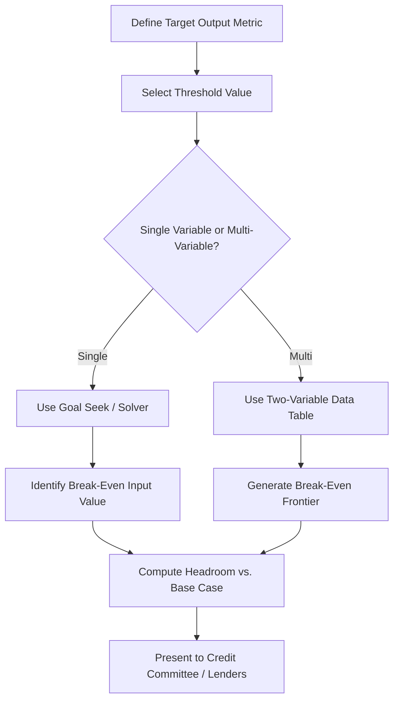

## Break-Even Analysis Techniques

### Overview and Purpose

Break-even analysis identifies the point at which a specific project finance variable causes a key output metric to hit a critical threshold — typically where equity returns fall to zero, or where debt service coverage falls to the minimum acceptable covenant level. Unlike sensitivity analysis, which shows how outputs change across a range of input values, break-even analysis works backward from a target output to solve for the exact input value that produces it.

In project finance, break-even analysis is a core underwriting and structuring tool because lenders, sponsors, and rating agencies want to know not just "how sensitive is the deal to a variable" but "how far can this variable move against us before the deal fails."

### Common Break-Even Metrics in Project Finance

**Key Points**

- **Break-even price**: The minimum output price (e.g., $/MWh, $/tonne, toll rate) at which the project achieves a target equity IRR or covers debt service — critical for merchant and quasi-merchant projects without long-term offtake contracts.
- **Break-even volume/output**: The minimum production or throughput level (e.g., MWh generated, tonnes processed, vehicles per day for a toll road) required to meet debt service or target returns.
- **Break-even DSCR point**: The combination of cost overrun, revenue shortfall, or opex increase at which DSCR falls to the minimum covenant level (commonly 1.00x–1.20x depending on sector and lender).
- **Break-even construction cost**: The maximum capex overrun the project can absorb before equity IRR falls below the sponsor's hurdle rate or before the debt-to-equity ratio breaches financing covenants.
- **Break-even discount rate (Internal Rate of Return)**: IRR itself is a break-even concept — the discount rate at which NPV equals zero.
- **Break-even operating cost**: The maximum opex level before CFADS becomes insufficient to service debt.

### Core Methodology

**Key Points**

- Break-even analysis is fundamentally a **goal-seek problem**: hold all other variables constant, and solve for the single input value that drives the target output to the specified threshold.
- In Excel-based project finance models, this is typically implemented using **Goal Seek** or **Data Tables** for single-variable break-even points, and **Solver** for more complex multi-constraint break-even problems.
- The underlying mathematical relationship is often nonlinear (particularly for IRR and DSCR-based break-evens, since cash flow timing and debt sculpting interact), so iterative numerical solving is standard rather than a closed-form algebraic solution.

### Break-Even IRR Formulation

The IRR break-even is the discount rate $r$ that satisfies:

$$0 = \sum_{t=0}^{n} \frac{CF_t}{(1+r)^t}$$

Where $CF_t$ is the net cash flow to equity in period $t$. Solving for $r$ requires iterative numerical methods (e.g., Newton-Raphson) since the equation generally has no closed-form solution for $n > 2$ periods with irregular cash flows.

### Break-Even Price Example

For a merchant power project, the break-even price $P^*$ that produces a target equity IRR can be found by setting up the equity cash flow as a function of price, then solving:

$$P^* = \frac{\text{OPEX} + \text{Debt Service} + \text{Target Equity Return Component}}{\text{Generation Volume}}$$

[Inference: this simplified single-period form is illustrative; in practice, break-even price for a multi-year model with debt amortization and tax effects requires iterative solving across the full cash flow schedule rather than a single algebraic formula, since debt sculpting and tax shields change year to year.]

### Excel Implementation: Goal Seek

**Key Points**

- **Goal Seek** ("Set cell" = output metric, e.g., Equity IRR cell; "To value" = target, e.g., 12%; "By changing cell" = input driver, e.g., merchant price assumption cell) directly computes the break-even input value.
- Goal Seek only solves for one variable at a time and requires the relationship between input and output to be continuous within the model's calculation logic — it will fail or return an implausible result if the model contains circular references that are not properly resolved with iterative calculation enabled.
- For repeatable, reportable break-even points (e.g., generating a table of break-even prices across multiple scenarios), a **Data Table** (What-If Analysis → Data Table) is preferable to manually re-running Goal Seek, since Data Tables can show sensitivity across a full range around the break-even point without repeated manual solving.

**Example**

A sponsor wants to know the break-even PPA price at which equity IRR equals exactly 10% (their minimum acceptable return):

1. Set the Goal Seek "Set cell" to the Equity IRR output cell.
2. Set "To value" to `0.10`.
3. Set "By changing cell" to the PPA price input assumption.
4. Excel iterates until it converges on the price that produces a 10% IRR, holding all other assumptions constant.

### Python Implementation

```python
from scipy.optimize import brentq
import numpy as np

def equity_irr(price, generation_mwh, opex, debt_service, capex_equity, years=15):
    """Simplified equity IRR calculation as a function of price."""
    revenue = price * generation_mwh
    cfads = revenue - opex
    equity_cf = cfads - debt_service
    cash_flows = [-capex_equity] + [equity_cf] * years
    return np.irr(cash_flows) if hasattr(np, 'irr') else npf_irr(cash_flows)

def npf_irr(cash_flows):
    import numpy_financial as npf
    return npf.irr(cash_flows)

def irr_gap(price, target_irr, **kwargs):
    return npf_irr([-kwargs['capex_equity']] +
                    [(price * kwargs['generation_mwh'] - kwargs['opex'] - kwargs['debt_service'])] * kwargs['years']) - target_irr

# Solve for break-even price where equity IRR = 10%
breakeven_price = brentq(
    irr_gap, a=10, b=200,
    args=(0.10,),
    xtol=1e-6
)
```

[Note: `numpy.irr` was deprecated and removed from NumPy; the `numpy_financial` package (`pip install numpy-financial`) is the standard current library for IRR/NPV functions in Python. This reflects a documented library change rather than an uncertain claim.]

**Output** (illustrative):



```
Break-even PPA price: $47.32/MWh (produces exactly 10.0% equity IRR)
```

### Break-Even DSCR Analysis

**Key Points**

- Break-even DSCR analysis solves for the maximum stress (e.g., % revenue reduction, % opex increase, % volume shortfall) the project can sustain before DSCR breaches the minimum covenant — often expressed as a **"headroom" percentage**.
- This is distinct from a simple ratio calculation: it requires flexing an underlying driver (price, volume, cost) until the resulting DSCR in the worst-affected period hits the threshold, since sculpted or amortizing debt structures mean DSCR does not move linearly with revenue changes across all years.
- Lenders often present break-even headroom as a standard credit metric: e.g., "Revenue can fall 22% before minimum DSCR breaches 1.15x," which is more intuitive to credit committees than an abstract sensitivity coefficient.

### Break-Even Analysis vs. Sensitivity Analysis vs. Scenario Analysis

| Technique | Question Answered | Output Format |
| --- | --- | --- |
| Sensitivity Analysis | "How does output X change as input Y varies by ±10%?" | Range of outputs across an input range (tornado chart, spider diagram) |
| Scenario Analysis | "What happens under a defined bear/base/bull case?" | Discrete set of output values for named scenarios |
| Break-Even Analysis | "At what value of input Y does output X hit a specific threshold?" | A single critical input value (the break-even point) |
| Monte Carlo Simulation | "What is the full probability distribution of output X given uncertainty in multiple inputs?" | Probability distribution and percentiles |

### Multi-Variable Break-Even Considerations

**Key Points**

- Real project finance stress scenarios rarely involve only one variable moving — cost overruns often coincide with delays, which coincide with revenue deferral. Single-variable break-even points can understate combined risk.
- A common technique is to compute break-even points along **two dimensions simultaneously** using a two-variable Data Table in Excel (e.g., combinations of price reduction and opex increase that jointly bring DSCR to covenant level), producing a break-even "frontier" or "iso-DSCR curve" rather than a single point.
- This frontier approach bridges break-even analysis toward scenario and Monte Carlo techniques, since it visualizes the combined threshold rather than a single-variable cutoff.

### Illustrative Break-Even Frontier (Two-Variable)

<svg xmlns="http://www.w3.org/2000/svg" viewBox="0 0 650 380">
<text x="325" y="26" text-anchor="middle" font-size="16" font-weight="bold" fill="#1a1a1a">Break-Even Frontier: Price vs. Opex (svg_diagram)</text>
<line x1="70" y1="320" x2="600" y2="320" stroke="#333" stroke-width="2" />
<line x1="70" y1="320" x2="70" y2="60" stroke="#333" stroke-width="2" />
<text x="335" y="350" text-anchor="middle" font-size="12" fill="#333">Price Reduction (%)</text>
<text x="30" y="190" text-anchor="middle" font-size="12" fill="#333" transform="rotate(-90 30 190)">Opex Increase (%)</text>
<path d="M 100 90 Q 250 120 350 180 Q 450 240 560 300" fill="none" stroke="#c53030" stroke-width="3" />
<text x="420" y="170" font-size="11" fill="#c53030">DSCR = 1.15x (Breach Line)</text>
<path d="M 100 90 Q 250 120 350 180 Q 450 240 560 300 L 560 320 L 100 320 Z" fill="#feb2b2" opacity="0.4" />
<text x="200" y="290" font-size="11" fill="#742a2a">Breach Zone</text>
<path d="M 100 90 Q 250 120 350 180 Q 450 240 560 300 L 560 60 L 100 60 Z" fill="#c6f6d5" opacity="0.4" />
<text x="200" y="100" font-size="11" fill="#22543d">Safe Zone</text>
</svg>

### Process Flow for Break-Even Analysis



### Practical Applications

**Key Points**

- **Merchant risk assessment**: Break-even price analysis is central to underwriting projects without contracted revenue, showing how far merchant prices can fall before returns or debt service are impaired.
- **Debt sizing validation**: Break-even headroom analysis is used alongside base case DSCR to confirm the debt quantum leaves adequate buffer against plausible downside movements.
- **Investment committee materials**: Break-even points (e.g., "break-even occupancy of 62%" for a toll road or hotel-linked asset) are frequently used as a single, intuitive risk metric for non-technical stakeholders.
- **Refinancing and covenant negotiation**: Break-even analysis helps sponsors and lenders negotiate covenant levels by clarifying the operational buffer a given DSCR floor actually provides.

### Common Pitfalls

**Key Points**

- **Treating break-even points as static**: A break-even price computed in Year 1 may not hold in Year 10 if debt is amortizing and opex is escalating — break-even analysis should be run across the full tenor, identifying the worst-case (tightest) break-even year, not just an average.
- **Ignoring interaction effects**: A single-variable break-even understates risk when multiple stresses are correlated (see Multi-Variable Break-Even Considerations above).
- **Circular reference failures in Goal Seek**: When break-even targets interact with circular model mechanics (e.g., cash sweeps affecting debt balances affecting interest affecting cash available for sweep), Goal Seek can converge slowly, fail to converge, or return a technically correct but practically unstable answer. [Behavior may vary depending on Excel's iterative calculation settings, convergence tolerance, and maximum iteration count configured in the workbook.]
- **Confusing break-even IRR with hurdle rate comparison**: A break-even discount rate (IRR) tells you the return the project generates, not whether that return is adequate — it must still be compared against the sponsor's required hurdle rate or WACC to be decision-useful.

**Next Steps**

- Sensitivity Analysis and Tornado Chart Construction
- Scenario Analysis and Downside Case Construction
- Monte Carlo Simulation for Project Finance
- Debt Sculpting and DSCR-Based Debt Sizing
- Covenant Structuring and Headroom Analysis
- IRR and NPV Calculation Mechanics in Leveraged Cash Flows
- Merchant Price Risk and Revenue Contracting Structures (PPAs, Tolling Agreements)