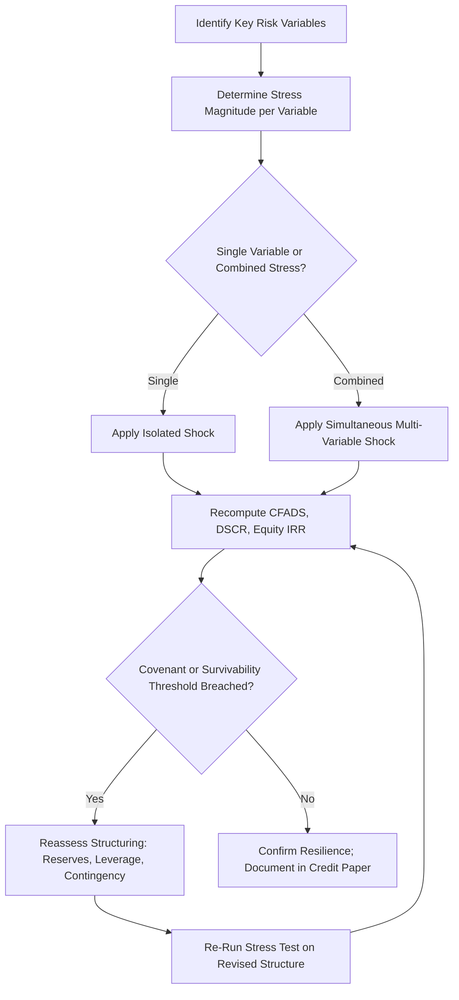

## Stress Testing Key Risk Variables

### Overview and Purpose

Stress testing in project finance is the practice of applying severe, but plausible, adverse shocks to one or more key risk variables to evaluate whether a project can continue to service its debt and preserve minimum acceptable returns under extreme conditions. Unlike standard sensitivity analysis, which typically flexes variables within a moderate, realistic range (±5%, ±10%), stress testing deliberately pushes variables to extreme downside values — often to the boundary of historical worst-case experience or beyond — to test the resilience of the financing structure itself.

Stress testing is a mandatory component of lender due diligence and rating agency review for nearly all project finance transactions, distinguishing "can the deal survive a bad year" from "how does the deal typically perform."

### Stress Testing vs. Sensitivity, Scenario, and Monte Carlo Analysis

**Key Points**

- **Sensitivity analysis** flexes variables within realistic, moderate ranges to rank the deal's exposure to each driver.
- **Scenario analysis** tests a small number of internally consistent, named cases (base, downside, upside).
- **Stress testing** specifically targets severe, often combined shocks calibrated to historical extremes or regulatory/lender-mandated thresholds, with the explicit purpose of confirming survivability rather than characterizing typical variability.
- **Monte Carlo simulation** generates a full probability distribution across many iterations; stress testing instead focuses on a small number of deliberately extreme, hand-picked combinations that may lie in the tail of a Monte Carlo distribution but are examined individually and explicitly.
- In practice, these techniques are complementary: Monte Carlo analysis can help identify which combined stresses are most probable and severe, which then inform which specific stress tests lenders formalize into the credit agreement.

### Categories of Key Risk Variables Subject to Stress Testing

**Key Points**

- **Construction risk variables**: Cost overrun (e.g., +15% to +30% capex stress), construction delay (e.g., 6–12 month delay stress), liquidated damages insufficiency.
- **Market/revenue risk variables**: Commodity or merchant price decline (e.g., -20% to -40% price stress), demand/volume shortfall (e.g., traffic, occupancy, offtake volume), contract counterparty default or curtailment.
- **Operating risk variables**: Opex overrun (e.g., +20% to +30%), availability/performance shortfall (e.g., plant availability dropping from 95% to 85%), major maintenance cost spikes.
- **Financial/macro risk variables**: Interest rate increase (e.g., +200–300 bps stress on floating-rate tranches), inflation shock, foreign exchange devaluation (particularly critical for projects with FX-mismatched revenue and debt).
- **Resource/technical risk variables**: Resource yield shortfall (e.g., P90 or P99 wind/solar resource year for renewables, reserve depletion rate for extractive projects).
- **Combined/compound stresses**: Simultaneous application of multiple adverse shocks (e.g., construction delay AND cost overrun AND lower initial revenue ramp-up), which is generally more representative of real-world crisis conditions than isolated single-variable stresses.

### Standard Stress Test Formulations Used by Lenders

**Key Points**

- **P90/P99 resource stress**: For renewable energy projects, lenders commonly require debt sizing to be validated against the P90 (90% probability of exceedance) energy yield estimate rather than the P50 (median) estimate, with some structures requiring P99 stress for a specific minimum-DSCR year test.
- **Combined downside case**: Many credit agreements define a formal "Combined Downside Case" or "Lenders' Case" that layers multiple stresses simultaneously (e.g., 10% capex overrun + 6-month delay + P90 resource + opex +10%) as the basis for setting the minimum required DSCR and debt sizing.
- **Break-even stress ("reverse stress test")**: Rather than pre-specifying a stress severity, a reverse stress test solves backward for the magnitude of shock needed to cause default or covenant breach, directly complementing break-even analysis techniques.
- **Historical worst-case calibration**: Many stress magnitudes are calibrated to the worst historical outcome observed in comparable projects or markets over a defined lookback period (e.g., worst 1-in-20-year commodity price decline).

### Illustrative Stress Test Framework Table

| Risk Variable | Base Case | Moderate Stress | Severe Stress | Metric Tested |
| --- | --- | --- | --- | --- |
| Construction Cost | 0% overrun | +10% | +25% | Equity IRR, Contingency Adequacy |
| Construction Delay | On schedule | 3 months | 9 months | DSRA Sufficiency, IDC |
| Merchant Price | P50 forward curve | -15% | -35% | Minimum DSCR |
| Opex | Base budget | +10% | +25% | Average DSCR |
| Resource/Volume | P50 | P75 | P90/P99 | Minimum DSCR, Debt Sizing |
| Interest Rate (floating tranche) | Forward curve | +150 bps | +300 bps | DSCR, Refinancing Risk |
| FX Rate (if mismatched) | Spot/forward | -10% | -25% | CFADS in Domestic Currency |

[Inference: the specific numeric thresholds shown are illustrative and commonly seen in market practice, but actual stress magnitudes are transaction-specific and depend on sector, jurisdiction, counterparty credit quality, and lender risk appetite — they are not universal standards.]

### Excel/Model Implementation Approach

**Key Points**

- Stress tests are typically implemented via a **scenario switch or toggle mechanism** (e.g., a dropdown-driven `CHOOSE` or `INDEX/MATCH` function referencing a scenario input table) that overrides base case assumptions with pre-defined stress values across multiple cells simultaneously.
- A well-structured project finance model separates **hardcoded stress inputs** into a dedicated assumptions or scenario tab, avoiding stress values embedded directly in calculation formulas, so that switching between base case and stress cases does not require altering the underlying model logic.
- Combined stress tests require careful sequencing when the model contains circularity (e.g., interest during construction affecting total capex affecting debt sizing affecting interest expense) — iterative calculation must be enabled and convergence verified for each stress case, not only the base case.

```excel
=CHOOSE(ScenarioSelector,
    BaseCase_ConstructionCost,
    ModerateStress_ConstructionCost,
    SevereStress_ConstructionCost)
```

### Python Implementation: Combined Stress Test Runner

```python
import pandas as pd

def run_stress_case(capex_overrun, price_shock, opex_shock, delay_months,
                     base_capex, base_price, base_opex, generation_mwh,
                     debt_service, delay_cost_per_month=500_000):
    """Applies combined stresses and returns key credit metrics."""
    capex = base_capex * (1 + capex_overrun) + (delay_months * delay_cost_per_month)
    price = base_price * (1 - price_shock)
    opex = base_opex * (1 + opex_shock)

    revenue = price * generation_mwh
    cfads = revenue - opex
    dscr = cfads / debt_service

    return {
        'capex': capex,
        'revenue': revenue,
        'cfads': cfads,
        'dscr': dscr
    }

scenarios = {
    'Base Case':      dict(capex_overrun=0.00, price_shock=0.00, opex_shock=0.00, delay_months=0),
    'Moderate Stress': dict(capex_overrun=0.10, price_shock=0.15, opex_shock=0.10, delay_months=3),
    'Severe Stress':   dict(capex_overrun=0.25, price_shock=0.35, opex_shock=0.25, delay_months=9),
}

results = {}
for name, params in scenarios.items():
    results[name] = run_stress_case(
        base_capex=100_000_000, base_price=50, base_opex=8_000_000,
        generation_mwh=500_000, debt_service=12_000_000, **params
    )

df = pd.DataFrame(results).T
print(df.round(2))
```

**Output** (illustrative):



```
                  capex     revenue      cfads   dscr
Base Case      1.00e+08  25000000.0  17000000.0  1.42
Moderate Stress 1.115e+08 21250000.0 11250000.0  0.94
Severe Stress   1.295e+08 16250000.0  4250000.0  0.35
```

[Unverified: figures are illustrative from a simplified single-year toy model; a real multi-year model would need to test the minimum DSCR across the full debt tenor, not a single period, since stress impact often varies significantly by year depending on amortization profile and revenue ramp-up.]

### Stress Testing and Reserve Account Sizing

**Key Points**

- The severity of stress scenarios directly informs the sizing of the **Debt Service Reserve Account (DSRA)** — commonly sized to cover 6–12 months of forward debt service, calibrated against the CFADS shortfall expected in a defined stress case.
- **Major Maintenance Reserve Accounts (MMRA)** are similarly stress-tested against the risk of major maintenance costs occurring earlier or at a higher magnitude than the base case schedule assumes.
- Insufficient reserve sizing relative to realistic stress scenarios is one of the most common findings in independent lender technical advisor reports.

### Stress Testing Process Flow



### Illustrative Stress Test Impact on DSCR Profile

<svg xmlns="http://www.w3.org/2000/svg" viewBox="0 0 700 340">
<text x="350" y="26" text-anchor="middle" font-size="16" font-weight="bold" fill="#1a1a1a">DSCR Profile Under Stress Scenarios (svg_diagram)</text>
<line x1="70" y1="290" x2="640" y2="290" stroke="#333" stroke-width="2" />
<line x1="70" y1="290" x2="70" y2="50" stroke="#333" stroke-width="2" />
<text x="355" y="315" text-anchor="middle" font-size="12" fill="#333">Operating Year</text>
<text x="30" y="170" text-anchor="middle" font-size="12" fill="#333" transform="rotate(-90 30 170)">DSCR (x)</text>
<line x1="70" y1="200" x2="640" y2="200" stroke="#a0aec0" stroke-width="1" stroke-dasharray="3,3" />
<text x="600" y="195" font-size="10" fill="#718096">1.20x Covenant</text>
<polyline points="100,110 180,100 260,105 340,95 420,100 500,90 580,95" fill="none" stroke="#38a169" stroke-width="2.5" />
<text x="580" y="80" font-size="10" fill="#22543d">Base Case</text>
<polyline points="100,150 180,160 260,155 340,170 420,165 500,175 580,170" fill="none" stroke="#dd6b20" stroke-width="2.5" />
<text x="580" y="185" font-size="10" fill="#9c4221">Moderate Stress</text>
<polyline points="100,190 180,220 260,240 340,260 420,245 500,255 580,250" fill="none" stroke="#c53030" stroke-width="2.5" />
<text x="560" y="270" font-size="10" fill="#742a2a">Severe Stress</text>
</svg>

### Regulatory and Rating Agency Context

**Key Points**

- Rating agencies apply their own standardized stress scenarios when assigning project finance debt ratings, often supplementing or overriding the sponsor's stress assumptions with independently calibrated stresses reflecting sector-specific historical volatility.
- For infrastructure debt held by regulated entities (e.g., insurers, pension funds subject to capital adequacy frameworks), stress test outcomes can directly affect regulatory capital charges assigned to the investment.
- Multilateral and development finance institutions frequently mandate specific stress test formats (e.g., a defined "Base Case," "P90 Case," and "Combined Downside Case") as a condition of participation in a financing.

### Common Pitfalls

**Key Points**

- **Testing variables in isolation only**: Real crises rarely involve a single variable moving in isolation; combined stress testing is necessary to capture realistic compound risk, even though it is more complex to structure in the model.
- **Understating stress severity**: Calibrating stresses only to recent historical experience can understate risk if the historical window excludes a genuine tail event (e.g., a market that has not experienced a severe downturn in the available data period).
- **Failing to test the full tenor**: A stress test that only examines Year 1 or the base case's identified "minimum DSCR year" can miss a different year becoming the binding constraint once stresses are applied, particularly where debt is sculpted rather than amortizing on a fixed schedule.
- **Static reserve assumptions under stress**: Assuming DSRA or MMRA balances remain untouched in a stress case, when in reality reserves would be drawn upon — the model should reflect reserve depletion and replenishment mechanics dynamically under stress, not just the base case waterfall.
- **Conflating stress testing with worst-case paralysis**: Excessively extreme, implausible stresses can produce results so severe they are dismissed as irrelevant by credit committees — calibration to plausible severity (not theoretical maximum severity) preserves the analysis's credibility and decision-usefulness.

**Next Steps**

- Break-Even Analysis Techniques
- Monte Carlo Simulation for Project Finance
- Debt Service Reserve Account (DSRA) and Major Maintenance Reserve Account Structuring
- Debt Sculpting and DSCR-Based Debt Sizing
- Rating Agency Methodologies for Project Finance Debt
- Construction Risk Allocation and Liquidated Damages Provisions
- Foreign Exchange and Inflation Risk Mitigation Structures
- Covenant Structuring and Financial Covenant Design