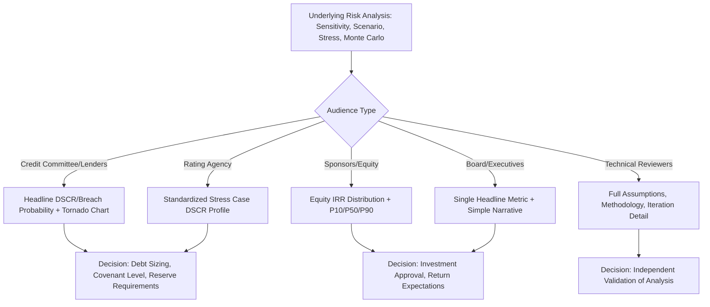

## Presenting Sensitivity Outputs to Stakeholders

### Overview and Purpose

Producing rigorous sensitivity, scenario, break-even, stress test, and Monte Carlo analysis is only half the task in project finance — the results must be communicated clearly and persuasively to stakeholders with widely varying technical backgrounds, time constraints, and decision-making priorities. Lenders, credit committees, rating agencies, sponsors, and boards each require different levels of detail, different framing, and different visual formats to make effective use of the same underlying analysis.

Poorly presented risk analysis, even if analytically sound, can fail to influence decisions, obscure genuine concerns, or create false confidence — making presentation technique a critical, non-optional component of the risk analysis workflow.

### Understanding the Audience

**Key Points**

- **Credit committees and lenders** typically want a small number of clear, decision-relevant metrics — minimum DSCR, break-even headroom, probability of covenant breach — rather than the full analytical detail behind them.
- **Rating agencies** expect standardized, comparable formats (e.g., DSCR profiles across defined stress cases) that map to their own published methodology, since output will often be compared directly against sector benchmarks.
- **Sponsors and equity investors** are typically most focused on equity IRR distribution, downside protection, and the probability of achieving target returns, with less interest in granular DSCR mechanics unless a covenant breach threatens equity distributions.
- **Boards and non-technical executives** need a small number of headline figures and a clear narrative ("the project can withstand X before breaching Y"), generally presented visually rather than in tabular or formula-heavy form.
- **Technical/model reviewers and lenders' engineers** require full transparency into methodology, assumptions, and underlying data — this audience is the exception where more analytical depth, not less, is appropriate.

### Core Presentation Principles

**Key Points**

- **Lead with the decision-relevant conclusion, not the methodology**: State the headline finding first (e.g., "the project maintains minimum 1.25x DSCR under the combined downside case") before explaining how it was derived.
- **Match precision to audience needs**: A credit committee typically needs one or two significant figures ("DSCR falls to approximately 1.15x"), not the full decimal precision an analyst might track internally.
- **Anchor every output to a threshold or benchmark**: A bare number (e.g., "P10 equity IRR is 6.2%") is far less useful than the same number framed against a reference point (e.g., "P10 equity IRR of 6.2% remains above the 5% minimum hurdle, but with limited headroom").
- **Avoid false precision**: Presenting Monte Carlo percentile outputs to multiple decimal places implies a level of confidence the underlying assumptions rarely support; rounding appropriately communicates uncertainty honestly.
- **Disclose key assumptions alongside results**: Any output (a break-even price, a stress test DSCR) is meaningless without stating the assumptions and scope of the stress applied — presenting results without assumptions invites misinterpretation or later disputes.

### Tornado Charts for Sensitivity Ranking

**Key Points**

- The **tornado chart** is the standard visual format for single-variable sensitivity analysis, ranking variables by the magnitude of their impact on a chosen output (e.g., equity IRR or NPV), with the largest-impact variable at the top.
- Bars are typically drawn showing both the upside and downside impact of each variable relative to the base case, creating the characteristic "tornado" shape when sorted by descending impact magnitude.
- Tornado charts should specify the range tested for each variable directly in the chart or accompanying notes (e.g., "Opex ±10%"), since the visual ranking is only meaningful in the context of the range applied — a variable tested across a wider range will naturally show greater impact.

### Illustrative Tornado Chart

<svg xmlns="http://www.w3.org/2000/svg" viewBox="0 0 700 380">
<text x="350" y="26" text-anchor="middle" font-size="16" font-weight="bold" fill="#1a1a1a">Equity IRR Sensitivity Tornado Chart (svg_diagram)</text>
<line x1="350" y1="55" x2="350" y2="345" stroke="#333" stroke-width="1.5" />
<text x="350" y="365" text-anchor="middle" font-size="11" fill="#333">Base Case Equity IRR</text>

<text x="80" y="80" text-anchor="end" font-size="12" fill="`#1a1a1a`">Merchant Price</text>

<rect x="180" y="68" width="170" height="24" fill="`#c53030`" />

<rect x="350" y="68" width="190" height="24" fill="`#38a169`" />

<text x="80" y="130" text-anchor="end" font-size="12" fill="`#1a1a1a`">Construction Cost</text>

<rect x="230" y="118" width="120" height="24" fill="`#c53030`" />

<rect x="350" y="118" width="110" height="24" fill="`#38a169`" />

<text x="80" y="180" text-anchor="end" font-size="12" fill="`#1a1a1a`">Opex</text>

<rect x="270" y="168" width="80" height="24" fill="`#c53030`" />

<rect x="350" y="168" width="75" height="24" fill="`#38a169`" />

<text x="80" y="230" text-anchor="end" font-size="12" fill="`#1a1a1a`">Interest Rate</text>

<rect x="290" y="218" width="60" height="24" fill="`#c53030`" />

<rect x="350" y="218" width="55" height="24" fill="`#38a169`" />

<text x="80" y="280" text-anchor="end" font-size="12" fill="`#1a1a1a`">Availability Factor</text>

<rect x="310" y="268" width="40" height="24" fill="`#c53030`" />

<rect x="350" y="268" width="35" height="24" fill="`#38a169`" />

<rect x="80" y="320" width="14" height="14" fill="#c53030" />
<text x="100" y="331" font-size="10" fill="#333">Downside</text>
<rect x="180" y="320" width="14" height="14" fill="#38a169" />
<text x="200" y="331" font-size="10" fill="#333">Upside</text>
</svg>

### Spider Diagrams for Multi-Range Sensitivity

**Key Points**

- **Spider diagrams** (line charts with the input variable's percentage deviation from base case on the x-axis and the output metric on the y-axis) are used when stakeholders need to see the *shape* of sensitivity across a continuous range, not just the endpoint impact shown in a tornado chart.
- Multiple variables are plotted as separate lines on the same chart, with steeper slopes indicating higher sensitivity — this format is particularly useful for illustrating nonlinear relationships (e.g., a DSCR covenant breach that only occurs beyond a certain threshold, visible as a kink or discontinuity in the line).
- Spider diagrams are generally better suited to technical/model-reviewer audiences than to board-level presentations, where a tornado chart's simpler ranking format communicates faster.

### DSCR Profile Charts Under Multiple Cases

**Key Points**

- A **DSCR profile chart** — plotting projected DSCR year-by-year across the debt tenor for base case, moderate stress, and severe stress scenarios simultaneously — is the standard visual for presenting covenant headroom to lenders and rating agencies.
- Overlaying a horizontal line at the minimum covenant DSCR level allows stakeholders to immediately see which years, if any, are at risk of breach under a given stress case (as illustrated in the DSCR profile chart under Stress Testing Key Risk Variables).
- This format directly supports the "worst year" analysis that lenders require, since project finance debt structures are typically tested against the single tightest year, not an average across the tenor.

### Presenting Monte Carlo Outputs

**Key Points**

- **Histogram with percentile markers**: The standard format for presenting a Monte Carlo output distribution (e.g., equity IRR), with vertical lines marking P10, P50 (median), and P90 to give stakeholders an intuitive read of the spread without needing to interpret raw statistical output.
- **Cumulative distribution function (S-curve)**: Often preferred by lenders because it directly answers "what is the probability the output is below/above X," which maps naturally to covenant breach probability questions.
- **Fan charts**: Used to present how the range of possible DSCR or cash flow outcomes widens or narrows over the debt tenor, combining time-series and probability-distribution information in a single visual.
- Avoid presenting raw simulation output tables (thousands of rows of iteration results) to any audience beyond the model reviewer — this obscures rather than clarifies the conclusion.

### Structuring a Sensitivity/Risk Analysis Presentation Deck

**Key Points**

- **Executive summary slide first**: State the headline conclusion (e.g., "the project remains cash-flow positive and above covenant under all tested downside scenarios except X") before any supporting detail.
- **Methodology summary (brief)**: A short statement of what was tested and how (e.g., "Monte Carlo simulation with 10,000 iterations across five correlated risk variables"), sufficient for credibility without overwhelming non-technical readers.
- **Key visual(s)**: One or two primary charts (tornado chart, DSCR profile, or Monte Carlo distribution) selected based on which best supports the headline conclusion for that specific audience.
- **Detailed appendix**: Full assumption tables, distribution parameters, correlation matrices, and iteration-level detail retained for technical reviewers and due diligence, but not presented in the main body.
- **Explicit call-out of any breach or near-breach conditions**: Any scenario approaching or crossing a covenant threshold should be flagged directly and prominently, not left for the audience to infer from a chart — burying a negative finding in supporting detail undermines credibility if discovered later.

### Presentation Structure by Audience

### Common Formatting and Communication Techniques

**Key Points**

- **Color coding by risk severity**: Consistent use of color (e.g., green/amber/red) across all charts in a presentation to indicate safe, cautionary, and breach zones, reducing cognitive load for repeated review of similar charts.
- **Consistent scaling across comparison charts**: Using the same axis scale across before/after or scenario-comparison charts prevents visual distortion that could mislead stakeholders about the relative magnitude of change.
- **Plain-language covenant translation**: Translating a technical covenant condition (e.g., "minimum DSCR of 1.20x tested quarterly on a backward-looking 12-month basis") into a operational statement (e.g., "revenue can fall roughly 20% before triggering a distribution lock-up") aids non-technical audiences without sacrificing accuracy.
- **One-page risk summary**: A concise, single-page summary combining the two or three most decision-relevant metrics and charts is frequently the most-referenced document in a transaction, more so than the full analytical report — since committee members and board directors often have limited review time.

### Common Pitfalls

**Key Points**

- **Overloading a single slide or chart** with every scenario, variable, and percentile simultaneously, producing a visual so dense that no single conclusion is clear — better practice is to build up complexity across several slides rather than presenting the maximum detail in one figure.
- **Omitting the base case for comparison**: Presenting stress or downside results without a clear reference to the base case denies stakeholders the context needed to judge severity.
- **Using inconsistent terminology across sections**: Referring to the same case by different names in different parts of a presentation (e.g., "Downside Case" vs. "Lenders' Case" vs. "P90 Case" for what is actually the same scenario) creates confusion and undermines confidence in the underlying analysis.
- **Failing to tailor detail to audience**: Presenting full Monte Carlo methodology and correlation matrix detail to a board audience (excessive) or presenting only a headline IRR figure to a technical lender diligence team (insufficient) both reduce the presentation's effectiveness.
- **Not distinguishing model output from model judgment**: Presenting quantitative outputs without noting where qualitative judgment, unmodeled risks, or known limitations apply can create false precision and misplaced confidence in stakeholders relying on the numbers alone.

**Next Steps**

- Monte Carlo Simulation for Project Finance
- Break-Even Analysis Techniques
- Stress Testing Key Risk Variables
- Covenant Structuring and Financial Covenant Design
- Building the Information Memorandum for Project Finance Transactions
- Data Visualization Best Practices for Financial Analysis
- Credit Committee and Investment Committee Approval Processes