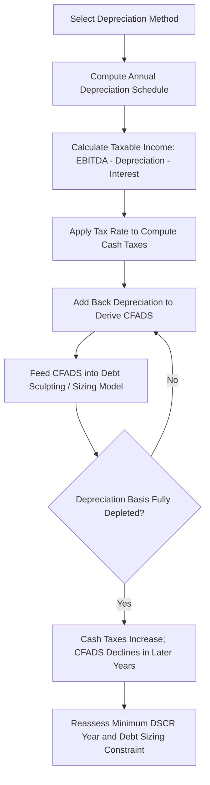

## Depreciation Methods and Tax Shields

### Overview and Purpose

Depreciation is the systematic allocation of a capital asset's cost over its useful life for accounting and/or tax purposes. In project finance, depreciation is significant not primarily as an accounting mechanic, but because it generates a **tax shield** — a non-cash deduction that reduces taxable income and therefore reduces actual cash taxes paid, directly increasing the cash flow available for debt service and equity distributions (CFADS).

Because project finance structures are highly leveraged and cash-flow-driven, the timing and magnitude of tax depreciation can materially affect debt sizing capacity, the DSCR profile, and equity returns — making depreciation policy selection a genuine value-driver in project structuring, not merely a compliance exercise.

### The Tax Shield Concept

**Key Points**

- A **tax shield** is the reduction in tax liability produced by a deductible non-cash expense. For depreciation specifically:

$$\text{Depreciation Tax Shield} = \text{Depreciation Expense} \times \text{Tax Rate}$$

- Because depreciation is a non-cash charge, the tax shield increases actual cash flow without representing a cash outflow itself — this is why depreciation is added back to net income when calculating cash flow from operations.
- **Accelerated depreciation** front-loads deductions into earlier years, which — combined with the time value of money — increases the present value of the tax shield relative to straight-line depreciation, even though the total depreciation deducted over the asset's life is identical under both methods.
- In project finance, the tax shield is one of the primary reasons why **tax equity** structures (particularly common in U.S. renewable energy) exist: tax shields and credits generated by the project can exceed what the sponsor itself can efficiently utilize, creating an incentive to bring in an investor primarily seeking to monetize the tax benefits.

### Common Depreciation Methods

**Key Points**

- **Straight-Line Depreciation**: Allocates an equal expense amount each year over the asset's useful life.

$$D_t = \frac{C - S}{n}$$

Where $C$ is the depreciable cost basis, $S$ is salvage value, and $n$ is useful life in years.

- **Declining Balance (Accelerated) Depreciation**: Applies a constant percentage rate to the asset's remaining book value each year, producing larger deductions in early years and smaller deductions later.

$$D_t = BV_{t-1} \times \frac{f}{n}$$

Where $BV_{t-1}$ is the beginning book value for the year, $n$ is useful life, and $f$ is the acceleration factor (commonly 1.5 for 150% declining balance or 2.0 for double-declining balance).

- **Modified Accelerated Cost Recovery System (MACRS)**: The standard tax depreciation system in the United States, assigning assets to defined recovery period classes (e.g., 5-year, 7-year, 15-year, 20-year) with prescribed depreciation rate tables that generally follow a declining balance method switching to straight-line partway through the recovery period to fully depreciate the asset.
- **Units of Production Depreciation**: Allocates depreciation based on actual usage or output (e.g., tonnes extracted, machine hours) rather than time — common for extractive and certain industrial project finance assets where physical utilization more accurately reflects economic consumption of the asset.
- **Sum-of-the-Years'-Digits (SYD)**: An accelerated method that allocates a declining fraction of depreciable cost each year based on the sum of the years' digits, less commonly used in modern project finance modeling but occasionally seen in older or jurisdiction-specific frameworks.

### MACRS in U.S. Project Finance

**Key Points**

- MACRS is particularly significant in U.S. project finance because many infrastructure and renewable energy assets qualify for short recovery periods relative to their actual economic/useful life — for example, wind and solar generation assets are commonly classified under a 5-year MACRS recovery period under current tax law categories, front-loading substantial tax deductions well before the asset's actual operating life ends. [Verify current tax code classification and bonus depreciation provisions applicable at the time of any specific transaction, as U.S. federal tax law affecting depreciation schedules and bonus depreciation percentages has changed multiple times through recent legislative cycles.]
- **Bonus depreciation** provisions, when in effect, allow an additional first-year deduction of a specified percentage of qualifying asset cost, further accelerating the tax shield beyond standard MACRS schedules — the applicable percentage has varied significantly by tax year under different legislative regimes.
- The interaction between MACRS/bonus depreciation and structures such as **tax equity partnerships** or **partnership flip structures** is a defining feature of U.S. renewable energy project finance, since the accelerated tax shield often exceeds the sponsor's own tax appetite, creating the economic rationale for third-party tax equity investment.

### Depreciation's Impact on the Project Finance Cash Flow Model

**Key Points**

- Depreciation reduces **taxable income**, which reduces **cash taxes payable**, which increases **CFADS** relative to a scenario with no depreciation shield — this flows directly into DSCR calculations and debt sizing capacity in a cash-flow-based (rather than pure P&L-based) financial model.
- Because depreciation is non-cash, it must be added back after computing tax expense in the standard indirect cash flow build:

$$\text{CFADS} = \text{EBITDA} - \text{Cash Taxes} - \Delta\text{Working Capital} - \text{Maintenance Capex}$$


$$\text{Cash Taxes} = (\text{EBITDA} - \text{Depreciation} - \text{Interest Expense}) \times \text{Tax Rate}$$

- The accelerated front-loading of depreciation under MACRS or declining balance methods typically produces the strongest tax shield — and therefore the highest CFADS uplift — in the early years of a project's operating life, which can materially affect the shape of a sculpted debt repayment profile if not modeled precisely.
- Once accumulated depreciation fully depletes the depreciable basis, the tax shield disappears, cash taxes increase, and CFADS declines correspondingly in later years — modeling this transition accurately is essential for correctly identifying a project's true minimum DSCR year.

### Book Depreciation vs. Tax Depreciation

**Key Points**

- **Book depreciation** (for GAAP/IFRS financial statement purposes) is often calculated on a straight-line basis over the asset's estimated useful economic life, primarily for external financial reporting consistency and comparability.
- **Tax depreciation** follows the applicable jurisdiction's prescribed tax code methodology (e.g., MACRS in the U.S.), which frequently differs substantially from book depreciation in both method and timing.
- This divergence creates a **temporary timing difference**, recognized in financial statements as a **deferred tax liability** — representing taxes that are economically owed but deferred to future periods due to the accelerated tax deduction taken in earlier years relative to book expense recognition.
- Project finance cash flow models must generally build the tax calculation off **tax depreciation** (since this determines actual cash taxes paid), while book depreciation, if modeled at all, is typically relevant only for covenant tests or reporting requirements tied to GAAP/IFRS financial statement metrics rather than cash flow itself.

### Illustrative Depreciation Schedule Comparison

| Year | Straight-Line (10-yr) | MACRS 5-Year (with half-year convention) |
| --- | --- | --- |
| 1 | $1,000,000 | $2,000,000 |
| 2 | $1,000,000 | $3,200,000 |
| 3 | $1,000,000 | $1,920,000 |
| 4 | $1,000,000 | $1,152,000 |
| 5 | $1,000,000 | $1,152,000 |
| 6 | $1,000,000 | $576,000 |
| 7–10 | $1,000,000/yr | $0 |

[Inference: figures illustrate the general shape of MACRS 5-year acceleration relative to straight-line on a $10,000,000 depreciable base using standard published MACRS percentage tables; actual applicable rates, conventions (half-year vs. mid-quarter), and total recovery period depend on asset classification and tax law in effect at the time.]

### Python Implementation: Depreciation Schedule and Tax Shield Comparison

```python
import numpy as np
import pandas as pd

def straight_line(cost, salvage, life):
    annual = (cost - salvage) / life
    return np.full(life, annual)

def declining_balance(cost, life, factor=2.0, salvage=0):
    rate = factor / life
    schedule = []
    book_value = cost
    for year in range(life):
        dep = book_value * rate
        if book_value - dep < salvage:
            dep = book_value - salvage
        schedule.append(dep)
        book_value -= dep
    return np.array(schedule)

cost = 10_000_000
life = 10
tax_rate = 0.25

sl_schedule = straight_line(cost, 0, life)
db_schedule = declining_balance(cost, life, factor=2.0)

sl_tax_shield = sl_schedule * tax_rate
db_tax_shield = db_schedule * tax_rate

discount_rate = 0.08
sl_pv = sum(sl_tax_shield[t] / (1 + discount_rate) ** (t + 1) for t in range(life))
db_pv = sum(db_tax_shield[t] / (1 + discount_rate) ** (t + 1) for t in range(life))

print(f"PV of Straight-Line Tax Shield: ${sl_pv:,.0f}")
print(f"PV of Declining Balance Tax Shield: ${db_pv:,.0f}")
```

**Output** (illustrative):



```
PV of Straight-Line Tax Shield: $1,678,301
PV of Declining Balance Tax Shield: $1,839,552
```

[Unverified: the specific dollar figures shown are outputs of this illustrative example only and will change with different cost basis, discount rate, or tax rate assumptions — the directional conclusion that accelerated depreciation produces a higher present value tax shield than straight-line, given an identical total depreciable amount and positive discount rate, follows directly from time-value-of-money mechanics.]

### Tax Shield Sensitivity in Debt Sizing



### Tax Equity and Partnership Flip Structures

**Key Points**

- In U.S. renewable energy project finance, the combination of accelerated MACRS depreciation and investment/production tax credits often generates tax benefits that exceed the amount a typical infrastructure sponsor can efficiently use against its own taxable income.
- **Partnership flip structures** allocate a disproportionate share of tax benefits (including depreciation deductions) to a tax equity investor in the early years of the partnership, with cash and ownership allocations "flipping" to favor the sponsor once the tax equity investor achieves its target after-tax return.
- Accurately modeling the interaction between the depreciation schedule, the tax equity investor's target IRR, and the flip date is one of the more complex modeling exercises in project finance, requiring iterative circular calculation since the flip trigger itself depends on cumulative after-tax cash flows that are partly a function of the depreciation-driven tax allocation.

### Common Pitfalls

**Key Points**

- **Confusing book depreciation with tax depreciation** when building the cash tax calculation, leading to materially incorrect CFADS and debt sizing if the model inadvertently uses straight-line book depreciation to compute cash taxes rather than the applicable accelerated tax depreciation schedule.
- **Ignoring the depreciation cliff**: Failing to model the point at which tax depreciation is fully exhausted, which causes a step-change increase in cash taxes and corresponding CFADS decline — if this occurs during the debt tenor, it can create the true minimum DSCR year that a simplistic model might otherwise overlook.
- **Applying outdated bonus depreciation or recovery period assumptions**: Given the frequency of legislative change to accelerated depreciation provisions in the U.S. and analogous capital allowance regimes elsewhere, using outdated percentages or recovery periods is a common and material modeling error. [Behavior and applicable rates are jurisdiction- and tax-year-specific; verify against current legislation for any live transaction.]
- **Overlooking jurisdictional differences**: Depreciation methods, recovery periods, and available accelerated allowances (e.g., capital allowances in the UK, accelerated depreciation regimes in various emerging markets) differ substantially by jurisdiction — a modeling approach appropriate for a U.S. MACRS-based project cannot simply be transplanted to a project in another tax jurisdiction without adjustment.
- **Mismodeling the tax equity flip mechanics**: Treating the flip date as a fixed input rather than a circularly-determined output of the after-tax cash flow allocation can materially misstate both sponsor and tax equity investor returns.

**Next Steps**

- Tax Equity Structures and Partnership Flip Modeling
- Investment Tax Credits and Production Tax Credits in Project Finance
- Deferred Tax Liabilities and Financial Statement Treatment
- Cross-Border Tax Structuring and Withholding Tax Considerations
- Debt Sculpting and DSCR-Based Debt Sizing
- VAT, Import Duties, and Indirect Tax Considerations in Construction