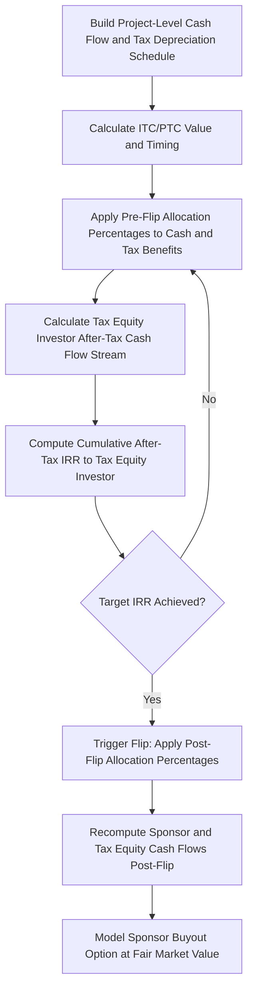

## Tax Equity Partnership Flip Structures

### Overview and Purpose

A tax equity partnership flip structure is a financing arrangement, predominantly used in U.S. renewable energy project finance, in which a tax equity investor contributes capital to a project-owning partnership primarily to monetize tax benefits — accelerated depreciation and tax credits — that the project generates, while the sponsor (developer) retains long-term operational control and the majority of cash flows once the tax equity investor achieves a targeted after-tax return. At that point, the allocation of both cash and tax benefits "flips" from favoring the tax equity investor to favoring the sponsor.

These structures exist because U.S. tax law grants substantial tax benefits (Investment Tax Credits, Production Tax Credits, and accelerated MACRS depreciation) to renewable energy assets that frequently exceed what a typical sponsor — often a developer without significant taxable income of its own — can efficiently absorb. Tax equity investors, typically large financial institutions or corporations with substantial tax appetite, provide capital in exchange for access to these benefits.

### Why Tax Equity Structures Exist

**Key Points**

- Many renewable energy developers lack sufficient taxable income to fully utilize the tax credits and accelerated depreciation their projects generate — unused tax benefits carried forward have a lower present value than benefits used immediately.
- Tax equity investors (commonly large banks, insurance companies, or corporations with substantial and predictable tax liability) can monetize these benefits immediately against their own tax liability, making the tax benefits more valuable in their hands.
- The structure allows the developer to raise low-cost capital (relative to pure equity) by "selling" the tax benefits' value, while retaining eventual majority ownership and long-term cash flow upside once the tax equity investor's target return is achieved.
- Because Investment Tax Credits and depreciation deductions front-load substantial value into a project's early years — well ahead of when a sponsor's own cash equity would typically expect a comparable return — tax equity monetization effectively brings forward capital that would otherwise only be realized over many years of operation.

### Key Tax Benefits Being Monetized

**Key Points**

- **Investment Tax Credit (ITC)**: A one-time credit calculated as a percentage of qualifying eligible basis (commonly used for solar and certain other technologies), claimed in the year the asset is placed in service.
- **Production Tax Credit (PTC)**: A per-kilowatt-hour credit claimed over a multi-year period (commonly the first ten years of operation, historically most associated with wind generation), tied to actual electricity output rather than a one-time capital basis calculation.
- **Accelerated (MACRS) Depreciation**: As discussed in depreciation methods, renewable assets commonly qualify for short MACRS recovery periods, front-loading substantial depreciation deductions into the early years of operation.
- [Verify current eligibility, credit percentages, technology-neutral credit provisions, and any transferability rules applicable at the time of any specific transaction, as U.S. federal tax credit provisions for energy assets have been subject to substantial and repeated legislative revision.]

### Common Flip Structure Types

**Key Points**

- **Partnership Flip (Cash and Tax Allocation)**: The tax equity investor and sponsor form a partnership; pre-flip, the tax equity investor typically receives a large majority (e.g., commonly cited ranges around 99%) of tax benefits and a negotiated share of cash distributions; post-flip, allocations shift dramatically in the sponsor's favor (e.g., a common post-flip split cited in market practice is around 5% to the tax equity investor and 95% to the sponsor, though exact splits are transaction-negotiated).
- **Sale-Leaseback**: The developer sells the project asset to a tax equity investor (lessor) and leases it back, with the lessor claiming the tax benefits (particularly useful where the developer cannot itself directly use the credits) and the developer operating the asset and making lease payments.
- **Inverted Lease (Pass-Through Lease)**: A hybrid structure in which the tax equity investor and sponsor form a partnership that leases the project from a separate entity, allowing tax credits and depreciation to pass through to the tax equity partner while cash flows are allocated differently — used in some structures where a straightforward partnership flip is less tax-efficient for the specific technology or credit type involved.
- The choice among these structures depends on technology type, credit type (ITC vs. PTC), the sponsor's own tax position, and investor preference, and is a specialized area typically requiring dedicated tax counsel. [Inference: specific structure prevalence varies by technology and has shifted over time as tax law and market practice evolve; the general mechanics described reflect long-standing market practice rather than a fixed universal rule.]

### The "Flip" Mechanism

**Key Points**

- The **flip point** is the date (or the point at which a target after-tax internal rate of return is achieved by the tax equity investor) at which the allocation of cash and tax benefits shifts from the pre-flip ratio to the post-flip ratio.
- The flip can be structured as either a **fixed-date flip** (occurring on a pre-agreed calendar date) or a **target-IRR flip** (occurring whenever the tax equity investor's cumulative after-tax IRR first reaches the contractually specified target, which may occur earlier or later than originally projected depending on actual project performance).
- After the flip, the sponsor commonly has a **buyout option (call right)** to purchase the tax equity investor's remaining partnership interest at fair market value, consolidating full ownership.
- Modeling a target-IRR flip is inherently **circular**: the flip date depends on cumulative after-tax cash flows to the tax equity investor, which depend on the allocation percentages in effect, which themselves depend on whether the flip has occurred — requiring iterative calculation to solve.

### Illustrative Cash and Tax Allocation Before and After Flip

| Allocation | Pre-Flip (Illustrative) | Post-Flip (Illustrative) |
| --- | --- | --- |
| Tax Benefits (Depreciation, Credits) | ~99% to Tax Equity Investor | ~5% to Tax Equity Investor |
| Cash Distributions | Negotiated split (e.g., ~sponsor-favorable early cash allocation is common in some structures) | ~95% to Sponsor |
| Governance/Control | Shared, with tax equity investor consent rights over major decisions | Sponsor typically gains full operational control |

[Inference: the percentage splits shown are commonly cited illustrative figures from market practice descriptions and vary meaningfully by transaction, technology, investor, and negotiated terms — they should not be treated as standard or required splits.]

### Python Implementation: Simplified Target-IRR Flip Solver

```python
import numpy_financial as npf
import numpy as np

def solve_flip_year(cash_flows_to_te_investor, target_irr, max_years=15):
    """
    Iteratively determines the year in which the tax equity investor's
    cumulative after-tax IRR first reaches the target flip IRR.
    """
    for year in range(1, max_years + 1):
        partial_cf = cash_flows_to_te_investor[:year + 1]
        try:
            irr = npf.irr(partial_cf)
        except Exception:
            continue
        if irr is not None and irr >= target_irr:
            return year, irr
    return None, None

# Illustrative: initial capital contribution followed by annual allocated
# cash + monetized tax benefit equivalent to the tax equity investor
te_investor_cf = [-50_000_000, 8_000_000, 7_500_000, 7_000_000,
                   6_500_000, 6_000_000, 5_500_000, 5_000_000]

flip_year, achieved_irr = solve_flip_year(te_investor_cf, target_irr=0.08)
print(f"Flip occurs in year: {flip_year}")
print(f"Tax equity investor IRR at flip: {achieved_irr:.2%}")
```

**Output** (illustrative):



```
Flip occurs in year: 6
Tax equity investor IRR at flip: 8.14%
```

[Unverified: this is a simplified illustrative example using assumed cash flows; a production model would need to incorporate the full depreciation schedule, credit timing, allocation waterfall mechanics, and potentially a more granular (monthly or quarterly) IRR calculation, since real partnership agreements specify precise compounding and allocation conventions that materially affect the exact flip timing.]

### Modeling Workflow for Partnership Flip Structures



### Interaction with Project Finance Debt

**Key Points**

- Tax equity commitments are typically structured to close concurrently with or shortly after construction debt or term debt financial close, and lenders will review the tax equity commitment and partnership agreement carefully as part of due diligence, since it materially affects the SPV's capital structure and cash distribution waterfall.
- **Back-leverage debt** is a structure in which the sponsor raises debt at a holding company level above the tax equity partnership (rather than directly at the project level), because senior lenders are often unwilling to have their security interest structurally subordinated to or complicated by tax equity partnership mechanics at the project level.
- Consent rights and control provisions held by the tax equity investor (particularly pre-flip) must be carefully reconciled with lender step-in and enforcement rights, since a change of control or default remedy exercised by lenders could otherwise conflict with the tax equity investor's negotiated governance protections.
- Depreciation recapture risk (the risk that early disposition or a change in use of the asset could trigger recapture of previously claimed tax benefits) is a key risk allocation point in the partnership agreement and is typically addressed through indemnification provisions.

### Illustrative Flip Structure Ownership Diagram

<svg xmlns="http://www.w3.org/2000/svg" viewBox="0 0 700 380">
<text x="350" y="26" text-anchor="middle" font-size="16" font-weight="bold" fill="#1a1a1a">Partnership Flip Structure Overview (svg_diagram)</text>
<rect x="220" y="50" width="260" height="50" rx="6" fill="#2b6cb0" />
<text x="350" y="80" text-anchor="middle" font-size="13" fill="#fff">Project Company (SPV)</text>
<line x1="350" y1="100" x2="350" y2="140" stroke="#333" stroke-width="1.5" />
<rect x="220" y="140" width="260" height="50" rx="6" fill="#4a5568" />
<text x="350" y="170" text-anchor="middle" font-size="13" fill="#fff">Tax Equity Partnership</text>
<line x1="280" y1="190" x2="150" y2="230" stroke="#333" stroke-width="1.5" />
<line x1="420" y1="190" x2="550" y2="230" stroke="#333" stroke-width="1.5" />
<rect x="60" y="230" width="180" height="60" rx="6" fill="#c53030" />
<text x="150" y="255" text-anchor="middle" font-size="12" fill="#fff">Tax Equity Investor</text>
<text x="150" y="273" text-anchor="middle" font-size="10" fill="#fed7d7">Pre-Flip: ~99% Tax / Negotiated Cash</text>
<rect x="460" y="230" width="180" height="60" rx="6" fill="#38a169" />
<text x="550" y="255" text-anchor="middle" font-size="12" fill="#fff">Sponsor / Developer</text>
<text x="550" y="273" text-anchor="middle" font-size="10" fill="#c6f6d5">Post-Flip: ~95% Cash / Tax</text>
<line x1="150" y1="290" x2="150" y2="320" stroke="#333" stroke-width="1" stroke-dasharray="4,3" />
<line x1="550" y1="290" x2="550" y2="320" stroke="#333" stroke-width="1" stroke-dasharray="4,3" />
<text x="350" y="335" text-anchor="middle" font-size="11" fill="#4a5568">Allocations Shift at Flip Point (Fixed Date or Target IRR)</text>
</svg>

### Common Pitfalls

**Key Points**

- **Treating the flip date as a static input** rather than the circularly-determined output of the after-tax cash flow allocation, leading to inconsistent or incorrect modeling of post-flip cash distributions.
- **Failing to model recapture risk** and its indemnification treatment, which can create unquantified contingent liability exposure for the sponsor.
- **Underestimating the complexity of back-leverage debt sizing**, since cash flow available to service holdco-level debt depends on distributions from the tax equity partnership, which are themselves governed by the flip waterfall and can vary meaningfully year to year, particularly around the flip transition.
- **Overlooking curtailment and performance risk impact on PTC-based structures**, since production tax credits are directly tied to actual output — underperformance relative to the P50 energy yield estimate reduces both project revenue and the pace of credit generation, potentially delaying the flip date.
- **Applying outdated credit eligibility or percentage assumptions**: given the frequency of change in U.S. federal energy tax credit legislation, using outdated ITC/PTC rates, eligibility criteria, or transferability provisions is a common and material error. [Verify current legislation for any live transaction; provisions in this area have changed substantially and repeatedly.]

**Next Steps**

- Depreciation Methods and Tax Shields
- Back-Leverage Debt Structures
- Investment Tax Credit and Production Tax Credit Mechanics
- Deferred Tax Liabilities and Financial Statement Treatment
- Debt Sculpting and DSCR-Based Debt Sizing
- Sale-Leaseback and Inverted Lease Structures in Renewable Energy Finance
- Circular Reference Management in Excel-Based Waterfall Models