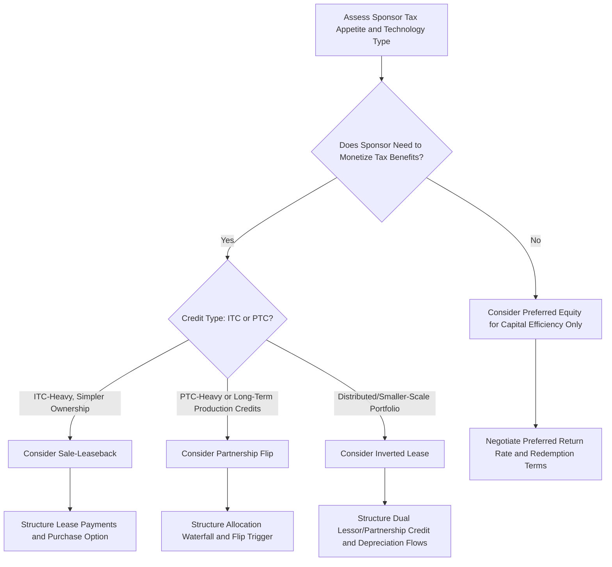

## Preferred Equity, Sale-Leaseback, and Inverted Lease Structures

### Overview and Purpose

Beyond the standard partnership flip structure, project finance and renewable energy sponsors have developed several alternative tax-benefit monetization and capital structures — preferred equity, sale-leaseback, and inverted (pass-through) lease arrangements — each suited to different technology types, tax benefit profiles, sponsor tax positions, and investor risk/return preferences. These structures share the common purpose of efficiently allocating tax benefits, cash flows, and risk between parties with different capacities to use them, but differ meaningfully in mechanics, complexity, and typical use cases.

### Preferred Equity Structures

**Key Points**

- **Preferred equity** in project finance refers to an equity investment that receives a preferential (fixed or formulaic) return before any distributions are made to common/sponsor equity, without the investor necessarily receiving the disproportionate tax benefit allocations characteristic of a full partnership flip structure.
- Preferred equity is typically used as a **layer within the capital structure between senior debt and common equity**, reducing the sponsor's required common equity check while offering the preferred investor a more predictable, contractually defined return profile than common equity, and generally a subordinate but more senior position than common equity in the distribution waterfall.
- Unlike tax equity partnership flip structures, preferred equity investors are not necessarily seeking to monetize tax benefits directly — the structure is often used purely as a capital efficiency tool, sometimes layered *alongside* a separate tax equity investor in more complex "leveraged lease" or hybrid capital stacks.
- Preferred equity distributions are typically prioritized in the cash flow waterfall after debt service (and reserve funding) but before common equity distributions, and may include a **cumulative** feature (unpaid preferred returns accrue and must be paid before any common distribution) or **non-cumulative** feature.
- Redemption mechanics (a fixed date, a call option, or conversion rights) are heavily negotiated and directly affect both the sponsor's long-term ownership economics and the preferred investor's effective yield profile.

### Sale-Leaseback Structures

**Key Points**

- In a **sale-leaseback**, the project sponsor/developer sells the completed (or to-be-completed) project asset to a third-party investor (the lessor), who then leases the asset back to the sponsor (as lessee) to operate under a long-term lease agreement.
- The lessor, as the legal owner of the asset, claims the associated tax benefits — depreciation and, where applicable, Investment Tax Credit — while the sponsor/lessee retains operational control and the economic benefit of the project's cash flows, net of lease payments.
- Sale-leasebacks are structurally simpler than a partnership flip in some respects (there is no ongoing partnership governance or complex allocation waterfall) but shift a larger share of long-term asset ownership economics to the investor for the lease term, and typically involve a **fixed lease payment schedule** rather than a variable cash-and-tax allocation.
- A key structuring consideration is ensuring the arrangement is respected as a genuine sale-leaseback for tax purposes rather than being recharacterized as a secured financing, which depends on the specific terms of the lease, purchase options, and residual value risk allocation — this is a specialized tax law determination requiring qualified tax counsel.
- At lease expiration, the sponsor commonly holds a **fair market value purchase option** or, in some structures, a fixed-price buyout option, to reacquire full ownership of the asset.

### Inverted Lease (Pass-Through Lease) Structures

**Key Points**

- An **inverted lease**, also called a pass-through lease, is a hybrid structure in which the sponsor and tax equity investor form a partnership (similar to a partnership flip) that itself acts as the **lessee**, leasing the project asset from a separate owner-lessor entity (which may be wholly owned by the sponsor).
- The distinguishing feature is that tax credits pass through the partnership structure to the tax equity investor via a specific tax election, while depreciation may be retained by the lessor entity — this separation of credit and depreciation benefit flows is the reason the structure is used in cases where a straightforward sale-leaseback or partnership flip would be less tax-efficient for the specific credit mechanics involved.
- Inverted leases have historically seen relatively more use for smaller-scale or distributed solar portfolios (e.g., residential or commercial solar) compared to utility-scale wind or solar, where partnership flip and sale-leaseback structures have more commonly predominated — though structure selection ultimately depends on the specific tax and commercial facts of each transaction. [Inference: relative prevalence by segment reflects generally described market practice and may not hold uniformly across all transaction types or evolve consistently as tax law and market conventions change.]
- Modeling an inverted lease requires careful tracking of two separate but related cash and tax benefit flows — the lease payment stream from the partnership to the lessor, and the tax credit/depreciation allocation between the lessor and the tax equity partner within the partnership — making it one of the more operationally complex structures to build and audit in a project finance model.

### Comparison of Structures

| Feature | Partnership Flip | Preferred Equity | Sale-Leaseback | Inverted Lease |
| --- | --- | --- | --- | --- |
| Primary Purpose | Monetize tax benefits via allocation shift | Capital-efficient layered financing | Monetize tax benefits via asset sale | Monetize tax credits via lease pass-through |
| Tax Benefit Recipient | Tax equity investor (pre-flip) | Not typically a tax benefit vehicle | Lessor (asset owner) | Tax equity partner (credits) / Lessor (depreciation) |
| Ongoing Governance Complexity | High (partnership consent rights) | Low to moderate | Low | High (dual entity structure) |
| Typical Return Mechanism | Target after-tax IRR trigger | Fixed/formulaic preferred return | Fixed lease payments | Combination of lease payments and credit allocation |
| Common Technology Use | Utility-scale wind and solar | Any project finance sector | Various, including non-renewable assets | Historically more common in smaller-scale solar |

### Illustrative Cash Flow Waterfall Position

<svg xmlns="http://www.w3.org/2000/svg" viewBox="0 0 650 380">
<text x="325" y="26" text-anchor="middle" font-size="16" font-weight="bold" fill="#1a1a1a">Capital Structure Waterfall Position (svg_diagram)</text>
<rect x="175" y="50" width="300" height="55" fill="#2b6cb0" />
<text x="325" y="82" text-anchor="middle" font-size="13" fill="#fff">Senior Project Debt (Most Senior)</text>
<rect x="175" y="110" width="300" height="55" fill="#4299e1" />
<text x="325" y="142" text-anchor="middle" font-size="13" fill="#fff">Reserve Accounts (DSRA/MMRA)</text>
<rect x="175" y="170" width="300" height="55" fill="#805ad5" />
<text x="325" y="202" text-anchor="middle" font-size="13" fill="#fff">Preferred Equity</text>
<rect x="175" y="230" width="300" height="55" fill="#d69e2e" />
<text x="325" y="262" text-anchor="middle" font-size="13" fill="#fff">Tax Equity Allocation (Pre-Flip)</text>
<rect x="175" y="290" width="300" height="55" fill="#38a169" />
<text x="325" y="322" text-anchor="middle" font-size="13" fill="#fff">Common/Sponsor Equity (Most Junior)</text>

<text x="500" y="80" font-size="10" fill="`#4a5568`">Fixed/Contractual</text>

<text x="500" y="325" font-size="10" fill="`#4a5568`">Residual Upside</text>

</svg>

### Structure Selection Decision Flow

### Modeling Considerations Across Structures

**Key Points**

- All three structures require the project finance model to support **multiple, non-pro-rata distribution tiers**, meaning a simple pro-rata equity waterfall is insufficient — the model must reflect the specific contractual priority and allocation percentages unique to each structure and its governing agreement.
- **Circular reference risk** is present in preferred equity structures with formulaic (rather than fixed) returns tied to project performance, in sale-leasebacks with fair-market-value-based purchase options requiring residual value estimation, and especially in inverted leases where dual entity cash flows interact.
- Sensitivity and scenario analysis (see prior chapter) should specifically test how each structure's return to the investor and to the sponsor responds to downside cases, since fixed-payment structures (sale-leaseback, preferred equity) behave very differently under stress than allocation-based structures (partnership flip, inverted lease) where the investor's return is more directly linked to project performance.
- Legal and accounting characterization risk (e.g., whether a sale-leaseback is respected as a true sale, or whether a preferred equity instrument is characterized as debt or equity for accounting and tax purposes) can have material downstream modeling implications and should be confirmed with tax and accounting advisors before finalizing model mechanics.

### Common Pitfalls

**Key Points**

- **Treating preferred equity as functionally equivalent to debt** in the model without correctly reflecting subordination to senior debt and the absence of standard debt covenants and acceleration remedies, which can materially misstate risk allocation.
- **Failing to test sale-leaseback recharacterization risk** in the model's assumptions — if a transaction is later recharacterized as a financing rather than a true sale for tax purposes, the assumed tax benefit allocation to the lessor would be invalidated, with material consequences for both parties' returns.
- **Underestimating inverted lease modeling complexity**, particularly the dual cash/tax flow tracking between the lessor and the tax equity partnership, leading to errors in either the credit allocation or the depreciation allocation that are difficult to detect without careful reconciliation.
- **Inconsistent waterfall tier modeling**, where a change to one tier's assumptions (e.g., extending the preferred equity redemption date) is not properly reflected in downstream tiers, producing an internally inconsistent cash flow waterfall.
- **Applying outdated tax credit or characterization rules**: given the frequency of change in U.S. federal tax law affecting credit transferability, safe harbor provisions, and structure characterization, using outdated assumptions is a common and material error. [Verify current legislation and applicable guidance for any live transaction.]

**Next Steps**

- Depreciation Methods and Tax Shields
- Tax Equity Partnership Flip Structures
- Back-Leverage Debt Structures
- Cash Flow Waterfall Design and Distribution Mechanics
- Investment Tax Credit and Production Tax Credit Mechanics
- Circular Reference Management in Excel-Based Waterfall Models