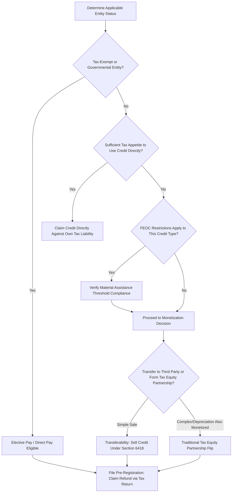

## Tax Credit Transferability and Direct Pay Mechanisms

### Overview and Purpose

Tax credit transferability and elective (direct) pay are two credit monetization mechanisms introduced by the Inflation Reduction Act (IRA) of 2022, codified respectively under Internal Revenue Code Section 6418 (transferability) and Section 6417 (elective pay), that allow parties to realize the cash value of clean energy tax credits without necessarily forming a complex tax equity partnership. These mechanisms were designed to broaden access to clean energy tax credit monetization beyond the small pool of sophisticated tax equity investors traditionally required for partnership flip and sale-leaseback structures.

As of 2026, this area of law has been substantially reshaped by the One Big Beautiful Bill Act (OBBBA), signed July 4, 2025, which preserved the core transferability and elective pay mechanisms while introducing significant new restrictions, accelerated phase-out deadlines, and Foreign Entity of Concern (FEOC) eligibility rules that materially affect project finance structuring. This is an active, fast-moving area of tax law, and any live transaction requires current guidance verification with qualified tax counsel.

### Elective Pay ("Direct Pay") Mechanism

**Key Points**

- Elective pay, sometimes referred to as "direct pay" (distinct from the IRS payment method of the same informal name), allows entities that can't use elective pay but do qualify for an eligible tax credit to transfer all or a portion of the credit to a third-party buyer in exchange for cash — more precisely, elective pay itself makes certain credits effectively refundable for eligible "applicable entities." [Internal Revenue Service](https://www.irs.gov/credits-deductions/elective-pay-and-transferability)
- Elective pay makes certain clean energy tax credits and the CHIPs manufacturing credit effectively refundable, with the IRS treating the elective payment amount as a tax payment, counting it as an overpayment, and refunding it to the entity. [Internal Revenue Service](https://www.irs.gov/credits-deductions/elective-pay-and-transferability)
- Eligible "applicable entities" for elective pay are generally **tax-exempt or governmental in nature** — applicable entities generally include tax-exempt organizations, state and local governments, Indian tribal governments, Alaska Native Corporations, the Tennessee Valley Authority and rural electric cooperatives, with certain other taxpayers eligible to elect applicable-entity treatment for a limited subset of credits. [irs](https://irs.gov/newsroom/irs-releases-guidance-on-elective-payments-and-transfers-of-certain-credits-under-the-inflation-reduction-act)
- This mechanism is particularly significant for project finance structures involving public power authorities, municipal utilities, rural electric cooperatives, and tribal-owned energy projects, which historically could not benefit from tax credits at all due to having no taxable income against which to claim them.

### Transferability Mechanism

**Key Points**

- Transferability, codified under IRC Section 6418, allows eligible taxpayers to transfer all or a portion of eligible credits to unrelated taxpayers for cash payments, with the unrelated taxpayers then allowed to claim the transferred credits on their own tax returns, applicable for tax years beginning after December 31, 2022. [Internal Revenue Service](https://www.irs.gov/newsroom/irs-releases-final-guidance-on-transfers-of-certain-credits-under-the-inflation-reduction-act)[Internal Revenue Service](https://www.irs.gov/newsroom/irs-releases-final-guidance-on-transfers-of-certain-credits-under-the-inflation-reduction-act)
- This mechanism allows a taxable (non tax-exempt) project sponsor with insufficient tax appetite to sell credits directly to a third-party buyer for cash, without the ongoing partnership governance, allocation waterfall, and target-IRR flip mechanics required by a traditional tax equity partnership flip structure.
- The buyer applies the purchased credit against their federal income tax liability; the seller receives cash without forming a partnership with the buyer, which is the key structural simplification transferability offers relative to tax equity partnership structures. [Crux](https://www.crux.com/blog/transferable-tax-credits)
- Transferable tax credits sit alongside traditional tax equity as a complementary path to monetize clean energy and manufacturing credits, and have rapidly become one of the largest sources of clean energy financing in the United States, particularly broadening capital access for mid-size project developers, manufacturers, and miners that traditionally lacked access to tax equity investment. [An ultimate guide to transferable tax credits (updated 2026) | The Crux of It Blog +2](https://www.crux.com/blog/transferable-tax-credits)
- A mandatory **IRS pre-filing registration process** through an electronic portal is required before either an elective payment election or a credit transfer election can be made, generating a registration number that must be included on the relevant tax return.

### Transferability vs. Traditional Tax Equity: Structural Comparison

| Feature | Transferability (Sec. 6418) | Traditional Tax Equity Partnership Flip |
| --- | --- | --- |
| Relationship Formed | Simple sale of credit for cash; no partnership | Ongoing partnership with governance rights |
| Buyer's Involvement | Passive; no ownership interest in project | Active partner with consent/governance rights |
| Complexity | Relatively simple, single transaction | Complex allocation waterfall, flip mechanics |
| Depreciation Treatment | Depreciation typically retained by seller/sponsor | Depreciation allocated per partnership agreement |
| Typical Buyer Pool | Broader range of corporate taxpayers with tax appetite | Traditionally limited to sophisticated financial institutions |
| Risk Transfer | Credit recapture risk typically remains with seller (indemnified) | Shared per partnership agreement |

[Inference: this comparison reflects general market structuring practice; specific risk allocation, indemnification, and depreciation treatment are transaction-negotiated and can vary.]

### Foreign Entity of Concern (FEOC) Restrictions Under OBBBA

**Key Points**

- Starting in 2026, no tax credit is allowed if the taxpayer is a Prohibited Foreign Entity (PFE), which includes both Specified Foreign Entities (SFEs) and Foreign-Influenced Entities (FIEs). [Sidley Austin LLP](https://www.sidley.com/en/insights/newsupdates/2025/07/the-one-big-beautiful-bill-act-navigating-the-new-energy-landscape)
- An SFE is generally an entity identified by reference to an enumerated list of authorities as a threat to U.S. security, a Chinese military company operating in the U.S., or a "foreign-controlled entity," with a domestic entity treated as an SFE only if it is majority-owned by entities with ties to North Korea, China, Russia, or Iran. [Sidley Austin LLP](https://www.sidley.com/en/insights/newsupdates/2025/07/the-one-big-beautiful-bill-act-navigating-the-new-energy-landscape)
- The definition of an FIE is much broader than that of a foreign-controlled entity, with certain narrow exceptions for publicly traded entities, meaning FEOC diligence now extends well beyond simple direct-ownership checks. [Sidley Austin LLP](https://www.sidley.com/en/insights/newsupdates/2025/07/the-one-big-beautiful-bill-act-navigating-the-new-energy-landscape)
- Clean energy tax credits are unavailable to any project owned by an SFE or FIE over which an SFE has effective control, or in some cases, that receives material assistance from an SFE or FIE, with the material assistance requirement intended to limit sourcing of equipment, components, and critical minerals from China and applying to credits under Sections 45X, 45Y, and 48E. [Thomson Reuters](https://www.thomsonreuters.com/en-us/posts/sustainability/one-big-beautiful-bill-act-clean-energy/)
- For projects beginning construction in 2026, at least 40% of the value of solar system components must come from non-FEOC sources to qualify for the 48E or 45Y credits, with that percentage rising 5 percentage points annually to 60% for projects beginning construction in 2030; storage projects face a 55% non-FEOC threshold in 2026, rising to 75% by 2030. [Solar Insure](https://www.solarinsure.com/final-changes-to-solar-tax-credit-from-h-r-1)[Solar Insure](https://www.solarinsure.com/final-changes-to-solar-tax-credit-from-h-r-1)
- Importantly, the Act preserves transferability of renewable energy tax credits under Section 6418 for the full duration of the applicable credit period, but introduces an FEOC restriction on the transaction — transferability remains available but credits cannot be transferred to a specified foreign entity. [Kirkland & Ellis LLP](https://www.kirkland.com/publications/kirkland-alert/2025/08/one-big-beautiful-bill-act-brings-big-changes-to-green-energy-tax-credits)[SEIA](https://seia.org/research-resources/clean-energy-provisions-big-beautiful-bill/)

### Accelerated Phase-Out Timelines Under OBBBA

**Key Points**

- OBBBA introduced the accelerated phase-out or termination of the technology-neutral Section 45Y (Clean Electricity Production Credit) and Section 48E (Clean Electricity Investment Credit) for wind and solar projects placed in service after 2027, with an exception for projects that begin construction on or before July 4, 2026. [Sidley Austin LLP](https://www.sidley.com/en/insights/newsupdates/2025/07/the-one-big-beautiful-bill-act-navigating-the-new-energy-landscape)
- Solar and wind projects must begin construction, as defined by IRS Notice 2025-42, no later than July 4, 2026, or be placed in service no later than December 31, 2027. [Novogradac](https://www.novoco.com/resource-centers/renewable-energy-tax-credits/about-renewable-energy-tax-credits)
- The Act generally does not affect energy projects that began construction by the end of 2024, which remain eligible for pre-IRA-style credits under the legacy Section 48 ITC and Section 45 PTC provisions. [Sidley Austin LLP](https://www.sidley.com/en/insights/newsupdates/2025/07/the-one-big-beautiful-bill-act-navigating-the-new-energy-landscape)
- These accelerated deadlines have significant project finance modeling implications: the "begin construction" determination date directly affects which credit regime, phase-out percentage, and FEOC restriction tier applies to a given project, making this determination a critical, transaction-defining diligence item rather than a formality.
- Technology-specific carve-outs exist: for example, Section 45V hydrogen production credit facilities beginning construction after December 31, 2027 are no longer eligible for the credit, but Section 45V is not subject to the new FEOC restrictions applicable to 45X, 45Y, and 48E, illustrating that FEOC and phase-out rules are not uniform across all credit types. [FBT Gibbons](https://fbtgibbons.com/one-big-beautiful-bill-act-cuts-the-power-phase%E2%80%91outs-foreign%E2%80%91entity-restrictions-and-domestic-content-in-clean%E2%80%91energy-credits/)

### Modeling Implications for Project Finance

**Key Points**

- **Credit eligibility must be modeled as a scenario-dependent input**, not a fixed assumption, given the interaction between construction start date, placed-in-service date, technology type, and the applicable FEOC material assistance percentage threshold for that vintage year.
- **Transferability pricing** (the discount at which credits are sold, reflecting buyer due diligence costs, recapture risk, and market liquidity) should be modeled as a distinct assumption from the credit's face value, since transferred credits typically sell below full face value to compensate the buyer for risk and time value.
- **FEOC compliance costs** — legal diligence, supply chain certification, and potential safe harbor documentation — represent a new, non-trivial project cost category that should be explicitly budgeted for projects seeking to qualify for 45X, 45Y, or 48E credits under the post-OBBBA regime.
- **Recapture risk allocation** in a transferability sale must be explicitly addressed in the transfer agreement and reflected in the model's risk allocation and indemnification cost assumptions, since the buyer bears the risk of credit recapture triggered by the seller's subsequent noncompliance or disqualifying event.
- Given the fast pace of legislative and regulatory change in this area, project finance models should isolate credit-related assumptions (eligibility, phase-out percentage, FEOC threshold, elective pay/transfer treatment) in a clearly labeled, easily updatable assumptions section rather than embedding them throughout calculation logic.

### Credit Monetization Decision Flow

### Illustrative Credit Monetization Path Comparison

<svg xmlns="http://www.w3.org/2000/svg" viewBox="0 0 700 320">
<text x="350" y="26" text-anchor="middle" font-size="16" font-weight="bold" fill="#1a1a1a">Credit Monetization Pathways (svg_diagram)</text>
<rect x="30" y="60" width="190" height="90" rx="6" fill="#2b6cb0" />
<text x="125" y="95" text-anchor="middle" font-size="12" fill="#fff">Elective Pay</text>
<text x="125" y="115" text-anchor="middle" font-size="10" fill="#bee3f8">Tax-exempt / gov't entities</text>
<text x="125" y="132" text-anchor="middle" font-size="10" fill="#bee3f8">Direct IRS refund</text>
<rect x="255" y="60" width="190" height="90" rx="6" fill="#38a169" />
<text x="350" y="95" text-anchor="middle" font-size="12" fill="#fff">Transferability</text>
<text x="350" y="115" text-anchor="middle" font-size="10" fill="#c6f6d5">Taxable sponsor, no partnership</text>
<text x="350" y="132" text-anchor="middle" font-size="10" fill="#c6f6d5">Simple cash sale of credit</text>
<rect x="480" y="60" width="190" height="90" rx="6" fill="#805ad5" />
<text x="575" y="95" text-anchor="middle" font-size="12" fill="#fff">Tax Equity Partnership</text>
<text x="575" y="115" text-anchor="middle" font-size="10" fill="#e9d8fd">Credit + depreciation</text>
<text x="575" y="132" text-anchor="middle" font-size="10" fill="#e9d8fd">Flip governance structure</text>
<line x1="125" y1="150" x2="125" y2="190" stroke="#333" stroke-width="1.5" />
<line x1="350" y1="150" x2="350" y2="190" stroke="#333" stroke-width="1.5" />
<line x1="575" y1="150" x2="575" y2="190" stroke="#333" stroke-width="1.5" />
<rect x="200" y="190" width="300" height="60" rx="6" fill="#d69e2e" />
<text x="350" y="215" text-anchor="middle" font-size="12" fill="#fff">FEOC Compliance Check</text>
<text x="350" y="233" text-anchor="middle" font-size="10" fill="#fefcbf">Applies to 45X / 45Y / 48E credits</text>
<line x1="350" y1="250" x2="350" y2="280" stroke="#333" stroke-width="1.5" />
<text x="350" y="300" text-anchor="middle" font-size="11" fill="#4a5568">Credit Realized as Project Cash Flow</text>
</svg>

### Common Pitfalls

**Key Points**

- **Failing to complete IRS pre-filing registration** before attempting to claim an elective payment or execute a credit transfer, which is a mandatory prerequisite and a common source of transaction delay if not planned for well in advance of the relevant tax filing deadline.
- **Overlooking FEOC material assistance thresholds** in supply chain diligence, particularly given that the FEOC provisions are extremely complex, with safe harbor rules, certification requirements, and existing contract exceptions requiring extensive implementation guidance — a project's equipment procurement strategy must now be evaluated against evolving compliance thresholds, not just cost and performance. [Bipartisan Policy Center](https://bipartisanpolicy.org/explainer/unpacking-the-feoc-provisions-in-the-one-big-beautiful-bill-act/)
- **Treating transferability pricing as equal to face value**, when in practice transferred credits typically trade at a discount reflecting buyer diligence and risk premiums — modeling full face value overstates expected project finance proceeds from a credit sale.
- **Ignoring the "begin construction" determination's downstream effects**: this single determination affects credit type eligibility, phase-out percentage, and FEOC threshold tier simultaneously, making it one of the highest-leverage diligence items in a post-OBBBA renewable energy project finance transaction.
- **Assuming static rules given the pace of change**: this area of tax law has been amended substantially since 2022 and continues to evolve through Treasury guidance; any live transaction requires verification of current rules, safe harbor tables, and effective dates directly with qualified tax counsel rather than relying on general descriptions. [This entire regulatory area should be treated as subject to ongoing change; the details above reflect the state of guidance as identified through current search and may not capture subsequent regulatory developments.]

**Next Steps**

- Tax Equity Partnership Flip Structures
- Depreciation Methods and Tax Shields
- Preferred Equity, Sale-Leaseback, and Inverted Lease Structures
- Foreign Entity of Concern (FEOC) Supply Chain Diligence
- Investment Tax Credit and Production Tax Credit Mechanics
- Debt Sculpting and DSCR-Based Debt Sizing Under Credit Monetization Uncertainty