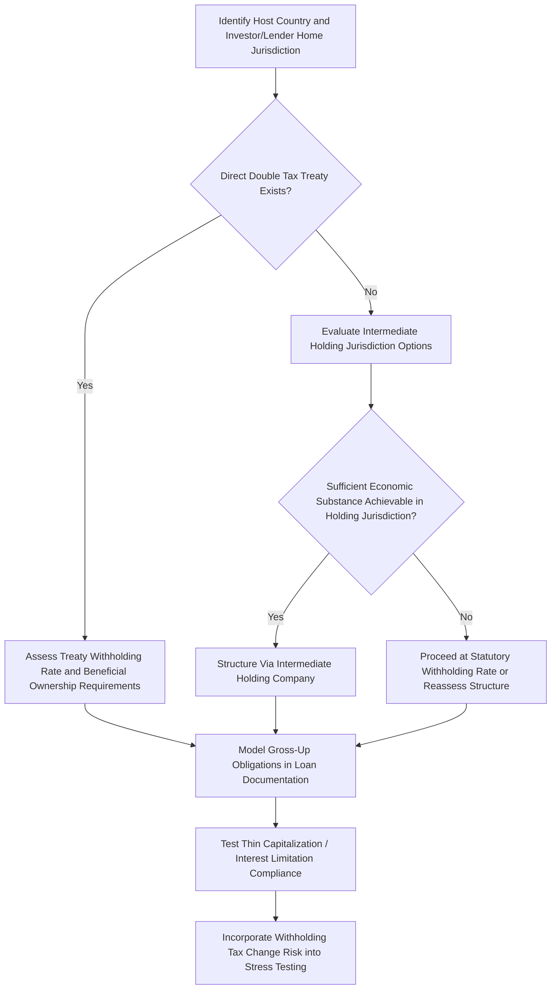

## Withholding Tax and Cross-Border Structuring

### Overview and Purpose

Cross-border project finance transactions — involving foreign sponsors, foreign lenders, offshore holding structures, or projects in emerging markets financed with international capital — introduce withholding tax exposure at multiple points in the payment structure: interest paid to foreign lenders, dividends distributed to foreign equity holders, royalties or technical service fees paid to foreign affiliates, and sometimes payments for equipment or services from foreign suppliers. Because withholding tax is deducted at source before the payment reaches the recipient, it directly reduces the net cash return to lenders and investors unless mitigated through structuring, tax treaty relief, or gross-up provisions.

Withholding tax planning is a core component of cross-border project finance structuring because even a modest withholding rate (commonly 10%-30% in the absence of treaty relief) can materially affect the all-in cost of debt or the net equity return, and because tax treaty benefits and structural mitigants are highly jurisdiction- and structure-specific.

### How Withholding Tax Arises in Project Finance

**Key Points**

- **Interest withholding tax**: Applied by the host country (where the SPV/borrower is located) on interest payments made to a foreign lender, since the host country taxes the income at its source rather than relying solely on the lender's home country to tax it.
- **Dividend withholding tax**: Applied on dividend distributions from the project company (or an intermediate holding company) to a foreign parent or equity investor.
- **Royalty and technical service fee withholding tax**: Applied on payments to a foreign affiliate for licensed technology, trademarks, or technical/management services provided to the project.
- **Capital gains withholding**: In some jurisdictions, applied on gains realized by a foreign investor upon exit (sale of shares in the project company), which is a key consideration in exit and refinancing planning.
- Statutory withholding rates absent any treaty relief are typically set at a relatively high default rate by domestic law (commonly in the 15%-30% range for many jurisdictions), which is why tax treaty analysis is a first-order structuring consideration for any cross-border project finance transaction.

### Double Taxation Treaties (DTTs)

**Key Points**

- A **Double Taxation Treaty** (also called a Double Tax Agreement or Double Tax Convention) between the host country and the lender's/investor's home country typically reduces the statutory withholding rate on interest, dividends, and royalties to a lower treaty rate, and may eliminate withholding entirely in some cases.
- Treaty benefits are generally only available if the recipient satisfies the treaty's **beneficial ownership** requirement — meaning the recipient must be the genuine economic owner of the income, not merely a conduit or nominee interposed to obtain treaty benefits it would not otherwise be entitled to.
- Many jurisdictions and treaties incorporate **Limitation on Benefits (LOB)** provisions or general anti-avoidance rules (sometimes informed by the OECD's Base Erosion and Profit Shifting, or BEPS, framework) specifically designed to deny treaty benefits to structures lacking sufficient economic substance in the intermediate treaty jurisdiction.
- **Treaty shopping** — routing an investment through an intermediate holding jurisdiction solely to access a more favorable treaty rate — has become substantially harder to sustain following widespread BEPS-driven treaty updates and the OECD Multilateral Instrument (MLI), which many countries have adopted to insert anti-abuse provisions directly into their existing treaty networks. [Verify the current treaty network, MLI adoption status, and specific anti-abuse provisions applicable to any given jurisdiction pair, as this area continues to evolve through ongoing treaty renegotiation and MLI ratification.]

### Common Cross-Border Holding Structures

**Key Points**

- **Direct cross-border lending/investment**: The simplest structure, with the foreign lender or investor holding debt or equity directly in the project SPV — withholding tax exposure is determined solely by the treaty (if any) between the host country and the lender's/investor's actual home jurisdiction.
- **Intermediate holding company structures**: Interposing a holding company in a jurisdiction with a favorable treaty network with the host country (historically, jurisdictions such as the Netherlands, Luxembourg, Mauritius, Singapore, and others have been commonly used for this purpose in various regional contexts) to reduce withholding tax on dividend or interest flows back to the ultimate parent.
- **Back-to-back loan structures**: A lender extends a loan to an intermediate entity, which on-lends to the project SPV — historically used to access favorable treaty rates on the interest leg, though increasingly scrutinized under substance and beneficial ownership requirements.
- **Debt versus equity structuring at the holding company level**: The mix of debt and equity used to fund the project SPV from an intermediate holding company affects the composition of cross-border payment flows (interest vs. dividends), each of which may carry different withholding treatment and be subject to different thin capitalization or interest limitation rules.

### Illustrative Cross-Border Structure with Withholding Points

<svg xmlns="http://www.w3.org/2000/svg" viewBox="0 0 700 400">
<text x="350" y="26" text-anchor="middle" font-size="16" font-weight="bold" fill="#1a1a1a">Cross-Border Structure and Withholding Points (svg_diagram)</text>
<rect x="270" y="50" width="160" height="55" rx="6" fill="#2b6cb0" />
<text x="350" y="82" text-anchor="middle" font-size="12" fill="#fff">Foreign Lender / Investor</text>
<line x1="350" y1="105" x2="350" y2="145" stroke="#333" stroke-width="1.5" />
<rect x="150" y="145" width="120" height="30" rx="4" fill="#feb2b2" />
<text x="210" y="165" text-anchor="middle" font-size="10" fill="#742a2a">Dividend WHT Point</text>
<rect x="270" y="200" width="160" height="55" rx="6" fill="#4a5568" />
<text x="350" y="232" text-anchor="middle" font-size="12" fill="#fff">Intermediate Holding Co</text>
<text x="350" y="248" text-anchor="middle" font-size="9" fill="#cbd5e0">(Treaty Jurisdiction)</text>
<line x1="350" y1="255" x2="350" y2="295" stroke="#333" stroke-width="1.5" />
<rect x="440" y="255" width="150" height="30" rx="4" fill="#feb2b2" />
<text x="515" y="275" text-anchor="middle" font-size="10" fill="#742a2a">Interest WHT Point</text>
<rect x="270" y="300" width="160" height="55" rx="6" fill="#38a169" />
<text x="350" y="332" text-anchor="middle" font-size="12" fill="#fff">Project SPV (Host Country)</text>
</svg>

### Interest Deductibility and Thin Capitalization Rules

**Key Points**

- Beyond withholding tax on the payment itself, many jurisdictions impose **thin capitalization rules** or **interest limitation rules** (increasingly modeled on the OECD BEPS Action 4 framework) that cap the amount of interest expense a project SPV can deduct for corporate income tax purposes, typically based on a debt-to-equity ratio threshold or a percentage-of-EBITDA limitation.
- Interest disallowed under thin capitalization or interest limitation rules is not deductible against the SPV's taxable income, increasing the project's effective cash tax burden even though the interest payment itself is still made — this interacts directly with the depreciation tax shield analysis, since both affect the same taxable income base.
- Cross-border project finance models should explicitly test the debt-to-equity ratio and projected interest expense against the host jurisdiction's specific thin capitalization or interest limitation threshold, since breaching it can materially affect projected cash taxes and CFADS in a way that a purely mechanical DSCR calculation might otherwise overlook.

### Gross-Up Provisions in Loan Documentation

**Key Points**

- Cross-border loan agreements commonly include a **tax gross-up clause**, obligating the borrower (the project SPV) to pay an additional amount to the lender sufficient to ensure the lender receives the same net amount it would have received absent any withholding tax, effectively shifting the economic burden of withholding tax to the borrower/project.
- Gross-up provisions directly affect project finance cash flow modeling: if a change in law increases withholding tax during the life of the loan, the project's actual debt service cost increases correspondingly, which must be captured as a cash flow risk in sensitivity and stress testing rather than assumed away.
- Some financing agreements include a **tax indemnity** provision distinct from the gross-up clause, addressing other tax-related costs (e.g., increased costs from a change in law affecting the lender's tax position) beyond the specific withholding tax gross-up mechanic.
- The interaction between gross-up obligations and withholding tax rate changes is a specific stress test variable that should be incorporated into the risk analysis of any cross-border-financed project, given that host country tax law is subject to change over a typical 15-20 year project finance debt tenor.

### Value Added Tax (VAT) and Indirect Tax Considerations

**Key Points**

- Beyond withholding tax on financing payments, cross-border project finance transactions often involve **VAT or GST** on imported equipment, construction services, and certain cross-border service fees, which can create significant working capital timing issues if VAT paid on inputs is not promptly recoverable.
- Many jurisdictions offer **VAT exemptions or deferral mechanisms** for large infrastructure or energy projects specifically to avoid burdening project cash flow during the capital-intensive construction phase, though eligibility and mechanics vary significantly by jurisdiction and sector.
- **Import duties** on capital equipment are a related but distinct consideration from VAT, and some jurisdictions offer duty exemptions for qualifying infrastructure or energy project equipment as an investment incentive.

### Modeling Cross-Border Tax Flows

**Key Points**

- A project finance model financing a project with foreign lenders or investors should explicitly model the **gross versus net cash flow** distinction at each cross-border payment point — gross interest/dividend amount, withholding tax deducted, and net amount received by the foreign party — rather than modeling only the net figure, since gross-up obligations and treaty rate changes require visibility into the gross calculation.
- **Treaty rate lookup tables** are commonly built as a dedicated assumptions section, referencing the applicable treaty rate (or absence of treaty, defaulting to statutory withholding rate) based on the specific counterparty jurisdiction, to support scenario testing of different lender/investor jurisdictions or potential treaty changes.
- Where an intermediate holding company is used, the model must reflect withholding tax (or its absence, if eliminated by treaty or an EU-style parent-subsidiary directive equivalent) at **both** the project SPV-to-holding-company leg and the holding-company-to-ultimate-parent leg, since a favorable treaty at only one leg does not eliminate withholding exposure on the other.

### Cross-Border Structuring Decision Flow

### Common Pitfalls

**Key Points**

- **Assuming treaty benefits apply automatically** without confirming beneficial ownership, substance requirements, and Limitation on Benefits provisions, which can result in denied treaty relief and a materially higher effective withholding rate than assumed in the model.
- **Modeling only net cash flows** at cross-border payment points, obscuring the gross-up exposure that would materialize if withholding tax rates change or treaty relief is successfully challenged by host country tax authorities.
- **Overlooking thin capitalization or interest limitation rule compliance**, which can result in disallowed interest deductions, higher-than-modeled cash taxes, and a corresponding CFADS shortfall relative to the base case.
- **Failing to model both legs of an intermediate holding structure**, incorrectly assuming that a favorable treaty rate on one leg of the payment chain eliminates withholding exposure on the other leg.
- **Treating cross-border tax structuring as static** over a long project finance debt tenor, when treaty renegotiation, BEPS/MLI-driven anti-abuse provisions, and unilateral host country tax law changes can all alter the withholding tax and structuring landscape materially over a 15-20 year period — this risk should be explicitly incorporated into stress testing alongside other key risk variables.

**Next Steps**

- Tax Equity Partnership Flip Structures
- Depreciation Methods and Tax Shields
- Currency Risk and Foreign Exchange Hedging Structures
- Political Risk Insurance and Multilateral Guarantee Structures
- Thin Capitalization and Interest Limitation Rules in Detail
- VAT and Import Duty Planning for Construction Phase Cash Flow