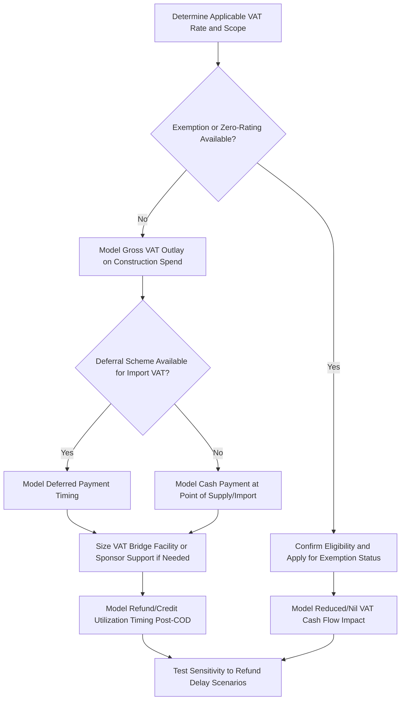

## Value Added Tax in Project Cash Flows

### Overview and Purpose

Value Added Tax (VAT), and its close analogues Goods and Services Tax (GST) in some jurisdictions, is a consumption tax levied at each stage of the supply chain on the value added to goods and services. Unlike corporate income tax or withholding tax, VAT is generally intended to be **cash-flow neutral** for a registered business over time — VAT paid on inputs (purchases) is typically recoverable as a credit against VAT collected on outputs (sales), or refundable if input VAT exceeds output VAT. However, in project finance, the *timing* of VAT payment and recovery — particularly during a capital-intensive, multi-year construction phase with limited or no revenue — creates a genuine working capital and financing consideration that must be explicitly modeled.

VAT is a distinct consideration from corporate income tax and withholding tax discussed elsewhere in this chapter: it is not a cost to the business in the long run if properly structured and recovered, but a mismanaged VAT position can create material short-term liquidity strain precisely at the point in a project's life (construction) when the SPV has the least financial flexibility to absorb it.

### How VAT Arises Across the Project Life Cycle

**Key Points**

- **Construction phase**: VAT is typically charged by contractors, equipment suppliers, and service providers on their invoices to the project SPV, creating a substantial VAT outlay at exactly the point when the SPV has no offsetting output VAT from project revenue (since the project is not yet operational).
- **Import VAT**: For imported equipment and materials (common in project finance given the international nature of specialized equipment supply chains), import VAT is often payable at the point of customs clearance, creating an additional cash timing consideration distinct from domestically-sourced VAT.
- **Operations phase**: Once the project is generating revenue, output VAT charged on sales (where applicable — some project finance revenue streams, such as certain regulated utility tariffs or specific exempt supplies, may not attract output VAT at all, depending on jurisdiction and sector) can be offset against input VAT on ongoing operating costs, generally normalizing the VAT position.
- **Exit/disposal phase**: Sale of project assets or shares may itself trigger VAT considerations depending on the transaction structure and jurisdiction-specific rules regarding asset sales, share sales, and "transfer of a going concern" type exemptions.

### The Construction-Phase VAT Cash Flow Problem

**Key Points**

- During construction, a project SPV commonly accumulates a large **VAT receivable position** (input VAT paid to contractors and suppliers, with little or no output VAT to offset it against), which must either be refunded by the tax authority or carried forward as a credit against future output VAT once operations begin.
- The **timing lag between paying input VAT and receiving a refund or utilizing the credit** can range from weeks to many months (or longer, in jurisdictions with slow or inefficient VAT refund administration), creating a genuine financing need that must be sized and funded — either through a dedicated VAT facility, sponsor support, or inclusion within the overall construction financing package.
- In jurisdictions with historically slow or unreliable VAT refund processes, lenders and sponsors may treat the VAT receivable as effectively illiquid for modeling purposes and require a specific VAT bridge facility rather than assuming prompt refund, since a stalled VAT refund can otherwise create an unplanned liquidity shortfall during construction.
- The magnitude of the construction-phase VAT exposure is directly proportional to the applicable VAT rate and total qualifying capex — for a project with, say, a 15%-20% VAT rate (common in many jurisdictions) and capex in the hundreds of millions, the VAT receivable can represent a very substantial absolute cash amount requiring dedicated financing attention.

### VAT Mitigation Mechanisms

**Key Points**

- **VAT exemption or zero-rating for qualifying infrastructure/energy projects**: Many jurisdictions provide specific exemptions or zero-rating for imports of capital equipment or construction services related to designated categories of infrastructure or energy projects, eliminating the cash flow issue at its source for qualifying spend — eligibility criteria and application procedures vary significantly by jurisdiction and are frequently sector-specific (e.g., renewable energy equipment may qualify for exemptions that general industrial equipment does not).
- **VAT deferral schemes**: Some jurisdictions allow deferral of import VAT payment (e.g., via a deferred payment scheme or postponed VAT accounting mechanism) rather than requiring cash payment at the point of customs clearance, effectively converting a cash payment into an accounting entry reconciled on a later VAT return.
- **Dedicated VAT bridge/working capital facility**: A financing facility specifically sized to fund the construction-phase VAT receivable, typically repaid once VAT refunds are received or the credit is utilized against operational-phase output VAT — this is a distinct facility from the main construction or term debt facility and is sized and structured separately.
- **Fiscal representative or special-purpose VAT recovery arrangements**: In some jurisdictions, using a registered fiscal representative or specific administrative arrangement can expedite VAT refund processing relative to standard procedures.
- **Sponsor support/contingent equity commitment**: In the absence of an exemption, deferral, or dedicated facility, sponsors may need to commit contingent equity support specifically to bridge VAT timing risk, which should be explicitly documented and sized in the financing structure.

### Illustrative VAT Cash Flow Timeline

<svg xmlns="http://www.w3.org/2000/svg" viewBox="0 0 700 340">
<text x="350" y="26" text-anchor="middle" font-size="16" font-weight="bold" fill="#1a1a1a">VAT Cash Flow Across Project Phases (svg_diagram)</text>
<line x1="60" y1="290" x2="640" y2="290" stroke="#333" stroke-width="2" />
<line x1="60" y1="290" x2="60" y2="60" stroke="#333" stroke-width="2" />
<text x="350" y="315" text-anchor="middle" font-size="12" fill="#333">Project Timeline</text>
<text x="25" y="175" text-anchor="middle" font-size="12" fill="#333" transform="rotate(-90 25 175)">VAT Position</text>
<line x1="60" y1="200" x2="640" y2="200" stroke="#a0aec0" stroke-width="1" stroke-dasharray="3,3" />
<path d="M 60 200 L 150 200 Q 250 250 350 260 L 350 200 Z" fill="#feb2b2" opacity="0.6" />
<text x="200" y="230" text-anchor="middle" font-size="11" fill="#742a2a">Construction: VAT Receivable Builds</text>
<path d="M 350 200 L 450 190 Q 550 175 640 165 L 640 200 Z" fill="#c6f6d5" opacity="0.6" />
<text x="500" y="180" text-anchor="middle" font-size="11" fill="#22543d">Operations: Refund/Credit Utilized</text>
<line x1="350" y1="60" x2="350" y2="290" stroke="#333" stroke-width="1.5" stroke-dasharray="5,3" />
<text x="350" y="50" text-anchor="middle" font-size="11" fill="#333">COD (Commercial Operations Date)</text>
</svg>

### Modeling VAT in the Project Finance Cash Flow

**Key Points**

- VAT should be modeled as a **separate line item and, where material, a dedicated sub-schedule** within the construction budget and financing plan, distinct from the underlying capex cost itself — conflating gross (VAT-inclusive) and net (VAT-exclusive) capex figures is a common and significant modeling error.
- The construction budget is generally built on a **net-of-recoverable-VAT basis** for the purpose of assessing the underlying project economics, while a **separate VAT financing schedule** tracks the gross VAT outlay, the expected refund/credit timing, and the associated financing cost (whether via a dedicated facility, general contingency, or sponsor support).
- Where VAT refund timing is uncertain, sensitivity analysis should specifically test the impact of **delayed VAT refunds** on construction-phase liquidity, since a VAT refund delay operates similarly to a construction cost overrun or delay in its impact on cash requirements, even though it does not affect the underlying project economics once ultimately recovered.
- Any dedicated VAT facility's interest cost, if any, represents a genuine (if often modest, relative to total project financing costs) economic cost of the VAT timing mismatch and should be captured in the overall project financing cost, since this cost is not offset by the VAT refund itself.

### VAT Cash Flow Modeling Workflow

### Sector and Jurisdictional Variation

**Key Points**

- **Regulated utility revenue**: In some jurisdictions, certain regulated tariff revenues (e.g., water, in some structures) may be VAT-exempt rather than zero-rated, which is an important distinction — exempt supplies typically do not allow the recovery of associated input VAT, whereas zero-rated supplies do, materially changing the project's long-run VAT recovery position.
- **Public-Private Partnership (PPP) and availability-payment structures**: VAT treatment of availability payments made by a government counterparty can vary significantly by jurisdiction and the specific characterization of the payment (e.g., as consideration for a taxable supply of services versus a different characterization), requiring jurisdiction-specific tax analysis at the outset of structuring.
- **Emerging market VAT administration risk**: In jurisdictions with less mature or historically inconsistent VAT refund administration, project finance lenders may apply more conservative assumptions regarding refund timing and may require larger contingency or dedicated facility sizing than in jurisdictions with a well-established, reliable VAT refund track record. [Inference: this reflects general lender risk management practice; the specific conservatism applied is transaction- and jurisdiction-specific rather than governed by a fixed universal standard.]

### Common Pitfalls

**Key Points**

- **Conflating VAT-inclusive and VAT-exclusive capex figures**, leading to either an overstated underlying project cost (if VAT is never backed out) or an understated financing requirement (if the VAT cash timing need is ignored entirely).
- **Assuming prompt VAT refund without evidence**, particularly in jurisdictions with a track record of delayed VAT administration — this is one of the more common sources of unplanned construction-phase liquidity strain in cross-border project finance.
- **Failing to distinguish exempt from zero-rated revenue treatment** in the operations-phase model, which can lead to an incorrect assumption about the project's ongoing ability to recover input VAT on operating costs.
- **Omitting a dedicated VAT facility or contingency line** from the financing plan entirely, treating VAT as immaterial to the financing structure when, for large capex projects, the absolute VAT cash amount can be financially significant even though it is ultimately a timing rather than a permanent cost item.
- **Overlooking import VAT and customs-related cash timing** separately from domestic VAT, particularly for projects with a high proportion of imported specialized equipment, where customs clearance procedures may impose different payment timing than domestic supplier invoicing.

**Next Steps**

- Withholding Tax and Cross-Border Structuring
- Depreciation Methods and Tax Shields
- Construction Budget and Contingency Planning
- Working Capital Facilities in Project Finance
- Political Risk Insurance and Multilateral Guarantee Structures
- Public-Private Partnership Payment Mechanism Design