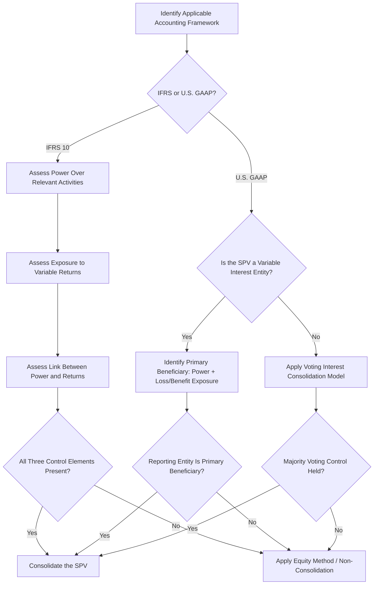

## Accounting for Special Purpose Vehicles and Consolidation

### Overview and Purpose

The accounting treatment of a project finance Special Purpose Vehicle (SPV) — specifically, whether its sponsor(s) must consolidate the SPV's assets, liabilities, and results into their own financial statements — is a critical structuring consideration with significant implications for a sponsor's reported leverage, balance sheet metrics, and financial covenant compliance at the corporate (sponsor) level, entirely separate from the SPV's own non-recourse or limited-recourse financing structure. A key motivation for many project finance structures is achieving **non-consolidation** (or "off-balance-sheet" treatment) at the sponsor level, so that the SPV's substantial debt does not appear on the sponsor's own consolidated balance sheet.

Consolidation accounting for project finance SPVs is governed principally by IFRS 10 (Consolidated Financial Statements) internationally and by the Variable Interest Entity (VIE) model under ASC 810 in U.S. GAAP, with the two frameworks sharing a similar underlying objective — identifying which party has genuine control — but differing meaningfully in their specific analytical tests.

### The Consolidation Question: Why It Matters

**Key Points**

- If a sponsor is required to consolidate an SPV, the SPV's full debt, assets, and liabilities appear on the sponsor's consolidated balance sheet, which can affect the sponsor's own leverage ratios, credit ratings, and compliance with its own corporate-level financial covenants — even though the SPV's debt remains legally non-recourse to the sponsor.
- Non-consolidation ("equity method" or similar off-balance-sheet treatment) allows a sponsor to report only its equity investment in the SPV (and its share of the SPV's net income/loss) rather than the SPV's gross assets and liabilities, which is often a significant motivating factor in how project finance joint ventures and ownership percentages are structured.
- Consolidation determination is made **independently of the legal non-recourse nature of the debt** — a debt can be entirely non-recourse to the sponsor as a matter of loan documentation while the sponsor is still required to consolidate the SPV under applicable accounting standards, because consolidation tests focus on control, not on legal recourse.

### IFRS 10: The Control Model

**Key Points**

- Under IFRS 10, an investor consolidates an investee when it has **control**, defined as having all three of: (1) power over the investee (existing rights that give the current ability to direct relevant activities), (2) exposure or rights to variable returns from its involvement, and (3) the ability to use its power over the investee to affect the amount of the investor's returns.
- **Power** in a project finance context often turns on which party controls the "relevant activities" — for an operating project, this frequently means whoever controls operational decision-making, procurement, and major capital decisions, which may or may not align with which party holds the largest equity percentage.
- A sponsor holding less than 50% of an SPV's equity can still be required to consolidate if it otherwise has practical power over relevant activities (e.g., through disproportionate voting rights on operational matters, control of the operator role, or other contractual arrangements), while conversely a sponsor holding more than 50% might not consolidate if genuine substantive participating or protective rights held by other equity holders constrain its power.
- **Substantive rights** matter more than the nominal ownership percentage: IFRS 10 requires assessing whether other parties hold substantive rights (e.g., genuine ability to remove the party with power, or to require certain actions) that would negate a finding of unilateral control.

### U.S. GAAP: The Variable Interest Entity (VIE) Model

**Key Points**

- Under ASC 810, an entity must first determine whether the SPV is a **Variable Interest Entity (VIE)** — generally, an entity where the equity investment at risk is insufficient to permit the entity to finance its activities without additional subordinated financial support, or where the equity holders as a group lack the characteristics of a controlling financial interest (decision-making rights, obligation to absorb losses, or right to receive residual returns).
- If the SPV is determined to be a VIE, the reporting entity must identify the **primary beneficiary** — the party with (1) the power to direct the activities that most significantly impact the VIE's economic performance, and (2) the obligation to absorb losses or the right to receive benefits that could potentially be significant to the VIE. The primary beneficiary consolidates the VIE.
- If the SPV is **not** a VIE, standard voting interest consolidation rules apply instead (generally, consolidation based on majority voting control), which more closely resembles a traditional ownership-percentage-driven analysis.
- Project finance SPVs are frequently structured such that the sponsor's equity investment, combined with substantial third-party non-recourse debt, can create VIE characteristics (since the equity at risk relative to total capitalization may be relatively thin), making the primary beneficiary analysis — rather than a simple voting-control analysis — the operative test in many U.S. GAAP project finance consolidation determinations.

### Comparing IFRS 10 and U.S. GAAP VIE Approaches

| Feature | IFRS 10 | U.S. GAAP (ASC 810 VIE Model) |
| --- | --- | --- |
| Core Test | Power + variable returns + link between the two | VIE identification, then primary beneficiary test |
| Ownership Percentage Role | Relevant but not determinative | Relevant but not determinative for VIEs |
| Key Analytical Focus | Control over "relevant activities" | Power to direct most economically significant activities + loss/benefit exposure |
| Applies a Distinct "VIE" Threshold Concept | No — single control model for all investees | Yes — separate VIE screen before consolidation test |
| Outcome Convergence | Generally similar outcomes in most project finance structures despite different analytical paths | Generally similar outcomes in most project finance structures despite different analytical paths |

[Inference: while the two frameworks generally converge on similar consolidation conclusions for typical project finance structures, this is not guaranteed in every case — specific fact patterns, particularly involving unusual governance rights or complex multi-sponsor joint ventures, can produce different conclusions under the two frameworks and should be assessed independently with qualified accounting advisors under each applicable standard.]

### Structuring Considerations to Achieve Non-Consolidation

**Key Points**

- **Joint venture structures with genuine shared control**: Structuring an SPV as a joint venture where no single sponsor holds unilateral power over relevant/economically significant activities (e.g., requiring unanimous consent for major decisions among multiple sponsors) can support a non-consolidation conclusion for all sponsors, with each instead applying equity method accounting.
- **Minority protective rights versus participating rights**: Ensuring that rights held by minority sponsors or other equity holders are genuinely substantive (participating) rather than merely protective (designed only to protect the minority holder's investment without conferring operational control) is a key distinction, since only substantive participating rights can negate a majority holder's presumed control.
- **Operator role allocation**: Since the operator of a project often has significant practical influence over relevant/economically significant activities, the allocation and structuring of the operator role (and any consent rights other parties hold over the operator's decisions) is frequently a central and heavily negotiated factor in the consolidation analysis.
- **Careful review of debt and equity terms for embedded control rights**: Even non-equity arrangements (e.g., certain lender consent rights, step-in rights, or other contractual arrangements) can, in unusual cases, be relevant to a broader control assessment and should be reviewed holistically rather than focusing solely on the equity ownership documents.
- Achieving a desired accounting outcome should never be the sole driver of a structure's economic and governance terms — structuring should reflect genuine commercial and risk allocation objectives, with the accounting consequence assessed as an outcome of those terms rather than reverse-engineered purely to achieve a particular accounting result, both as a matter of sound governance and because standards-setters and auditors specifically scrutinize structures that appear designed primarily to circumvent consolidation requirements.

### Consolidation Determination Decision Flow

### Financial Statement and Disclosure Implications

**Key Points**

- Even where non-consolidation is achieved, both IFRS and U.S. GAAP require **extensive disclosure** about unconsolidated structured entities/VIEs, including the nature of the sponsor's involvement, maximum exposure to loss, and any support the sponsor has provided or is committed to provide — meaning off-balance-sheet treatment does not eliminate financial statement transparency obligations regarding the arrangement.
- Sponsors with multiple project finance SPVs across a portfolio must apply the consolidation analysis **separately to each SPV**, since governance terms, ownership percentages, and operator arrangements often vary meaningfully across a portfolio of projects even within the same corporate group.
- Changes in facts and circumstances over a project's life (e.g., a change in operator, a renegotiation of governance rights, or a change in a co-venturer's substantive participating rights) can trigger a **reassessment** of the consolidation conclusion, meaning consolidation status is not necessarily fixed for the life of the project and should be periodically revisited, particularly around any material governance or ownership change.

### Common Pitfalls

**Key Points**

- **Assuming non-recourse debt automatically means non-consolidation**: These are entirely separate questions — a debt's legal recourse status has no direct bearing on whether the sponsor must consolidate the SPV under applicable accounting standards.
- **Relying solely on ownership percentage** as a proxy for the consolidation conclusion, when both IFRS 10 and the VIE model specifically require analysis of substantive control and economic exposure rights that can diverge from the nominal ownership percentage.
- **Failing to distinguish protective from participating rights** held by minority co-venturers, which is often the single most consequential judgment call in a joint venture consolidation analysis.
- **Treating the consolidation conclusion as permanent** without monitoring for changes in facts and circumstances (governance changes, operator changes, ownership changes) that could require reassessment over the life of a long-tenor project finance asset.
- **Structuring purely to achieve a desired accounting outcome** without genuine underlying commercial substance, which not only risks challenge by auditors and standard-setters but can also create governance arrangements that are commercially awkward or poorly aligned with the sponsors' actual risk-sharing intentions.
- **Overlooking portfolio-level disclosure obligations** for unconsolidated SPVs, mistakenly assuming that achieving non-consolidation eliminates all financial reporting obligations related to the arrangement.

**Next Steps**

- Non-Recourse and Limited-Recourse Financing Explained
- The Special Purpose Vehicle Structure
- Joint Venture Governance and Shareholder Agreements in Project Finance
- Tax Equity Partnership Flip Structures
- Financial Covenant Design at the Sponsor (Corporate) Level
- IFRS versus U.S. GAAP Differences in Project Finance Accounting