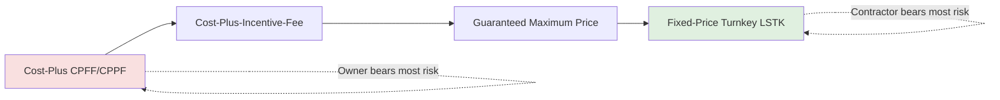

## EPC Contract Structures: Fixed-Price, Turnkey, and Cost-Plus

### Overview and Role in Project Finance

Engineering, Procurement, and Construction (EPC) contracts are the primary mechanism by which construction risk is transferred from a project company (the borrower, often a special purpose vehicle or SPV) to a contractor. In project finance, lenders rely heavily on the EPC contract structure because construction risk — cost overruns, delays, and performance shortfalls — occurs before the asset generates revenue, and therefore before debt service can begin. The choice of EPC structure directly determines the project's risk allocation matrix, its bankability, and the pricing of both debt and the contract itself.

The three dominant structures — Fixed-Price (Lump-Sum) Turnkey, Cost-Plus, and hybrid variants — sit on a spectrum of risk transfer. Fixed-Price Turnkey transfers the most risk to the contractor; Cost-Plus transfers the least, leaving most risk with the owner/sponsor.

### Fixed-Price (Lump-Sum) Turnkey EPC

**Key Points**

- The contractor agrees to design, procure, and construct the entire facility for a single, pre-agreed lump-sum price.
- "Turnkey" implies the contractor delivers a fully functioning facility ready for operation — the owner "turns the key" and the plant runs.
- The contractor bears the risk of cost overruns, most schedule delays, and (via performance guarantees) underperformance against specified output/efficiency metrics.
- This is the preferred and, in most cases, required structure for non-recourse or limited-recourse project finance lenders.

**Mechanics**

Under a Fixed-Price Turnkey (also called Lump-Sum Turnkey, LSTK) contract:

1. **Single point of responsibility** — one EPC contractor (or a consortium acting jointly and severally) is responsible for the entire scope, eliminating interface risk between separate design, procurement, and construction contractors.
2. **Fixed contract price** — the price is set at financial close and does not adjust for the contractor's actual costs, subject to limited exceptions (see Change Orders below).
3. **Fixed completion date** — a guaranteed mechanical completion date and a guaranteed commercial operation date (COD), backed by liquidated damages (LDs) for delay.
4. **Performance guarantees** — guaranteed output (e.g., MW capacity), efficiency (e.g., heat rate), and availability, backed by LDs for performance shortfall, tested via a defined performance test protocol.
5. **Risk premium** — because the contractor absorbs cost and schedule risk, the fixed price embeds a risk premium (typically 10-20% above a Cost-Plus estimate) to compensate for contingency.

**Why Lenders Require This Structure**

[Inference] Lenders generally require, or strongly prefer, Fixed-Price Turnkey EPC contracts because:

- Debt sizing and the base-case financial model depend on a known, capped construction cost — a Cost-Plus structure introduces open-ended cost risk that is difficult to size debt against.
- LD caps and guarantees provide a quantifiable "second line of defense" if construction risk materializes, which can be modeled as a mitigant in the sources-and-uses waterfall and debt sizing.
- A single point of responsibility reduces the risk of finger-pointing between multiple contractors during a dispute, which lenders view as a threat to timely COD and debt service commencement.

**Limitations to the "Fixed" Price**

The price is rarely absolutely fixed. Common carve-outs that shift risk back toward the owner include:

- **Change orders** for owner-directed scope changes.
- **Force majeure** events (defined narrowly, typically excluding foreseeable risks).
- **Change in law** occurring after a defined cut-off date.
- **Unforeseen site conditions** — depending on negotiation, this may remain with the contractor (harder-fought turnkey) or be carved out to the owner (softer turnkey).
- **Latent defects in owner-supplied information** (e.g., geotechnical data provided by the owner).

### Cost-Plus (Reimbursable) EPC

**Key Points**

- The owner pays the contractor's actual costs (labor, materials, equipment, subcontractors) plus a fee — either a fixed fee or a percentage markup.
- Most construction cost risk remains with the owner; the contractor's primary risk is limited to its own performance (e.g., managing costs within an estimate, or reputational risk).
- Rarely bankable on a standalone basis in non-recourse project finance because it leaves the SPV exposed to open-ended cost risk.

**Common Fee Structures**

| Structure | Description | Contractor Incentive |
| --- | --- | --- |
| Cost-Plus-Fixed-Fee (CPFF) | Owner reimburses actual costs; contractor earns a pre-agreed fixed fee regardless of final cost | Weak incentive to control costs; fee is guaranteed |
| Cost-Plus-Percentage-Fee (CPPF) | Fee is a percentage of actual costs | Perverse incentive — higher costs increase contractor's fee |
| Cost-Plus-Incentive-Fee (CPIF) | Fee adjusts based on performance against a target cost, sharing savings/overruns per an agreed ratio | Aligns incentives; contractor shares in savings and overruns |
| Guaranteed Maximum Price (GMP) | Cost-plus subject to a ceiling; costs above the GMP are the contractor's responsibility | Hybrid — behaves like fixed-price above the cap |

**When Cost-Plus Is Used**

[Inference] Cost-Plus structures tend to appear in project finance contexts when:

- The scope cannot be adequately defined at financial close (e.g., early-stage brownfield rehabilitation, complex retrofits, or first-of-a-kind technology where engineering is incomplete).
- The sponsor has strong balance-sheet support and is willing to accept construction risk directly, sometimes financing construction with corporate/on-balance-sheet debt before refinancing with project debt post-completion (a "mini-perm" or construction-to-term structure).
- Fast-track schedules require construction to start before design is finalized, making a fixed price premature.
- A cost-plus phase is used for early works (site mobilization, long-lead procurement) ahead of a fixed-price conversion once design matures.

### Guaranteed Maximum Price (GMP) as a Bridge Structure

A GMP contract is frequently used as a bankable middle ground. The contractor is reimbursed actual costs up to a ceiling; costs above the ceiling are absorbed by the contractor, while savings below the ceiling may be shared per an agreed formula. This structure:

- Preserves lender comfort around a maximum construction cost exposure.
- Allows some flexibility for scope refinement as design develops.
- Often converts into a fixed lump-sum once design reaches a sufficient completion percentage (e.g., 90% design), an approach sometimes called "cost-plus-to-fixed-price conversion."

### Comparative Risk Allocation Matrix

| Risk Category | Fixed-Price Turnkey | GMP | Cost-Plus |
| --- | --- | --- | --- |
| Cost overrun (contractor scope) | Contractor | Shared above cap | Owner |
| Schedule delay (non-excusable) | Contractor (via LDs) | Contractor (via LDs, if included) | Owner (typically no LDs) |
| Performance shortfall | Contractor (via LDs) | Contractor (if guarantees included) | Owner (guarantees rare) |
| Design completeness risk | Contractor | Shared | Owner |
| Unforeseen site conditions | Negotiated (often owner) | Often owner | Owner |
| Interface/design risk | Contractor (single point) | Contractor | Owner (if multi-contract) |
| Price certainty for lenders | High | Moderate | Low |

### Liquidated Damages and Performance Guarantees

Regardless of structure, LDs are the mechanism translating contractual risk allocation into a bankable cash-flow mitigant:

- **Delay LDs** — a daily or weekly amount payable by the contractor for each day mechanical completion or COD is delayed past the guaranteed date, typically capped in aggregate (commonly 15-20% of contract price [Unverified] — caps vary significantly by sector, jurisdiction, and negotiating leverage).
- **Performance LDs** — a lump sum payable if the facility fails to meet guaranteed output/efficiency at the performance test, calculated to compensate for the shortfall in projected revenue (often modeled as a multiple of lost annual margin, capitalized over the debt term or project life).
- **Aggregate cap** — combined LD exposure is capped, commonly in the range of 20-30% [Unverified] of contract price, beyond which the owner's only recourse may be termination for default.

$$\text{Delay LD} = \text{Daily Rate} \times \text{Days Delayed}, \quad \text{Days Delayed} \leq \text{Cap (days)}$$

Lenders model LD proceeds as a partial offset to delayed debt service or as a top-up to a debt service reserve if COD slips, but LD caps are rarely sufficient to cover total lost revenue in a severe delay — hence the emphasis on contractor creditworthiness and parent company guarantees.

### Structural Diagram — Risk Transfer Spectrum

### Illustrative Example

**Example**

A 150 MW combined-cycle gas power plant SPV signs an LSTK EPC contract for $180 million with a guaranteed COD of 24 months, a delay LD rate of $50,000/day capped at $9 million (5% of contract price), and a performance LD formula compensating for any shortfall below 148 MW guaranteed net capacity. During construction, a subcontractor delay pushes COD back 40 days. The contractor pays $50{,}000 \times 40 = \$2{,}000{,}000$ in delay LDs, which the SPV applies to cover incremental interest during construction (IDC) accrued during the delay. Because the delay was within the LD cap and did not breach a long-stop date (the outer date beyond which the owner can terminate), the project remains bankable and lenders do not need to draw on contingency reserves.

### Interaction with Financial Model and Debt Sizing

- The EPC contract price feeds directly into the **Uses of Funds** in the sources-and-uses table.
- LD caps are frequently modeled as a **contingent cash inflow** in downside/delay sensitivity cases, partially offsetting the impact of a delayed COD on the debt service coverage ratio (DSCR).
- Lenders typically require an **EPC contractor guarantee or parent company guarantee (PCG)**, and sometimes a **performance bond or bank guarantee** (commonly 10% of contract value [Unverified], varying by market) to ensure LD obligations are collectible even if the contractor becomes insolvent.
- A **construction contingency line item** (commonly 5-10% [Unverified] of EPC price) is still included in the Uses of Funds even under Fixed-Price Turnkey, since owner-side risks (financing costs, change orders, force majeure) are not eliminated by contractor risk transfer.

### Common Negotiation Points

- **Long-stop date** — the ultimate date beyond which, regardless of LD payments, the owner may terminate for prolonged delay; critical because lenders' commitment periods and interest rate hedges are time-bound.
- **Force majeure carve-outs** — narrowly defined to prevent the contractor from using broad force majeure clauses to escape LD exposure.
- **Limitation of liability** — contractors typically cap total liability (LDs plus general damages) at a percentage of contract price (often 100% [Unverified], sometimes lower), excluding carve-outs for gross negligence, willful misconduct, or IP infringement.
- **Step-in rights** — lenders typically negotiate a direct agreement with the EPC contractor allowing them to "step into" the owner's position upon an SPV default, preserving the contract rather than triggering termination.

### Related Topics

- Direct Agreements and Lender Step-In Rights in EPC Contracts
- Performance Testing Protocols and Punch List Mechanics
- Parent Company Guarantees and Performance Bonds in Construction Risk Transfer
- Force Majeure and Change-in-Law Risk Allocation
- Construction Contingency and IDC Modeling in the Financial Model
- Multi-Contract ("Wrap") EPC Structures vs. Single-Point EPC
- Delay and Performance Liquidated Damages Modeling in DSCR Sensitivities