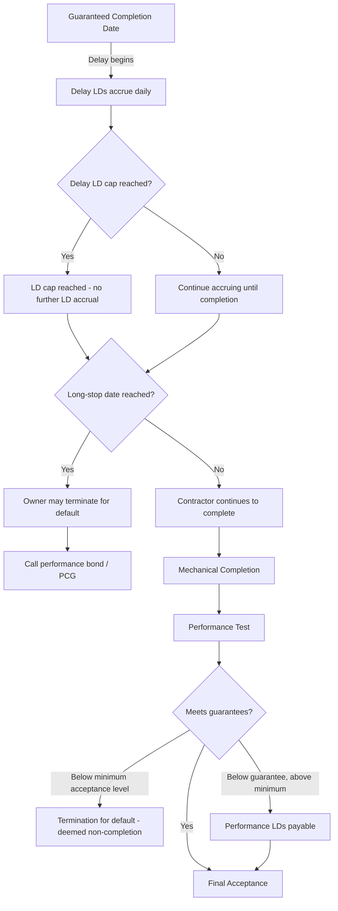

## Liquidated Damages and Performance Guarantees

### Overview and Purpose

Liquidated damages (LDs) and performance guarantees are the contractual mechanisms that convert abstract risk allocation into quantified, enforceable financial remedies. In project finance, where lenders extend debt against future cash flows rather than corporate balance sheets, LDs serve as a pre-agreed proxy for the economic harm caused by delay or underperformance — allowing damages to be recovered without the time, cost, and uncertainty of proving actual loss in court or arbitration. They are the primary "second line of defense" lenders rely on when construction or operational risk, transferred contractually to a counterparty, actually materializes.

LDs must be distinguished from **penalties**: in most common law jurisdictions, a damages clause is only enforceable as an LD if it represents a genuine pre-estimate of loss at the time of contracting. A clause designed to punish rather than compensate risks being struck down as an unenforceable penalty. [Unverified — enforceability standards vary materially by jurisdiction; civil law systems generally permit broader "penalty clause" enforcement than common law systems.]

### Categories of Liquidated Damages

**Key Points**

- **Delay LDs** compensate for late completion.
- **Performance LDs** compensate for a permanent shortfall against guaranteed technical output.
- Both are typically capped, both interact with long-stop dates and termination rights, and both are sized against the specific economic loss they are meant to proxy.

#### Delay Liquidated Damages

Delay LDs compensate the owner/SPV for losses incurred because the facility is not completed by the guaranteed date — primarily lost revenue and continued debt service (interest during construction, or IDC) without corresponding operating cash flow.

**Typical structure:**

- A **daily or weekly rate**, often tiered (e.g., a lower rate for the first 30 days, escalating thereafter) to reflect increasing owner harm the longer the delay persists.
- A **cap**, commonly expressed as a percentage of contract price.
- A **long-stop date** — the date beyond which the owner may terminate the EPC contract for prolonged delay, independent of continued LD accrual.

$$\text{Delay LD}_{\text{total}} = \sum_{i=1}^{n} r_i \times d_i, \quad \text{subject to } \text{Delay LD}_{\text{total}} \leq \text{Cap}$$

where $r_i$ is the applicable daily rate for tier $i$ and $d_i$ is the number of days delayed within that tier.

**Sizing methodology:** [Inference] Delay LD rates are typically derived from the project's projected daily margin (revenue less variable operating costs) plus daily debt service, so that the rate approximates the owner's actual daily economic exposure during the delay period. Financial advisors commonly cross-check the proposed LD rate against the base-case financial model's projected EBITDA per day of operation.

#### Performance Liquidated Damages

Performance LDs compensate for a permanent shortfall in guaranteed technical parameters, established at the performance test following mechanical completion. Common guaranteed parameters by sector:

| Sector | Typical Guaranteed Parameters |
| --- | --- |
| Thermal power | Net capacity (MW), heat rate/efficiency, auxiliary consumption |
| Renewable (solar/wind) | Availability factor, power curve conformance |
| Desalination/water | Output volume, specific energy consumption |
| Industrial/process plants | Throughput, yield, product specification |
| Transportation infrastructure | Capacity, availability, ride quality metrics |

**Sizing methodology:** Performance LDs are typically calculated as the capitalized value of the lost future margin resulting from the shortfall, since a permanent capacity or efficiency shortfall reduces revenue or increases costs for the entire remaining project/debt life, not just during a delay period.

$$\text{Performance LD} = \Delta\text{Annual Margin} \times \text{Capitalization Factor}$$

where the capitalization factor is commonly derived from a discounted annuity over the debt tenor or asset life, reflecting the net present value of the shortfall.

**Example**

A solar PV project guarantees 100 MWac capacity. At the performance test, the facility achieves only 97 MWac — a 3 MW (3%) shortfall. If each MW is projected to generate $140,000 in annual revenue at a 90% availability assumption, the shortfall reduces annual revenue by approximately $3 \times 140{,}000 \times 0.90 = \$378{,}000$. Capitalized over a 20-year power purchase agreement (PPA) term at a discount rate reflecting the project's cost of debt (say, 7%), the performance LD due from the EPC contractor would be calculated using the present value of a 20-year annuity of $378,000 — compensating the SPV upfront for a revenue shortfall that would otherwise persist for the life of the offtake agreement.

### Aggregate Caps and the "Cap on Caps"

Contracts typically layer multiple caps:

1. **Sub-cap on delay LDs** (e.g., 20% of contract price [Unverified])
2. **Sub-cap on performance LDs** (e.g., 20% of contract price [Unverified])
3. **Aggregate cap on all LDs combined** (often lower than the sum of the sub-caps, e.g., 30% of contract price [Unverified])
4. **Overall limitation of liability** — a ceiling on total contractor liability including LDs and general/direct damages, commonly 100% of contract price, with carve-outs for gross negligence, fraud, and certain indemnities (e.g., IP infringement, third-party bodily injury)

[Inference] The gap between the aggregate LD cap and the overall limitation of liability functions as headroom for direct damages claims arising outside the LD mechanism, such as claims for defective work discovered post-completion.

### Performance Guarantees — Contractor-Side Security

Distinct from LDs (a damages remedy), performance guarantees are the credit support instruments ensuring LD and warranty obligations are actually collectible:

| Instrument | Function |
| --- | --- |
| Performance bond / bank guarantee | On-demand or conditional guarantee, typically 10% of contract value [Unverified], callable if the contractor defaults |
| Parent company guarantee (PCG) | The EPC contractor's parent guarantees performance of the subsidiary's obligations, addressing thin-capitalization of project-specific contracting entities |
| Retention money | A percentage of each progress payment (commonly 5-10% [Unverified]) withheld until mechanical completion or the end of the defects liability period |
| Advance payment guarantee | Secures repayment of any mobilization advance if the contractor fails to perform |
| Warranty bond | Replaces retention/performance bonds during the defects liability period, covering latent defect risk |

Lenders typically require that the LD cap be matched or exceeded by available security (bonds plus PCG capacity), since an LD obligation is only as valuable as the counterparty's ability to pay it.

### Interaction with Long-Stop Dates and Termination

A critical structural feature is the **minimum acceptance level** (sometimes called the "minimum performance guarantee") — a floor below which the facility is deemed not to have achieved completion at all, triggering termination rights rather than a mere LD payment. This distinguishes an acceptable-but-shortfall outcome (cured by performance LDs) from a fundamentally deficient outcome (cured by termination and remobilization, often using bond/PCG proceeds to fund a replacement contractor).

### Modeling LDs in the Project Finance Cash Flow

- **Delay LD proceeds** are typically modeled as a **contingent cash inflow in delay sensitivity/downside cases**, partially offsetting the DSCR impact of a delayed COD by covering incremental IDC or funding the debt service reserve account (DSRA).
- **Performance LD proceeds** are typically modeled as a **one-time cash inflow at COD in underperformance sensitivity cases**, which may be used to prepay debt (a mandatory prepayment event under the loan agreement) to restore the DSCR profile implied by the base case — effectively "right-sizing" the debt to the actual (lower) achieved capacity.
- Lenders frequently require in the **finance documents** that performance LD proceeds be applied as a mandatory cash sweep/prepayment, rather than left with the sponsor, ensuring the debt-to-cash-flow ratio matches the as-built asset.

$$\text{Debt Prepayment from Performance LD} = \min(\text{Performance LD Received}, \text{Amount Required to Restore Base-Case DSCR})$$

### Common Negotiation and Drafting Issues

- **Sole and exclusive remedy language** — contracts typically state LDs are the owner's sole remedy for delay/performance shortfall (excluding termination rights), precluding a claim for uncapped actual damages in addition to LDs.
- **Genuine pre-estimate requirement** — LD rates should be supportable by a calculation methodology at the time of signing (not simply a round number), to withstand a penalty challenge. [Unverified — the practical litigation risk of an LD clause being struck down is low in well-advised project finance transactions but remains a drafting discipline.]
- **Force majeure suspension** — LD accrual is typically suspended (not eliminated) for the duration of a qualifying force majeure event, with the long-stop date extended correspondingly.
- **Currency and indexation** — LD rates fixed at signing may not reflect inflation or FX movements over a multi-year construction period; some contracts index LD rates to a cost or FX index.
- **Netting against liquidated damages already paid** — clarifying whether delay LDs paid during construction are creditable against, or independent of, performance LDs assessed at completion.

### Related Topics

- Direct Agreements and Lender Step-In Rights in EPC Contracts
- Force Majeure and Change-in-Law Risk Allocation
- Debt Service Coverage Ratio (DSCR) Sensitivity Modeling for Construction Delay
- Mandatory Prepayment and Cash Sweep Mechanics in Project Finance Loan Agreements
- Performance Testing Protocols and Punch List Mechanics
- Warranty and Defects Liability Periods in EPC Contracts
- Insurance-Backed Delay in Start-Up (DSU) Coverage as a Complement to Delay LDs