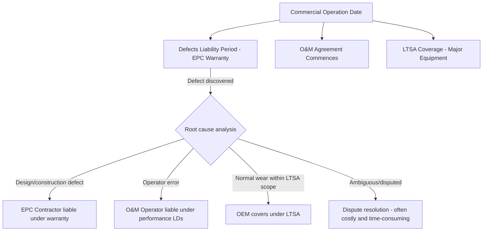

## Long-Term Operation and Maintenance Agreements

### Overview and Role in Project Finance

Long-Term Operation and Maintenance (O&M) Agreements govern the operating phase of a project's life — the period during which lenders' debt service depends entirely on the asset performing as modeled in the base case. Where EPC contracts transfer construction-phase risk, O&M agreements transfer operating-phase risk: availability, output degradation, maintenance cost overruns, and unplanned outages. For lenders, a robust O&M agreement with a creditworthy, experienced operator is often as critical to bankability as the EPC contract itself, since a 20-25 year debt tenor requires 20-25 years of reliable operating performance, not merely a well-built asset at COD.

O&M structures are typically documented as either a **Full O&M Agreement** (operator manages all operating activities) or split into separate **Operation Agreement** and **Maintenance Agreement** (particularly common where original equipment manufacturers, or OEMs, provide long-term maintenance while a separate operator handles day-to-day plant operation).

### Core Structural Models

**Key Points**

- **Fixed-fee O&M** — a fixed annual fee (often indexed to inflation), placing cost risk on the operator.
- **Cost-reimbursable O&M** — the owner reimburses actual costs plus a management fee, placing cost risk on the owner.
- **Full-wrap / long-term service agreement (LTSA)** — typically used for major rotating equipment (gas turbines, wind turbines), where the OEM guarantees availability and covers major maintenance events for a fixed or capped fee.

| Structure | Cost Risk Allocation | Typical Use Case |
| --- | --- | --- |
| Fixed-fee O&M | Operator | Mature, well-understood technology (e.g., simple-cycle gas, solar PV) |
| Cost-plus O&M | Owner | Complex or first-of-a-kind facilities where cost cannot be reliably fixed |
| LTSA / Full-wrap | OEM | Rotating equipment with predictable but expensive scheduled overhauls (gas turbines, wind turbine gearboxes) |
| Hybrid (fixed base fee + variable pass-through) | Shared | Most common in practice — fixed fee for routine O&M, pass-through for consumables/major spares |

### Key Commercial Terms

#### Term and Renewal

O&M agreements are typically coterminous with, or longer than, the debt tenor, since lenders require operating cover for the full repayment period. Renewal options (often in 5-year increments) are common where the initial term is shorter than the asset's useful life.

#### Fee Structure

$$\text{Total O\&M Fee} = \text{Fixed Base Fee} \times (1 + \text{Inflation Index}) + \text{Variable Pass-Through Costs} + \text{Incentive/Bonus Adjustments}$$

- **Fixed base fee** — covers labor, routine maintenance, insurance, and overhead; typically escalated annually by a CPI or wage index.
- **Variable/pass-through costs** — spare parts, major component replacement, consumables (chemicals, lubricants), and often fuel (in tolling structures, fuel is usually supplied by the owner or offtaker, not the operator).
- **Performance-based incentive fees** — bonus/malus mechanisms tied to availability, heat rate, or safety metrics, aligning operator incentives with the owner's revenue drivers.

#### Performance Guarantees and Liquidated Damages

Mirroring the EPC LD structure, O&M agreements typically include:

- **Availability guarantees** — a minimum guaranteed availability factor (e.g., 95% for a combined-cycle plant [Unverified — thresholds vary widely by technology and contract]), with LDs payable if actual availability falls short, calculated against lost capacity payments or energy revenue.
- **Heat rate/efficiency guarantees** — LDs for excess fuel consumption caused by operator performance (as distinct from equipment degradation covered by the EPC/OEM warranty).
- **Non-performance-based deductions** — fee reductions or LDs for safety incidents, environmental non-compliance, or failure to meet reporting obligations.

**Example**

A combined-cycle gas plant O&M agreement guarantees 96% equivalent availability factor (EAF). In a given contract year, the plant achieves only 93% EAF due to an unplanned outage attributable to operator error (as opposed to an OEM-covered component failure). The 3-percentage-point shortfall is multiplied by the plant's capacity payment rate under its power purchase agreement (PPA) — say $15,000/MW-year for a 300 MW plant — to calculate the LD: $0.03 \times 300 \times 15{,}000 = \$135{,}000$ payable by the operator to the owner, subject to the agreement's annual LD cap (commonly a multiple of the annual O&M fee).

### Interface with EPC Warranties and OEM Agreements

A critical risk allocation issue is the **boundary between O&M operator liability, EPC contractor warranty liability, and OEM LTSA coverage** during the initial post-COD period:

[Inference] This overlap is a recurring source of dispute in practice: an equipment failure shortly after COD may plausibly be attributed to a latent construction defect (EPC warranty), operator mishandling (O&M liability), or normal wear covered under a manufacturer's LTSA — and each counterparty has an incentive to attribute the failure to another party's scope. Well-drafted project agreements include a coordinated interface protocol and joint inspection rights to reduce this friction.

### Termination and Step-In Rights

Lenders typically require:

- **Direct agreements** with the O&M operator, granting lenders step-in rights to cure operator defaults or replace the operator without automatically terminating the underlying agreement.
- **Termination for operator default** — persistent availability shortfalls, insolvency, or failure to maintain required licenses/permits typically trigger owner termination rights, subject to cure periods.
- **Termination for owner convenience** — often permitted with notice and compensation, though lenders may restrict this right without their consent, since operator continuity is a bankability factor.
- **Transition assistance obligations** — requiring the outgoing operator to cooperate in transferring operations to a replacement, given the specialized knowledge required to run complex facilities.

### Operator Creditworthiness and Parent Guarantees

Since O&M LDs are only as valuable as the operator's ability to pay, lenders typically require:

- A **parent company guarantee** where the contracting operator entity is a special-purpose or thinly capitalized subsidiary.
- Minimum **net worth or liquidity covenants** for the operator, monitored throughout the O&M term.
- In some structures, a **performance bond** sized to cover a defined multiple of potential annual LD exposure.

### Modeling O&M in the Project Finance Base Case

- The **fixed O&M fee** (escalated) is modeled as a recurring operating expense line, directly reducing EBITDA and therefore DSCR.
- **Major maintenance reserve accounts (MMRA)** are often required by lenders to pre-fund large periodic overhauls (e.g., gas turbine major inspections every 4-6 years [Unverified — intervals are OEM- and duty-cycle-specific]), smoothing what would otherwise be lumpy cash outflows that could breach DSCR covenants in overhaul years.
- **O&M cost overrun sensitivities** are a standard downside case in lender due diligence, testing DSCR resilience if actual O&M costs exceed the contracted/budgeted fee (relevant primarily under cost-reimbursable structures, or where pass-through costs exceed budget under a hybrid structure).

$$\text{Debt Service Coverage Ratio (DSCR)} = \frac{\text{Revenue} - \text{O\&M Costs} - \text{Major Maintenance Reserve Contribution}}{\text{Scheduled Debt Service}}$$

### Common Negotiation Points

- **Scope boundary with LTSA/OEM contracts** — precise allocation of responsibility for major component failures versus routine operator-caused issues.
- **Benchmarking clauses** — some long-term agreements include periodic market benchmarking of the fee structure to prevent above-market pricing over a 15-20 year term.
- **Change in law / change in scope** — mechanisms for adjusting fees if regulatory requirements or plant modifications materially change the operator's cost base.
- **Insurance allocation** — clarifying which party procures and maintains operational insurance (property, business interruption, third-party liability) and how proceeds interact with O&M LD claims.
- **Cap on aggregate liability** — as with EPC contracts, O&M operator liability (LDs plus general damages) is typically capped, often expressed as a multiple of the annual O&M fee (e.g., 12-24 months' fees [Unverified]) rather than a percentage of contract value, reflecting the recurring-revenue nature of O&M contracts versus the lump-sum nature of EPC contracts.

### Related Topics

- Long-Term Service Agreements (LTSA) with Original Equipment Manufacturers
- Major Maintenance Reserve Accounts and Debt Service Coverage Ratio Modeling
- Direct Agreements and Lender Step-In Rights Across Project Contracts
- EPC Contract Structures: Fixed-Price, Turnkey, and Cost-Plus
- Liquidated Damages and Performance Guarantees
- Insurance Structuring in Project Finance: Construction and Operating Phase Coverage
- Availability-Based Payment Mechanisms in Power Purchase Agreements