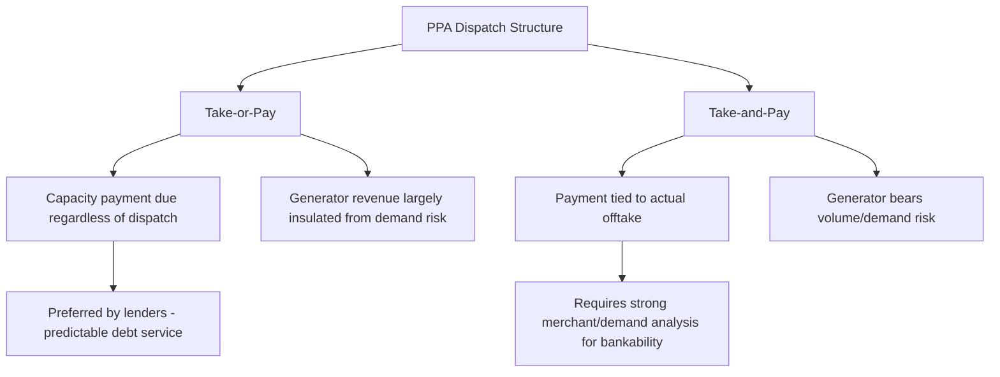

## Power Purchase Agreement Structuring in Depth

### Overview and Role in Project Finance

A Power Purchase Agreement (PPA) is the offtake contract under which a generator sells electricity (and often capacity and/or environmental attributes) to a buyer — typically a utility, corporate offtaker, or government-owned entity — over a long term, commonly 10-25 years. In project finance, the PPA is frequently the single most important document in the entire contract package: it is the primary, and often sole, source of project revenue, and lenders size debt directly against the cash flows the PPA is projected to generate. A well-structured PPA converts merchant price and volume risk into a bankable, largely predictable revenue stream; a poorly structured one can render an otherwise well-built project unfinanceable on a non-recourse basis.

### Core Payment Structures

**Key Points**

- **Tolling/Capacity-based** — buyer pays for availability regardless of dispatch, and typically supplies fuel.
- **Energy-only (as-available)** — payment strictly for energy delivered, common in renewables.
- **Two-part tariff (capacity + energy)** — the dominant thermal power structure, separating fixed cost recovery from variable cost recovery.
- **Contract-for-Differences (CfD)** — generator sells into the market/pool and receives a top-up or pays back the difference versus a strike price.

| Structure | Fixed Payment Component | Variable Payment Component | Typical Application |
| --- | --- | --- | --- |
| Tolling agreement | Capacity/tolling fee covers fixed costs and debt service | Buyer supplies fuel; generator paid a conversion fee per MWh | Merchant-adjacent thermal plants where buyer wants fuel price exposure |
| Two-part tariff | Capacity payment (fixed) covers fixed O&M and debt service | Energy payment covers fuel and variable O&M, often pass-through | IPP thermal generation (gas, coal) |
| Energy-only PPA | None or minimal | Fixed or escalating price per MWh for all energy delivered | Solar, wind — no fuel cost, availability largely weather-driven |
| Contract for Differences | None | $\text{Payment} = (\text{Strike Price} - \text{Market Price}) \times \text{Volume}$ | Merchant markets with policy support (offshore wind, some corporate PPAs) |

### The Two-Part Tariff in Detail

The two-part (capacity + energy) tariff is the structure most closely associated with bankable thermal independent power producer (IPP) projects, because it isolates fixed-cost recovery (debt service, fixed O&M, equity returns) from variable-cost recovery (fuel, variable O&M) — insulating the project company's ability to service debt from dispatch risk.

$$\text{Total PPA Revenue} = (\text{Capacity Payment Rate} \times \text{Available Capacity}) + (\text{Energy Payment Rate} \times \text{Energy Delivered})$$

**Capacity Payment Mechanics**

- Typically expressed as $/kW-month or $/kW-year, multiplied by tested and maintained available capacity (not actual dispatch).
- Designed to cover fixed costs regardless of how much the plant is actually dispatched — critical for debt service predictability, since it decouples cash flow from load/dispatch variability that the project company cannot control.
- Usually subject to **availability testing** (periodic capacity tests) and **deemed availability** provisions, and reduced by an **availability adjustment factor** if the plant underperforms its guaranteed availability.
- Often escalated by a **fixed cost index** (e.g., a blend of CPI and a capital goods index) to preserve real value over a long contract term.

**Energy Payment Mechanics**

- Compensates for variable costs: fuel and variable O&M.
- In many structures, the **fuel cost component is a pass-through** — the offtaker bears fuel price risk, and the generator is compensated for actual fuel consumed at the guaranteed heat rate, insulating the project from commodity price volatility.
- A **heat rate guarantee** (carried over from the EPC and O&M performance guarantees) determines the fuel consumption baseline used to calculate the energy payment; if actual heat rate is worse than guaranteed, the generator (not the offtaker) typically absorbs the excess fuel cost.

### Take-or-Pay and Dispatch Risk Allocation

A central bankability feature is whether the PPA is **take-or-pay** (the offtaker pays the capacity charge regardless of dispatch instructions) or **take-and-pay** (payment only for energy actually taken).

[Inference] Take-or-pay structures are strongly preferred by project finance lenders because they remove demand risk from the project company entirely, shifting it to the offtaker — who is typically better positioned to manage system-wide demand risk across its portfolio. Take-and-pay or fully merchant exposure generally requires either a highly liquid, transparent power market, a strong hedging strategy, or materially higher equity cushions and lower leverage to be bankable.

### Renewable Energy PPA Structures

Renewable PPAs (solar, wind) differ structurally from thermal two-part tariffs because there is no fuel cost to isolate and output is weather-dependent rather than dispatch-controlled:

- **Fixed price per MWh** for all energy delivered, often with **must-take/must-run** obligations placing curtailment risk on the offtaker (or, increasingly in oversupplied markets, on the generator via **curtailment risk-sharing** clauses).
- **Contracted quantity/shape** — some PPAs specify an expected generation profile (P50/P90 exceedance probabilities from an independent energy yield assessment) used to calibrate expectations, though actual weather-driven variability typically remains with the generator absent a shaping/firming arrangement.
- **Corporate PPAs** (increasingly common outside traditional utility offtake) are frequently structured as **virtual/financial PPAs (VPPAs)**, functioning as a CfD settled financially without physical delivery to the corporate buyer, allowing the buyer to claim environmental attributes while the generator still sells physical power into the wholesale market or to a separate physical offtaker.

$$\text{VPPA Settlement} = (\text{Strike Price} - \text{Reference/Market Price}) \times \text{Metered Volume}$$

### Renewable Energy Certificates and Environmental Attributes

**Key Points**

- Environmental attributes (RECs, Guarantees of Origin, carbon credits) are legally distinct from the energy commodity and must be explicitly allocated in the PPA.
- Whether attributes are bundled with the energy sale or unbundled/retained by the generator materially affects both parties' revenue and compliance positions.

Failure to clearly allocate environmental attribute ownership is a common source of post-signing dispute, particularly as voluntary and compliance carbon/REC markets have matured; lenders' counsel typically review this allocation carefully since unbundled attribute sales can represent a material, separately monetizable revenue stream in the base case.

### Curtailment, Force Majeure, and Change in Law

- **Curtailment** — grid-operator-directed reduction in output; PPAs allocate whether the generator is compensated for curtailed energy (as if delivered) or bears the revenue loss, a heavily negotiated point in markets with high renewable penetration and transmission constraints.
- **Force majeure** — as with EPC and O&M contracts, defines events excusing performance; PPA drafting must coordinate force majeure definitions across the EPC, O&M, and PPA to avoid gaps where one contract excuses performance but another does not.
- **Change in law** — allocates risk of new taxes, tariffs, or regulatory changes affecting project economics; increasingly significant given the frequency of renewable subsidy and tariff policy changes in many markets. [Unverified — the specific allocation is highly jurisdiction- and negotiation-dependent.]

### Credit Support and Offtaker Risk

Because the PPA is the primary revenue source, **offtaker creditworthiness** is a first-order bankability driver — often more consequential than the technical merits of the project itself.

| Offtaker Type | Typical Credit Enhancement |
| --- | --- |
| State-owned utility (weaker credit) | Sovereign guarantee, letter of credit, escrow/payment security mechanism, partial risk guarantee from a multilateral (e.g., World Bank, IFC) |
| Investment-grade utility | Often no additional credit support required |
| Corporate offtaker | Parent guarantee, letter of credit sized to a defined exposure period (e.g., 3-6 months of payments [Unverified]) |
| Government/ministry direct offtake | Government guarantee or sovereign support agreement |

**Common credit support mechanisms:**

- **Letters of credit (LCs)** — sized to cover a defined number of months of payment obligations, replenished if drawn.
- **Escrow accounts** — offtaker payments routed through a dedicated account with priority allocation to debt service.
- **Payment security mechanisms** — layered structures (e.g., an LC backed by a government guarantee) common in emerging-market IPPs with weaker sovereign or utility credit.
- **Political risk insurance / partial risk guarantees** — from export credit agencies (ECAs) or multilaterals, covering offtaker payment default caused by government action.

### PPA Tenor, Debt Tenor Matching, and Tail Period

$$\text{Tail Period} = \text{PPA Term} - \text{Debt Tenor}$$

Lenders generally require the PPA term to extend beyond the debt repayment tenor, creating a **tail period** — a buffer during which the project generates PPA revenue with no debt service obligation, providing a cushion against underperformance during the debt term and additional refinancing/collateral comfort. [Inference] A common convention is a tail period of at least 2-3 years [Unverified — the required tail is transaction- and lender-specific, varying with perceived resource, technology, and offtaker risk], though this varies significantly by market and technology.

### PPA Termination and Compensation on Termination

- **Termination for offtaker default** (e.g., persistent payment failure) typically entitles the generator to a termination payment sized to cover outstanding debt plus a return on equity, ensuring lenders are made whole even if the offtaker relationship collapses.
- **Termination for generator default** (e.g., persistent underperformance, insolvency) typically results in a lower termination payment, often limited to outstanding debt (protecting lenders but not equity), reflecting the generator's fault.
- **Termination for force majeure/prolonged outage** — intermediate compensation, heavily negotiated, sometimes tied to insurance proceeds.

These termination payment tiers are frequently a focal point of lender due diligence, since the debt-only-recovery scenario (generator default) must still be sufficient to repay outstanding lender claims under all foreseeable circumstances, including default suffered late in the debt tenor when insurance/warranty coverage may have lapsed.

### Modeling the PPA in the Base Case Financial Model

- **Capacity payment revenue** is modeled as a relatively fixed line item (subject to availability performance), forming the primary basis for minimum DSCR calculations in downside cases.
- **Energy payment revenue** (where fuel/variable costs are pass-through) is typically modeled as a wash — it does not materially affect DSCR since both the revenue and offsetting cost move together, though basis/timing risk on non-simultaneous pass-through mechanics can create short-term working capital effects.
- **P50/P90 generation assumptions** for renewable PPAs drive a family of DSCR sensitivity cases: the base case may use P50 (median expected) generation, while lenders typically require the debt sizing to be resilient at a more conservative P90 or P99 exceedance probability, ensuring debt service is covered in all but rare low-resource years.

$$\text{DSCR}_{\text{P90}} = \frac{\text{Revenue at P90 Generation} - \text{Operating Costs}}{\text{Scheduled Debt Service}}$$

### Related Topics

- Take-or-Pay vs. Take-and-Pay Risk Allocation in Offtake Contracts
- Credit Support Mechanisms for Weak Sovereign and Utility Offtakers
- P50/P90 Energy Yield Assessments and Renewable Debt Sizing
- Virtual/Financial Power Purchase Agreements and Corporate Offtake Structures
- Termination Payment Waterfalls and Lender Step-In Rights
- EPC Contract Structures: Fixed-Price, Turnkey, and Cost-Plus
- Long-Term Operation and Maintenance Agreements
- Fuel Supply Agreements and Pass-Through Mechanics in Thermal IPPs