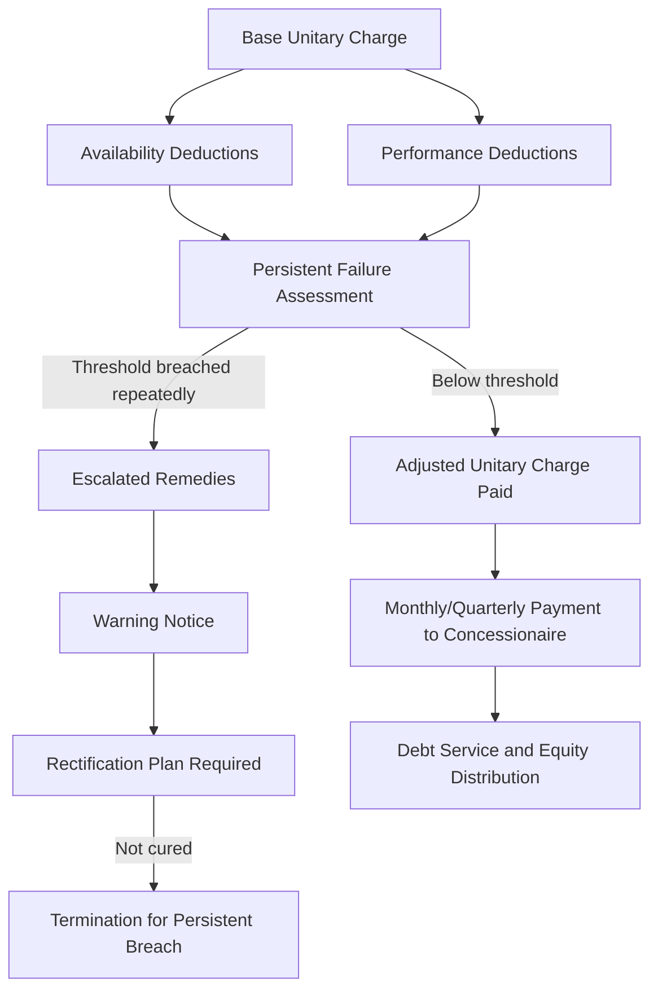

## Availability Payment Regimes in Concession Agreements

### Overview and Role in Project Finance

Availability payment regimes are the dominant revenue structure for social and economic infrastructure concessions — toll roads, hospitals, schools, prisons, and rail — procured under public-private partnership (PPP) or private finance initiative (PFI) frameworks. Under an availability regime, the public authority (the grantor) pays the project company (concessionaire) for making the asset available and maintaining it to specified performance standards, rather than paying based on actual usage or demand. This structure deliberately removes demand/volume/patronage risk from the project company, transferring it instead to the public sector — the inverse of a demand-risk (patronage-based) concession such as many toll roads.

For lenders, availability payments are attractive because they convert what would otherwise be a usage-dependent, forecast-sensitive revenue stream into a payment obligation resembling a long-term receivable from a public authority, closely analogous in credit character to the availability-based capacity payment in a power PPA, but adapted to social infrastructure's non-commodity output.

### Core Structure of the Availability Payment

**Key Points**

- Payment is contingent on the asset being **available** and meeting **performance/quality standards**, not on how much it is used.
- Deductions apply for **unavailability** and **performance failures**, calculated via a pre-agreed payment mechanism (PM) formula.
- The regime typically has both a **capital/investment recovery element** (covering debt service and equity returns) and an **operating cost recovery element** (covering facilities management, lifecycle maintenance).

$$\text{Unitary Charge} = \text{Base Availability Payment} - \text{Availability Deductions} - \text{Performance Deductions}$$

The **unitary charge** (a term originating in UK PFI practice but used analogously across many jurisdictions) is the single periodic payment (monthly or quarterly) made by the grantor, from which deductions are subtracted for failures against the agreed service specification.

### Availability Deductions

Availability deductions apply when all or part of the facility (or a discrete "unit" or "area" of it, e.g., a ward in a hospital, a lane on a road) is not available for its intended use.

**Typical mechanics:**

- The concession agreement defines the facility as a set of discrete **units of availability** (rooms, lanes, sections), each assigned a **deduction weighting** reflecting its relative importance.
- Unavailability is measured from the point a defect/fault is reported (or should reasonably have been detected) until it is rectified, often subject to **rectification periods** graded by severity.
- Deductions typically escalate the longer a unit remains unavailable, and may include a **persistent failure** mechanism triggering escalated remedies (including termination rights) if the same failure recurs within a defined period.

$$\text{Availability Deduction} = \sum_{j} w_j \times t_j \times r_j$$

where $w_j$ is the weighting of unavailable unit $j$, $t_j$ is the time (e.g., hours or days) unit $j$ was unavailable, and $r_j$ is the applicable deduction rate per unit-time.

**Example**

A hospital PPP has 200 available "bed spaces" as its unit of availability, each weighted equally, with a total base monthly unitary charge of $2,000,000. If a ward containing 20 bed spaces (10% of the facility) is rendered unavailable for 5 days out of a 30-day month due to a mechanical failure not rectified within the specified timeframe, the deduction is approximately proportional to $\frac{20}{200} \times \frac{5}{30} \times \$2{,}000{,}000 \approx \$33{,}333$, before applying any severity multiplier or persistent-failure escalation specified in the payment mechanism schedule.

### Performance Deductions

Distinct from binary availability (is the unit usable at all), performance deductions address **quality of service** even when the asset is technically available — e.g., cleanliness standards in a hospital, response times for maintenance requests, or ride quality on a road surface.

- Performance is typically monitored via **key performance indicators (KPIs)**, each with a defined measurement methodology, threshold, and points/deduction value for failure.
- A **performance points system** is common: each failure accrues points; deductions apply once a monthly/quarterly points threshold is exceeded, and accumulated points over a rolling period (e.g., 12 months [Unverified — periods vary by contract]) may trigger escalated contractual consequences.
- Some regimes cap total performance deductions as a percentage of the unitary charge, separate from the availability deduction cap.

### The Payment Mechanism (PM) as a Negotiated Schedule

The **Payment Mechanism** is typically a lengthy, highly technical schedule to the concession agreement, negotiated extensively during procurement because it is the sole determinant of project revenue. [Inference] Because the PM formula directly drives lender debt sizing, financial advisors and lenders' technical advisers typically stress-test the PM against realistic failure scenarios (e.g., a major system breakdown, a series of minor recurring faults) to confirm that worst-case deductions remain within levels the project can absorb without breaching DSCR covenants.

### Deduction Caps and Bankability Thresholds

Lenders typically require, or heavily influence during procurement, caps that ensure deductions cannot single-handedly cause a payment default:

| Cap Type | Purpose |
| --- | --- |
| Monthly deduction cap | Limits total deductions in any single period, typically as a percentage of the base unitary charge (commonly 20-30% [Unverified], contract-specific) |
| Annual deduction cap | Limits cumulative deductions across a contract year |
| "Zero payment" floor test | Contracts often specify the deduction level at which payment would notionally fall to zero, used to calibrate whether the PM is proportionate and financeable |
| Persistent breach threshold | Number/frequency of failures that escalates from financial deduction to termination risk, independent of the cap on deductions themselves |

[Inference] A recurring bankability negotiation is ensuring the PM is not so punitive that a plausible sequence of operational failures could push deductions to a level threatening debt service, since lenders will not accept indefinite exposure to operator-side operational risk without a ceiling calibrated against the project's actual debt service capacity.

### Debt Service Protection Features

Because availability payments are the sole revenue source, several structural protections are standard in the financing documents (distinct from the concession agreement itself):

- **Senior debt service reserve accounts (DSRA)** — funded to cover a defined number of months of debt service (commonly 6 months [Unverified]), providing a buffer against short-term deduction spikes.
- **Lock-up and distribution tests** — equity distributions are typically blocked if the DSCR falls below a specified threshold as a result of deductions, preserving cash within the project company.
- **Direct agreement with the grantor** — granting lenders step-in rights to cure performance failures (often via a substitute contractor) before the grantor can exercise termination rights for persistent breach, protecting lenders from losing the concession due to a curable operational failure.

### Grantor-Side Payment Risk

Unlike demand-risk concessions, availability payment structures substitute volume/patronage risk with **grantor (counterparty) credit and payment risk**:

- **Public authority payment risk** — particularly relevant in sub-sovereign or emerging-market contexts, where the paying authority's own budget or fiscal capacity may be constrained; mitigated via sovereign guarantees, escrow mechanisms, or direct central government payment undertakings.
- **Deduction/dispute risk** — the grantor's technical monitoring team assesses and applies deductions; disputes over measurement methodology or fault attribution are common and typically resolved via an independent certifier or expert determination mechanism specified in the concession agreement.
- **Indexation risk** — unitary charges are typically indexed (commonly to CPI or a construction cost index) to preserve real value over concession terms often exceeding 25-30 years; mismatches between the indexation basis and the project's actual cost inflation exposure (e.g., energy-intensive facilities in high energy-inflation periods) can erode margins over time.

### Interaction with Lifecycle Maintenance Obligations

Availability regimes typically require the concessionaire to maintain the asset to a defined **handback condition** at the end of the concession term, in addition to day-to-day availability standards:

- **Lifecycle/renewal reserve funds** are commonly required to pre-fund major periodic replacement (roofing, mechanical/electrical systems, road resurfacing), smoothing lumpy capital expenditure that would otherwise create cash flow volatility late in the concession term.
- **Handback surveys and condition requirements** — typically specified well in advance of expiry (e.g., 2-5 years prior [Unverified]), with obligations to remediate any shortfall against the required handback standard, sometimes backed by a handback reserve account funded from operating cash flow in the concession's later years.

$$\text{Lifecycle Reserve Contribution}_t = f(\text{Projected Renewal Capex}, \text{Remaining Concession Term}, \text{Asset Condition})$$

### Modeling Availability Payments in the Financial Model

- The **base unitary charge**, escalated by the indexation formula, forms the primary revenue line, generally modeled as highly predictable in the base case (unlike demand-based revenue, which requires traffic/patronage forecasting).
- **Deduction sensitivities** are modeled as a downside case — applying an assumed level of recurring minor deductions plus a stress scenario (e.g., a major system failure lasting several weeks) to confirm the DSCR remains above the lock-up/default threshold even under adverse operating performance.
- **Lifecycle reserve drawdowns** are modeled as scheduled capital reinvestment funded from a sinking fund built up over the concession term, distinct from routine O&M opex.

$$\text{DSCR} = \frac{\text{Unitary Charge (net of deductions)} - \text{Operating Costs} - \text{Lifecycle Reserve Contribution}}{\text{Scheduled Debt Service}}$$

### Related Topics

- Demand-Risk vs. Availability-Risk Concession Structures
- Payment Mechanism Design and KPI Calibration in PPP Contracts
- Handback Standards and Lifecycle Reserve Account Structuring
- Direct Agreements and Lender Step-In Rights in Concession Financing
- Sovereign and Sub-Sovereign Payment Risk Mitigation in PPPs
- Long-Term Operation and Maintenance Agreements
- Indexation Mechanisms and Real Revenue Preservation Over Long Concession Terms