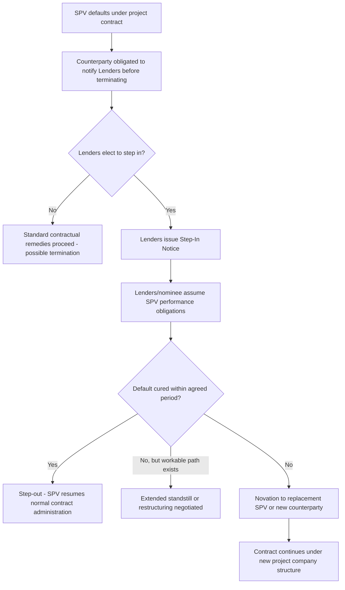

## Step-In Rights and Direct Agreements

### Overview and Purpose

Direct agreements (sometimes called consent agreements, tripartite agreements, or collateral deeds) are contracts entered into directly between the project's senior lenders and each key project counterparty (the EPC contractor, O&M operator, offtaker/grantor, and sometimes major suppliers), notwithstanding that lenders are not party to the underlying project contract itself. Their central purpose is to grant lenders **step-in rights** — the ability to intervene in the underlying contract, cure defaults, or substitute the defaulting project company (the borrower/SPV) without automatically triggering that counterparty's termination rights.

Direct agreements exist because, absent this mechanism, a default by the SPV under any single project contract (EPC, O&M, PPA/concession) could allow the counterparty to terminate that contract — and because project contracts are typically **interdependent**, the loss of one (e.g., the offtake agreement) can render the entire project non-viable, destroying lenders' collateral value at precisely the moment their borrower is in distress. Direct agreements are therefore a cornerstone of "lender protection" in project finance security packages, sitting alongside share pledges, account security, and assignments of project contracts.

### Why Step-In Rights Matter to Lenders

**Key Points**

- Non-recourse project finance lenders' primary recourse on default is the project itself — its cash flows and contracts — not a corporate guarantor.
- If a key contract terminates, the security package (a pledge over shares, an assignment of receivables) becomes far less valuable, since there is no underlying business generating revenue.
- Step-in rights allow lenders to preserve the project as a going concern during a workout, rather than facing an immediate and value-destructive unwind.

[Inference] Because lenders in a non-recourse structure are effectively "lending against the contracts," direct agreements function as an extension of the lenders' security interest — converting what would otherwise be a pledge over an empty corporate shell (if key contracts terminate) into a pledge over a business that can continue operating while a restructuring or replacement sponsor/operator is arranged.

### Structure of a Typical Direct Agreement

A direct agreement is generally structured as a tripartite (three-way) deed between: (1) the lenders (or a security agent/trustee acting on their behalf), (2) the SPV/project company, and (3) the relevant counterparty (EPC contractor, O&M operator, offtaker, or grantor). Core provisions typically include:

| Provision | Function |
| --- | --- |
| Notice of default | Requires the counterparty to notify lenders of any SPV default under the underlying contract before exercising termination rights |
| Cure period extension | Grants lenders an additional period (beyond the SPV's own cure period) to remedy the default themselves or fund a cure |
| Step-in right | Permits lenders (or a nominee) to assume the SPV's rights and obligations under the contract, either temporarily or by novation |
| Step-in notice mechanics | Specifies the form, timing, and effect of a formal step-in notice |
| Continued performance obligation | Counterparty agrees to continue performing the underlying contract during the standstill/cure period, provided lenders meet ongoing payment obligations |
| Novation/assignment mechanics | Provides for the contract to be assigned or novated to lenders' nominee or replacement SPV if a permanent substitution is required |
| Liability cap for lenders | Limits lenders' liability upon step-in, typically to ongoing obligations arising after step-in, excluding pre-existing SPV liabilities (an "opt-in without full liability" position) |
| Termination right preservation | Confirms the counterparty retains the right to terminate if lenders do not exercise or complete step-in within an agreed timeframe |

### The Step-In Sequence

**Cure vs. permanent step-in:** In many cases, lenders exercise a "**soft**" or "**temporary**" step-in — curing a specific default (e.g., a missed payment) to prevent termination while working with the existing SPV management or a replacement operator, without permanently displacing the project company. A "**hard**" or "**permanent**" step-in, involving formal assumption of the contract or novation to a new entity, is a more significant and less common intervention, typically reserved for situations where the existing SPV/sponsor cannot be rehabilitated.

### Direct Agreements Across Key Project Contracts

#### EPC Direct Agreement

Grants lenders the right to step in during construction if the SPV defaults (e.g., failure to make progress payments due to financing disruption), preserving the construction program and preventing the EPC contractor from suspending or terminating works — which would be particularly damaging mid-construction, before any asset value or revenue exists to support a workout.

#### O&M Direct Agreement

Allows lenders to replace a failing operator or cure a payment default without triggering the operator's termination rights, critical because a lapse in operations (even briefly) can cause consequential damage to technical assets, breach offtake/concession performance obligations, and trigger cross-defaults across the contract suite.

#### Offtake (PPA) / Concession Direct Agreement

Often the single most important direct agreement, since the PPA or concession is typically the sole revenue source. Grants lenders the right to step in and either cure SPV defaults or, in extremis, arrange for a replacement operator/sponsor to take over the project company (via share transfer under the lenders' share pledge) while preserving the offtake or concession arrangement itself, since the *contract* — not the specific ownership of the SPV — is what generates revenue.

#### Government/Grantor Direct Agreements (Concessions)

In PPP/concession structures, the direct agreement with the public authority (grantor) is frequently the most heavily negotiated, since government counterparties often resist broad or indefinite step-in rights on public policy or sovereignty grounds. These agreements typically specify:

- A defined **standstill period** during which the grantor cannot terminate for a curable default while lenders assess options.
- **Compensation on termination** provisions (discussed further under PPA/concession termination payment structures), which interact closely with the direct agreement's step-in provisions since a termination payment sized to cover outstanding debt reduces the urgency and risk of lenders' exercising step-in.

### Interface with Security Package and Share Pledges

Direct agreements do not operate in isolation — they function alongside the broader project finance security package:

- **Share pledge over the SPV** — allows lenders to enforce security by taking control of the SPV (installing new directors/management) rather than stepping into individual contracts; often the primary enforcement mechanism, with contract-level step-in rights serving as a complementary, more surgical tool.
- **Assignment of project contracts and receivables** — provides lenders a security interest in the contracts themselves (in addition to step-in rights), so that upon enforcement, cash flows can be redirected to lenders' accounts.
- **Account security/cash flow waterfall control** — direct agreements are frequently coordinated with account bank agreements to ensure that, upon a step-in event, lenders can control and redirect the cash flow waterfall consistent with the finance documents.

[Inference] The choice between enforcing via share pledge (replacing SPV ownership/control) versus contract-level step-in (assuming performance under a specific contract while leaving SPV structure intact) generally depends on whether the underlying problem is a governance/sponsor-level failure (favoring share enforcement) or a specific counterparty performance failure isolated to one contract (favoring targeted step-in).

### Negotiation Points and Limitations

- **Liability exposure on step-in** — counterparties typically seek to ensure that if lenders step in, they assume full going-forward contractual obligations (not a limited or cherry-picked subset), while lenders seek to cap their exposure to avoid inadvertently assuming open-ended liability that could deter them from exercising step-in rights at all.
- **Time limits on step-in periods** — counterparties resist indefinite standstill periods that leave them unable to terminate a non-performing relationship; negotiated cure/standstill periods (commonly ranging from 30-180 days depending on contract type and severity [Unverified — highly transaction-specific]) balance lender flexibility against counterparty commercial certainty.
- **Consent rights over amendments** — direct agreements frequently give lenders consent rights over material amendments to the underlying contract, ensuring sponsors cannot unilaterally weaken lender protections embedded in the original project contracts.
- **Multiple direct agreements and cross-coordination** — in complex projects with several direct agreements (EPC, O&M, offtake, land lease, fuel supply), inconsistent cure periods or notice mechanics across agreements can create timing gaps; careful drafting coordination is required to ensure a default cascade does not outpace lenders' ability to respond under each individual agreement.

### Modeling and Due Diligence Implications

While direct agreements are legal rather than financial instruments, they directly affect the **credit risk profile** lenders assign to a transaction and therefore influence financeable leverage and pricing:

- Robust direct agreements across all material contracts are typically treated by lenders' credit committees as a risk mitigant supporting higher leverage/lower margin, since they reduce the probability that a single counterparty dispute cascades into total loss of project value.
- Absence or weakness of a direct agreement with a critical counterparty (e.g., a government offtaker resisting standard step-in language) is commonly flagged in due diligence reports as a **bankability gap**, sometimes requiring additional credit enhancement (higher equity, debt service reserves, political risk insurance) to compensate.

### Related Topics

- Security Package Structuring: Share Pledges, Account Security, and Assignments
- EPC Contract Structures: Fixed-Price, Turnkey, and Cost-Plus
- Long-Term Operation and Maintenance Agreements
- Power Purchase Agreement Structuring in Depth
- Availability Payment Regimes in Concession Agreements
- Termination Payment Waterfalls on Offtaker and Concessionaire Default
- Cross-Default and Cross-Acceleration Provisions in Project Finance Loan Agreements