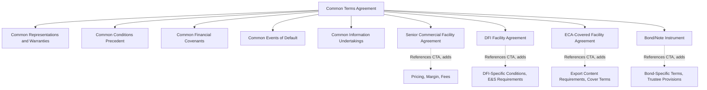
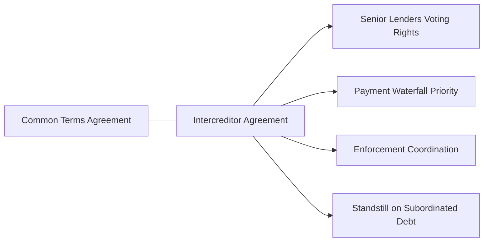

## Common Terms Agreement and Facility Agreements

### Overview and Role in Project Finance

The Common Terms Agreement (CTA) is a master financing document used in project finance transactions with **multiple tranches of debt** — for example, a senior commercial bank facility, a development finance institution (DFI) facility, an export credit agency (ECA)-covered facility, and a bond tranche financing the same project. Rather than duplicating identical representations, covenants, events of default, and conditions precedent across each individual facility agreement, the CTA consolidates all provisions that must be **common across all tranches** into a single document, while each tranche retains its own **Facility Agreement** governing terms specific to that instrument (pricing, repayment profile, availability period, and lender-specific conditions).

This structure is standard in large, multi-sourced project financings — particularly infrastructure, power, and natural resources projects — where different lender classes have different risk appetites, regulatory constraints, and documentation preferences, but all require consistency on the fundamental credit terms governing the borrower.

### Rationale for the CTA/Facility Agreement Split Structure

**Key Points**

- **Avoids inconsistency** — without a CTA, each facility agreement would separately define representations, covenants, and events of default, creating a material risk of drafting divergence that could produce conflicting lender rights or gaps in protection.
- **Simplifies amendments** — a single amendment to a common provision (e.g., a financial covenant reset) can be executed once under the CTA rather than negotiated separately with each lender group.
- **Supports pari passu ranking** — the CTA typically establishes that all tranches rank pari passu (equally) in right of payment and security, subject to agreed payment waterfall priorities, which is essential where DFIs, ECAs, and commercial banks share the same security package.
- **Enables intercreditor coordination** — the CTA often works in tandem with an Intercreditor Agreement to govern how multiple lender classes interact, vote, and share enforcement proceeds.

### Typical Contents of the Common Terms Agreement

#### Representations and Warranties

Standard representations covering the SPV's corporate status, authority to enter the transaction, absence of conflicts, validity of project contracts, compliance with law, environmental and social matters, and accuracy of financial projections — given by the borrower to all lender classes simultaneously and identically.

#### Conditions Precedent (CPs)

The CTA typically consolidates:

- **Conditions precedent to financial close** — corporate documents, legal opinions, executed project contracts, security perfection, government approvals/permits, insurance in place, and the base-case financial model.
- **Conditions precedent to each drawdown** — confirmation of continued accuracy of representations, no default, satisfaction of construction milestones (for phased drawdowns), and updated cost-to-complete certifications.

#### Financial Covenants

- **Debt Service Coverage Ratio (DSCR)** — both a backward-looking (historic) and forward-looking (projected) test, typically calculated semi-annually, with a minimum threshold triggering restrictions if breached.
- **Loan Life Coverage Ratio (LLCR)** — measures coverage of debt service by the net present value of projected cash flows over the remaining loan life.
- **Project Life Coverage Ratio (PLCR)** — similar to LLCR but measured over the full remaining project/concession life, providing a longer-horizon coverage metric.
- **Leverage/gearing ratios** — debt-to-equity or debt-to-EBITDA limits, particularly relevant if additional indebtedness is contemplated.

$$\text{DSCR} = \frac{\text{Cash Flow Available for Debt Service (CFADS)}}{\text{Scheduled Principal} + \text{Interest}}$$

$$\text{LLCR} = \frac{\text{NPV of Projected CFADS over Remaining Loan Life}}{\text{Outstanding Debt Balance}}$$

#### Information and General Undertakings

Common obligations across all tranches: delivery of quarterly/annual financial statements, compliance certificates, notice of default events, maintenance of insurance, maintenance of permits/licenses, restrictions on business activities (the "single-purpose vehicle" covenant), and negative pledge provisions restricting additional encumbrances on project assets.

#### Events of Default

A consolidated list of events (payment default, breach of covenant, misrepresentation, insolvency, cross-default to project contracts, material adverse change, loss of key permits/licenses, expropriation) that, upon occurrence, are assessed uniformly across all tranches — critical for maintaining pari passu treatment, since a default under one facility that did not simultaneously constitute a default under the CTA's common terms could create inconsistent lender remedies.

### Facility Agreement — Tranche-Specific Terms

Each Facility Agreement (or Note Purchase Agreement / Bond Instrument for capital markets tranches) incorporates the CTA by reference and adds terms unique to that specific debt instrument:

| Element | Typically Addressed In |
| --- | --- |
| Interest rate / margin | Facility Agreement (tranche-specific) |
| Repayment schedule / maturity | Facility Agreement (tranche-specific) |
| Availability period | Facility Agreement (tranche-specific) |
| Fees (commitment, arrangement, agency) | Facility Agreement (tranche-specific) |
| Currency and hedging arrangements | Facility Agreement (tranche-specific, though hedging policy may be common) |
| Representations, covenants, events of default | Common Terms Agreement (shared) |
| Conditions precedent (core) | Common Terms Agreement (shared) |
| Tranche-specific conditions (e.g., ECA cover requirements, DFI E&S conditions) | Facility Agreement (tranche-specific, additive to CTA) |

[Inference] This split allows, for example, an ECA-covered tranche to include additional export-content or national-interest conditions specific to that agency's mandate, and a DFI tranche to include enhanced environmental and social (E&S) performance requirements consistent with that institution's safeguard policies, without requiring commercial lenders to accept or administer those same additional conditions.

### Intercreditor Agreement Interface

The CTA typically works alongside a separate **Intercreditor Agreement**, which governs:

- **Payment priority/waterfall** among tranches (even where nominally pari passu, cash flow allocation mechanics require detailed sequencing).
- **Voting thresholds** for waivers, consents, and amendments — commonly requiring majority lender consent (e.g., 66⅔% by value [Unverified — thresholds are transaction-specific]) for ordinary matters and unanimous or supermajority consent for fundamental changes (extending maturity, reducing principal, releasing security).
- **Enforcement coordination** — preventing any single lender class from unilaterally accelerating or enforcing security without coordinated action, typically requiring instruction from a defined majority.
- **Standstill provisions** — particularly relevant where subordinated or mezzanine tranches exist, restricting their enforcement rights while senior debt remains outstanding.

### Amendments and Waivers Under a CTA Structure

- **Common terms amendments** typically require a specified majority across all lenders under the CTA (often coordinated via the Intercreditor Agreement's voting mechanics), since a change to a common provision affects every tranche simultaneously.
- **Facility-specific amendments** (e.g., adjusting pricing on a single tranche) generally require only that tranche's lender consent, since other tranches are unaffected.
- A **Facility Agent** (or Common Documentation Agent) is typically appointed to administer the CTA on behalf of all lender classes, coordinating amendment processes, CP satisfaction confirmations, and information distribution — distinct from each tranche's own **Facility Agent** or **Bond Trustee**, who manages tranche-specific administration (interest calculations, drawdown notices).

### Modeling Implications

- The **financial covenant definitions** in the CTA (particularly CFADS, DSCR, and reserve account funding requirements) directly determine how the base-case and sensitivity financial models must be structured, since the model must replicate the exact covenant calculation methodology to test compliance under stress cases.
- **Multi-tranche repayment profiles** — where tranches have different maturities, amortization schedules, or currencies — require the financial model to calculate a **blended DSCR** across all tranches, in addition to any tranche-specific coverage tests some lender groups may require.
- **Cash flow waterfall modeling** must reflect the payment priority established by the Intercreditor Agreement, ensuring reserve account funding, tranche-specific debt service, and distribution tests are sequenced correctly in the model's logic.

$$\text{Blended DSCR} = \frac{\text{CFADS}}{\sum_{i=1}^{n} (\text{Principal}_i + \text{Interest}_i)}$$

where the summation runs across all $n$ debt tranches governed by the CTA.

### Common Negotiation Points

- **Scope of "common" terms** — sponsors and lenders negotiate which provisions genuinely need to be common (representations, events of default) versus which can remain tranche-specific, balancing documentation efficiency against individual lender flexibility.
- **DFI/ECA-specific carve-outs** — development finance institutions and export credit agencies often require preferential treatment on certain provisions (e.g., preferred creditor status, specific E&S covenants) that must be reconciled with the pari passu principle underpinning the CTA.
- **Cross-default thresholds** — negotiating whether a default under one project contract or tranche automatically cross-defaults across the entire CTA, or whether materiality thresholds and cure periods apply before cross-default is triggered.
- **Voting threshold calibration** — balancing efficient decision-making (lower thresholds) against protecting individual lender classes from being outvoted on matters materially affecting their specific tranche.

### Related Topics

- Intercreditor Agreements and Payment Waterfall Structuring
- Financial Covenants: DSCR, LLCR, and PLCR Calculation Methodologies
- Conditions Precedent and Drawdown Mechanics in Project Finance
- Export Credit Agency and Development Finance Institution Co-Financing Structures
- Step-In Rights and Direct Agreements
- Cash Flow Waterfall Design and Reserve Account Mechanics
- Events of Default and Cross-Default Provisions in Multi-Tranche Financings