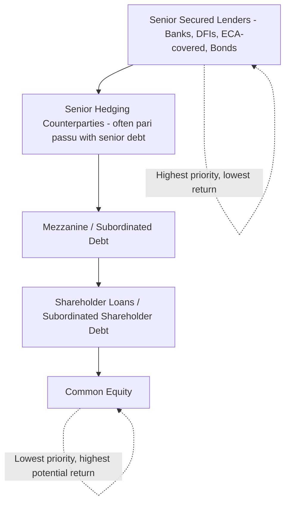
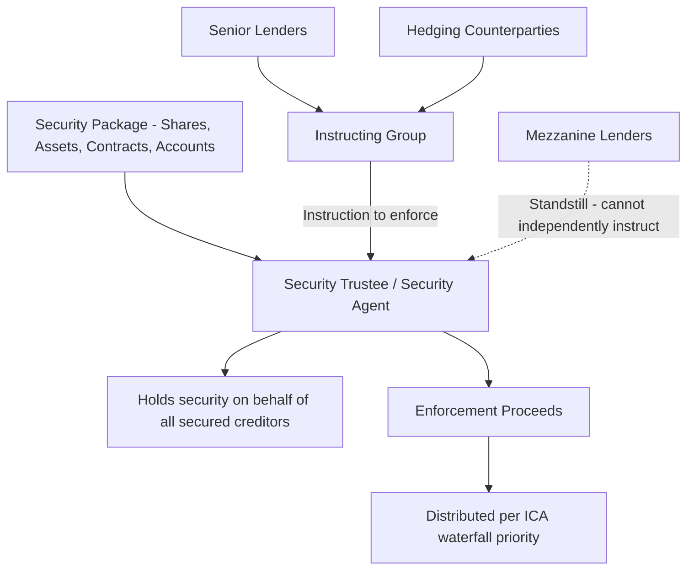

## Intercreditor Agreements and Creditor Hierarchy

### Overview and Purpose

An Intercreditor Agreement (ICA) is the document that governs the relationship **among different classes of creditors** financing the same project — senior lenders, mezzanine/subordinated lenders, hedging counterparties, shareholder loan providers, and sometimes trade creditors — rather than the relationship between any single creditor class and the borrower (which is addressed in the Common Terms Agreement and individual facility agreements). Where a project has only one class of pari passu senior debt, an ICA may be unnecessary or minimal; wherever the capital structure includes multiple layers of debt with different risk/return profiles and different priority claims, the ICA becomes essential to avoid disputes over payment priority, security enforcement, and decision-making authority.

The ICA answers a set of questions the underlying facility agreements deliberately leave open: who gets paid first, who can vote on what, who can accelerate or enforce security, and how are enforcement proceeds shared.

### The Creditor Hierarchy

**Key Points**

- Project finance capital structures are typically **layered**, with each layer bearing progressively more risk in exchange for higher return.
- Priority is established both **contractually** (via subordination provisions in the ICA) and **structurally** (via the security package and payment waterfall).
- Hierarchy determines not only payment priority but also **control rights** — senior creditors typically hold primary decision-making authority over enforcement and amendments.

| Layer | Typical Characteristics | Priority Position |
| --- | --- | --- |
| Senior secured debt | First-ranking security over all project assets; lowest cost of capital; most restrictive covenants | Highest |
| Hedging counterparties (interest rate/FX swaps) | Often ranked pari passu with senior debt given their role in managing senior debt's own risk | Typically pari passu with senior debt, sometimes structurally senior on early termination amounts |
| Mezzanine/subordinated debt | Contractually subordinated; higher margin; may have equity-like features (warrants, kickers) | Subordinate to senior, senior to equity |
| Shareholder loans | Often subordinated by both contractual terms and structural subordination (unsecured or second-ranking security) | Subordinate to mezzanine |
| Equity | Residual claimant; receives distributions only after all debt service and reserve requirements are satisfied | Lowest |

### Core Functions of the Intercreditor Agreement

#### Payment Subordination and Waterfall Priority

The ICA establishes the **cash flow waterfall** — the mandatory sequence in which available cash is applied each payment period, ensuring senior obligations are met before any payment reaches subordinated creditors or equity.

$$\text{Waterfall (illustrative)}:\quad \text{Opex} \rightarrow \text{Senior Debt Service} \rightarrow \text{DSRA Funding} \rightarrow \text{Senior Hedging Payments} \rightarrow \text{Mezzanine Debt Service} \rightarrow \text{Major Maintenance Reserve} \rightarrow \text{Shareholder Loan Service} \rightarrow \text{Equity Distributions}$$

- **Payment blockage/standstill provisions** — the ICA typically prevents the SPV from making any payment to a subordinated creditor if a senior default has occurred and is continuing, even if the subordinated creditor's own facility agreement would otherwise permit payment.
- **Turnover provisions** — if a subordinated creditor mistakenly receives a payment in breach of the waterfall (e.g., during a payment default), the ICA typically requires that creditor to hold the payment on trust for, and turn it over to, senior creditors.

#### Voting and Consent Rights

The ICA allocates decision-making authority across creditor classes for amendments, waivers, and consents:

| Decision Type | Typical Voting Requirement |
| --- | --- |
| Ordinary course waivers/consents | Majority senior lenders (commonly 50-66⅔% by value [Unverified — thresholds are transaction-specific]) |
| Fundamental amendments (maturity extension, principal reduction, security release, pricing changes) | Unanimous or high supermajority senior lender consent |
| Enforcement action initiation | Instructing group of senior lenders (often majority or supermajority), acting through a security agent/trustee |
| Subordinated/mezzanine consent rights | Typically limited to matters directly and adversely affecting their specific tranche; broad standstill on independent action |

[Inference] Subordinated creditors generally accept materially reduced voting and control rights in exchange for their higher-return, higher-risk position in the capital structure — the ICA formalizes this reduced-control bargain, preventing a mezzanine lender from blocking a senior-approved restructuring merely because it disagrees with the outcome.

#### Standstill Provisions

Standstill provisions restrict subordinated creditors from taking independent enforcement action (accelerating their debt, petitioning for insolvency, enforcing security) for a defined period after a default, or until senior debt has been repaid in full, preserving the senior lenders' ability to control the restructuring or enforcement process without competing or conflicting actions from junior creditors.

- **Standstill period** — commonly ranges from 90-180 days [Unverified — highly transaction-specific] following notice of a default under the mezzanine facility, during which mezzanine lenders cannot accelerate or enforce.
- **Permitted actions during standstill** — mezzanine lenders typically retain the right to accrue interest (even if payment is blocked) and to participate in information rights, even while enforcement rights are suspended.

#### Enforcement Coordination and Security Trustee Structure

Rather than each creditor holding separate security (which would create a race to enforce and destroy collective value), project finance structures typically appoint a single **Security Trustee** (or Security Agent) who holds the entire security package on trust/agency for all secured creditors collectively. The trustee acts only on instructions from a defined **instructing group** (typically majority senior lenders), ensuring enforcement is coordinated rather than fragmented.

### Interaction with Hedging Counterparties

Interest rate and currency hedging providers occupy a distinctive position in the creditor hierarchy:

- Hedging counterparties are typically granted **pari passu ranking with senior debt** for scheduled hedging payments, since the hedge exists to manage the senior debt's own interest rate or FX risk, and its economic function is inseparable from the senior facility.
- **Early termination amounts** under a hedge (payable if the swap is terminated following an event of default) can be substantial and are a heavily negotiated point — some ICAs subordinate early termination amounts behind scheduled senior debt service, reflecting that a large termination payment is a contingent, event-driven claim rather than a routine debt service obligation.
- The ICA typically specifies whether hedge termination itself constitutes, or is triggered by, a broader project finance event of default, and coordinates the hedge counterparty's voting rights (often limited, given their specialized, payment-focused interest in the transaction) with those of the broader senior lender group.

### Subordination Mechanics: Contractual vs. Structural

**Key Points**

- **Contractual subordination** — achieved through explicit terms in the ICA (payment blockage, turnover, standstill) rather than the corporate structure itself.
- **Structural subordination** — achieved by positioning subordinated debt at a different level of the corporate structure (e.g., at a holding company above the SPV) or with junior-ranking (or no) security, so that senior creditors' direct claim on SPV assets is inherently superior.

[Inference] Many project financings combine both approaches: shareholder loans are frequently both contractually subordinated (via ICA payment blockage provisions) and structurally subordinated (unsecured, or secured only by a junior-ranking pledge), providing overlapping layers of protection for senior creditors even if one mechanism were successfully challenged in an insolvency proceeding.

### Distribution Tests and the Interaction with Equity

The ICA (or, in simpler structures, the CTA/facility agreement directly) typically establishes **lock-up tests** — conditions that must be satisfied before cash can flow past debt service and reserve funding to reach shareholder loans or equity distributions:

- Minimum historic and projected DSCR thresholds (commonly requiring a defined margin above the minimum default-triggering DSCR level [Unverified — specific ratios are transaction-specific]).
- No continuing default or event of default.
- Full funding of the DSRA and any major maintenance reserve account to required levels.
- Satisfaction of any additional conditions specific to the transaction (e.g., completion of a specified construction milestone, or expiry of an initial "seasoning" period post-COD).

$$\text{Distribution Permitted if: } \text{DSCR}_{\text{historic}} \geq \text{Lock-Up Threshold} \text{ AND } \text{DSCR}_{\text{projected}} \geq \text{Lock-Up Threshold} \text{ AND No Default}$$

### Modeling Implications

- The **cash flow waterfall structure** established by the ICA must be replicated precisely in the project finance financial model, since the sequencing of reserve funding, senior debt service, mezzanine service, and distributions materially affects the timing and amount of equity cash flows used to calculate equity IRR.
- **Multi-tranche DSCR calculations** may require both a **senior DSCR** (senior debt service only) and a **total/blended DSCR** (senior plus subordinated debt service) to test compliance with different lock-up and default thresholds applicable to each creditor class.
- **Standstill and turnover mechanics** are generally not modeled directly in the base case (since they are default-scenario provisions) but are critical inputs to lenders' downside/recovery analysis and loan-loss-given-default assessments.

### Common Negotiation Points

- **Standstill period length** — mezzanine/subordinated lenders seek shorter standstill periods to preserve their ability to act if senior lenders are perceived as slow or overly lenient toward a distressed sponsor; senior lenders seek longer periods to maintain control over the restructuring process.
- **Cure rights for subordinated lenders** — the extent to which mezzanine lenders can cure a senior default (paying arrears) to prevent senior enforcement, preserving their own position, is a frequently negotiated protection for junior creditors.
- **Buy-out options** — some ICAs grant subordinated lenders (or sponsors) the right to purchase senior debt at par following a senior default, allowing them to take control of the restructuring process directly rather than relying on standstill and cure mechanics alone.
- **Scope of pari passu treatment for hedging** — precise definition of which hedging payments (scheduled vs. termination) receive senior-equivalent ranking, given the potentially large and unpredictable size of termination amounts.

### Related Topics

- Common Terms Agreement and Facility Agreements
- Cash Flow Waterfall Design and Reserve Account Mechanics
- Security Package Structuring: Share Pledges, Account Security, and Assignments
- Mezzanine and Subordinated Debt Structuring in Project Finance
- Hedging Strategies: Interest Rate and Currency Risk Management
- Distribution/Lock-Up Tests and DSCR Covenant Calibration
- Step-In Rights and Direct Agreements