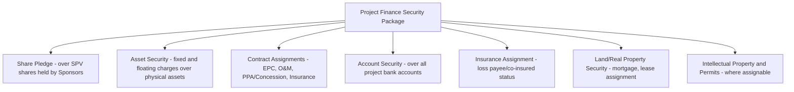
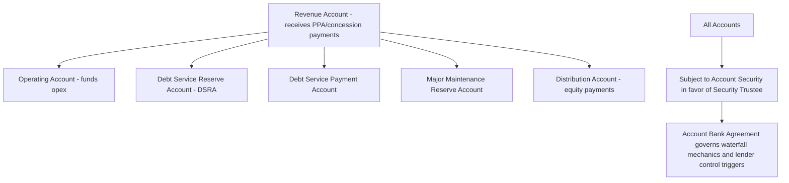

## Security Package and Collateral Structures

### Overview and Purpose

The security package is the complete set of collateral and legal interests granted by the project company (SPV) and its shareholders to lenders (typically via a Security Trustee/Agent holding on behalf of all secured creditors) to secure repayment of project debt. In non-recourse project finance, lenders have no recourse to sponsor balance sheets, so the security package — not sponsor creditworthiness — is the substantive collateral backing the loan. Because a project's principal "assets" are frequently intangible (long-term contracts, permits, cash flow rights) rather than easily liquidated physical property, project finance security structures are more comprehensive and interconnected than typical corporate lending collateral, spanning shares, physical assets, contracts, accounts, and insurance.

### Core Components of the Security Package

**Key Points**

- Security is typically taken over **everything of value** the SPV holds: its shares, physical assets, contractual rights, receivables, bank accounts, and insurance proceeds.
- The objective is to ensure that upon default, lenders can either **enforce and sell** the collateral, or **step into and continue operating** the project as a going concern (see step-in rights and direct agreements) rather than merely liquidating stranded assets.
- Security is granted by both the SPV (asset-level security) and its shareholders (share pledge), addressing both the project's assets and its ownership/control.

### Share Pledge

A pledge (or charge, mortgage, or equivalent security interest depending on jurisdiction) granted by the SPV's shareholders (sponsors) over their shares in the project company.

**Function:**

- Allows lenders, upon enforcement, to **take control of the SPV** by exercising voting rights or transferring share ownership to a lender nominee or replacement sponsor — without needing to unwind or replace the underlying project contracts, which remain with the same legal entity (the SPV).
- Often the **primary enforcement mechanism** in a project finance workout, since replacing ownership/management while preserving the SPV's contractual relationships is typically less value-destructive than attempting to transfer individual assets and contracts to a new entity.
- Distinguished from asset-level security because it operates at the corporate/ownership level rather than the asset level — lenders taking share pledge security become (or control) the shareholder, not a direct asset owner.

[Inference] The share pledge is generally considered a cornerstone of project finance enforcement strategy precisely because most other elements of the security package (contract assignments, permits) are difficult or impossible to transfer to a new entity without counterparty consent, whereas share ownership can typically be transferred via the pledge mechanism with fewer third-party consent requirements, subject to any change-of-control restrictions in the project contracts themselves.

### Asset Security (Fixed and Floating Charges)

Security granted directly by the SPV over its physical and intangible assets:

| Security Type | Typical Scope | Enforcement Characteristics |
| --- | --- | --- |
| Fixed charge | Specifically identified assets (land, plant, equipment, specific receivables) | Lender consent required for SPV to deal with/dispose of the asset; higher priority on enforcement in most jurisdictions |
| Floating charge | A shifting pool of assets (inventory, receivables generally, cash) that the SPV can deal with in the ordinary course until the charge "crystallizes" | Provides flexibility for ordinary business operation; converts to fixed charge upon crystallization (default/enforcement) |
| Mortgage over real property | Land, buildings, and fixtures | Registered against title; enforcement typically via judicial or non-judicial foreclosure/sale procedures per local law |

[Unverified — the precise legal character and availability of fixed vs. floating charges, and their relative priority, differs substantially by jurisdiction; civil law jurisdictions often use different security instruments (e.g., pledges, mortgages, and specific statutory project finance security regimes) rather than the fixed/floating charge distinction common in common law systems.]

### Assignment of Project Contracts

Security assignments (or, in some jurisdictions, pledges/charges over contractual rights) over the SPV's rights under its key project contracts:

- **EPC contract** — assignment of the SPV's rights to warranty claims, liquidated damages, and performance guarantees.
- **O&M agreement** — assignment of rights to performance LDs and termination compensation.
- **Offtake agreement (PPA/concession)** — assignment of the SPV's right to receive revenue payments, often the single most valuable assigned contract given its role as primary cash flow source.
- **Insurance policies** — assignment of proceeds, with lenders typically named as **loss payee** (for property/business interruption insurance) and **additional insured** (for liability insurance).
- **Government approvals/permits** — assigned where legally permissible; many jurisdictions restrict the assignability of government-issued permits and licenses, requiring alternative protective mechanisms (e.g., direct agreements with the granting authority, or step-in rights) instead of direct assignment.

**Purpose of contract assignment security:** Beyond providing a claim lenders can enforce, contract assignments work in tandem with **direct agreements** (see prior chapter item) to allow lenders to redirect payment streams directly to a controlled account, and to formally notify counterparties of lenders' security interest, which in many jurisdictions is a legal prerequisite (notice/perfection) for the assignment to be effective against third parties.

### Account Security

Security over the SPV's bank accounts, typically structured as a hierarchy of dedicated accounts governed by the finance documents:

- **Account Bank Agreement** — a separate document (sometimes integrated with the security documents) specifying the mandatory order of application of funds (the cash flow waterfall), the account bank's obligations, and the circumstances under which lenders gain unilateral control over account operation (typically upon an event of default).
- **Springing control** — many account security structures grant the SPV day-to-day operating control over accounts absent default, with control "springing" to lenders (i.e., requiring lender signatures or lender-directed instructions) upon a specified triggering event, balancing operational flexibility against lender protection.

### Insurance Assignment and Loss Payee Provisions

Lenders typically require:

- **Property/construction all-risk insurance** with lenders named loss payee, ensuring reconstruction or debt repayment proceeds flow through lender-controlled channels rather than directly to the SPV or sponsors.
- **Business interruption / delay-in-startup insurance** — proceeds designed to substitute for lost revenue during an insured event, directly supporting debt service continuity.
- **Third-party liability insurance** with lenders named additional insured, protecting against the SPV's liability exposure eroding project value available for debt service.
- **Lenders' insurance broker/adviser review** — an independent insurance adviser typically reviews policy adequacy, exclusions, and deductibles as part of due diligence, since gaps in coverage represent uninsured risk that could otherwise threaten debt service.

### Perfection and Enforceability Considerations

**Key Points**

- A security interest that is validly granted but not properly **perfected** (registered, filed, or otherwise made effective against third parties per local law) may be unenforceable against a liquidator, subsequent secured creditor, or bona fide purchaser.
- Perfection requirements vary enormously by jurisdiction and asset type — registration at a companies registry, land registry, or specialized security registry; possession (for certain pledges); or notice to a counterparty (for assigned receivables).

[Inference] Because project finance transactions frequently span multiple jurisdictions (e.g., an SPV incorporated in one country, assets located in another, offshore accounts in a third), a coordinated legal opinion program covering security creation, perfection, and priority in each relevant jurisdiction is a standard and often lengthy component of financial close conditions precedent, since a security package that is perfect on paper but improperly perfected under local law provides materially less protection than intended.

### Negative Pledge and Restrictions on Further Encumbrance

The finance documents typically include a **negative pledge covenant** prohibiting the SPV from granting any further security interest over project assets to third parties without lender consent, preserving the priority and completeness of the existing security package. Permitted exceptions are typically narrowly defined (e.g., liens arising by operation of law, security securing permitted additional indebtedness within agreed limits).

### Security Trustee Structure and Multi-Creditor Coordination

As discussed in the Intercreditor Agreement context, security is typically held by a single **Security Trustee/Agent** on behalf of all secured creditors collectively (senior lenders, hedging counterparties, and, subject to subordination, mezzanine lenders), rather than each creditor holding a separate, competing security interest. This structure:

- Avoids a "race to enforce" that could destroy collective value.
- Ensures enforcement proceeds are distributed per the priority waterfall established in the Intercreditor Agreement.
- Requires the trustee to act only upon instruction from a defined majority/instructing group, coordinating enforcement strategy across the full creditor group.

### Modeling and Due Diligence Implications

While the security package is primarily a legal structure rather than a modeled financial input, it materially affects:

- **Recovery rate assumptions** in lender credit risk models — a comprehensive, well-perfected security package supports higher assumed recovery in a default scenario, influencing internal credit ratings and capital allocation for lenders.
- **Leverage capacity** — lenders' willingness to extend higher leverage is partly a function of confidence in the security package's enforceability and completeness; jurisdictions with weaker secured creditor protections or slower enforcement processes typically see lower achievable leverage or higher required equity cushions. [Unverified — the magnitude of this effect is transaction- and jurisdiction-specific.]
- **Conditions precedent timeline** — perfection of security across multiple jurisdictions and asset classes is frequently the single most time-consuming category of conditions precedent to financial close, requiring coordinated local counsel opinions before funds can be disbursed.

### Common Negotiation Points

- **Scope of share pledge enforcement mechanics** — whether enforcement requires judicial process or can proceed via appropriation/private sale, which varies by jurisdiction and materially affects speed of enforcement.
- **Springing control triggers on accounts** — sponsors typically seek narrow, clearly defined triggers (e.g., only a payment default) for lenders to assume account control, while lenders seek broader triggers (any event of default, or even certain financial covenant deterioration) for earlier intervention.
- **Permitted encumbrances carve-outs** in the negative pledge — negotiating exceptions for operationally necessary liens (e.g., statutory liens for unpaid contractors, operating leases) without undermining the negative pledge's overall protective function.
- **Insurance proceeds application** — whether insurance proceeds from a covered loss must be applied to reinstate the asset, prepay debt, or a combination, particularly significant following a major casualty event.

### Related Topics

- Common Terms Agreement and Facility Agreements
- Intercreditor Agreements and Creditor Hierarchy
- Step-In Rights and Direct Agreements
- Cash Flow Waterfall Design and Reserve Account Mechanics
- Insurance Structuring in Project Finance: Construction and Operating Phase Coverage
- Legal Due Diligence and Conditions Precedent to Financial Close
- Cross-Border and Multi-Jurisdictional Security Perfection Challenges