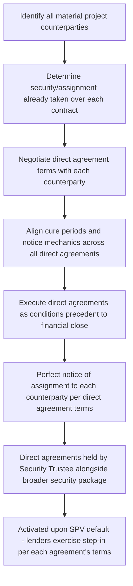

## Direct Agreements With Project Counterparties

### Overview and Purpose

Direct Agreements with Project Counterparties are the documentation instruments through which lenders establish a direct contractual relationship with each material third party to the project — the EPC contractor, O&M operator, offtaker/grantor, fuel/feedstock supplier, land lessor, and sometimes key subcontractors or the SPV's shareholders — notwithstanding that lenders are not party to the underlying commercial contracts between the SPV and those counterparties. This item examines direct agreements specifically as a **financing documentation and security workstream**: how they are drafted, sequenced, negotiated, and integrated into the conditions precedent and security perfection process across the full counterparty set, complementing the contract-specific step-in mechanics addressed earlier in the risk allocation context.

### Why Direct Agreements Are a Security-Package Concern

**Key Points**

- Contract assignment security (discussed under the security package) gives lenders a *proprietary interest* in the SPV's rights under a project contract, but that interest is only as valuable as lenders' practical ability to **enforce or continue** the contract if the SPV defaults.
- A direct agreement operationalizes the assignment: it obtains the counterparty's advance acknowledgment of the assignment, its agreement not to terminate without notifying lenders, and its consent to lenders stepping in — turning a paper security interest into a workable enforcement pathway.
- Without a matching direct agreement, an assigned contract may still terminate automatically upon an SPV insolvency or default under its **general law or contract-specific termination rights**, regardless of the lenders' separate security interest in the (now-terminated) contract.

[Inference] From a security-package perspective, a contract assignment without a corresponding direct agreement is frequently characterized by lenders' counsel as an incomplete security interest — valuable in an accounting/priority sense but of limited practical use if the underlying contract can lawfully be terminated by the counterparty before lenders have any opportunity to intervene.

### The Direct Agreement Negotiation and Documentation Sequence

Direct agreements are typically negotiated **in parallel with**, not after, the underlying project contracts, since counterparties often resist granting broad consent/step-in rights and the negotiating leverage to obtain them is generally highest before the underlying commercial contract is finalized and signed. [Inference] Sponsors and their counsel frequently attempt to agree the core direct agreement terms (notice periods, cure rights, liability caps on step-in) as a term sheet exhibit to the underlying EPC, O&M, or offtake contract itself, precisely so that the direct agreement negotiation does not become a late-stage bottleneck to financial close.

### Direct Agreements as Conditions Precedent

Execution (and, where relevant, perfection) of direct agreements with each material counterparty is almost universally listed as a **condition precedent to financial close** in the Common Terms Agreement's CP schedule. Lenders' counsel typically require:

- **Fully executed direct agreements** with the EPC contractor, O&M operator, and offtaker/grantor at a minimum, prior to first drawdown.
- **Legal opinions** confirming the direct agreements are valid, binding, and enforceable against each counterparty under the governing law of the relevant contract.
- **Notice of assignment** delivered to, and where required acknowledged by, each counterparty, satisfying local law perfection requirements for the assignment of contractual rights described under the security package.
- Where a counterparty is a government or state-owned entity, confirmation that the direct agreement has received any required **governmental/regulatory approvals or sovereign immunity waivers** necessary for enforceability against that counterparty.

[Unverified — the precise scope of counterparties requiring a direct agreement as a hard CP, versus a best-efforts or post-closing undertaking, varies by transaction and lender group risk appetite; some lenders permit financial close with a subset of direct agreements outstanding, subject to a post-closing covenant to complete them within an agreed period.]

### Coordinating Terms Across Multiple Direct Agreements

A recurring documentation challenge is ensuring **consistency of timing and mechanics** across the full suite of direct agreements, since project contracts are interdependent and a mismatch in cure/notice periods between, for example, the EPC direct agreement and the offtake direct agreement can leave lenders unable to respond coherently to a cascading default.

| Coordination Issue | Risk if Unaddressed |
| --- | --- |
| Inconsistent notice periods for default | Lenders may receive notice of an EPC default with insufficient time to also assess and respond to a related offtake agreement risk |
| Inconsistent cure periods | A cure achievable under one direct agreement's timeline may not be achievable under a shorter parallel timeline in another |
| Inconsistent step-in liability caps | Lenders stepping into one contract may face materially different liability exposure than under another, complicating a holistic step-in decision |
| Uncoordinated termination triggers | A termination event under one contract (e.g., loss of a key permit) may not be mirrored as a termination-relevant event under a related direct agreement, creating gaps |

[Inference] Because these interdependencies are numerous and technical, lenders' counsel commonly produce a **direct agreements matrix** during documentation — a cross-reference table mapping notice periods, cure periods, step-in mechanics, and liability caps across every direct agreement — specifically to identify and close such gaps before financial close, rather than discovering them during an actual default scenario.

### Direct Agreement Terms by Counterparty Type

#### EPC Contractor Direct Agreement

Typically the most time-pressured direct agreement to negotiate, since construction-phase defaults (e.g., a payment disruption caused by a drawdown delay) can have immediate physical consequences (contractor demobilization) if not addressed quickly. Cure periods are often shorter than for operational-phase agreements, reflecting the higher cost of construction delay.

#### O&M Operator Direct Agreement

Addresses both routine performance defaults and the practical mechanics of an operator substitution, including **data room and knowledge transfer obligations** the outgoing operator must observe to enable a smooth transition if lenders exercise a permanent step-in/termination.

#### Offtaker/Grantor Direct Agreement

Frequently the most heavily negotiated, particularly with government or state-owned counterparties who may resist granting broad, indefinite step-in rights on sovereignty or public-policy grounds. Often includes carve-outs limiting lenders' step-in rights where public health, safety, or national security considerations are engaged (particularly relevant for concessions involving hospitals, prisons, or defense-adjacent infrastructure).

#### Land Lessor / Government Grantor of Site Rights

Where the project site is leased rather than owned, a direct agreement (or equivalent consent to assignment/mortgage of the leasehold interest) with the landowner is required to ensure lenders can preserve site access rights upon SPV default — a frequently overlooked but critical element, since loss of site access can be as value-destructive as loss of the offtake contract itself.

#### Shareholders' Direct Agreement / Direct Agreement Regarding Sponsor Support

Where sponsors provide equity support undertakings, cost overrun guarantees, or subordinated shareholder loans, a direct agreement (or equivalent provisions within the equity support documents) may grant lenders enforcement rights directly against sponsors for these specific undertakings, separate from the SPV-level security package.

### Interaction with the Security Trustee and Enforcement Process

Direct agreements are typically held and administered by the same **Security Trustee/Agent** that holds the broader asset, share, and account security described under the security package, ensuring a single coordinated point of enforcement authority rather than fragmented action across different lender representatives. Upon a default:

1. The Security Trustee receives notice (directly from the counterparty, per the direct agreement's notice obligation, or from the SPV/lenders' own monitoring).
2. The instructing group of lenders (per the Intercreditor Agreement's voting mechanics) determines whether to exercise step-in rights under the relevant direct agreement(s).
3. The Security Trustee issues the formal step-in notice(s) required under each direct agreement's mechanics, coordinating timing across multiple agreements where a single underlying default affects several contracts simultaneously.

### Modeling and Due Diligence Implications

- While direct agreements are not directly modeled financial inputs, the **completeness of the direct agreement suite** is a standard due diligence checklist item feeding into lenders' overall risk assessment and, indirectly, into pricing and leverage decisions — similar to the security package's effect on assumed recovery rates.
- **Legal due diligence timelines** for direct agreements — particularly with government/grantor counterparties requiring internal approvals — are frequently identified as a **critical path item** in the financial close timetable, since a delayed direct agreement can hold up satisfaction of conditions precedent even where all other documentation is complete.
- Financial advisors typically track direct agreement execution status as part of the broader **conditions precedent tracker** maintained in the lead-up to financial close, alongside security perfection, insurance placement, and permit confirmations.

### Common Negotiation Points

- **Counterparty resistance to broad consent rights** — particularly from government/grantor counterparties, who may seek to limit lenders' step-in rights to defined categories of default rather than an open-ended right to intervene in any SPV default.
- **Liability caps upon step-in** — as with the risk-allocation-focused treatment of step-in rights, lenders seek to limit their assumed liability to obligations arising after step-in, while counterparties seek assurance that stepping-in lenders will assume full going-forward performance obligations.
- **Fees and costs of direct agreement negotiation** — counterparties, particularly smaller subcontractors or suppliers, may seek reimbursement of legal costs incurred in negotiating a direct agreement, which sponsors typically budget for as part of financing transaction costs.
- **Post-closing direct agreements for immaterial counterparties** — negotiating which counterparties require a hard CP direct agreement versus a post-closing best-efforts covenant, balancing closing timeline pressure against completeness of the security package.

### Related Topics

- Step-In Rights and Direct Agreements (Risk Allocation Perspective)
- Security Package and Collateral Structures
- Common Terms Agreement and Facility Agreements
- Conditions Precedent and Drawdown Mechanics in Project Finance
- Intercreditor Agreements and Creditor Hierarchy
- Cross-Border and Multi-Jurisdictional Security Perfection Challenges
- Legal Due Diligence Processes Ahead of Financial Close