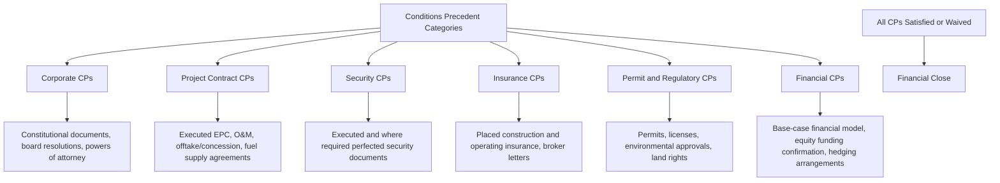
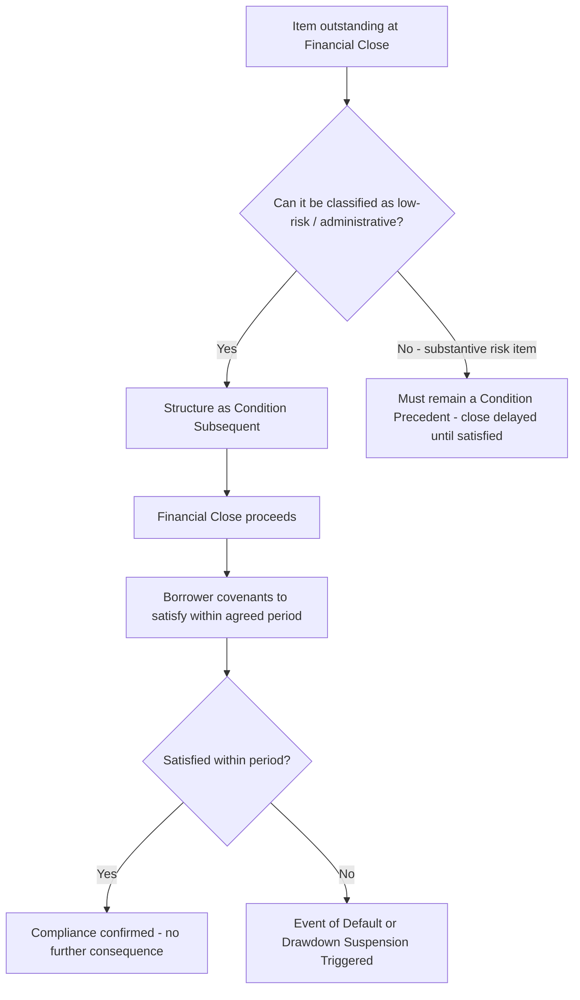

## Conditions Precedent and Conditions Subsequent

### Overview and Purpose

Conditions Precedent (CPs) and Conditions Subsequent (CSs) are the mechanisms by which lenders control the timing and sequencing of debt disbursement in a project finance transaction, ensuring that funds are only advanced once specified legal, financial, technical, and documentary requirements have been satisfied. CPs must be satisfied **before** a defined event occurs — typically financial close or a drawdown — while CSs permit an event to occur (most often financial close or first drawdown) subject to an obligation to satisfy specified outstanding items **within an agreed period afterward**. Together, they form the procedural gatekeeping mechanism that translates the extensive due diligence, documentation, and security perfection work described elsewhere in the financing package into an actionable disbursement process.

### Conditions Precedent to Financial Close

**Key Points**

- Financial close CPs are the most extensive category, since they must comprehensively confirm the transaction is ready to proceed to binding effectiveness and, typically, first drawdown.
- CPs are organized by category — corporate, project contracts, security, insurance, permits/regulatory, and financial — and are typically compiled into a detailed **CP checklist/schedule** annexed to the Common Terms Agreement.
- Satisfaction is confirmed via a combination of **certified documents**, **legal opinions**, and **conditions precedent certificates** issued by the borrower confirming ongoing accuracy of representations.

#### Corporate Conditions Precedent

- Constitutional documents (articles/memorandum of association) of the SPV and relevant sponsor entities.
- Board and shareholder resolutions authorizing the transaction and the individuals executing documents on the SPV's behalf.
- Powers of attorney and specimen signatures for authorized signatories.
- Corporate structure chart confirming the SPV's ownership and, where relevant, confirmation of any change-of-control or restructuring completed ahead of close.
- Legal opinions on corporate capacity and due authorization from counsel in the SPV's jurisdiction of incorporation.

#### Project Contract Conditions Precedent

- Fully executed EPC contract, O&M agreement, offtake agreement/concession agreement, fuel or feedstock supply agreement (where applicable), and land lease/purchase documentation.
- Confirmation that all conditions to effectiveness under each underlying project contract (e.g., the EPC contract's own conditions precedent to notice to proceed) have been satisfied or will be satisfied concurrently with financial close.
- Executed direct agreements with each material counterparty (see prior item), together with confirming legal opinions.

#### Security Conditions Precedent

- Execution of all security documents comprising the security package (share pledge, asset charges, contract assignments, account security).
- Evidence of registration/perfection of security in each relevant jurisdiction and registry, or a clear post-closing perfection plan where perfection cannot be completed prior to close (addressed as a CS — see below).
- Legal opinions confirming valid creation, and where applicable perfection, of security interests.

#### Insurance Conditions Precedent

- Evidence that required construction-phase (and, where relevant, early operating-phase) insurance policies have been placed, with lenders named loss payee/additional insured as appropriate.
- An independent insurance adviser's report confirming policy adequacy against the project's risk profile and lender requirements.

#### Permit and Regulatory Conditions Precedent

- Confirmation that all permits, licenses, and government approvals material to construction and initial operation have been obtained (with any outstanding permits typically requiring specific legal analysis of the risk of non-issuance, sometimes justifying a CS rather than a hard CP if the permit is administrative/ministerial in nature and issuance is highly likely).
- Environmental and social impact assessment approvals, particularly significant where DFI or ECA lenders apply enhanced environmental and social safeguard requirements.
- Foreign investment approvals, exchange control registrations, or other regulatory clearances specific to the jurisdiction.

#### Financial Conditions Precedent

- The **base-case financial model**, agreed and often "locked" between sponsors and lenders' financial advisers, forming the reference point for covenant calculations and future model updates.
- Evidence of **equity funding** — either equity already contributed, or binding equity commitment/subscription agreements confirming sponsors will fund their committed equity contribution in the agreed proportion and sequence relative to debt drawdowns.
- Execution of **hedging agreements** (interest rate/currency swaps) where required by the finance documents as a condition to drawdown.
- Payment of upfront fees (arrangement fees, agency fees) due at financial close.

### Conditions Precedent to Drawdown (as distinct from Financial Close CPs)

Beyond the CPs required for the financing documents to become effective, most project financings — particularly during construction, where debt is drawn in tranches against certified progress — require **drawdown-specific CPs** to be satisfied before each individual disbursement:

- **Drawdown notice** delivered within the required notice period, specifying the amount and purpose of the requested drawdown.
- **No default** — confirmation that no event of default (or, in some structures, no potential event of default) is continuing at the time of the drawdown request.
- **Continued accuracy of representations** — repetition of key representations as of the drawdown date.
- **Construction progress certification** — for construction-phase drawdowns, an independent engineer's certificate confirming works have progressed consistent with the drawdown schedule and that the amount requested corresponds to actual costs incurred.
- **Cost-to-complete confirmation** — confirmation that remaining committed funds (debt plus undrawn equity) remain sufficient to complete the project, guarding against a funding shortfall becoming apparent only late in construction.
- **Pro rata funding confirmation** — evidence that equity and debt are being drawn in the proportion specified in the finance documents (commonly equity-first, pari passu, or pro rata structures), preventing lenders from funding disproportionately ahead of sponsor equity contributions.

$$\text{Available Drawdown} = \min(\text{Requested Amount}, \text{Certified Cost Incurred}, \text{Remaining Facility Commitment})$$

### Conditions Subsequent

**Key Points**

- CSs allow financial close (or first drawdown) to proceed notwithstanding that certain non-critical items remain outstanding, subject to a binding covenant to complete them within a specified period.
- CSs are typically reserved for items that are **administrative, low-risk, or genuinely cannot be completed by the close date** for reasons outside the borrower's control (e.g., a registry with a multi-week processing backlog), rather than for substantive risk items.
- Failure to satisfy a CS within the agreed period is typically itself an event of default (or triggers automatic consequences such as drawdown suspension), preserving lender leverage to ensure timely completion.

**Common examples of items structured as Conditions Subsequent:**

- **Security perfection/registration** — where the underlying security document is validly executed at close, but formal registration at a land registry, companies registry, or security registry is a purely administrative filing process subject to registry processing times beyond the borrower's control.
- **Minor permits** — non-critical, typically ministerial permits or licenses (e.g., certain operational environmental permits not required until an operational milestone well after construction start) not yet issued but expected imminently.
- **Outstanding legal opinions from minor jurisdictions** — where the substantive documents are signed but a formal opinion confirming enforceability in a secondary jurisdiction is still being finalized.
- **Post-closing corporate housekeeping** — updating statutory registers, filing notices with corporate registries, or similar administrative formalities.

[Inference] The distinction between a CP and a CS in practice often turns on lenders' credit risk assessment of the consequence of the item remaining unsatisfied: if the SPV's or lenders' position would be materially and adversely affected by the item never being completed, it is generally retained as a hard CP; if the item is virtually certain to be completed and its temporary absence poses limited risk, it is a candidate for CS treatment, subject to lenders' credit approval of the specific carve-out.

### Interaction with the Common Terms Agreement and CP Certificate Process

The CP/CS schedule is typically annexed to, and governed by, the Common Terms Agreement (see prior item), since CP satisfaction must be assessed uniformly across all lender tranches to preserve pari passu treatment. The process typically involves:

1. **CP checklist compilation** — legal counsel for lenders (and often a separate CP tracker maintained by the financial adviser) compiles and continuously updates the full CP list against the transaction's actual documentation status.
2. **Document collection and review** — each CP document is reviewed by lenders' counsel for compliance with the required form/content specified in the CTA.
3. **Conditions precedent certificate** — typically issued by the borrower (and sometimes by an authorized signatory of each sponsor) certifying that each CP has been satisfied as of the financial close date, providing a formal, signed record lenders can rely on.
4. **Facility Agent confirmation** — the Facility/Common Documentation Agent typically issues formal confirmation that all CPs have been satisfied or validly waived, which operates as the trigger for financial close to become effective.

### Waiver of Conditions Precedent

Lenders retain the discretion to **waive** a CP (rather than requiring strict satisfaction), typically subject to the same voting thresholds specified in the Intercreditor Agreement for other amendments/waivers. [Inference] Waivers are more commonly granted for administrative CPs where the underlying risk is judged immaterial, and are far less commonly granted for substantive risk-bearing CPs (e.g., an unexecuted offtake agreement), since waiving a fundamental CP is functionally equivalent to lenders accepting a risk they had specifically required be mitigated before funding.

### Modeling and Transaction Management Implications

- The CP satisfaction timeline directly determines the **financial close date**, which in turn affects the construction schedule, interest rate/FX hedge execution timing, and the base-case financial model's assumed drawdown schedule.
- **Drawdown-specific CPs** (particularly independent engineer certification of construction progress) create an operational interface between the financial model's projected drawdown schedule and actual construction progress, requiring the model to be capable of reflecting drawdown timing variances if construction progresses faster or slower than originally scheduled.
- Financial advisers typically maintain a live **CP/CS tracker** as a standard deliverable throughout the period leading to financial close, cross-referenced against the legal CP schedule, to provide sponsors and lenders visibility into remaining bottlenecks.

### Common Negotiation Points

- **Scope of items eligible for CS treatment** — sponsors seek to maximize the number of items pushed to CS status to accelerate financial close, while lenders' credit teams resist CS treatment for anything they consider a substantive risk mitigant.
- **Length of the CS cure period** — balancing realistic administrative timelines (e.g., registry processing times) against lenders' desire to avoid open-ended outstanding items.
- **Consequences of CS non-satisfaction** — negotiating whether missing a CS deadline triggers an immediate event of default (a harsh remedy for an administrative delay) versus a lesser consequence such as drawdown suspension or a cure period extension subject to lender consent.
- **Materiality qualifiers on drawdown CPs** — negotiating whether representations must be repeated as absolutely true at each drawdown, or only true in all material respects, affecting the practical ease of satisfying repeated drawdown CPs over a multi-year construction period.

### Related Topics

- Common Terms Agreement and Facility Agreements
- Security Package and Collateral Structures
- Direct Agreements With Project Counterparties
- Base-Case Financial Model Construction and Lender Due Diligence
- Construction-Phase Drawdown Mechanics and Independent Engineer Certification
- Legal Due Diligence Processes Ahead of Financial Close
- Intercreditor Agreements and Creditor Hierarchy