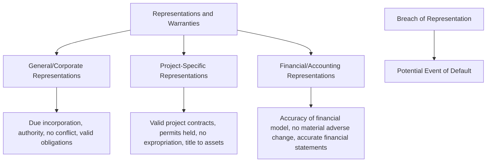
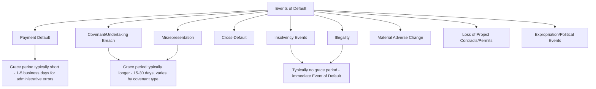

## Representations, Warranties, and Events of Default

### Overview and Purpose

Representations, warranties, and events of default form the credit-protection backbone of the Common Terms Agreement (and, in single-tranche financings, the facility agreement itself). Representations and warranties are statements of fact made by the borrower (the SPV) — and sometimes sponsors — about the project, its contracts, and its legal/financial status, given as a precondition to lending and repeated at defined intervals thereafter. Events of default are the defined triggering circumstances that, upon occurrence, entitle lenders to accelerate the debt, enforce security, or exercise other specified remedies. Together, they allow lenders to (1) confirm the factual and legal basis on which credit was extended, and (2) establish clear, contractually defined circumstances under which that credit exposure can be terminated or enforced — critical in non-recourse project finance, where lenders' entire credit assessment rests on the project's specific facts rather than general corporate creditworthiness.

### Representations and Warranties

**Key Points**

- Representations are given at financial close and typically **repeated** at each drawdown and, in many facility agreements, on each interest payment date, ensuring continued factual accuracy throughout the life of the loan, not merely at signing.
- A breach of representation (i.e., a representation proving untrue when made or repeated) is itself typically an event of default, distinguished from misrepresentation as a separate ground for termination in general contract law.
- Representations are broadly categorized as **general/corporate**, **project-specific**, and **financial/accounting**.

#### General/Corporate Representations

- **Status and due incorporation** — the SPV is validly incorporated and existing under the laws of its jurisdiction.
- **Power and authority** — the SPV has the corporate power to enter into and perform the finance documents, and has obtained all necessary internal authorizations (board/shareholder resolutions).
- **No conflict** — entering the finance documents does not conflict with the SPV's constitutional documents, applicable law, or any other agreement binding on the SPV.
- **Legal validity/enforceability** — the finance documents constitute valid, legally binding obligations of the SPV enforceable in accordance with their terms.
- **No immunity** — particularly relevant where a sovereign or state-owned entity is a counterparty or guarantor, confirming no claim of sovereign immunity will be asserted to resist enforcement.

#### Project-Specific Representations

- **Project contracts** — each material project contract (EPC, O&M, offtake/concession) has been validly executed, is in full force and effect, and no party is in default under it.
- **Permits and licenses** — all permits, licenses, and governmental approvals material to construction and operation have been obtained and are in full force and effect (or, for permits not yet required, that no obstacle to their timely future issuance is known).
- **Title and assets** — the SPV holds good title (or valid leasehold/usage rights) to the project site and all material project assets, free of encumbrances other than permitted security.
- **No expropriation/nationalization** — no governmental action to expropriate, nationalize, or otherwise interfere with the project or the SPV's ownership of it is pending or, to the SPV's knowledge, threatened.
- **Environmental and social compliance** — the project complies with applicable environmental and social laws and, where DFI/ECA lenders are involved, with the relevant institution's environmental and social safeguard standards.
- **Insurance** — required insurance policies are in place and premiums are current.

#### Financial/Accounting Representations

- **Accuracy of the base-case financial model** — the model's assumptions were reasonable and prepared in good faith at the time of preparation (typically not a guarantee of accuracy of future outcomes, but a representation as to the reasonableness and good-faith basis of the assumptions used).
- **No material adverse change (MAC)** — no event has occurred that could reasonably be expected to have a material adverse effect on the SPV's ability to perform its obligations, a broad, often heavily negotiated "catch-all" representation and, separately, event of default trigger.
- **Accuracy of financial statements** — financial statements delivered to lenders present a true and fair view of the SPV's financial condition in accordance with the applicable accounting standard.
- **No undisclosed liabilities** — the SPV has no material liabilities other than those disclosed in the finance documents or financial model.

### Repetition of Representations

Most project finance facility agreements specify that representations are deemed repeated:

- On the date of each drawdown request and drawdown.
- On each interest/repayment date.
- On the date of delivery of each compliance certificate.

[Inference] Repetition mechanics create an ongoing, rather than one-time, compliance obligation — meaning a fact that was true at financial close but becomes untrue during the life of the loan (e.g., a permit lapses, a material adverse change occurs) can independently trigger a representation-breach event of default even without any separate covenant breach, giving lenders a continuously updated credit-quality checkpoint throughout the debt term.

### Events of Default

**Key Points**

- Events of default are typically graded by severity and often include a **grace/cure period** for less severe breaches, while certain fundamental defaults (e.g., insolvency, illegality) are frequently defined as immediate, without a cure period.
- A recurring drafting distinction exists between an "**Event of Default**" (a fully matured trigger entitling acceleration) and a "**Potential Event of Default**" or "**Default**" (a circumstance that would become an Event of Default with the giving of notice, lapse of time, or a combination), used to trigger lesser consequences (e.g., a drawdown stop) before the full remedy set becomes available.

#### Payment Default

Failure to pay principal, interest, or fees when due. Typically the most severe and least tolerated default category, though a short grace period (commonly a few business days) is standard to accommodate administrative/technical payment failures (e.g., a wire transfer processing delay) rather than genuine inability or unwillingness to pay.

#### Covenant/Undertaking Breach

Failure to comply with an affirmative or negative covenant (information delivery, insurance maintenance, negative pledge, restrictions on business activities, financial covenants). Grace periods are typically longer than for payment defaults, reflecting that many covenant breaches are curable without threatening the fundamental credit position (e.g., a late-delivered compliance certificate).

#### Misrepresentation

As discussed above, a representation proving untrue when made or repeated. [Unverified — whether a materiality qualifier or cure right applies to misrepresentation-based defaults is heavily negotiated and varies significantly by transaction; some facility agreements distinguish between "material" misrepresentations (immediate default) and immaterial ones (no default or a cure right).]

#### Cross-Default

Default under any of the project contracts (EPC, O&M, offtake/concession) or under any other financial indebtedness of the SPV, which — even though not itself a breach of the finance documents — is deemed to constitute (or, more commonly, entitle lenders to declare) an event of default under the CTA. Cross-default provisions are essential to maintaining the interconnected risk allocation structure described in earlier chapter items, since a default under the offtake agreement, if left unaddressed, could otherwise persist without triggering lender rights until cash flow deterioration eventually caused an independent financial covenant breach.

$$\text{Cross-Default Trigger: } \exists \text{ default under Project Contract or other Indebtedness} \Rightarrow \text{Potential Event of Default under CTA}$$

[Inference] Cross-default thresholds are frequently subject to materiality and monetary carve-outs (e.g., only defaults exceeding a specified amount, or only defaults that are continuing and not cured within an applicable grace period under the underlying contract) to avoid an immaterial dispute under a minor supply contract automatically cascading into a full project finance event of default.

#### Insolvency Events

Bankruptcy, liquidation, appointment of an administrator/receiver, inability to pay debts as they fall due, or analogous insolvency proceedings affecting the SPV (and sometimes key sponsors or counterparties). Typically defined broadly and without a cure period, given the fundamental threat insolvency poses to ongoing project operation and lender recovery prospects.

#### Illegality

It becomes unlawful for the SPV to perform its obligations under the finance documents, or for lenders to maintain or fund their commitments — often linked to sanctions, exchange control changes, or fundamental regulatory shifts. Typically triggers a lender right to cancel commitments and require prepayment, sometimes without the broader acceleration/enforcement remedy set associated with other default categories.

#### Material Adverse Change (MAC)

A broad, often contentious catch-all provision allowing lenders to declare default upon any event or circumstance that could reasonably be expected to have a material adverse effect on the SPV's business, assets, financial condition, or ability to perform its obligations. [Inference] Because MAC clauses are inherently subjective and forward-looking, they are among the most heavily negotiated provisions in the CTA — sponsors typically seek to narrow the definition (e.g., requiring the effect to be reasonably certain and quantifiable) while lenders seek to preserve broad discretion to respond to unforeseen risks not otherwise captured by the specific, enumerated default categories.

#### Loss of Project Contracts or Permits

Termination, repudiation, or material amendment (without lender consent) of any material project contract, or revocation, suspension, or non-renewal of any material permit or license — directly tied to the risk allocation and step-in mechanisms discussed in the risk allocation chapter, since the loss of a key contract or permit typically undermines the fundamental basis on which the project's cash flow (and hence lenders' credit) was assessed.

#### Expropriation and Political Events

Nationalization, expropriation, or other governmental action depriving the SPV of ownership or control of the project, particularly relevant in emerging-market or politically sensitive jurisdictions and often coordinated with political risk insurance or multilateral guarantee coverage as a mitigant rather than a pure default trigger.

### Grace Periods and Cure Rights

| Default Category | Typical Grace/Cure Period | Rationale |
| --- | --- | --- |
| Payment default (technical/administrative) | 1-5 business days [Unverified] | Accommodates processing delays without penalizing genuine willingness/ability to pay |
| Covenant breach (curable) | 15-30 days [Unverified] | Allows time for administrative or operational remediation |
| Misrepresentation | Often no cure right, or a short period if capable of remedy | Reflects the fundamental nature of a factual inaccuracy underlying the credit decision |
| Insolvency | Typically none | Immediate threat to lender recovery position |
| Cross-default | Mirrors grace period under the underlying contract/indebtedness, subject to CTA-level materiality thresholds | Avoids duplicating or shortening cure rights already negotiated under the underlying instrument |

### Consequences of an Event of Default

Upon occurrence (and, where applicable, expiry of any grace period) of an event of default, lenders typically have a graduated set of remedies, usually exercisable at the discretion of the instructing group under the Intercreditor Agreement rather than automatically:

1. **Cancellation of undrawn commitments** — preventing further disbursement.
2. **Acceleration** — declaring all outstanding principal, accrued interest, and other amounts immediately due and payable.
3. **Enforcement of security** — instructing the Security Trustee to enforce the security package (share pledge, asset charges, account security).
4. **Exercise of step-in rights** — under the relevant direct agreements, as an alternative or precursor to full enforcement, aimed at preserving the project as a going concern.

[Inference] In practice, lenders in a non-recourse project financing frequently favor a measured, step-in-first approach over immediate acceleration and enforcement, since a project in default is usually more valuable as an operating business (preserved via step-in and workout) than as a liquidated collection of assets and terminated contracts — this practical preference is reflected in the structuring emphasis placed on step-in rights and direct agreements throughout the financing documentation.

### Modeling and Due Diligence Implications

- **Financial covenant-related representations and events of default** (DSCR, LLCR thresholds) must be modeled with precise alignment to the CTA's defined calculation methodology, since even minor definitional discrepancies (e.g., treatment of one-off items in CFADS) can produce a compliance certificate that inaccurately reflects actual covenant status.
- **Cross-default monitoring** requires ongoing tracking of compliance under all material project contracts, not merely the finance documents themselves — a monitoring burden typically shared between the SPV's management and the lenders' independent engineer/technical adviser.
- **MAC clause interpretation** is rarely modeled directly but is a key qualitative risk factor considered in lenders' credit committee assessments, particularly during periods of macroeconomic or sector-specific stress.

### Common Negotiation Points

- **Materiality qualifiers** — the extent to which representations, covenants, and cross-default triggers are qualified by "material" or "material adverse effect" thresholds, balancing lender protection against excessive technical default risk for immaterial matters.
- **Grace period lengths** — sponsors seek longer cure periods to avoid technical defaults for administrative or short-term operational issues; lenders seek shorter periods to preserve timely intervention rights.
- **MAC clause scope and triggering standard** — heavily negotiated given its inherently subjective character, often resolved through detailed, negotiated carve-outs and a higher evidentiary threshold (e.g., requiring the change to be reasonably expected to be continuing and not merely temporary).
- **Cross-default monetary/materiality thresholds** — negotiating minimum default amounts or materiality qualifiers under cross-default provisions to prevent minor, unrelated commercial disputes from triggering project finance-wide default consequences.

### Related Topics

- Common Terms Agreement and Facility Agreements
- Conditions Precedent and Conditions Subsequent
- Intercreditor Agreements and Creditor Hierarchy
- Security Package and Collateral Structures
- Direct Agreements With Project Counterparties
- Financial Covenants: DSCR, LLCR, and PLCR Calculation Methodologies
- Step-In Rights and Direct Agreements