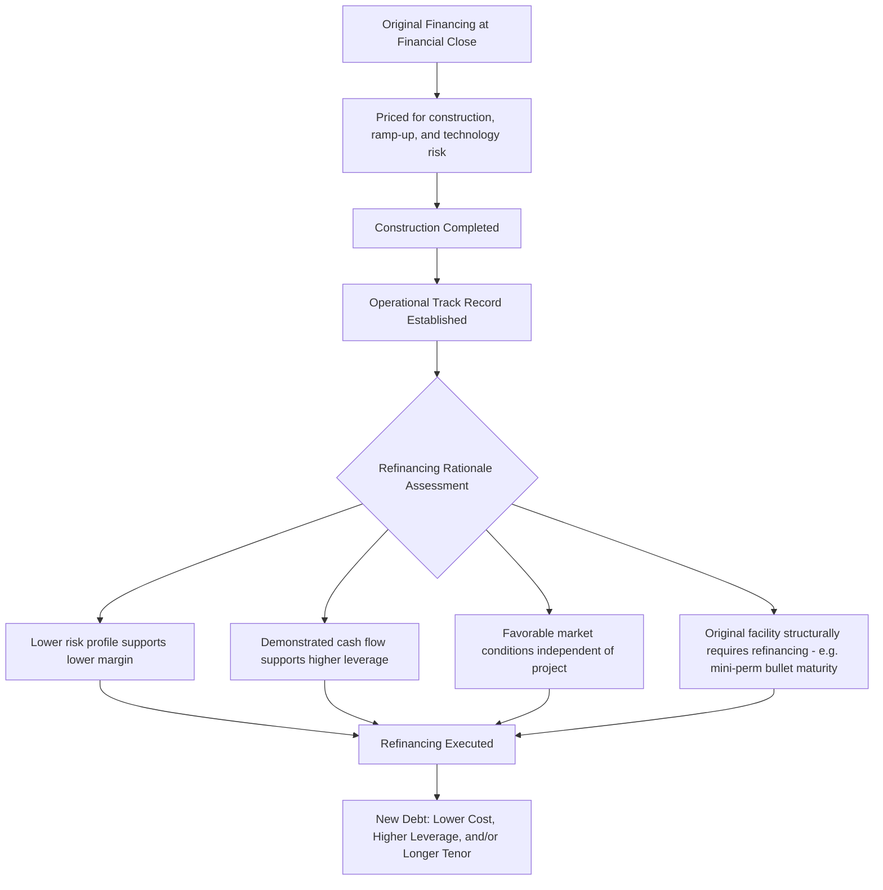
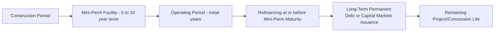

## Rationale and Timing for Refinancing

### Overview and Purpose

Refinancing in project finance refers to the replacement of an existing debt facility with new debt — from the same or different lenders, on revised terms — typically executed after a project has moved past its highest-risk phase (construction and initial ramp-up) into stable, demonstrated operation. Unlike corporate refinancing, which is often driven primarily by interest rate arbitrage, project finance refinancing is frequently driven by a **fundamental change in the project's risk profile**: a project that was financed on a construction-risk basis, with conservative leverage and pricing to compensate lenders for completion, ramp-up, and technology risk, can often access materially better terms once it has demonstrated a track record of stable operating cash flow. This risk-profile shift is the central rationale that distinguishes project finance refinancing from routine corporate debt refinancing.

### Why Projects Are Refinanced: The Core Rationale

**Key Points**

- **Risk reduction post-completion** — construction risk, the single largest risk category in the initial financing, disappears entirely once the asset is operating; ramp-up and early operational risk diminish materially once a stable performance track record is established.
- **Pricing arbitrage** — lower perceived risk generally translates into lower required margins, allowing refinancing to reduce the project's cost of capital.
- **Leverage optimization** — a demonstrated cash flow track record often supports higher sustainable leverage than was prudent to underwrite at financial close based solely on projections, allowing sponsors to extract additional value (a "leverage-up" refinancing) while maintaining acceptable coverage ratios.
- **Tenor extension** — replacing a shorter initial "mini-perm" or construction-to-term facility with longer-dated debt better matched to the asset's remaining useful life or concession term.
- **Market and macro conditions** — improved credit market conditions (lower base rates, tighter spreads, increased lender competition for operating assets) independent of project-specific factors can also justify refinancing.

### The Risk Profile Shift: Construction vs. Operating Phase

[Inference] The economic logic underpinning project finance refinancing rests on the observation that construction-phase project debt is priced to compensate lenders for a bundle of risks — completion risk, cost overrun risk, technology/performance risk at commissioning, and ramp-up risk — many of which are either fully resolved (construction is either complete or it is not) or substantially reduced (a plant that has operated at guaranteed performance levels for 12-24 months has demonstrated that performance risk, rather than merely projected it) by the time refinancing is contemplated. Lenders extending operating-phase debt are therefore underwriting a fundamentally different, generally lower-risk credit than the original construction lenders faced, which is reflected in tighter pricing and, often, higher achievable leverage.

| Risk Category | Present at Original Financial Close | Present at Typical Refinancing Point |
| --- | --- | --- |
| Completion/construction risk | Yes — dominant risk factor | No — fully resolved |
| Cost overrun risk | Yes | No |
| Technology/commissioning performance risk | Yes — largely projected | Substantially reduced — demonstrated via performance testing and operating history |
| Ramp-up/early operational risk | Yes — projected | Reduced or resolved, depending on time elapsed since COD |
| Offtaker/market demand risk | Yes — throughout project life | Continues, though often better understood with an operating track record |
| Interest rate/refinancing risk (if original debt has shorter tenor than asset life) | Deferred to future refinancing date | Directly addressed by the refinancing itself |

### The "Mini-Perm" Structure as a Structural Driver of Refinancing

**Key Points**

- A **mini-perm** facility is deliberately structured with a maturity shorter than the project's useful life or concession term — commonly 5-10 years [Unverified — structures vary significantly by market and sector] — with the explicit expectation that it will be refinanced at or before maturity with longer-term "permanent" debt.
- Mini-perms allow construction-phase lenders (often commercial banks with balance sheet constraints on long-dated exposure) to provide financing without committing capital for the full asset life, while providing sponsors faster, sometimes more flexible access to construction financing than would be available if long-tenor permanent debt had to be arranged from day one.
- The refinancing is not merely opportunistic under a mini-perm structure — it is a **structurally anticipated event**, often with the original facility's amortization profile deliberately back-loaded (a "soft" or "hard" bullet at maturity) to reflect the expectation of refinancing rather than full amortization within the mini-perm term.

[Inference] Sponsors and their financial advisers typically build refinancing into the original financial model and transaction strategy from the outset when a mini-perm is used, treating the refinancing not as a contingent future option but as a core assumption underlying the projected equity returns — meaning failure to refinance successfully (a "refinancing risk" scenario) is itself a modeled downside case lenders and sponsors assess at financial close.

### Timing Considerations for Refinancing

#### Minimum Operating Track Record

Lenders providing refinancing debt typically require a minimum period of demonstrated operational performance before extending credit on operating-phase terms:

- **Post-COD performance testing** confirming the asset meets or exceeds guaranteed technical parameters (capacity, efficiency, availability).
- **A minimum number of completed payment/covenant compliance periods** (commonly at least 2-4 consecutive periods of DSCR compliance [Unverified — the specific track record required varies by lender, sector, and technology risk profile]) demonstrating the project performs in line with, or better than, the original base case.
- **Absence of unresolved disputes** under key project contracts (EPC warranty claims, O&M performance issues, offtaker payment disputes) that could complicate a refinancing lender's credit assessment.

#### Prepayment and Breakage Cost Considerations

- **Prepayment premiums/make-whole provisions** under the original facility may apply if refinancing occurs before scheduled maturity, requiring a cost-benefit analysis weighing refinancing savings against breakage costs.
- **Hedge unwind costs** — if the original facility's interest rate or currency hedges must be terminated or restructured as part of refinancing, mark-to-market breakage costs on those hedges (which can be substantial if rates have moved significantly since inception) must be factored into the refinancing economics.

$$\text{Net Refinancing Benefit} = \text{NPV of Interest Savings} - \text{Prepayment Premium} - \text{Hedge Breakage Costs} - \text{New Transaction Costs}$$

#### Market Timing

[Inference] Beyond project-specific readiness, sponsors and their advisers typically monitor broader credit market conditions — base rate trends, credit spread levels, lender/investor appetite for the specific sector and geography — since refinancing executed during a period of tight spreads and strong investor demand for operating infrastructure assets can capture materially better terms than the same project could achieve during a period of market stress, independent of the project's own improved risk profile.

### Refinancing Structures and Sources

| Refinancing Source | Characteristics |
| --- | --- |
| Bank loan refinancing | Similar structure to original financing but repriced/releveraged; may involve a different bank group more focused on operating assets |
| Bond/capital markets issuance (project bonds) | Institutional investors (insurance companies, pension funds) seeking long-dated, stable cash flow assets; often achieves longer tenor than bank debt |
| Institutional/infrastructure debt fund refinancing | Specialized funds targeting operating infrastructure assets, sometimes offering more flexible structuring than traditional bank or bond markets |
| Multilateral/DFI refinancing | Less common as a refinancing source (DFIs more typically finance construction-phase risk), though some provide operating-phase facilities in specific development contexts |

### Sponsor Motivations Beyond Cost of Capital

**Key Points**

- **Dividend recapitalization** — refinancing at higher leverage than the original facility can release excess proceeds to sponsors as a special distribution, effectively monetizing a portion of the equity value created by successful construction and stabilization without requiring an asset sale.
- **Portfolio and balance sheet management** — sponsors managing a portfolio of projects may refinance a specific asset to free up capital or debt capacity for redeployment into new investments.
- **Covenant flexibility** — operating-phase refinancing can secure more flexible covenant packages (higher permitted distribution thresholds, reduced reserve requirements) appropriate to a de-risked asset, compared to the conservative covenants necessarily embedded in the original construction financing.

$$\text{Dividend Recap Proceeds} = \text{New Debt Amount} - \text{Refinanced Debt Balance} - \text{Transaction Costs}$$

**Example**

A wind farm project originally financed with a $200 million mini-perm facility at financial close reaches its third year of stable operation, having consistently achieved a DSCR of 1.55x against an original base case of 1.35x, reflecting stronger-than-projected wind resource and lower-than-budgeted O&M costs. With the outstanding balance reduced to $170 million through scheduled amortization, the sponsor engages advisers to refinance with a 15-year institutional debt placement sized to a more aggressive but still investment-grade-consistent 1.30x minimum DSCR, raising $210 million in new debt. After repaying the $170 million outstanding balance and covering approximately $8 million in transaction costs and hedge breakage, the sponsor releases approximately $32 million in refinancing proceeds as a special distribution, while also benefiting from a lower ongoing margin and an extended, better-matched debt tenor.

### Modeling Refinancing in the Base Case and Sensitivity Analysis

- **Refinancing assumptions** (timing, expected margin reduction, expected leverage increase) are frequently built into the sponsor's own equity-return model as an upside case, distinct from the lenders' base case, which typically assumes the original facility runs to its contractual maturity without refinancing benefit (a conservative, lender-side convention).
- **Refinancing risk** — the risk that refinancing cannot be completed on acceptable terms (or at all) at mini-perm maturity — is itself a standard downside sensitivity in lenders' credit assessment of a mini-perm structure, testing whether the project could service the original debt's contractual amortization profile even in the absence of a successful refinancing.
- **Post-refinancing DSCR and covenant recalibration** — a refinancing transaction typically requires a full updated financial model reflecting the new debt terms, updated operating assumptions based on actual performance history, and revised covenant thresholds appropriate to the refinancing lenders' risk assessment.

### Common Considerations and Constraints

- **Existing lender consent requirements** — where refinancing occurs before scheduled maturity, the original finance documents typically require lender consent (or specific prepayment mechanics) rather than permitting unilateral sponsor-driven refinancing.
- **Change of security/direct agreement continuity** — refinancing lenders typically require the full security package and direct agreement suite to be replicated or assigned in their favor, requiring coordination with existing counterparties (EPC contractor warranty periods notwithstanding, O&M operator, offtaker) to execute new or amended direct agreements.
- **Tax and structuring considerations** — refinancing transaction structuring must consider withholding tax implications on interest payments to new lenders, stamp duty or registration taxes on new security documents, and any restrictions under existing project contracts on changes to the SPV's capital structure.

### Related Topics

- Dividend Recapitalization Mechanics and Sponsor Return Optimization
- Project Bonds and Institutional Debt Placement for Operating Infrastructure Assets
- Mini-Perm Facility Structuring and Refinancing Risk Modeling
- Common Terms Agreement and Facility Agreements
- Financial Covenants: DSCR, LLCR, and PLCR Calculation Methodologies
- Security Package and Collateral Structures
- Equity IRR Modeling and Sponsor Return Waterfalls