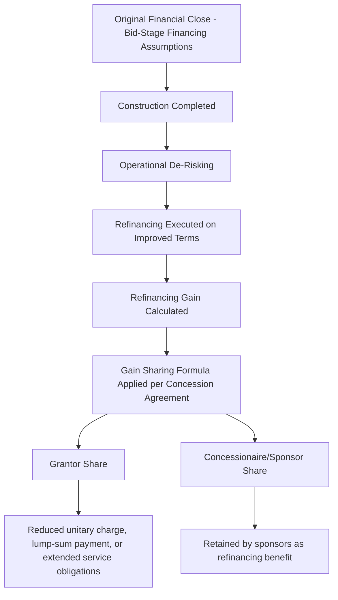
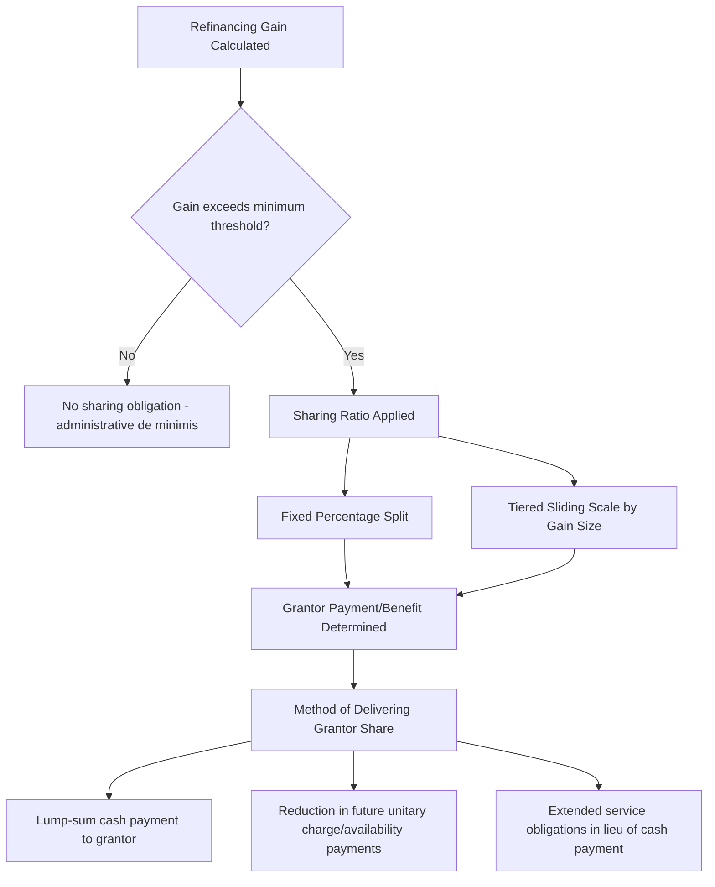
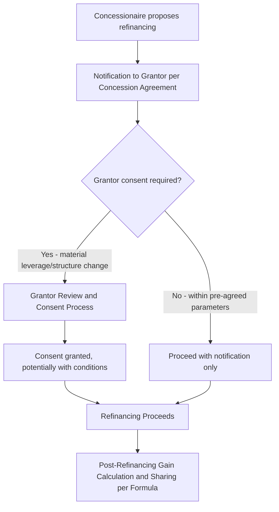

## Refinancing Gain Sharing Mechanisms

### Overview and Purpose

Refinancing gain sharing mechanisms are contractual provisions — most commonly found in **public-private partnership (PPP) and concession agreements**, though analogous concepts appear in some private project financings — that require a project company (concessionaire/SPV) to share a portion of the financial benefit realized from refinancing its debt with the public sector grantor or, in private contexts, with other stakeholders. These mechanisms exist because refinancing gains in a PPP context often arise not purely from sponsor skill or operational outperformance, but partly from the **public authority's own credit support** (through the underlying concession/availability payment structure) having de-risked the project in ways that benefit the private financing markets — creating a policy rationale for the public sector to participate in the resulting financial upside.

### Rationale for Gain Sharing in PPP/Concession Contexts

**Key Points**

- Many PPP/concession structures are procured via competitive tender, with bidders required to submit a **base-case financial model** reflecting financing assumptions (leverage, tenor, pricing) prevailing at the time of bid — often conservative, reflecting construction-phase risk pricing.
- If the concessionaire subsequently refinances on significantly better terms once construction risk has passed, the resulting gain (lower cost of capital, higher achievable leverage) was not necessarily anticipated or priced into the original competitive tender.
- [Inference] Gain sharing provisions are grounded in the policy view that some portion of this refinancing benefit is attributable to the **inherent credit enhancement** the public sector's payment obligations (availability payments, concession revenue guarantees) provide to project lenders — value the public sector arguably helped create and should partially share in, rather than the gain accruing entirely to private equity sponsors.

### Defining and Calculating the "Refinancing Gain"

The core technical challenge in gain sharing mechanisms is establishing an objective, auditable methodology for calculating the gain, since sponsors and grantors have opposing incentives (sponsors seeking to minimize the calculated gain, grantors seeking to maximize it).

**Common approaches to gain calculation:**

$$\text{Refinancing Gain} = \text{Base Equity IRR (Post-Refinancing)} - \text{Base Equity IRR (Pre-Refinancing, per Original Financial Model)}$$

or, alternatively, expressed as a net present value of cash flow differences:

$$\text{Refinancing Gain (NPV basis)} = \text{NPV}(\text{Distributable Cash Flows Post-Refinancing}) - \text{NPV}(\text{Distributable Cash Flows under Original Financing, using consistent discount rate})$$

**Key components typically compared:**

| Component | Pre-Refinancing (Original Model) | Post-Refinancing (New Model) |
| --- | --- | --- |
| Debt margin/pricing | Original financial close terms | New refinancing terms |
| Leverage (gearing) | Original debt-to-equity ratio | New, often higher, debt-to-equity ratio |
| Debt tenor | Original facility maturity/amortization profile | New facility maturity/amortization profile |
| Equity IRR | As calculated in the original base-case model | As recalculated reflecting the new financing structure |

[Unverified — the specific calculation methodology (equity IRR differential vs. NPV of cash flow differences vs. a simpler debt service savings calculation) varies substantially across jurisdictions and individual concession agreements; there is no single universally standardized approach, and the choice of methodology can materially affect the calculated gain amount.]

### Typical Sharing Ratios and Thresholds

**Key Points**

- Sharing ratios are typically negotiated at the outset of the concession (embedded in the original concession agreement) rather than at the time of refinancing itself, removing the incentive for either party to negotiate opportunistically once an actual gain has crystallized.
- Common structures include a **fixed percentage split** (e.g., 50/50 [Unverified — actual ratios vary significantly by jurisdiction and program]), a **tiered/sliding scale** (increasing the grantor's share as the gain increases), or a **threshold-based approach** (no sharing below a minimum gain threshold, to avoid administrative burden for immaterial refinancings).

### Methods of Delivering the Grantor's Share

Once the gain and the grantor's share are calculated, several mechanisms exist for actually transferring that value to the public sector:

1. **Lump-sum cash payment** — the concessionaire pays the grantor's calculated share directly from refinancing proceeds, the most straightforward mechanism from an administrative perspective.
2. **Reduction in future unitary charge/availability payments** — the grantor's share is delivered as a reduced ongoing payment obligation over the remaining concession term, effectively amortizing the benefit rather than delivering it as a single upfront sum; this approach ties the benefit's realization to the grantor's ongoing payment mechanism rather than requiring an immediate cash transfer.
3. **Extended concessionaire obligations** — in some structures, the grantor's share is delivered in kind, such as additional capital investment obligations or extended service standards, rather than a cash or payment-reduction mechanism.
4. **Extension of concession term** (in demand-risk concessions) — less commonly, a refinancing gain-sharing benefit is delivered as an extended concession period rather than a direct payment, though this is more typically associated with separate compensation/rebalancing mechanisms than dedicated refinancing gain-sharing clauses.

[Inference] The choice of delivery method often reflects the grantor's own budgetary and public finance considerations — a lump-sum payment provides immediate fiscal benefit but may be less politically visible than a reduction in ongoing charges (which more directly and visibly benefits the ultimate service users or taxpayers funding the availability payments), influencing which mechanism public authorities prefer to negotiate into standard concession templates.

### Triggering Events Requiring Gain-Sharing Assessment

Gain-sharing provisions typically apply to a defined set of refinancing events, commonly including:

- **Full or partial refinancing** of the original project debt (replacement of existing facilities with new debt).
- **Material amendment** to existing debt terms that has an economically equivalent effect to a refinancing (e.g., a significant margin reduction or leverage increase achieved through an amendment rather than a full facility replacement) — often captured to prevent parties from structuring around the gain-sharing obligation via amendment rather than outright refinancing.
- **Extension of debt maturity** beyond the originally financed term, particularly where this releases additional distributable cash flow to sponsors.
- Some concession agreements also capture gain arising from an **equity sale or corporate restructuring** with analogous economic effect, though this is less commonly bundled into a "refinancing" gain-sharing clause specifically and more often addressed via separate change-of-control provisions.

[Inference] Because sponsors could otherwise achieve similar economic benefits through mechanisms not literally defined as a "refinancing" (e.g., a hedge restructuring, a covenant amendment achieving similar leverage flexibility, or a change of control combined with new financing), well-drafted gain-sharing clauses in mature PPP markets increasingly aim to capture the broader economic substance of a beneficial financing change, rather than being narrowly limited to a literal replacement of the original facility.

### Requirement for Grantor Consent to Refinancing

Separate from the gain-sharing calculation itself, many concession agreements require **grantor consent** (or at least notification and consultation rights) before a concessionaire can execute a refinancing, particularly where:

- The refinancing would materially increase leverage beyond levels contemplated in the original bid.
- The refinancing would alter the security package or direct agreement structure the grantor originally negotiated.
- The refinancing could affect the grantor's own step-in rights or termination compensation calculations (see prior chapter items), since a releveraged capital structure changes the quantum of outstanding debt the grantor might need to cover in a termination-for-convenience or grantor-default scenario.

### Interaction with Termination Compensation

A material consideration in gain-sharing and refinancing consent provisions is the interaction with **termination payment calculations** under the concession agreement. If a refinancing increases outstanding debt (via a leverage-increasing refinancing that releases distribution proceeds to sponsors), and the concession agreement's termination compensation formula is based on outstanding debt (a "debt-based" compensation approach, common in grantor-default or termination-for-convenience scenarios), then a refinancing that increases debt could correspondingly increase the grantor's termination liability exposure — a consideration that heavily influences why many concession agreements require grantor consent to refinancing above defined leverage thresholds, and often calibrate gain-sharing formulas to account for any resulting change in termination exposure.

$$\text{Grantor's Adjusted Termination Exposure} = \text{Pre-Refinancing Termination Liability} + \Delta(\text{Outstanding Debt due to Refinancing}) - \text{Gain-Share Offset (if applicable)}$$

[Unverified — the specific mechanics linking gain-sharing calculations to termination compensation adjustments vary considerably across jurisdictions and individual concession precedents; not all agreements explicitly link these two mechanisms.]

### Modeling Implications

- Sponsors evaluating a prospective refinancing in a gain-share-subject concession must model the **net benefit after gain-sharing**, not merely the gross refinancing benefit, since the calculated grantor share directly reduces the sponsor-retained portion of the refinancing gain.
- The **gain calculation methodology specified in the concession agreement** must be built as a distinct calculation module within the financial model, run in parallel with the sponsor's own refinancing economics assessment, to determine the net proceeds genuinely available for distribution after satisfying the gain-sharing obligation.
- **Timing of gain-sharing payment** (upfront lump sum vs. amortized unitary charge reduction) affects the sponsor's own cash flow and IRR modeling differently — an upfront payment reduces immediate refinancing proceeds, while an amortized reduction in future unitary charges affects the ongoing revenue line over the remaining concession term.

### Common Negotiation Points

- **Calculation methodology precision** — given the potential for disputes over a methodology that is inherently comparative (post-refinancing vs. a hypothetical continuation of original terms), precise, unambiguous drafting of the calculation formula at the outset of the concession is critical to avoid costly disputes at the time of an actual refinancing.
- **Sharing ratio calibration** — balancing the public sector's policy interest in capturing value against maintaining sufficient sponsor incentive to pursue refinancing at all (an overly aggressive grantor share could remove the commercial incentive for sponsors to refinance, paradoxically reducing the public benefit the mechanism is intended to capture).
- **Scope of captured transactions** — as discussed above, negotiating how broadly the gain-sharing trigger is defined to prevent structuring around the obligation via economically equivalent but technically distinct transactions.
- **Threshold for materiality** — setting a de minimis gain threshold below which sharing obligations do not apply, avoiding disproportionate administrative burden for minor financing adjustments.

### Related Topics

- Rationale and Timing for Refinancing
- Availability Payment Regimes in Concession Agreements
- Termination Payment Waterfalls on Offtaker and Concessionaire Default
- Dividend Recapitalization Mechanics and Sponsor Return Optimization
- Common Terms Agreement and Facility Agreements
- Equity IRR Modeling and Sponsor Return Waterfalls
- Public-Private Partnership Procurement and Bid-Stage Financial Modeling