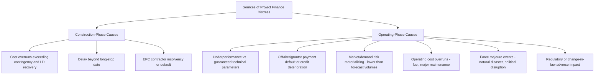
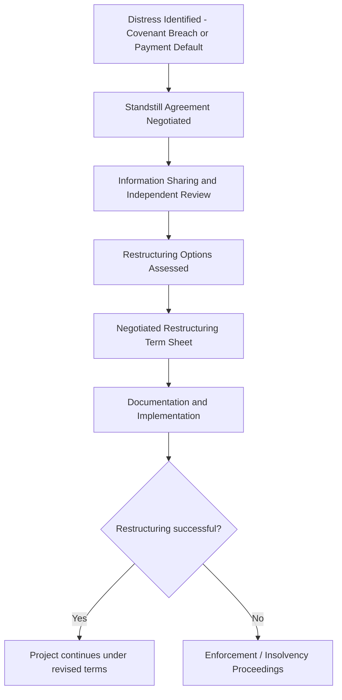
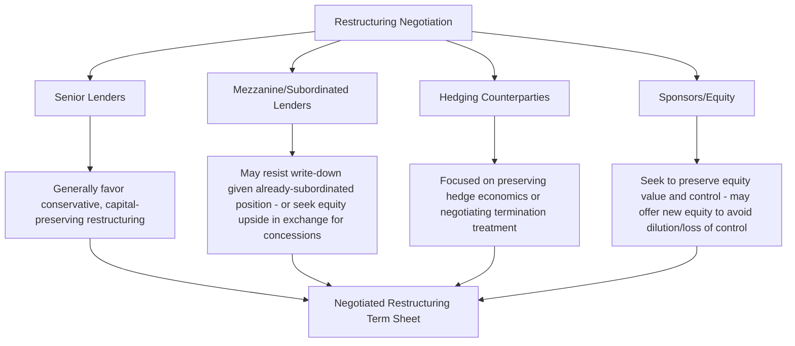

## Debt Restructuring in Distressed Projects

### Overview and Purpose

Debt restructuring in project finance refers to the negotiated modification of a project's debt obligations — pricing, tenor, amortization, covenants, or principal amount — undertaken when a project is unable to service its debt as originally scheduled, or is projected to be unable to do so absent intervention. Unlike corporate restructuring, where a distressed borrower's assets and cash flows are typically fungible across multiple business lines, project finance restructuring occurs within the constrained, single-purpose structure the financing was originally built around: a single asset, a defined contract suite, and a security package specifically designed to keep the project operating rather than to facilitate liquidation. This structural context shapes both the objectives and the mechanics of project finance restructuring, which overwhelmingly favors **consensual, out-of-court workout** over formal insolvency proceedings wherever feasible.

### Why Project Finance Favors Consensual Restructuring Over Insolvency

**Key Points**

- The single-purpose, non-recourse structure means lenders' recovery is entirely dependent on the project continuing to generate cash flow — a formal insolvency/liquidation process that disrupts operations (loss of key personnel, contractor demobilization, offtaker relationship damage) can destroy far more value than it recovers.
- The extensive **direct agreement and step-in rights** infrastructure built into the original financing (see prior chapter items) is specifically designed to enable lenders to intervene and stabilize a distressed project without necessarily triggering formal insolvency or contract termination.
- Formal insolvency proceedings in many jurisdictions can trigger **automatic termination or ipso facto clauses** in project contracts (EPC warranties, O&M agreements, offtake agreements), potentially destroying the very contractual relationships that give the project its value — a risk lenders and sponsors alike generally wish to avoid.

[Inference] Because the entire project finance security and contractual architecture is purpose-built around preserving the project as an operating business through step-in rather than facilitating liquidation, both lenders and sponsors typically share a strong mutual incentive to pursue consensual restructuring — a degree of alignment less commonly present in general corporate distressed situations, where creditors and shareholders often have more starkly opposed interests regarding the merits of continued operation versus liquidation.

### Common Causes of Project Finance Distress

### The Restructuring Process: Key Stages

#### Early Warning and Covenant Monitoring

Distress is typically first identified through the **financial covenant monitoring** framework established under the Common Terms Agreement — a declining DSCR trend, breach of a lock-up test, or drawing on the debt service reserve account (DSRA) are common early indicators that trigger heightened lender engagement before an actual payment default occurs.

#### Standstill Agreements

Upon identifying distress (often before a formal event of default, or immediately following one), lenders and the SPV/sponsors frequently enter into a **standstill agreement** — a temporary arrangement under which lenders agree not to exercise acceleration or enforcement rights for a defined period, allowing time for a restructuring solution to be negotiated without the immediate pressure of enforcement action.

**Typical standstill agreement provisions:**

- Suspension of acceleration and enforcement rights for a defined period (commonly 60-180 days [Unverified — highly transaction-specific], often extendable).
- Continued payment of interest (sometimes at a reduced or deferred rate) during the standstill period.
- Enhanced information rights and reporting obligations, allowing lenders to closely monitor the project during the standstill.
- Fees payable to lenders for agreeing to standstill (a "standstill fee" or "waiver fee"), compensating lenders for the forbearance and the ongoing credit risk exposure.
- Often accompanied by lenders engaging an **independent business/financial reviewer** to assess the project's viability and recommend restructuring options.

#### Independent Review and Viability Assessment

Lenders typically commission an independent technical and financial review to assess:

- **Root cause of the distress** — whether the underlying cause is temporary/curable (e.g., a one-off force majeure event, a short-term commodity price dislocation) or structural/permanent (e.g., a fundamentally flawed demand forecast, an unrecoverable technology performance shortfall).
- **Achievable cash flow going forward** under realistic revised operating assumptions, forming the basis for negotiating a sustainable revised debt service profile.
- **Recovery value in a liquidation/enforcement scenario**, providing lenders a benchmark against which to assess whether a proposed restructuring offers a better outcome than enforcement.

[Inference] The distinction between temporary/curable distress and structural/permanent distress is frequently the single most important determinant of the restructuring strategy pursued: temporary distress often justifies a straightforward payment deferral or covenant waiver, while structural distress typically requires more fundamental restructuring (debt write-down, equity injection, or a change of sponsor/operator) since simply deferring payments would not resolve an underlying cash flow shortfall that is expected to persist.

### Restructuring Tools and Techniques

**Key Points**

- Restructuring tools range from modest, temporary accommodations to fundamental capital structure changes, and are typically applied in combination rather than individually.

| Restructuring Tool | Description | Typical Application |
| --- | --- | --- |
| Covenant waiver/reset | Temporary or permanent adjustment of financial covenant thresholds | Where underlying cash flow is adequate but original covenant levels were too conservative or a temporary dip has occurred |
| Payment deferral/PIK | Deferring cash interest payments, sometimes capitalizing (payment-in-kind) unpaid interest into principal | Short-term liquidity relief without permanently reducing lenders' claim |
| Maturity extension | Extending the final maturity date, often combined with amortization profile re-profiling | Addressing a timing mismatch between cash flow generation and scheduled repayment |
| Amortization re-profiling | Restructuring the repayment schedule (e.g., reducing near-term principal payments, extending the tail) | Aligning debt service with realistically achievable near-term cash flow |
| Interest rate/margin adjustment | Reducing (or, in a "amend and extend" context, sometimes increasing in exchange for other concessions) the applicable margin | Balancing lender compensation for increased risk against the project's ability to pay |
| Debt-for-equity conversion | Converting a portion of debt into equity or equity-like instruments, reducing the cash debt service burden | More severe distress where cash flow cannot support the original debt quantum even after re-profiling |
| Principal write-down (haircut) | Lenders accept a reduction in the face amount of debt owed | Most severe form of restructuring, typically only where recovery analysis confirms this exceeds likely enforcement/liquidation recovery |
| New money/additional facility | Lenders (or new investors) provide additional financing to address a liquidity shortfall or fund necessary capital expenditure | Where additional capital, not merely relief on existing debt, is required to restore viability |
| Sponsor/equity cure | Existing or replacement sponsors inject additional equity to cure a covenant breach or fund a shortfall | Where sponsors have both the capacity and incentive (continued upside participation) to support the project |

$$\text{Post-Restructuring Sustainable Debt Service} = \text{Realistic Achievable CFADS} \times \text{Target Minimum DSCR}^{-1}$$

The restructuring negotiation frequently centers on calibrating the revised debt quantum and terms to this sustainable debt service capacity, ensuring the restructured project is not simply deferring an inevitable second default.

### Role of Direct Agreements and Step-In Rights in Restructuring

As addressed in the risk allocation and financing documentation chapters, **direct agreements** with the EPC contractor, O&M operator, and offtaker/grantor become operationally critical during a restructuring, since:

- Lenders may need to **step in and replace an underperforming operator** as part of the restructuring solution, particularly where operational underperformance (rather than purely financial/market factors) is a root cause of distress.
- Maintaining continuity of the **offtake or concession agreement** throughout the restructuring process is typically essential to preserving project value — lenders and sponsors alike generally prioritize any restructuring path that avoids triggering offtaker/grantor termination rights.
- The **Intercreditor Agreement's** voting and standstill mechanics govern how a restructuring proposal is approved across multiple lender classes (senior, mezzanine, hedging counterparties), often requiring careful negotiation where different creditor classes have different views on the appropriate restructuring path given their different priority positions.

### Sponsor Considerations in Restructuring

[Inference] Sponsors facing a distressed project must weigh several considerations that influence their negotiating posture: whether to inject additional equity to preserve their ownership position and any remaining upside, whether to negotiate a reduced ownership stake in exchange for lender concessions (effectively sharing recovery value with creditors), or, in severe cases, whether to walk away from the investment entirely given the non-recourse nature of the financing (limiting sponsor loss to equity already invested). This last option — sponsors declining to inject further capital and effectively ceding the project to lenders — is a structural feature specific to non-recourse project finance, distinguishing sponsor incentives from those of a corporate borrower whose personal or corporate assets might otherwise be at risk.

### Formal Insolvency as a Fallback

Where consensual restructuring cannot be achieved — due to an unbridgeable gap between achievable cash flow and creditor claims, irreconcilable differences among creditor classes, or sponsor unwillingness to support a workout — formal insolvency proceedings become necessary. [Unverified — the specific insolvency regime (administration, receivership, chapter 11-equivalent reorganization, liquidation) and its interaction with project finance security and step-in rights varies enormously by jurisdiction, and the treatment of ipso facto/automatic termination clauses in project contracts upon insolvency filing differs materially across legal systems.] Lenders' security package (particularly the share pledge, enabling a change of control without necessarily triggering contract termination) and the direct agreements previously negotiated are generally the primary tools used to attempt to preserve project value even within a formal insolvency framework, to the extent the relevant jurisdiction's insolvency law permits.

### Modeling Restructuring Scenarios

- Restructuring negotiations are typically supported by a **revised financial model** reflecting realistic, often conservative, going-forward operating assumptions (rather than the original, now-invalidated base case), used to test the sustainability of any proposed revised debt service profile.
- **Multiple restructuring scenarios** (varying combinations of maturity extension, margin adjustment, and principal treatment) are typically modeled and compared on a recovery/NPV basis for each creditor class, informing negotiation positions.
- **Sensitivity analysis on the revised base case** remains essential even post-restructuring, since a restructuring calibrated too optimistically to a revised base case risks a repeat default if the revised assumptions themselves prove overly aggressive.

$$\text{Lender Recovery Comparison: } \text{NPV(Restructured Debt Service)} \text{ vs. } \text{NPV(Enforcement/Liquidation Recovery)}$$

Lenders generally proceed with a consensual restructuring only where the analysis suggests it offers superior expected recovery (on a risk-adjusted, present-value basis) compared to enforcement, though qualitative factors (reputational considerations, relationship value, avoidance of value-destructive insolvency proceedings) also influence the decision.

### Common Negotiation Points

- **Allocation of restructuring costs** — advisory, legal, and independent reviewer fees incurred during the restructuring process are frequently a point of negotiation regarding which party (or the project itself) bears the cost.
- **New money priority** — where additional financing is required, negotiating whether new money ranks ahead of existing senior debt (a "priming" structure) is often contentious, since existing senior lenders may resist subordinating their claims even to facilitate a viability-restoring capital injection.
- **Equity dilution and control** — the terms on which sponsors retain or cede control and economic interest in exchange for lender concessions is frequently the most commercially sensitive element of a restructuring negotiation.
- **Covenant and reporting enhancements post-restructuring** — lenders typically require materially enhanced monitoring, reporting, and covenant packages going forward as a condition of agreeing to restructuring relief, reflecting the reduced trust following the original default.

### Related Topics

- Rationale and Timing for Refinancing
- Step-In Rights and Direct Agreements
- Intercreditor Agreements and Creditor Hierarchy
- Events of Default and Cross-Default Provisions in Multi-Tranche Financings
- Security Package and Collateral Structures
- Termination Payment Waterfalls on Offtaker and Concessionaire Default
- Financial Covenants: DSCR, LLCR, and PLCR Calculation Methodologies