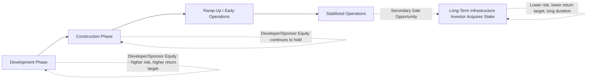
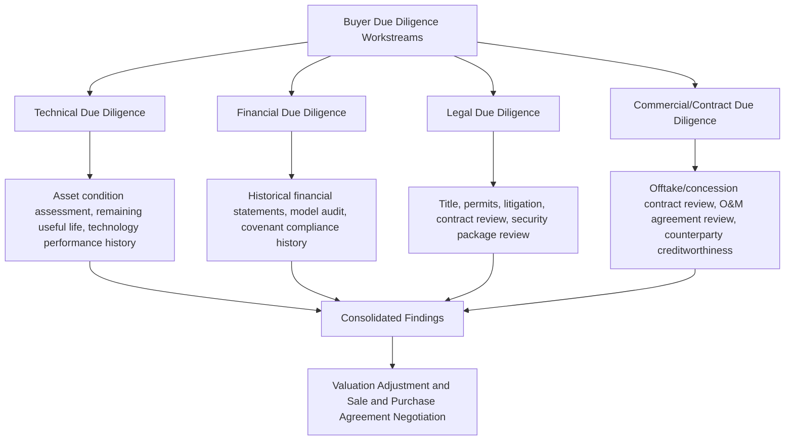
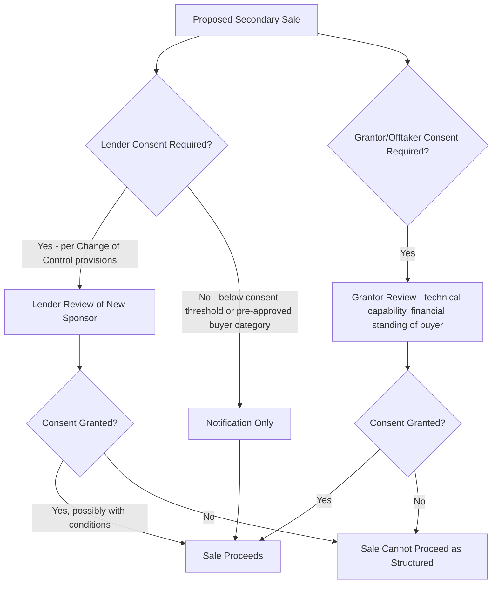

## Secondary Market Sale of Project Equity

### Overview and Purpose

Secondary market sale of project equity refers to the transfer of an existing sponsor's ownership stake in an operating (or, less commonly, under-construction) project company to a new investor, after the project has reached financial close and, typically, after some or all of the construction/development risk has been resolved. This is distinct from the original primary investment made by sponsors at financial close: the secondary sale is an **exit or portfolio-rotation transaction**, allowing original developers, construction-risk investors, or financial sponsors to monetize their investment and redeploy capital, while allowing a new class of investor — often with a different risk appetite, cost of capital, or investment horizon — to acquire a de-risked, cash-generative infrastructure asset.

Secondary market activity has grown into a substantial, distinct segment of infrastructure and project finance markets, reflecting a broader industry pattern in which different investor types specialize in different phases of a project's lifecycle: developers and construction-risk specialists build and stabilize assets, while long-term infrastructure funds, pension funds, insurance companies, and sovereign wealth funds acquire stabilized, operating assets for their predictable, often inflation-linked cash flows.

### The Investor Lifecycle Rationale

**Key Points**

- Different investor classes have structurally different risk tolerances, return requirements, and capital duration profiles, creating a natural specialization across the project lifecycle.
- **Developers/sponsors** typically seek higher returns commensurate with development, construction, and early operational risk, and often have a business model built around recycling capital (selling stabilized assets) to fund new development activity.
- **Long-term infrastructure investors** (pension funds, insurance companies, infrastructure funds, sovereign wealth funds) typically seek lower, more stable, long-duration returns matched to their own long-dated liabilities, making a de-risked operating asset — offering predictable cash flow rather than development upside — a better portfolio fit.

### Timing Considerations for a Secondary Sale

[Inference] The optimal timing for a secondary sale generally reflects a trade-off between maximizing the value uplift from de-risking (waiting until construction and initial ramp-up risk have been resolved, since buyers will pay a premium for demonstrated operating performance) and the seller's own capital recycling needs or return-crystallization objectives (an earlier sale, while still commanding some construction-risk discount, may better suit a developer's business model of continuously rotating capital into new projects rather than holding long-dated operating stakes). Common triggering points include:

- **Post-completion/COD** — once construction risk has been eliminated and initial performance testing confirms the asset meets guaranteed technical parameters.
- **Post-ramp-up** — after a demonstrated operating track record (commonly 1-3 years [Unverified — the required track record varies by technology, buyer sophistication, and market conditions]) has resolved residual technology and performance uncertainty.
- **Concurrent with or shortly after refinancing** — a project refinanced onto favorable operating-phase debt terms (as discussed in the prior chapter item) often presents an attractive secondary sale opportunity, since the refinancing itself provides an independent, market-validated confirmation of the project's de-risked credit profile.

### Transaction Structures for Secondary Equity Sales

| Structure | Description |
| --- | --- |
| Full stake sale (100%) | Seller exits entirely; buyer acquires full ownership and control |
| Partial stake sale | Seller retains a minority (or, less commonly, majority) interest, often to retain some ongoing development/development-fee relationship or continued upside participation |
| Portfolio sale | Multiple project equity stakes sold together as a package, common where a developer is exiting several assets simultaneously to a single buyer or consortium |
| Platform/holdco sale | Sale of the corporate entity holding multiple project interests, rather than individual project-level stakes, common in developer exits involving diversified renewable or infrastructure portfolios |

### Key Valuation Methodologies

**Key Points**

- Secondary market valuations for operating project equity are predominantly **discounted cash flow (DCF)**-based, reflecting the predictable, contracted nature of operating project cash flows.
- **Equity IRR / required return benchmarking** against comparable transactions and the buyer's own cost of capital is central to determining the appropriate discount rate applied to projected distributable cash flows.

$$\text{Equity Value} = \sum_{t=1}^{n} \frac{\text{Distributable Cash Flow}_t}{(1 + r)^t}$$

where $r$ is the buyer's required equity discount rate, reflecting the specific risk profile of the asset (technology, offtaker/grantor credit, remaining contract/concession term, jurisdiction) and $n$ is the remaining project or contract life.

**Key valuation drivers:**

- **Remaining contract/concession term** relative to the buyer's investment horizon — a shorter remaining PPA or concession term relative to the buyer's target holding period introduces re-contracting or merchant exposure risk that affects valuation.
- **Actual operating performance track record** versus the original base case — outperformance (higher-than-projected availability, lower-than-budgeted O&M costs) typically supports a valuation premium, while underperformance has the opposite effect.
- **Remaining useful life of key equipment** relative to the contract/concession term, and the adequacy of major maintenance/lifecycle reserve provisioning.
- **Offtaker/grantor credit quality**, particularly significant for availability-based or PPA-backed assets where the entire valuation rests on that counterparty's payment reliability.
- **Prevailing infrastructure market discount rates** — secondary infrastructure asset pricing is influenced by broader capital market conditions (interest rate environment, competing asset class yields, investor demand for the specific sector/geography).

### The Due Diligence Process for Secondary Buyers

Secondary buyer due diligence, while covering similar categories to original project finance due diligence, places particular emphasis on **actual historical performance** (rather than projected performance), since a track record exists that original financial-close diligence could not access. This includes detailed review of:

- Historical DSCR and covenant compliance under the existing (or, if applicable, refinanced) debt facility.
- Actual vs. budgeted O&M costs and any major unplanned maintenance events.
- Any history of EPC warranty claims, O&M performance disputes, or offtaker/grantor payment issues.
- Condition of the security package and continued validity/enforceability of direct agreements, which the buyer will typically need transferred or re-executed in its favor.

### Consent Rights and Change of Control Provisions

**Key Points**

- Project finance loan agreements almost universally include **change of control provisions** restricting the transfer of SPV equity without lender consent, since lenders' original credit assessment was partly based on sponsor identity, experience, and (in some structures) sponsor support undertakings.
- Project contracts (particularly offtake/concession agreements with government counterparties) frequently include similar **change of control consent requirements**, reflecting the grantor's interest in the identity and competence of the party operating critical infrastructure.

[Inference] Lenders' assessment of a proposed change of control typically focuses on whether the incoming investor has adequate financial capacity and, where relevant, operational/technical competence (directly or through a retained/replacement operator) to sustain the project's performance — considerations distinct from, but analogous to, the original sponsor due diligence conducted at financial close. Government grantors reviewing a change of control in a concession context often apply similar, sometimes more stringent, scrutiny given public interest considerations in the continuity of critical service delivery.

### Structuring the Transaction: Direct Agreements and Novation

A secondary equity sale, being a sale of shares in the SPV rather than a sale of the underlying assets or contracts, does **not** typically require novation of the underlying project contracts (EPC warranties, O&M agreement, offtake/concession agreement) themselves, since the SPV — the contracting party — remains the same legal entity; only its ownership changes. However:

- **Direct agreements** referencing specific sponsor entities (e.g., sponsor support/equity commitment undertakings tied to the outgoing sponsor) typically require amendment, replacement, or release, since the outgoing sponsor's specific undertakings do not automatically transfer to the incoming buyer.
- **Sponsor guarantees or completion support** (if still outstanding, e.g., a cost overrun guarantee not yet fully discharged) must be addressed — either replaced by equivalent support from the incoming buyer or formally released if no longer required (e.g., following full construction completion).
- **Warranties and indemnities in the sale and purchase agreement (SPA)** between outgoing and incoming sponsors typically allocate risk for pre-closing liabilities, disputed claims, and any undisclosed defects or contract breaches, functioning analogously to a corporate M&A transaction despite the underlying project finance context.

### Modeling the Secondary Sale Transaction

- The buyer's acquisition model typically **rebuilds the base case** using updated, actual operating assumptions rather than relying solely on the original financial model, incorporating real historical performance data as a superior forecasting basis compared to the original, pre-operational projections.
- **Post-acquisition refinancing potential** is frequently assessed as part of the buyer's investment case — a buyer may plan to refinance existing project debt shortly after acquisition if further margin compression or leverage optimization is achievable, layering a refinancing strategy on top of the equity acquisition itself.
- **Equity IRR sensitivity to entry price** is a central component of buyer investment committee analysis, testing the resilience of the target return across a range of realistic operating and refinancing scenario assumptions.

$$\text{Buyer's Target Equity IRR} = f(\text{Entry Price}, \text{Projected Distributable Cash Flows}, \text{Exit Assumption (if applicable)})$$

### Common Negotiation Points

- **Locked-box vs. completion accounts pricing mechanisms** — as in general M&A practice, negotiating whether the purchase price is fixed as of a pre-agreed reference date (locked-box) or adjusted based on completion-date financial position (completion accounts).
- **Allocation of pre-closing liability risk** — particularly for warranty/indemnity claims relating to EPC defects, environmental liabilities, or contractual disputes arising from the period before the buyer's ownership.
- **Retained development/asset management relationships** — where the seller is a developer, negotiating whether the seller retains an ongoing asset management or development services role (and associated fee income) post-sale, common where developers seek to maintain some involvement and fee revenue even after monetizing their equity position.
- **Timing and conditionality of lender/grantor consents** — structuring the transaction timeline and conditions precedent to sale completion around the third-party consent processes described above, which can be lengthy and are frequently the critical path item determining the overall transaction timetable.

### Related Topics

- Rationale and Timing for Refinancing
- Direct Agreements With Project Counterparties
- Security Package and Collateral Structures
- Equity IRR Modeling and Sponsor Return Waterfalls
- Infrastructure Fund Investment Strategies and Portfolio Construction
- Change of Control Provisions in Project Finance Loan Agreements
- Public-Private Partnership Procurement and Bid-Stage Financial Modeling