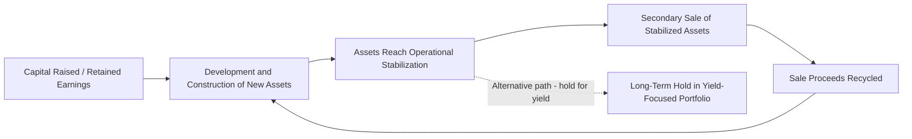
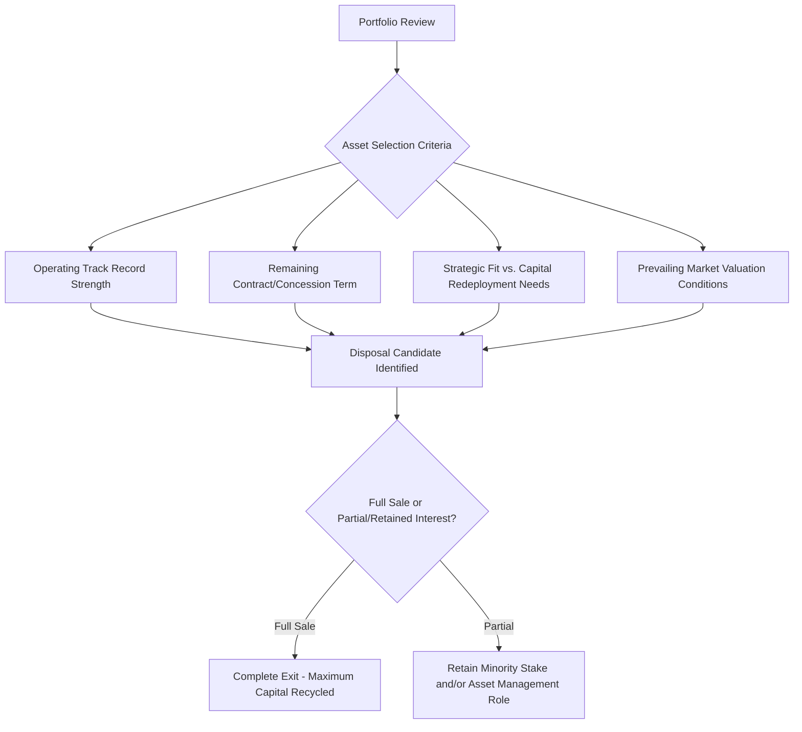
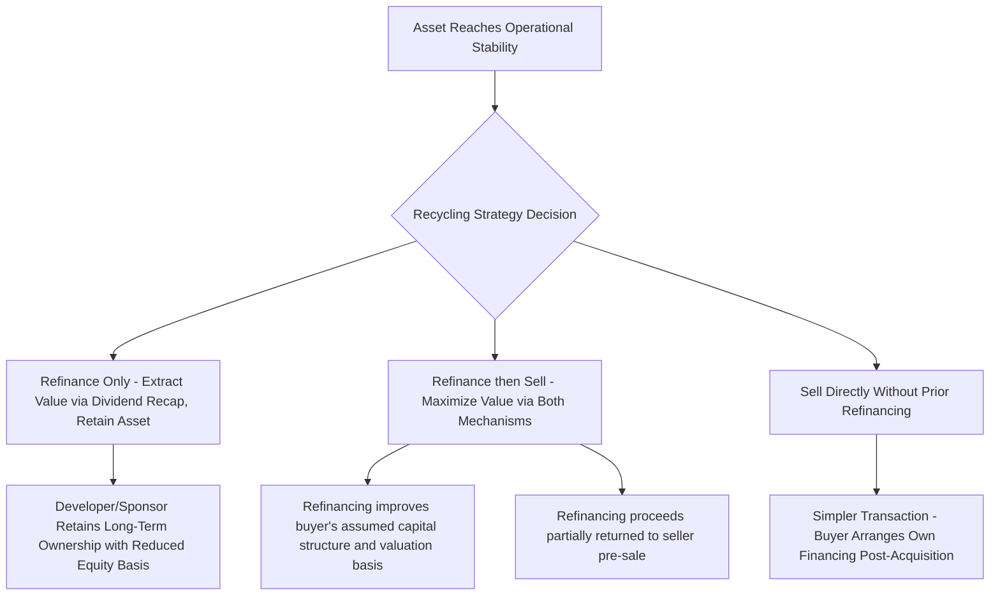

## Portfolio Recycling and Asset Rotation Strategies

### Overview and Purpose

Portfolio recycling (also called capital recycling or asset rotation) refers to the systematic strategy pursued by developers, financial sponsors, and infrastructure investors of periodically **selling stabilized, de-risked assets** from their portfolio and redeploying the proceeds into new development, construction-phase, or higher-return opportunities. Where the secondary market sale discussed in the prior item addresses a single transaction, portfolio recycling addresses the **programmatic, repeated application** of this strategy as a core element of an investor's business model — a structural capital allocation discipline rather than an opportunistic one-off exit.

This strategy is particularly prevalent among project developers (whose business model is often built around origination and construction expertise rather than long-term asset ownership) and among certain fund structures with defined investment periods and return-of-capital obligations to their own investors, but it also increasingly features in the strategies of diversified infrastructure asset managers seeking to optimize portfolio-level risk-adjusted returns.

### The Capital Recycling Rationale

**Key Points**

- **Capital efficiency** — a developer's return on equity is often maximized by recycling capital through multiple development cycles rather than holding a single asset for its full life, since development-phase returns (compensating for higher risk) are typically higher than the returns available from simply holding a stabilized asset.
- **Risk concentration management** — periodic disposal prevents a portfolio from becoming overly concentrated in aging assets, a single technology, or a single geography/regulatory regime, supporting diversification objectives.
- **Fund structure requirements** — closed-end infrastructure and private equity-style funds have defined investment and harvesting periods, structurally requiring asset disposals within a specified timeframe to return capital to limited partners (LPs) per the fund's governing documents.
- **Balance sheet and leverage optimization** — recycling proceeds can be used to reduce corporate-level leverage, fund new equity commitments without requiring additional capital raises, or support dividend distributions to the developer's own shareholders.

### The Developer Business Model and Recycling

[Inference] Many renewable energy and infrastructure developers structure their entire business model around a repeated origination-to-exit cycle: securing land rights, permits, and offtake agreements (development-stage value creation), executing construction (often via a fixed-price EPC contract, transferring construction risk as discussed in the risk allocation chapter), stabilizing operations through an initial performance period, and then selling the operating asset to a long-term infrastructure investor — using the proceeds (which typically embed a significant margin over the developer's all-in development and construction cost) to fund the next development cycle. This model allows developers with limited permanent capital to originate and construct a volume of projects far exceeding what their balance sheet alone could support if they held every asset to the end of its useful life.

$$\text{Developer Margin per Cycle} = \text{Secondary Sale Value} - \text{Development and Construction Cost} - \text{Cost of Capital During Hold Period}$$

### Portfolio-Level Strategic Considerations

**Key Points**

- Recycling decisions are typically made at the **portfolio level**, considering which specific assets to sell based on relative valuation attractiveness, strategic fit, and capital needs elsewhere in the portfolio — not simply selling the oldest or most mature asset by default.
- A **portfolio approach** to recycling can also involve bundling multiple assets into a single transaction (a portfolio sale), which can be more efficient for both seller and buyer than executing multiple individual asset sales, particularly where a buyer values acquiring immediate scale or diversification.

| Strategic Consideration | Description |
| --- | --- |
| Asset selection for disposal | Prioritizing assets with strong operating track records that command premium valuations, or conversely, weaker-performing assets a developer wishes to exit before further value erosion |
| Timing relative to market cycles | Executing sales during periods of strong buyer demand and favorable financing conditions (as discussed in refinancing timing) to maximize sale proceeds |
| Retained interest strategies | Selling a majority stake while retaining a minority interest and/or an asset management contract, preserving some ongoing economic participation and fee income |
| Geographic and technology diversification of remaining portfolio | Ensuring disposals do not inadvertently concentrate the remaining portfolio in a single risk category |
| Buyer relationship management | Cultivating repeat buyer relationships (e.g., with specific infrastructure funds or pension funds) can streamline future transaction execution and potentially command premium "trusted counterparty" pricing |

### Recycling Within Fund Structures

**Key Points**

- Closed-end infrastructure funds typically have a defined **investment period** (during which capital is deployed into new assets) followed by a **harvesting/realization period** (during which assets are sold and proceeds returned to LPs), creating a structural timeline driving recycling activity independent of any individual asset's specific optimal exit timing.
- Some fund structures include **recycling provisions** allowing the fund manager to reinvest early-realized proceeds into new investments during the investment period (rather than immediately distributing them to LPs), effectively extending the fund's deployable capital beyond its nominal committed capital amount — a mechanism distinct from, but related to, the broader portfolio recycling concept.

[Unverified — the specific terms governing recycling provisions (permitted recycling period, caps on recycled amounts as a percentage of committed capital, treatment of recycled gains vs. return of capital) vary significantly across individual fund limited partnership agreements and are heavily negotiated between fund sponsors and LPs during fundraising.]

### Interaction with Refinancing Strategy

Portfolio recycling and refinancing (discussed in the prior chapter item) are frequently used in combination rather than as alternative strategies:

[Inference] A common sequencing observed in practice is for a seller to refinance a project onto favorable operating-phase debt terms shortly before marketing it for sale, since a well-structured, recently refinanced capital structure can both reduce the seller's outstanding equity basis (via dividend recapitalization proceeds extracted during refinancing) and present a more attractive, de-risked financing profile to prospective buyers — effectively using refinancing as a value-optimization step within the broader recycling strategy, rather than treating the two transactions as independent decisions.

### Portfolio Construction Considerations for the Acquiring Investor

From the perspective of a long-term infrastructure investor systematically acquiring recycled assets (the buy-side counterpart to developer recycling), portfolio-level considerations include:

- **Vintage diversification** — acquiring assets at different points in their operating life to avoid concentration risk around a single refinancing or re-contracting date across the portfolio.
- **Technology and geography diversification** — balancing exposure across renewable technologies, jurisdictions, and regulatory regimes to manage correlated risk factors (e.g., a single country's policy change affecting all assets in that jurisdiction simultaneously).
- **Counterparty concentration** — monitoring aggregate exposure to a single offtaker or grantor across multiple acquired assets, which can create concentrated credit risk even across an otherwise diversified physical asset portfolio.
- **Duration matching** — aligning the weighted-average remaining contract/concession term of the acquired portfolio with the investor's own liability duration profile (particularly relevant for insurance companies and pension funds with long-dated liabilities to match).

### Modeling Portfolio-Level Recycling Economics

- Developers modeling their recycling strategy typically build a **portfolio-level cash flow model** tracking the origination, construction funding, stabilization, and projected exit timing/value of each asset in the pipeline, rather than modeling assets purely in isolation, since the timing of exits directly determines available capital for new development.
- **Blended return metrics** across a recycling program (e.g., a portfolio-level or program-level IRR incorporating multiple sequential development-to-exit cycles) are often used by developers to assess overall business model performance, distinct from the asset-level equity IRR calculated for any single project's financing.
- **Reinvestment rate assumptions** — the assumed return achievable on recycled capital when redeployed into new development is a critical, often heavily scrutinized assumption in developer business plans and fund-level return projections, since the overall attractiveness of a recycling strategy depends on the availability of sufficiently attractive new investment opportunities to redeploy proceeds into.

$$\text{Program-Level Return} = f\left(\sum_{i=1}^{n} \text{IRR}_i \text{ of each development-to-exit cycle}, \text{Reinvestment Timing and Rate}\right)$$

### Common Risks and Constraints

- **Market absorption capacity** — the secondary market's capacity to absorb asset disposals at attractive pricing is not unlimited; a developer or fund attempting to sell multiple assets simultaneously, or during a period of reduced buyer demand, may face pricing pressure or extended sale timelines.
- **Consent and process friction** — as discussed in the secondary sale item, lender and grantor/offtaker consent requirements for each individual disposal can create execution risk and timing delays that complicate a programmatic recycling strategy reliant on predictable transaction timelines.
- **Reinvestment risk** — a recycling strategy's success depends on the continued availability of attractive new development or acquisition opportunities; a shortage of suitable reinvestment opportunities can leave recycled capital under-deployed, diluting overall program returns.
- **Regulatory and tax considerations** — repeated asset disposals may carry different tax treatment (capital gains characterization, transfer taxes) depending on jurisdiction and holding structure, requiring careful structuring to preserve the strategy's overall economic efficiency across multiple transactions.

### Related Topics

- Secondary Market Sale of Project Equity
- Rationale and Timing for Refinancing
- Dividend Recapitalization Mechanics and Sponsor Return Optimization
- Infrastructure Fund Investment Strategies and Portfolio Construction
- Equity IRR Modeling and Sponsor Return Waterfalls
- Change of Control Provisions in Project Finance Loan Agreements
- Public-Private Partnership Procurement and Bid-Stage Financial Modeling