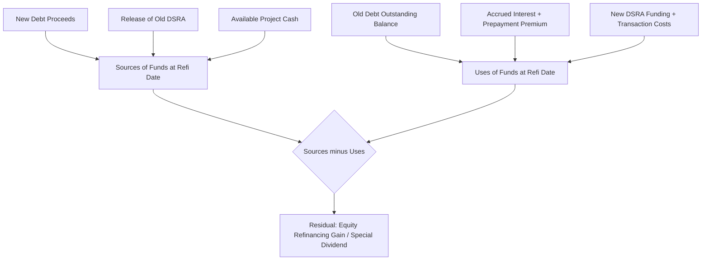

## Modeling Refinancing Scenarios

### Overview and Rationale

Refinancing in project finance refers to replacing an existing debt facility with new financing on different terms, executed after the project has reached commercial operation and de-risked relative to the construction and ramp-up phases. Sponsors pursue refinancing because a completed, cash-flowing asset with an operating track record justifies a lower risk premium than construction-phase debt. Modeling this event requires representing the existing facility's remaining obligations, the new facility's terms, the transaction costs of switching, and the redistribution of value between lenders and sponsors that results.

The core modeling task is to insert a discrete event into the cash flow timeline at the refinancing date, extinguish the old debt schedule from that point forward, originate a new debt schedule, and reconcile the cash flow available at that date across three claimants: repayment of old debt principal and breakage costs, funding of new debt-related reserve accounts, and any residual distributed to sponsors as a special dividend (the "refinancing gain" or "equity release").

**Key Points**

- Refinancing is modeled as a balance-sheet event at a single point in time (the refinancing date), not a change to the underlying operating cash flow assumptions
- The operating cash flow forecast (revenue, opex, taxes) is typically unaffected by refinancing; only the financing section of the model changes
- The primary output of interest to sponsors is the refinancing gain — cash released to equity that was previously trapped to service the old debt
- Lenders typically require the project to have met specific conditions (minimum operating history, DSCR track record) before refinancing conditions precedent are satisfied

### When Refinancing Occurs

Refinancing is typically triggered by one or a combination of:

1. **Construction-to-term conversion**: A mandatory event built into the original financing, where a bridge or construction loan converts to a long-term amortizing facility once commercial operation date (COD) is achieved and specific technical/commercial tests are passed
2. **Opportunistic market-driven refinancing**: Sponsors elect to refinance because interest rates have fallen, credit spreads have tightened, or the project's credit profile has improved (typically after a period of operating history, often 1-3 years post-COD)
3. **Structural refinancing**: A change in the capital structure itself, e.g., moving from a bank loan to a project bond, or from amortizing debt to a mini-perm structure
4. **Sponsor-driven dividend recapitalization**: Refinancing undertaken primarily to extract equity value by increasing leverage against a de-risked, cash-generative asset, rather than to reduce financing cost

Each motivation implies different modeling treatment, particularly around whether the new debt quantum is sized to replace the old balance one-for-one or is sized independently against the post-refinancing cash flow profile.

### Modeling the Refinancing Event: Structural Approach

**Step 1: Establish the Refinancing Date and Trigger Logic**

The model needs an explicit switch — either a hardcoded date or a formula-driven trigger — that identifies the period in which refinancing occurs. Formula-driven triggers commonly reference:

- A minimum number of periods elapsed since COD
- A minimum trailing DSCR over a specified look-back window
- Satisfaction of a target leverage ratio (Net Debt / EBITDA) threshold

A clean implementation uses a Boolean flag column, e.g. `RefinancingFlagPeriod`, computed once and referenced throughout the debt schedule rather than re-evaluated in every downstream formula.

**Step 2: Calculate the Old Facility's Termination Position**

At the refinancing date, calculate:

- Outstanding principal balance on the old facility immediately prior to refinancing, $B_{old}$
- Accrued but unpaid interest to the refinancing date
- Prepayment premium or breakage cost, if the old facility carries a fixed rate or make-whole provision
- Release or sweep of any reserve accounts tied exclusively to the old facility (e.g., a debt service reserve account, or DSRA, sized to the old facility's debt service profile)

The prepayment premium for a fixed-rate facility is often modeled using a make-whole formula:

$$P_{makewhole} = \max\left(0, \; PV(\text{remaining scheduled payments}, r_{discount}) - B_{old}\right)$$

where $r_{discount}$ is typically a reference rate (e.g., a government bond yield) plus a specified spread, and is lower than the facility's coupon — meaning the make-whole premium compensates the lender for lost interest income at the margin between the loan rate and the reinvestment rate.

**Step 3: Size and Originate the New Facility**

New debt sizing follows one of two logics:

- **Refinancing to a target credit metric**: size new debt to the maximum level supportable by projected post-refinancing cash flows subject to a minimum DSCR covenant (commonly the same annuity/sculpting logic used in initial financial close sizing, but applied to the remaining project life and updated cash flow forecast)
- **Refinancing to replace the old balance**: new debt quantum equals $B_{old}$ plus transaction costs, with the primary objective being rate/tenor improvement rather than leverage increase

The sizing calculation for a DSCR-constrained sculpted facility uses the same annuity/PV logic as construction-phase sizing:

$$D_{new} = \sum_{t=1}^{T} \frac{CFADS_t / DSCR_{target}}{(1+r)^t}$$

where $CFADS_t$ is cash flow available for debt service in period $t$ over the remaining new facility tenor $T$, and $r$ is the new facility's interest rate.

**Step 4: Reconcile Sources and Uses at the Refinancing Date**

A sources-and-uses table for the refinancing date itemizes:

**Sources**

- New debt proceeds
- Release of old DSRA (if not required to fund the new one)
- Cash on balance sheet available for the transaction

**Uses**

- Repayment of old debt principal
- Accrued interest on old debt
- Prepayment premium / make-whole
- New facility arrangement fees, legal fees, and other transaction costs
- Funding of new DSRA or other new reserve requirements
- Residual = distribution to equity (the refinancing gain)

This table must balance to zero; the residual line is what flows to the equity cash flow schedule as a special, non-recurring dividend distinct from ongoing distributions.

### Illustrative Mermaid Diagram: Refinancing Event Cash Flow

### Restating the Debt Schedule Post-Refinancing

After the refinancing date, the model must switch the active debt schedule reference from the old facility to the new one for all downstream calculations: interest expense, principal amortization, DSCR, LLCR, and covenant testing. A common implementation pattern uses a single "active debt service" row computed as:

$$DS_t^{active} = \begin{cases} DS_t^{old} & t < t_{refi} \\ DS_t^{new} & t \geq t_{refi} \end{cases}$$

This can be built with an `IF` or index-based lookup keyed to the refinancing flag, ensuring covenant ratios, cash waterfall priorities, and equity distribution calculations automatically reference the correct facility without requiring separate downstream schedules for each phase.

**Common Modeling Pitfall**: Failing to re-tier the cash flow waterfall after refinancing. If the new facility has different reserve requirements, cash sweep mechanics, or lock-up covenant thresholds than the old one, the waterfall priority of payments logic must be updated at the refinancing date, not just the debt balance and rate. Models that hardcode waterfall tiers to a single facility's terms will silently misstate post-refinancing distributions.

### Impact on Credit Metrics

Refinancing typically changes the profile of key metrics materially:

- **DSCR**: A common objective is to *lower* minimum DSCR post-refinancing (since the asset is now more proven), which permits either lower distributions-coverage buffers or higher leverage
- **Loan Life Coverage Ratio (LLCR)**: Recalculated over the new facility's remaining tenor using the formula

$$LLCR = \frac{\sum_{t=1}^{T_{new}} \frac{CFADS_t}{(1+r_{new})^t} + Reserves_{t_{refi}}}{D_{new}}$$

- **Leverage (Net Debt / EBITDA or Net Debt / RAB for regulated assets)**: Often increases in a dividend recapitalization scenario even though DSCR may stay within covenant, because sculpted sizing against a lower discount rate or longer effective tenor supports a larger absolute debt quantum against the same cash flow stream

[Inference] The degree to which leverage can increase without violating rating agency thresholds depends heavily on sector-specific benchmarks (e.g., merchant power vs. contracted PPA-backed assets carry very different acceptable leverage at a given rating), so any generalized leverage target should be treated as illustrative rather than prescriptive.

### Refinancing Gain Distribution Mechanics

The equity refinancing gain is not ordinary distributable cash flow and is usually modeled and reported as a separate line item because:

1. It affects the equity IRR calculation materially and asymmetrically — cash received early in the sponsor's holding period has outsized effect on IRR due to time-value compounding
2. Tax treatment may differ from operating distributions (in some jurisdictions, refinancing proceeds are treated as return of capital rather than taxable income, deferring tax rather than eliminating it)
3. Lenders on the *new* facility may impose lock-up conditions specifically on this one-time distribution (e.g., requiring a minimum post-refinancing DSCR track record of one or two periods before the special dividend can be released, even if it is otherwise available at close)

**Example**

Assume a solar project refinances three years post-COD:

- Old facility outstanding balance: $180,000,000
- Old DSRA balance (released): $12,000,000
- Accrued interest and prepayment premium: $4,500,000
- New facility sized to 1.30x minimum DSCR over 18-year remaining tenor: $225,000,000
- New facility transaction costs and new DSRA funding: $9,000,000

$$\text{Refinancing Gain} = (225{,}000{,}000 + 12{,}000{,}000) - (180{,}000{,}000 + 4{,}500{,}000 + 9{,}000{,}000) = 43{,}500{,}000$$

This $43,500,000 flows to equity holders as a special distribution at the refinancing date, subject to any lender lock-up conditions on the new facility.

### Equity IRR Impact and Sensitivity

Refinancing gains are one of the most IRR-sensitive line items in a project finance model because they typically occur in years 2-5 of a 20-25 year project life, when the time-value discounting effect is strongest. Sponsors and their modeling teams frequently run sensitivities on:

- Refinancing date (earlier is generally IRR-accretive, subject to lender minimum track record requirements)
- Discount/reference rate assumption for the new facility at the assumed future refinancing date (an interest rate forecast risk, often stress-tested with rate shock scenarios of +/- 100-200 bps)
- Target DSCR covenant on the new facility (looser covenants increase debt capacity and thus the gain, but increase leverage risk)

[Unverified] Whether a given lender group will permit refinancing-driven dividend recapitalization at all, and under what conditions, is a matter of specific facility documentation (often addressed in "Permitted Refinancing" or "Additional Indebtedness" covenants) and cannot be generalized across transactions without reviewing the actual credit agreement.

### Illustrative SVG: Refinancing Timeline and Cash Flow Impact (svg_diagram)

<svg xmlns="http://www.w3.org/2000/svg" viewBox="0 0 800 320">
\<style\>
.lbl { font-family: sans-serif; font-size: 13px; fill: #222; }
.small { font-family: sans-serif; font-size: 11px; fill: #555; }
.title { font-family: sans-serif; font-size: 14px; font-weight: bold; fill: #111; }
\</style\>
<text x="400" y="24" text-anchor="middle" class="title">Refinancing Timeline and Cash Flow Impact (svg_diagram)</text>
<line x1="60" y1="160" x2="740" y2="160" stroke="#333" stroke-width="2" />
<polygon points="740,160 728,154 728,166" fill="#333" />
<circle cx="120" cy="160" r="5" fill="#1f77b4" />
<text x="120" y="185" text-anchor="middle" class="lbl">COD</text>
<circle cx="420" cy="160" r="7" fill="#d62728" />
<text x="420" y="145" text-anchor="middle" class="lbl">Refinancing Date</text>
<text x="420" y="185" text-anchor="middle" class="small">Old debt repaid</text>
<text x="420" y="200" text-anchor="middle" class="small">New debt originated</text>
<circle cx="700" cy="160" r="5" fill="#1f77b4" />
<text x="700" y="185" text-anchor="middle" class="lbl">End of Concession</text>
<rect x="120" y="220" width="300" height="40" fill="#f2c7c3" stroke="#d62728" />
<text x="270" y="244" text-anchor="middle" class="small">Old Facility Debt Service (higher DS coverage buffer)</text>
<rect x="420" y="220" width="280" height="40" fill="#c7e0f2" stroke="#1f77b4" />
<text x="560" y="244" text-anchor="middle" class="small">New Facility Debt Service (optimized post-COD terms)</text>
<line x1="420" y1="110" x2="420" y2="160" stroke="#d62728" stroke-dasharray="4,3" />
<rect x="330" y="70" width="180" height="34" fill="#fff3cd" stroke="#b8860b" />
<text x="420" y="92" text-anchor="middle" class="small">Refinancing Gain to Equity</text>
</svg>

### Sensitivity and Scenario Testing Checklist

**Next Steps**

- Model timing risk: what happens to equity returns if refinancing conditions precedent are delayed by one or more periods
- Model interest rate risk: sensitize the new facility's assumed rate at the future refinancing date against forward curve and stressed scenarios
- Model a "no refinancing" downside case as a baseline comparison to isolate the refinancing gain's contribution to overall equity IRR
- Build in lender consent and minimum track record conditions as explicit gating logic rather than assuming refinancing occurs mechanically once economically optimal
- Cross-check post-refinancing leverage against sector rating agency benchmarks if the project or its debt is rated
- Extend the model to handle partial refinancing (refinancing only a tranche of the capital structure, e.g., replacing a mezzanine tranche while leaving senior debt untouched)
- Explore related chapter topics: Dividend Recapitalization Structures, Sponsor Exit via Secondary Sale, Debt Restructuring Under Distress, Make-Whole and Prepayment Premium Mechanics, Mini-Perm to Term-Loan-B Conversions