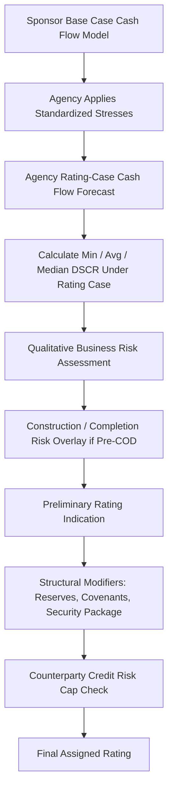

## Rating Agency Methodologies for Project Finance

### Overview

Rating agency methodologies for project finance provide a standardized analytical framework for assessing the credit risk of a special-purpose vehicle (SPV) financing a single asset or a narrow portfolio of related assets, distinguishing this analysis from corporate credit ratings. The three major agencies — S&P Global Ratings, Moody's Investors Service, and Fitch Ratings — each publish dedicated project finance criteria, and while their frameworks differ in structure and terminology, they converge on assessing the same underlying risk drivers: the reliability and predictability of project cash flow, the strength of contractual and structural protections, and the resilience of the capital structure to stress.

**Key Points**

- Project finance ratings are asset-based and structurally reliant on non-recourse or limited-recourse debt, meaning the rating reflects the SPV's own cash-generating capacity rather than a parent's balance sheet
- All three major agencies use a combination of qualitative business risk assessment and quantitative financial metric stress-testing (principally DSCR-based) to derive a rating
- Methodologies differentiate project phase risk explicitly: construction/greenfield risk is assessed and weighted differently from operational/brownfield risk
- Structural protections — cash flow waterfalls, reserve accounts, restricted payment tests, and covenant packages — are treated as ratings-relevant mitigants, not merely administrative details

### Why Project Finance Ratings Differ from Corporate Ratings

Corporate ratings assess an operating company with diversified revenue sources, ongoing access to capital markets, and management discretion over capital allocation across multiple assets and business lines. Project finance ratings instead assess:

- A single-purpose entity with one dominant cash flow source (or a narrow, related set)
- Debt that is explicitly structured to be serviced from that specific cash flow, often with contractual and structural insulation from sponsor credit risk (ring-fencing)
- A finite asset life or concession/contract term, meaning the rating horizon is often mapped to the full debt tenor rather than an indefinite going-concern assumption
- Contractual frameworks (offtake agreements, concession agreements, PPAs) that substitute for the diversification and market position considerations used in corporate analysis

This structural difference is why project finance methodologies emphasize contract counterparty credit quality, construction completion risk, and DSCR distribution stress-testing far more heavily than typical corporate criteria.

### S&P Global Ratings Methodology: Structural Overview

S&P's project finance framework (published under its "Project Finance Framework" and asset-specific criteria such as power, transportation infrastructure, and PPP/social infrastructure) generally proceeds through the following analytical stages:

1. **Operations Phase SACP (Stand-Alone Credit Profile) Assessment**
   - Assesses the project once in operation, independent of the sponsor
   - Built from a combination of:
     - **Market Assessment**: exposure to competitive, merchant, or regulated revenue frameworks
     - **Competitive Position**: cost position, asset quality, and operating track record
     - **Operations Phase Business Assessment Profile (ranges from category 1, strongest, to category 12, weakest)**
2. **Preliminary SACP**: derived by mapping the Business Assessment category against a minimum DSCR level under S&P's own cash flow stress scenarios, using a matrix table published in the criteria
3. **Modifiers**: the preliminary SACP is adjusted for factors including:
   - Debt structure and covenant package strength
   - Liquidity (reserve account sizing relative to peak debt service)
   - Counterparty credit risk of key contract partners (offtaker, EPC contractor, O&M provider)
   - Structural protections (cash flow waterfall seniority, restricted payment conditions)
4. **Construction Phase Overlay**: if the project has not yet reached commercial operation, S&P applies a separate construction risk assessment that can cap the rating below the operations-phase SACP until completion risk is resolved, reflecting the elevated risk of cost overrun, delay, and technology/completion risk during build

**Example**

A toll road project with a 1.45x minimum DSCR under S&P's downside traffic stress scenario, an availability-based (non-merchant) revenue structure, and a strong six-month debt service reserve might map to a Business Assessment category in the stronger range (e.g., category 3-4), potentially supporting a preliminary SACP in the 'BBB' category before modifiers are applied for counterparty risk and structural features.

### Moody's Methodology: Structural Overview

Moody's project finance methodology, most prominently articulated in its "Generic Project Finance Methodology" and sector-specific supplements (power generation, availability-based infrastructure, etc.), uses a scorecard approach with weighted factors:

1. **Construction Risk** (applicable pre-completion): technology risk, completion guarantee strength, EPC contractor experience and financial strength, permitting status
2. **Operating Risk**: asset track record, operating history, technology risk in operations, O&M contract strength
3. **Revenue Risk**:
   - Contracted/availability-based cash flow (lower risk weighting) versus merchant/market-based revenue (higher risk weighting)
   - Offtaker/counterparty credit quality, often capping the project rating near the offtaker's own rating in single-offtaker structures
   - Price and volume risk allocation between project and counterparties
4. **Debt Structure and Financial Metrics**:
   - Minimum, average, and median DSCR under Moody's own cash flow projections
   - Debt structure features: fixed vs. floating rate exposure, refinancing risk (bullet maturities/mini-perm structures score less favorably than fully amortizing structures), and covenant strength
5. **Legal and Structural Protections**: security package, step-in rights, restricted payment conditions, reserve account requirements

Moody's scorecard produces a weighted composite score that maps to an indicative rating range, which is then subject to analytical judgment and adjustment (Moody's methodologies explicitly note the scorecard is indicative, not mechanically determinative).

[Inference] The degree of analytical override applied to a scorecard-indicated outcome varies by transaction complexity and is generally larger for structures with atypical features (e.g., novel technology, unusual contractual risk allocation) than for well-precedented structures like conventional gas-fired power PPAs, though the exact override magnitude in any specific case would require reviewing the published rating action rationale.

### Fitch Ratings Methodology: Structural Overview

Fitch's project finance criteria similarly separates:

1. **Completion Risk** (construction phase): technology, contractor, and completion support assessment
2. **Operation Risk**: performance track record, asset condition, O&M arrangements
3. **Revenue Risk — Price**: exposure to price risk (contracted/fixed vs. merchant/market)
4. **Revenue Risk — Volume**: exposure to volume/demand risk (take-or-pay/availability-based vs. volume-at-risk)
5. **Debt Structure**: amortization profile, security package, hedging arrangements, refinancing risk

Fitch places particular emphasis on the **Price and Volume Risk** decomposition — separating the two dimensions of revenue risk explicitly rather than treating "revenue risk" as a single factor — which allows differentiated treatment of, for example, a merchant power project with volume certainty (must-run baseload) but price risk (spot market exposure), versus a toll road with price certainty (regulated tariff) but volume risk (traffic demand uncertainty).

Fitch also publishes explicit **DSCR threshold matrices** by sector and risk category, mapping minimum, average, and rating-case DSCR levels to indicative rating outcomes, broadly analogous to S&P's Business Assessment/DSCR matrix but organized around Fitch's five-factor framework.

### Comparative Table: Core Methodology Elements Across Agencies

| Element | S&P | Moody's | Fitch |
| --- | --- | --- | --- |
| Core Framework | SACP + Modifiers | Weighted Scorecard | Five-Factor Framework |
| Construction Risk Treatment | Separate overlay/cap | Explicit scorecard factor | Explicit "Completion Risk" factor |
| Revenue Risk Decomposition | Market Assessment (combined) | Revenue Risk (combined) | Split: Price Risk / Volume Risk |
| Primary Quantitative Metric | Minimum DSCR under stress case | Min/Avg/Median DSCR | Min/Avg/Rating-Case DSCR |
| Counterparty Risk Cap | Yes, via modifiers | Yes, often near-linked to offtaker rating | Yes, incorporated into revenue risk factors |
| Refinancing Risk | Assessed under debt structure modifiers | Explicit debt structure factor | Explicit debt structure factor |

### DSCR as the Central Quantitative Anchor

Across all three methodologies, minimum projected DSCR under the agency's own stress-adjusted cash flow forecast (rather than the sponsor's base case) is the dominant quantitative input. Agencies typically construct their own "rating case" cash flow forecast by applying standardized haircuts and stresses to the sponsor's base case, such as:

- Reduced volume/demand assumptions (e.g., lower traffic growth, lower merchant power capture prices)
- Increased operating cost assumptions
- Higher assumed maintenance capital expenditure, particularly around major overhaul/refurbishment cycles
- Interest rate stress on any floating-rate debt component

The general form of the DSCR calculation used across all frameworks is:

$$DSCR_t = \frac{CFADS_t}{DS_t} = \frac{\text{Cash Flow Available for Debt Service}_t}{\text{Principal}_t + \text{Interest}_t}$$

Agencies then examine the full distribution of $DSCR_t$ over the debt tenor under their rating case, focusing on:

$$DSCR_{min} = \min_{t=1}^{T} DSCR_t$$

as the primary binding constraint, since a single period of covenant breach or payment default risk drives structural credit events regardless of strong average coverage in other periods.

### Illustrative Mermaid Diagram: Generalized Rating Derivation Process

### Sector-Specific Methodology Supplements

Beyond the generic frameworks, each agency publishes sector supplements that adjust weightings and stress assumptions for asset classes with distinct risk profiles:

- **Power generation** (thermal, renewable): emphasis on technology risk, fuel supply/price risk (for thermal), resource risk (wind/solar variability), and offtake structure (PPA vs. merchant)
- **Availability-based public infrastructure (PPP/P3)**: emphasis on availability payment mechanism robustness, deduction/penalty regime analysis, and public-sector counterparty credit quality
- **Transportation (toll roads, ports, airports)**: emphasis on demand elasticity, competing infrastructure risk, and macroeconomic sensitivity of volume
- **Midstream and pipeline infrastructure**: emphasis on contract structure (take-or-pay vs. throughput), counterparty concentration, and commodity price pass-through mechanisms

[Unverified] The precise current weightings and stress magnitudes within each sector supplement are periodically revised by each agency; practitioners should consult the currently published criteria document for the specific asset class and jurisdiction in question rather than relying on generalized descriptions, since agencies update criteria periodically and prior versions are superseded.

### Rating Stability Mechanisms: Outlooks, Watches, and Reviews

All three agencies layer forward-looking rating stability indicators onto the base rating:

- **Outlook** (Positive/Stable/Negative): a 12-24 month directional view not implying an imminent rating action
- **Watch/Review status**: signals a more immediate potential rating action, often triggered by a specific pending event (refinancing, offtaker credit deterioration, major operational disruption, regulatory change)

Project finance ratings are particularly sensitive to discrete trigger events — a single major counterparty default, a natural catastrophe affecting the asset, or a regulatory change to the revenue framework — given the concentration risk inherent in single-asset financing, which is why agencies often move project finance ratings more abruptly around discrete events than would be typical for diversified corporate issuers.

### Practical Implications for Financial Modeling

Building a project finance model with rating agency review in mind typically requires:

- Constructing the cash flow forecast with sufficient granularity (monthly or quarterly, then annualized for covenant testing) to allow rating-case stress overlays to be applied cleanly
- Building explicit sensitivity toggles for the standardized stresses each agency is known to apply (volume haircuts, opex escalation, interest rate stress) so the model can replicate an agency's likely rating-case output
- Presenting DSCR as a full time-series (not just an average), since minimum DSCR in the worst single period is the binding metric across all three methodologies
- Documenting the counterparty credit quality of all key contracts (offtaker, EPC contractor, O&M provider, hedge counterparties) as explicit model inputs, since counterparty risk caps can override otherwise-strong project economics

**Next Steps**

- Explore Sector-Specific DSCR Stress Testing (Power, Transportation, PPP/P3, Midstream)
- Explore Counterparty Credit Risk Caps and Linkage Methodology
- Explore Construction/Completion Risk Assessment Frameworks
- Explore Rating Agency Cash Flow Stress Assumptions and Haircut Construction
- Explore Project Bonds vs. Bank Debt: Rating Implications of Capital Markets Structures
- Explore Surveillance and Rating Migration Patterns in Operating Project Finance Portfolios