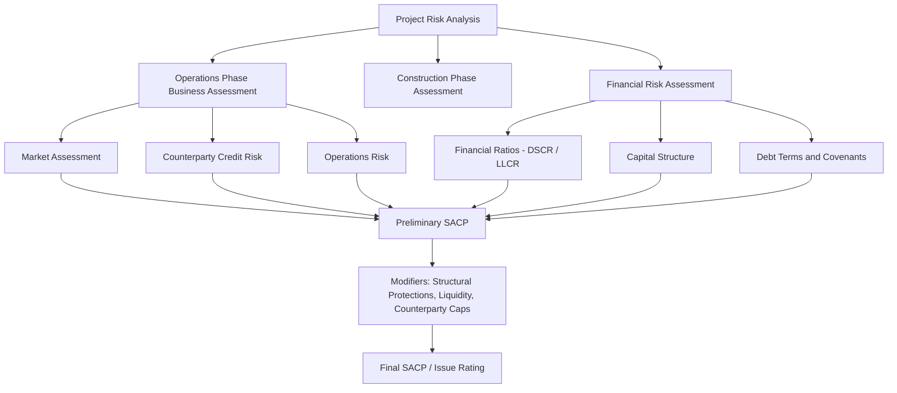
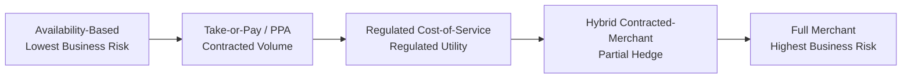
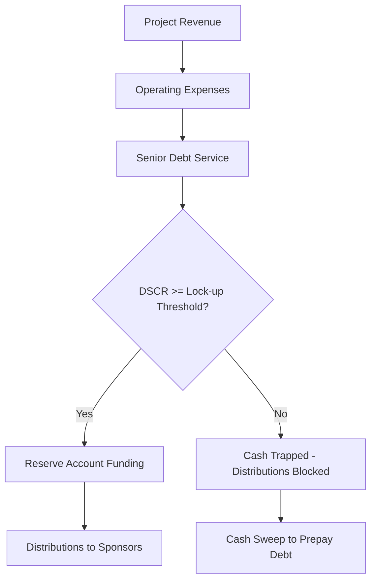

## Project Business Risk and Financial Risk Frameworks

### Overview

Project Business Risk and Financial Risk Frameworks form the analytical backbone that credit rating agencies, lenders, and equity sponsors use to assess whether a project finance transaction can service its debt obligations across economic cycles, construction phases, and operating life. Unlike corporate credit analysis, which evaluates a diversified, going-concern enterprise, project finance risk frameworks evaluate a single-purpose, finite-life asset with contractually defined cash flows, making the separation between **business risk** (the quality and predictability of the underlying cash-generating activity) and **financial risk** (the capital structure and its ability to absorb business risk volatility) the central organizing principle of the analysis.

### Conceptual Distinction: Business Risk vs. Financial Risk

**Business Risk**

Business risk refers to the inherent volatility and predictability of a project's operating cash flows, independent of how the project is financed. It answers the question: *how stable and certain is the revenue and cost structure of this asset?*

Key drivers of business risk include:

- Revenue contract structure (availability-based, volume-based/merchant, or hybrid)
- Counterparty credit quality (offtaker, government, utility)
- Operating complexity and technology risk
- Market structure (regulated monopoly vs. competitive merchant market)
- Resource risk (fuel supply, renewable resource variability, traffic/demand)
- Regulatory and political environment

**Financial Risk**

Financial risk refers to the capital structure choices layered on top of the business risk profile — leverage, debt tenor, amortization structure, hedging, and liquidity reserves. It answers the question: *given the underlying business risk, how much debt can this cash flow stream support, and how resilient is the structure to downside scenarios?*

Key drivers of financial risk include:

- Leverage (Debt/EBITDA, Debt/Capitalization)
- Debt Service Coverage Ratio (DSCR) profile and minimums
- Debt tenor relative to asset/contract life (tail risk)
- Interest rate and currency hedging
- Reserve accounts (DSRA, MRA)
- Refinancing risk (mini-perm structures, bullet maturities)

**Key Points**

- Business risk is assessed largely independent of financing; financial risk analysis begins only after business risk has been characterized, because the same capital structure is "safe" for a low-risk toll road and "aggressive" for a merchant power plant.
- Rating agencies (S&P, Moody's, Fitch) typically use a matrix approach: business risk assessment determines the *maximum* leverage/rating achievable, and financial risk metrics then determine *where within that band* the project sits.

### The S&P Project Finance Framework (Illustrative Structure)

Standard & Poor's project finance criteria is one of the most widely referenced frameworks and structures the analysis into two anchor categories that combine into a preliminary Stand-Alone Credit Profile (SACP) before overlays.

**1. Business Risk Assessment Components**

*Market Assessment* categorizes the project along a competitive spectrum:

- **Monopolistic market position**: regulated utility, availability-based PPP with government offtaker
- **Competitive market position**: merchant power, commodity-linked assets

*Operations Phase Risk* evaluates:

- Technology track record (proven vs. first-of-a-kind)
- Operator experience and O&M contract strength
- Resource risk (wind/solar variability, reserve life for extractive assets)
- Supply risk (fuel, feedstock availability and price pass-through)

*Counterparty Risk* evaluates the credit quality of offtakers, suppliers, and the EPC contractor, since project cash flows are frequently only as strong as the weakest critical counterparty — this is formalized in some frameworks as a rating cap tied to the offtaker's own credit rating.

**2. Financial Risk Assessment Components**

Financial risk assessment in the S&P framework centers on forward-looking, scenario-based minimum and average **DSCR** under a base case and a downside case, benchmarked against thresholds that vary by business risk category. A project with a stronger business risk profile (e.g., contracted, availability-based) can sustain a lower minimum DSCR at a given rating level than a merchant project.

### Moody's Framework: Generic Project Finance Methodology

Moody's structures its approach around four broad factors, each with sub-factors and a weighting scheme (illustrative weights shown; actual published weights should be verified against the current methodology document):

| Factor | Sub-Factors | Illustrative Weight |
| --- | --- | --- |
| Construction Risk | Complexity, completion guarantees, contractor experience | ~0–20% (phase-dependent) |
| Operating Risk | Operating history, O&M contract, technology risk | ~15–25% |
| Revenue/Market Risk | Contract structure, offtaker credit, market exposure | ~25–35% |
| Financial Strength | DSCR (min/avg), leverage, liquidity, refinancing risk | ~25–35% |

[Inference] Exact weightings, scorecards, and notching factors differ by asset class (power, PPP/availability, transportation, natural resources) and are periodically revised; a practitioner should confirm against the current published methodology for the specific sector before applying numeric weights in a live analysis.

### Detailed Business Risk Sub-Frameworks

**Revenue Contract Spectrum**

- **Availability-based** (e.g., toll-free PPP roads, social infrastructure, some transmission lines): revenue depends on the asset being available for use/service, not on actual usage — insulates the project from demand risk almost entirely.
- **Take-or-pay / PPA**: offtaker commits to purchase a fixed volume/capacity regardless of actual dispatch, shifting volume risk to the counterparty; project retains counterparty credit risk.
- **Regulated cost-of-service**: regulator sets tariffs to allow full cost recovery plus an approved return; business risk shifts to regulatory/political risk.
- **Merchant**: revenue is fully exposed to market price and volume fluctuations — the highest business risk category and typically supports materially lower leverage.

**Construction Phase Risk**

Construction risk is analyzed as a distinct sub-framework because it front-loads execution risk before any revenue is generated:

- Contract type: fixed-price, date-certain EPC (wrap) vs. cost-plus or multi-contract structures
- Completion guarantees and liquidated damages (LDs) for delay and performance shortfalls
- Contractor/sponsor financial strength and track record with the specific technology
- Permitting and interconnection risk
- Completion tests (mechanical completion, performance/reliability testing, final acceptance)

**Key Points**

- Construction risk typically dominates the risk profile before Commercial Operation Date (COD); post-COD, operating and market risk take over.
- Many rating frameworks apply a *notch-down* during construction relative to the anticipated operating-phase rating, reflecting binary completion risk.

### Financial Risk Metrics in Depth

**Debt Service Coverage Ratio (DSCR)**

$$DSCR_t = \frac{CFADS_t}{Debt\ Service_t}$$

Where $CFADS$ (Cash Flow Available for Debt Service) is typically:

$$CFADS_t = EBITDA_t - Taxes_t - \Delta WC_t - Maintenance\ Capex_t$$

- **Minimum DSCR**: the lowest projected DSCR across the debt tenor — this is the single most-cited metric in project finance credit analysis, since a single low-coverage period can trigger default even if average coverage is strong.
- **Average DSCR**: mean coverage across the debt life; used to assess overall cushion.
- Lenders frequently size debt using a **target minimum DSCR** (e.g., 1.30x for contracted power, 1.40–1.50x+ for merchant or resource-risk assets) applied against a P50/P90 production or demand case.

**Loan Life Coverage Ratio (LLCR)**

$$LLCR = \frac{NPV(CFADS_{t \to maturity}) + DSRA\ Balance}{Outstanding\ Debt}$$

LLCR discounts all future CFADS through loan maturity at the cost of debt and compares it to the outstanding balance — it captures structural cushion across the *remaining life* of the loan rather than a single period, making it useful for identifying "cliff" risk near maturity that a period-by-period DSCR might mask.

**Project Life Coverage Ratio (PLCR)**

$$PLCR = \frac{NPV(CFADS_{t \to end\ of\ project\ life}) + DSRA\ Balance}{Outstanding\ Debt}$$

PLCR extends the discounting horizon to the end of the underlying asset/contract/concession life (rather than just loan maturity), which is particularly relevant when debt tenor is shorter than the concession or resource life — it quantifies the cash flow "tail" available to refinance or absorb stress beyond original loan maturity.

**Leverage and Gearing**

$$Debt/Capitalization = \frac{Total\ Debt}{Total\ Debt + Equity}$$

Typical gearing ranges (highly sector- and risk-dependent, and subject to prevailing market conditions):

- Availability-based PPPs: 85–90% debt
- Contracted power (PPA-backed): 70–85% debt
- Merchant/commodity-exposed assets: 50–65% debt

[Inference] These ranges reflect commonly observed market practice rather than a fixed rule; actual achievable gearing in any transaction depends on prevailing credit market conditions, sponsor negotiating leverage, and lender risk appetite at the time of financial close.

### Combining Business and Financial Risk: The Rating Matrix Approach

Rating agencies commonly present the interaction between business risk and financial risk as a matrix, where a stronger business risk profile permits weaker financial metrics (higher leverage, lower DSCR) at the same rating level, and vice versa.

**Example** (illustrative, not a specific agency's published matrix):

| Business Risk Profile | Min DSCR for 'A' category | Min DSCR for 'BBB' category | Min DSCR for 'BB' category |
| --- | --- | --- | --- |
| Excellent (availability-based, strong sovereign offtaker) | ≥1.40x | ≥1.20x | ≥1.10x |
| Strong (contracted, investment-grade offtaker) | ≥1.60x | ≥1.35x | ≥1.20x |
| Adequate (hybrid/partial merchant) | ≥2.00x | ≥1.65x | ≥1.40x |
| Weak (full merchant, resource risk) | Not typically achievable | ≥2.50x+ | ≥1.75x |

[Speculation] The specific numeric thresholds above are constructed for illustrative purposes to demonstrate the *relationship* between business risk category and required coverage; a practitioner must substitute the actual published thresholds from the specific rating agency methodology and sector being applied.

### Structural Mitigants Bridging Business and Financial Risk

Because financial risk metrics alone can understate resilience, frameworks incorporate structural protections as modifiers:

- **Debt Service Reserve Account (DSRA)**: typically 6–12 months of forward debt service, funded at or shortly after financial close.
- **Maintenance Reserve Account (MRA)**: funds major overhaul/replacement capex, particularly relevant for rotating equipment (turbines, rolling stock).
- **Cash flow waterfall and lock-up covenants**: restrict distributions if DSCR falls below a lock-up threshold, trapping cash to protect lenders.
- **Cash sweep mechanisms**: mandatory prepayment from excess cash flow, accelerating deleveraging and reducing refinancing/tail risk.
- **Hedging requirements**: mandatory interest rate and FX hedging for a minimum percentage of debt, reducing financial risk introduced by market variables unrelated to the underlying business.

### Refinancing and Tail Risk

A financial risk dimension unique to project finance is **tail risk** — the cushion between final debt maturity and the end of the contracted/concession/asset life. Frameworks explicitly assess:

- **Mini-perm structures**: debt refinanced well before the underlying contract/concession expires, introducing refinancing risk that is analyzed as a distinct financial risk factor (interest rate risk, market access risk, and covenant/structure risk at refinancing date).
- **Fully-amortizing structures**: debt matches or is shorter than contract life, minimizing refinancing risk but requiring more conservative sizing.

**Key Points**

- Longer tail (contract life minus debt tenor) is viewed favorably as it provides refinancing flexibility and downside absorption capacity.
- Rating agencies often penalize mini-perm structures with shorter tails via lower achievable ratings or explicit refinancing risk overlays.

### Sensitivity and Scenario Analysis in Financial Risk Frameworks

Robust financial risk assessment requires stress-testing CFADS and DSCR under multiple scenarios:

- **P50/P90/P99 resource cases** (renewables): probabilistic energy yield assumptions at varying confidence levels
- **Downside operating case**: reduced availability, higher O&M costs, extended outages
- **Interest rate stress**: upward rate shocks on unhedged tranches
- **Inflation/FX stress**: cost inflation outpacing revenue escalation, or currency mismatch between revenue and debt service

**Example**

For a solar PV project, a P90 energy yield (90% probability of exceedance) is typically used for base-case lender sizing rather than P50 (average expectation), building in a conservative buffer that directly feeds into the minimum DSCR calculation and, consequently, the achievable leverage.

### Summary Comparison: Business Risk vs. Financial Risk Framework Elements

| Dimension | Business Risk | Financial Risk |
| --- | --- | --- |
| Focus | Cash flow quality/predictability | Capital structure resilience |
| Key Metrics | Contract type, counterparty rating, market structure | DSCR, LLCR, PLCR, leverage |
| Time Horizon | Asset/contract life | Debt tenor + tail |
| Mitigants | Contracts, hedges, insurance | Reserves, covenants, cash sweeps |
| Rating Impact | Sets the risk category / ceiling | Determines position within category |

**Conclusion**

Project Business Risk and Financial Risk Frameworks operate as complementary but distinct analytical lenses: business risk establishes *how predictable* a project's cash flows are, while financial risk determines *how much leverage and what structural protections* that predictability can support. Rating agencies formalize this relationship through matrices that trade off business risk quality against required coverage thresholds, while lenders operationalize it through DSCR/LLCR/PLCR sizing, reserve accounts, and cash flow waterfalls. A sound credit or financing analysis always begins with a rigorous business risk categorization before financial ratios are interpreted, since identical DSCR or leverage figures carry materially different credit implications depending on the underlying business risk profile.

**Related Topics**

- Rating Agency Methodologies for Project Finance (S&P, Moody's, Fitch) — Detailed Criteria
- DSCR, LLCR, and PLCR: Construction and Application in Debt Sizing
- Construction Risk Allocation and EPC Contract Structures
- Merchant Risk vs. Contracted Revenue Structures in Power Projects
- Debt Service Reserve Accounts and Cash Flow Waterfall Mechanics
- Mini-Perm Financing and Refinancing Risk Management
- Sponsor Support Structures and Completion Guarantees
- Sovereign and Sub-Sovereign Risk in Emerging Market Project Finance