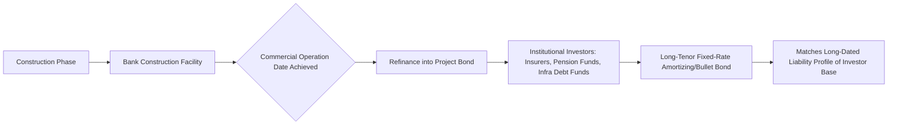

## Project Bonds and Institutional Investor Financing

### Overview and Market Context

Project bonds represent debt instruments issued by a project SPV directly into capital markets, typically purchased by institutional investors such as insurance companies, pension funds, sovereign wealth funds, and specialized infrastructure debt funds, rather than syndicated among commercial banks. This financing route has grown substantially since the 2008-2009 financial crisis, as Basel III capital adequacy requirements made long-tenor project lending less capital-efficient for commercial banks, creating a structural gap that institutional investors — who typically seek long-duration, stable-yield assets to match long-dated liabilities (pension obligations, insurance reserves) — are well suited to fill.

**Key Points**

- Project bonds are typically distinguished from bank debt by longer tenor (often 20-30+ years matching the underlying asset/concession life), fixed-rate coupons, and a bullet or sculpted amortization profile rather than the shorter-tenor, floating-rate, fully-amortizing structure typical of bank loans
- Institutional investors generally cannot participate in construction-phase risk to the same degree as banks, since bond investors typically lack the workout/restructuring infrastructure and risk appetite for hands-on construction monitoring, making brownfield/operating assets or wrapped/guaranteed structures the more common bond financing candidates
- The rise of project bonds has been driven by a combination of bank balance sheet constraints (Basel III), institutional investor demand for long-duration yield, and specific regulatory reforms (e.g., Solvency II treatment of infrastructure debt in the EU) that reduced capital charges for qualifying infrastructure investments

### Structural Differences: Bank Debt vs. Project Bonds

| Feature | Bank Debt | Project Bonds |
| --- | --- | --- |
| Typical Tenor | 5-10 years (mini-perm) or full tenor with refinancing risk | 20-30+ years, often matching asset life |
| Rate Structure | Floating (with or without hedge) | Fixed-rate coupon |
| Amortization | Fully amortizing, sculpted to DSCR | Bullet, sculpted, or amortizing (varies by structure) |
| Construction Risk Appetite | High — banks routinely finance greenfield projects | Low — bonds typically target completed/operating assets or require credit enhancement |
| Covenant Monitoring | Active, relationship-based, ongoing waiver/amendment capacity | Passive, bondholder committee/trustee-based, less flexible amendment process |
| Investor Base | Commercial banks, syndicate | Insurance companies, pension funds, infrastructure debt funds |
| Typical Use Case | Construction financing, shorter-dated operating debt | Refinancing of completed assets, greenfield with wrap/guarantee |

### The Construction Risk Problem and Structural Solutions

Because institutional bond investors are generally less equipped to manage construction-phase risk (delay, cost overrun, technology completion risk) than banks with dedicated project finance teams, several structures have emerged to bridge greenfield projects to the bond market:

1. **Bank-bond hybrid ("bank/bond" or "two-tranche") structures**: banks provide a shorter-tenor construction facility, which is then refinanced into the bond market once commercial operation is achieved — effectively combining the constructional flexibility of bank debt with the long-tenor, fixed-rate efficiency of bonds at the point the project is de-risked
2. **Monoline/credit wrap structures**: a monoline insurer or multilateral development bank guarantees timely payment of principal and interest, allowing the wrapped bond to carry the guarantor's rating rather than the project's own stand-alone rating (this model was more prevalent before the 2008 crisis significantly reduced monoline insurer capacity, though multilateral/DFI-backed credit enhancement remains active in emerging markets)
3. **Multilateral Development Bank (MDB) partial credit guarantees**: institutions such as the World Bank, IFC, or regional development banks provide partial guarantees covering specific risk periods (often construction and early operations) or specific tranches, improving the bond's credit profile enough for institutional investors during the highest-risk phase
4. **Private placement bonds with step-in rights**: structured similarly to bank loans but placed with a small club of institutional investors (rather than broadly syndicated), retaining some of the active covenant monitoring and amendment flexibility of bank debt while achieving longer tenor and fixed-rate pricing

### Illustrative Mermaid Diagram: Bank-Bond Refinancing Structure

### Private Placement vs. Public Bond Issuance

Project bonds are issued through two primary channels, each with distinct modeling and structuring implications:

**Private Placements**

- Sold directly to a limited number of institutional investors (commonly under exemptions such as Rule 144A or Regulation S in the US, or equivalent private placement regimes elsewhere)
- Typically retains a more bank-loan-like covenant package, including maintenance covenants, financial ratio tests, and more active investor consent rights
- Lower issuance costs and faster execution than public issuance, but generally smaller aggregate size and a narrower investor base
- Common venue: US Private Placement (USPP) market, which has historically been a significant source of long-tenor infrastructure debt for both US and non-US issuers

**Public Bond Issuance**

- Requires a credit rating (see Rating Agency Methodologies) and more extensive disclosure (prospectus, ongoing reporting obligations)
- Typically uses incurrence covenants rather than maintenance covenants — meaning covenant tests are only triggered by specific actions (e.g., incurring additional debt) rather than tested continuously — reflecting the passive, dispersed nature of the public bondholder base
- Broader investor base and potentially larger issuance size, but less flexibility to amend terms post-issuance given the need for bondholder resolutions across a fragmented holder base

### Modeling Implications: Sculpting Debt Service for Bond Structures

Bond structures introduce specific modeling considerations distinct from bank debt sizing:

**Bullet and Sculpted Amortization Profiles**

Where bank debt is typically fully amortizing (sculpted to a target DSCR each period), bonds are more frequently structured with either:

- A bullet repayment at maturity (with a sinking fund or cash accumulation mechanism building toward the bullet), or
- A sculpted profile similar to bank debt, but with less frequent amendment flexibility if the underlying cash flow forecast changes

For a bullet structure with a sinking fund, the model must build an accumulating reserve schedule:

$$SF_t = SF_{t-1} \times (1 + r_{SF}) + Contribution_t$$

where $SF_t$ is the sinking fund balance at period $t$, $r_{SF}$ is the reinvestment rate on the sinking fund balance (typically a conservative short-term rate), and $Contribution_t$ is the periodic funding amount, sized such that:

$$SF_T = B_{bullet}$$

at the bond's maturity date $T$, where $B_{bullet}$ is the bullet principal amount due.

**Fixed-Rate Coupon Modeling**

Since bonds are typically fixed-rate, the model does not need floating-rate reset logic or an interest rate hedge schedule (a common feature of floating-rate bank debt models), but does need to model any make-whole or prepayment premium provisions carefully, since fixed-rate bonds typically carry more restrictive or costly prepayment terms than floating-rate bank debt — often a full make-whole premium for early redemption rather than the simpler step-down prepayment fee schedules common in bank facilities.

### Credit Enhancement and Rating Uplift Mechanics

**Example**

Consider a toll road SPV with a stand-alone credit profile in the 'BB+' category, insufficient for many institutional investors' minimum rating thresholds (often 'BBB-'/investment grade or higher, reflecting regulatory or internal investment policy constraints). A partial credit guarantee from a multilateral development bank covering the first 30% of principal and interest due in any period could lift the effective rating of the bond to investment grade, since the guarantee absorbs the initial layer of cash flow shortfall risk before the SPV's own stand-alone credit quality is tested. This is typically modeled as a separate protective layer in the cash flow waterfall: guarantee-eligible shortfalls are drawn against the guarantee facility before triggering a payment default on the bond.

[Inference] The exact rating uplift achieved from a partial guarantee depends on the specific rating agency's linkage methodology between guarantor and project, and on guarantee coverage mechanics (first-loss vs. pro-rata vs. specific-tranche coverage), so any generalized uplift magnitude should be treated as illustrative only.

### Investor-Specific Considerations

**Insurance Companies**: often subject to regulatory capital frameworks (e.g., Solvency II in the EU) that apply differentiated capital charges based on asset duration matching and credit quality; long-dated, high-quality infrastructure debt that qualifies for preferential treatment under such frameworks becomes structurally attractive as it reduces the capital cost of holding the asset relative to a similarly-rated corporate bond of shorter duration

**Pension Funds**: seek assets matching long-dated liability profiles (retiree payment obligations extending 20-40+ years), making the long tenor of project bonds a natural liability-matching tool rather than merely a yield-seeking allocation

**Infrastructure Debt Funds**: specialized vehicles that may take on more construction and structuring complexity than traditional bond investors, sometimes bridging the gap between bank-like active management and bond-like long-tenor fixed-rate structures; these funds may also participate in private placements with more bespoke covenant packages than public issuance would typically carry

### Illustrative SVG: Institutional Capital Stack Positioning (svg_diagram)

<svg xmlns="http://www.w3.org/2000/svg" viewBox="0 0 800 300">
\<style\>
.lbl { font-family: sans-serif; font-size: 13px; fill: #222; }
.small { font-family: sans-serif; font-size: 11px; fill: #444; }
.title { font-family: sans-serif; font-size: 14px; font-weight: bold; fill: #111; }
\</style\>
<text x="400" y="24" text-anchor="middle" class="title">Institutional Capital Stack Positioning (svg_diagram)</text>
<rect x="150" y="50" width="500" height="40" fill="#fdebd0" stroke="#b9770e" />
<text x="400" y="75" text-anchor="middle" class="lbl">Sponsor Equity (highest risk, residual claim)</text>
<rect x="150" y="95" width="500" height="40" fill="#d6eaf8" stroke="#2874a6" />
<text x="400" y="120" text-anchor="middle" class="lbl">Subordinated / Mezzanine Debt</text>
<rect x="150" y="140" width="500" height="40" fill="#d5f5e3" stroke="#1e8449" />
<text x="400" y="165" text-anchor="middle" class="lbl">Senior Project Bonds (Institutional Investors)</text>
<rect x="150" y="185" width="500" height="40" fill="#e8daef" stroke="#6c3483" />
<text x="400" y="210" text-anchor="middle" class="lbl">Senior Bank Debt (construction phase, if applicable)</text>
<rect x="150" y="230" width="500" height="30" fill="#fadbd8" stroke="#943126" />
<text x="400" y="250" text-anchor="middle" class="small">Credit Enhancement Layer: MDB Guarantee / Wrap (if applicable)</text>
</svg>

### Regulatory and Market Structure Drivers

**Basel III Impact on Bank Project Lending**: increased capital requirements for long-tenor, illiquid loan exposures on bank balance sheets have made banks structurally less willing to hold long-dated project debt outright, favoring shorter-tenor commitments (mini-perm structures) that are refinanced into capital markets — this dynamic is a primary structural driver of the bank-bond hybrid model discussed above

**Solvency II (EU)**: introduced a distinct, more favorable capital treatment for "qualifying infrastructure investments" meeting specific criteria (predictable cash flows, robust contractual framework, appropriate risk mitigation), which measurably increased European insurance company appetite for infrastructure debt post-implementation

[Unverified] The specific qualifying criteria and capital charge reductions under Solvency II's infrastructure framework have been subject to periodic regulatory refinement; current eligibility criteria should be verified against the applicable regulatory technical standards in force at the time of a given transaction rather than assumed static.

### Practical Modeling Checklist for Bond-Financed Structures

- Build separate interest calculation logic for fixed-rate bond tranches (no floating rate reset or hedge accounting required)
- Model sinking fund accumulation mechanics explicitly if a bullet maturity is used, including reinvestment rate assumptions and any shortfall/true-up mechanism
- Build make-whole premium calculations for any early redemption scenario (relevant to refinancing modeling — see Modeling Refinancing Scenarios)
- If credit enhancement (guarantee/wrap) is present, model the guarantee draw mechanics as a distinct waterfall layer, including any guarantee fee expense and reimbursement obligation to the guarantor
- Model incurrence covenant tests (for public bonds) as event-triggered checks (e.g., additional indebtedness test triggered only when new debt is proposed) rather than continuously tested maintenance covenants
- Where a bank-bond hybrid is used, ensure the model correctly transitions from floating-rate/bank covenant logic during construction to fixed-rate/bond covenant logic post-refinancing, consistent with the debt schedule-switching approach described in Modeling Refinancing Scenarios

**Next Steps**

- Explore Project Business Risk and Financial Risk Frameworks
- Explore Multilateral Development Bank and DFI Credit Enhancement Structures
- Explore Solvency II and Institutional Infrastructure Debt Capital Treatment
- Explore Private Placement (USPP) Market Mechanics and Documentation
- Explore Sinking Fund and Bullet Maturity Structuring in Detail
- Explore Green and Sustainability-Linked Project Bonds