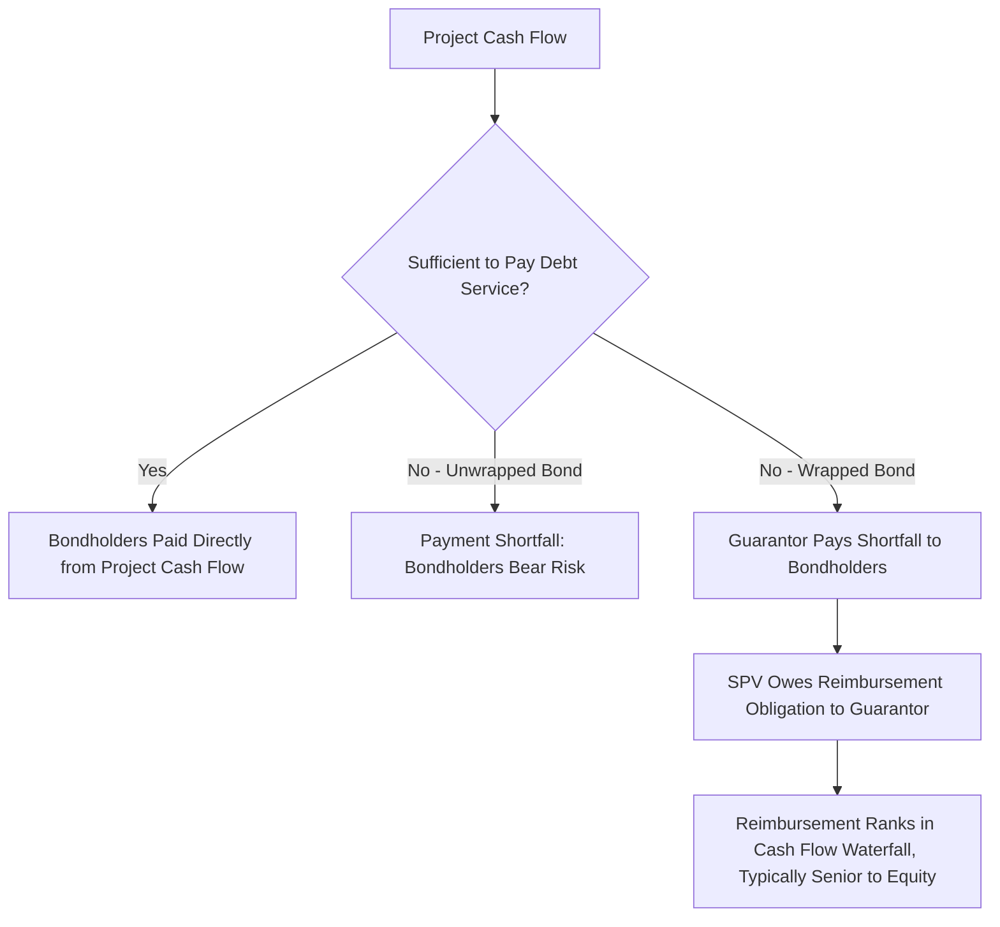

## Wrapped Versus Unwrapped Bond Structures

### Overview

Wrapped and unwrapped bond structures describe two distinct approaches to allocating credit risk in project bond financing, differentiated by whether a third-party credit enhancement provider guarantees timely payment of principal and interest. A wrapped bond carries an external guarantee — traditionally from a monoline financial guarantee insurer, and more recently from multilateral development banks (MDBs) or development finance institutions (DFIs) — that substitutes the guarantor's credit quality for the project's own stand-alone credit profile in the eyes of the market. An unwrapped bond relies entirely on the project's own cash flow, structural protections, and stand-alone credit profile, with investors pricing and rating the bond based on the SPV's own risk characteristics.

**Key Points**

- The wrap does not change the underlying project's cash flow or risk profile — it changes who bears the risk of a shortfall and, consequently, how the market prices and rates the bond
- Wrapped bonds are priced primarily off the guarantor's credit spread, while unwrapped bonds are priced off the project's own stand-alone credit assessment
- The monoline insurance market that dominated wrapped project bonds pre-2008 has substantially diminished; MDB and DFI guarantees have become the more common contemporary credit enhancement mechanism, particularly in emerging markets
- From a modeling perspective, a wrap introduces an additional waterfall layer (the guarantee facility) and a new cost line (guarantee fees), but does not require re-forecasting the underlying operating cash flow

### Historical Context: The Monoline Insurance Model

Prior to the 2008 financial crisis, a small number of highly-rated monoline financial guarantee insurers (specialist insurers whose sole business was wrapping bonds, hence "monoline") dominated the wrapped bond market, particularly in municipal and infrastructure finance. The model worked as follows:

1. The monoline insurer, typically carrying a 'AAA' or 'Aaa' rating, agreed to guarantee timely payment of scheduled principal and interest on the bond in the event the SPV failed to pay
2. The wrapped bond then traded and was rated based on the monoline's rating rather than the SPV's own stand-alone credit profile, since investors' primary credit exposure ran to the guarantor
3. The SPV paid an upfront or ongoing guarantee fee (a form of insurance premium) to the monoline in exchange for this credit substitution
4. This allowed lower-rated or unrated projects to access the bond market at rates reflecting the monoline's superior credit quality rather than their own, often resulting in significant borrowing cost savings net of the guarantee fee

The 2008-2009 financial crisis substantially impaired this model: several major monoline insurers suffered severe credit deterioration or failure due to exposure to structured credit products unrelated to their infrastructure wrap business, which caused wrapped bonds referencing those insurers to lose their credit substitution benefit overnight (since the wrap is only as strong as the guarantor's own credit). This event significantly reduced market reliance on monoline wraps and shifted attention toward alternative credit enhancement providers with more resilient credit profiles.

[Inference] The residual monoline insurance market that persists today operates at meaningfully smaller scale and with more conservative underwriting standards than the pre-2008 market, though the precise current market size and the specific surviving monoline entities active in project finance would need to be verified against current market data rather than assumed from the pre-crisis market structure.

### Contemporary Credit Enhancement: MDB and DFI Guarantees

Multilateral development banks and development finance institutions (World Bank/IBRD, IFC, Asian Development Bank, African Development Bank, regional and national DFIs) have become the more prevalent wrap providers in current project bond markets, particularly for emerging market infrastructure. Common structures include:

**Partial Credit Guarantees (PCGs)**: cover a specified portion of debt service (e.g., the final maturities of a bond, or a percentage of each payment), extending the effective tenor or improving the credit quality of the covered portion without the guarantor taking on the full risk of the transaction

**Partial Risk Guarantees (PRGs)**: cover debt service default arising from specified risk events, often government-related or political risk events (breach of contract, currency inconvertibility, expropriation), rather than covering all sources of shortfall unconditionally

**Policy-Based Guarantees**: broader guarantees tied to sovereign or sub-sovereign policy reform commitments, less common in pure project finance contexts but relevant in some public infrastructure financings

The rationale for MDB/DFI involvement typically extends beyond pure credit enhancement economics — these institutions often have a developmental mandate to mobilize private capital into infrastructure in markets that would not otherwise attract institutional investment at commercially viable pricing, meaning their guarantee provision is frequently bundled with broader technical assistance, environmental and social safeguards compliance, and de-risking objectives.

### Illustrative Mermaid Diagram: Wrapped vs. Unwrapped Payment Flow

### Rating Mechanics: Wrapped vs. Unwrapped

For an **unwrapped bond**, the rating agency methodology described in Rating Agency Methodologies for Project Finance applies directly — the SACP, scorecard, or five-factor assessment is built entirely around the project's own operating and financial risk characteristics, with the resulting rating reflecting the SPV's stand-alone credit quality.

For a **wrapped bond**, the rating agency's approach depends on the guarantee structure:

- **Full, unconditional, timely-payment guarantee**: the bond typically receives the higher of the guarantor's rating or the project's stand-alone rating (in practice, almost always the guarantor's rating, since the wrap is generally only economically useful when the guarantor's credit is stronger than the project's own)
- **Partial guarantee**: the rating reflects a blended assessment, where the guaranteed portion of cash flows carries the guarantor's credit quality and the unguaranteed portion carries the project's stand-alone credit quality; agencies typically model this through a "weak-link" or "risk-sharing" approach depending on the specific mechanics of how the guarantee is drawn (first-loss vs. pro-rata vs. specific-maturity coverage)
- **Guarantor rating linkage/notching**: even where a wrap materially improves the rating, agencies commonly retain a small degree of linkage to the underlying project's rating (a form of "look-through" analysis), reflecting the reality that a severely distressed underlying project increases the probability of guarantee calls, which is not entirely without cost or risk implication for the guarantor relationship going forward

### Modeling the Guarantee Facility as a Waterfall Layer

**Example**

Consider an unwrapped stand-alone project bond that would carry a 'BB' rating based on a minimum DSCR of 1.15x under the rating agency's stress case — below the investment-grade threshold many institutional investors require. A partial credit guarantee from a regional development bank covering the final five years of a 20-year bond's principal repayment could be modeled as follows:

**Sources and Uses at Each Payment Date**

1. Calculate scheduled debt service due, $DS_t$
2. Calculate cash flow available for debt service, $CFADS_t$
3. If $CFADS_t \geq DS_t$: pay debt service normally from project cash flow
4. If $CFADS_t < DS_t$ **and** the shortfall falls within the guaranteed period/tranche: draw on the guarantee facility for the shortfall amount

$$Guarantee\ Draw_t = \max(0, \; DS_t - CFADS_t) \quad \text{for } t \in \text{guaranteed period}$$

5. Record a reimbursement obligation to the guarantor equal to the cumulative guarantee draws, typically accruing interest at a specified reimbursement rate
6. Reimbursement obligations are typically structured to rank senior to equity distributions but may rank pari passu with or subordinate to the bond itself, depending on the specific guarantee agreement — this ranking is a negotiated structural feature that materially affects how quickly the SPV can resume equity distributions after a guarantee draw

This structure allows the bond's investment-grade portion (years 1-15 in this example, unwrapped) to be rated on the project's own stand-alone credit quality, while the higher-risk tail-end maturities (years 16-20, wrapped) benefit from the guarantor's credit substitution — a partial wrap targeting the specific risk period where the project's own credit profile is weakest, often the later years of a concession where residual value or refinancing risk is more pronounced.

### Cost-Benefit Analysis: Wrap Fee vs. Borrowing Cost Savings

The economic decision to wrap a bond hinges on comparing:

$$\text{Net Benefit} = \left(r_{unwrapped} - r_{wrapped}\right) \times \text{Principal} \times \text{Weighted Average Life} - \text{Guarantee Fee (PV)}$$

where $r_{unwrapped}$ is the coupon rate the bond would carry without the wrap (reflecting the project's own stand-alone credit spread) and $r_{wrapped}$ is the coupon rate achievable with the guarantor's credit substitution (reflecting the guarantor's typically tighter credit spread). The guarantee fee — whether paid upfront as a lump sum or as an ongoing annual fee expressed in basis points on outstanding guaranteed principal — must be less than the discounted interest savings for the wrap to be economically beneficial to the SPV and its sponsors.

[Unverified] Actual guarantee fee levels vary substantially by guarantor, transaction risk profile, guaranteed tranche size, and prevailing market conditions, and are typically negotiated on a transaction-specific basis rather than published as a standard rate card; any specific fee assumption used in a model should be sourced from indicative term sheets or comparable precedent transactions rather than assumed generically.

### Structural and Documentation Considerations

**Guarantee Agreement Terms**: the precise mechanics of when and how a guarantee can be drawn (timely payment guarantee vs. guarantee triggered only upon acceleration/default), the guarantor's subrogation rights upon paying a claim, and the reimbursement obligation's priority in the cash flow waterfall are all negotiated documentation points with material modeling and credit implications

**Guarantor Consent Rights**: wrapped bond structures typically grant the guarantor enhanced consent and control rights over amendments, waivers, and enforcement decisions relative to what individual bondholders would hold in an unwrapped structure, reflecting the guarantor's larger economic exposure to the transaction's performance

**Step-in Rights**: guarantors in wrapped structures frequently negotiate step-in rights allowing them to take control of remedies or even project operations in a default scenario, since they bear the ultimate payment risk and have strong incentive to actively manage a distressed situation rather than remain passive like typical dispersed bondholders

### Comparative Summary Table

| Dimension | Wrapped Bond | Unwrapped Bond |
| --- | --- | --- |
| Primary Credit Reference | Guarantor's credit rating | Project's stand-alone credit profile |
| Typical Rating Basis | Guarantor rating (with possible notching/linkage) | SACP / scorecard / five-factor rating case |
| Additional Cost | Guarantee fee (upfront or ongoing) | None |
| Additional Waterfall Complexity | Guarantee draw and reimbursement mechanics | None |
| Investor Due Diligence Focus | Guarantor's own creditworthiness and claims-paying history | Project's own operating, contractual, and financial risk |
| Typical Use Case | Below-investment-grade projects seeking investment-grade market access; emerging market infrastructure | Investment-grade-capable projects; markets with well-established stand-alone project finance track records |
| Post-Crisis Market Relevance | Reduced monoline capacity; MDB/DFI guarantees more prevalent | Dominant model in mature project finance markets (OECD infrastructure, utility-scale renewables) |

### Practical Modeling Checklist

- Build a distinct guarantee facility schedule tracking cumulative draws, accrued reimbursement interest, and repayment of the reimbursement obligation
- Confirm and model the specific guarantee trigger mechanics (timely payment vs. acceleration-triggered) since this affects when draws occur relative to the underlying debt service schedule
- Model the reimbursement obligation's priority explicitly within the cash flow waterfall, consistent with the specific guarantee agreement's ranking provisions
- Incorporate guarantee fees as a distinct operating or financing cost line, sized according to the negotiated fee structure (upfront, ongoing basis-point fee on outstanding guaranteed amount, or a hybrid)
- If only a partial tranche or period is wrapped, ensure the model correctly isolates guaranteed cash flows from unguaranteed cash flows for both waterfall and rating-case sensitivity purposes
- Cross-reference the rating impact against the relevant agency's specific linkage/notching methodology for partial guarantees rather than assuming a full rating substitution

**Next Steps**

- Explore Project Business Risk and Financial Risk Frameworks
- Explore Multilateral Development Bank and DFI Credit Enhancement Structures in Depth
- Explore Partial Credit Guarantee vs. Partial Risk Guarantee Structuring Differences
- Explore Rating Agency Notching and Linkage Methodologies for Guaranteed Debt
- Explore Political Risk Insurance as a Complementary Credit Enhancement Tool
- Explore Emerging Market Project Finance: Structuring Around Sovereign and Currency Risk