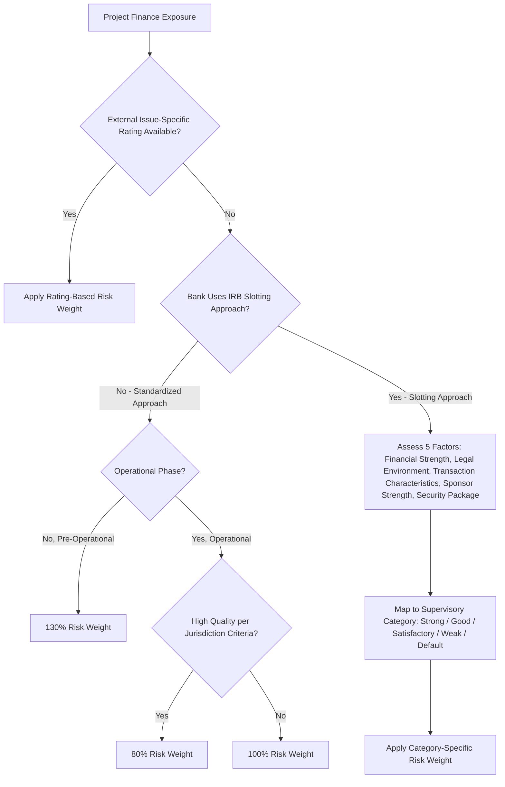

## Basel III and Basel IV Capital Impact on Project Lending

### Overview and Terminology

"Basel IV" is the market shorthand for the final set of reforms completing the Basel III framework — often referred to more precisely as "Basel III finalization," "Basel III Endgame" (in the US), or "Basel 3.1" (in the UK) — agreed by the Basel Committee on Banking Supervision in 2017 and subsequently implemented on a jurisdiction-by-jurisdiction basis with materially different timelines. These reforms directly reshape how much regulatory capital a bank must hold against project finance lending, which in turn affects the relative cost, tenor appetite, and structural preferences banks bring to project finance transactions.

**Key Points**

- The reforms most relevant to project finance are: (1) the introduction of more granular, standardized risk weights for specialized lending exposures, (2) the "output floor" constraining how far internal ratings-based (IRB) models can reduce capital requirements relative to the standardized approach, and (3) jurisdiction-specific treatment of "high-quality" project finance exposures
- Implementation dates and specific calibrations differ materially across the EU (CRR3/CRD VI), UK (Basel 3.1), US (Basel III Endgame proposals), and other jurisdictions (e.g., Canada under OSFI), so a bank's actual capital treatment of a given project finance exposure depends on its home regulator's specific rules in force at the time
- The net effect of these reforms has generally been to increase capital requirements for banks using internal models relative to the pre-reform baseline, while introducing some preferential treatment for "high-quality" operational-phase project finance to avoid excessively penalizing well-structured infrastructure lending

### The Specialized Lending Asset Class

Basel capital frameworks treat project finance as one of several categories of "specialized lending" — exposures to an entity created specifically to finance or operate a physical asset, where the primary source of repayment is the cash flow generated by that asset rather than the general creditworthiness of a diversified borrower. The specialized lending category is typically subdivided into:

- **Project Finance (PF)**: financing of a single asset or narrow set of related assets, generating a rating dependent primarily on that asset's cash flow (this is the category directly relevant to project finance modeling)
- **Object Finance (OF)**: financing of physical assets (ships, aircraft, rail cars) where repayment depends on cash flows from the specific asset financed, typically via lease or charter
- **Commodities Finance (CF)**: short-term financing of commodity inventories or receivables
- **Income-Producing Real Estate (IPRE)**: financing repaid primarily from lease or rental income generated by the property financed

Banks assign risk weights to these exposures either using external issue-specific credit ratings where available (the External Ratings-Based Approach) or, where unrated, via prescribed standardized risk weight tables — this second case is the more common scenario in bank-led project finance, since most bank-syndicated project loans are unrated.

### Standardized Risk Weights for Unrated Project Finance

Under the finalized Basel standardized approach, unrated project finance exposures are risk-weighted according to project phase:

| Phase | Standard Risk Weight | High-Quality Risk Weight |
| --- | --- | --- |
| Pre-operational (construction) | 130% | Not applicable — high-quality treatment requires operational status |
| Operational | 100% | 80% |

Project finance exposures are risk-weighted at 130% during the pre-operational phase and 100% during the operational phase, with high-quality operational-phase project finance exposures risk-weighted at 80%. This creates a clear regulatory capital incentive structure that mirrors the credit risk reality already familiar from rating agency methodologies: construction-phase risk is capitalized more heavily than de-risked, cash-generative operational risk, and the "high-quality" carve-out gives an additional capital benefit to the strongest operational projects.

**Defining "High Quality"**: eligibility for the preferential 80% risk weight generally requires the project entity to demonstrate sufficient positive net cash flow to cover its remaining contractual obligations and to meet a set of qualitative and structural criteria (low refinancing risk, strong contractual and structural protections, robust security package) specified in each jurisdiction's implementing rules — the precise criteria are set out in the applicable national or regional rulebook rather than a single universal Basel text, and can differ in emphasis between jurisdictions.

[Unverified] The specific enumerated criteria for "high quality" classification (financial ratio thresholds, structural protection requirements) vary by implementing jurisdiction and have been subject to consultation and refinement in several jurisdictions through 2026; practitioners should verify the current criteria against their specific regulator's finalized rulebook rather than assume uniform criteria across markets.

### The IRB Supervisory Slotting Approach

Banks using internal ratings-based approaches for specialized lending, where they lack sufficient internal data to generate reliable own-estimates of probability of default, may use the **supervisory slotting approach** rather than a standardized or full IRB approach. Under slotting, exposures are classified into one of several supervisory categories (commonly labeled Strong, Good, Satisfactory, Weak, and Default) based on an assessment of five factors specified in the framework:

1. Financial strength (leverage, DSCR profile, stress resilience)
2. Political and legal environment
3. Transaction and/or asset characteristics
4. Strength of the sponsor and developer, including any public-private partnership income stream
5. Security package

Each supervisory category maps to a prescribed risk weight, differentiated between standard maturity exposures and exposures with a remaining maturity below a specified threshold (shorter-dated exposures within a category generally attract a lower risk weight than longer-dated exposures in the same category, reflecting reduced cumulative default risk over a shorter horizon).

The slotting criteria specify how factors including financial strength, political and legal environment, transaction and/or asset characteristics, strength of the sponsor and developer, and security package are to be taken into account and combined to determine the final risk weight category. [European Banking Authority](https://www.eba.europa.eu/documents/10180/1489608/e915f563-acba-485d-a05a-0756ce8360dd/EBA-2016-RTS-02%20(Final%20RTS%20on%20specialised%20lending%20exposures).pdf)

### Illustrative Mermaid Diagram: Slotting Classification Process

### The Output Floor

One of the most consequential elements of the finalized Basel framework for project finance banks using internal models is the **output floor**, which requires a bank's total risk-weighted assets calculated under internal models to be no lower than a specified percentage (73% at full phase-in under the global Basel standard) of what those risk-weighted assets would be under the standardized approach. This mechanism directly constrains the capital benefit banks can achieve from favorable internal model outputs on project finance portfolios, even where a bank's own historical data would otherwise support materially lower risk weights than the standardized tables.

During the EU's phase-in period, the increase in total risk-weighted assets attributable to the output floor is capped at 25% of the institution's pre-floor risk-weighted assets, with this cap itself phasing out over the transition period, and a preferential 65% risk weight is permitted for high-quality unrated corporate exposures under the standardized approach used in the output floor calculation, rather than the 100% Basel III otherwise prescribes.

For banks with historically strong internal model outputs on well-structured project finance portfolios (a common feature of European infrastructure lenders with long track records), the output floor represents a binding capital increase relative to the pre-reform regime, since the floor is calibrated off the generally more conservative standardized approach risk weights rather than the bank's own historical loss experience.

### Jurisdictional Implementation Timelines

Implementation dates and specific calibrations have diverged meaningfully across major jurisdictions:

**European Union (CRR3/CRD VI)**: CRR3 applies starting 1 January 2025, with a phased-in implementation for the output floor by January 2030, and EU member states were required to implement CRD VI by 11 January 2026.

**United Kingdom (Basel 3.1)**: The Prudential Regulation Authority published its final policy statement (PS1/26) for the implementation of Basel 3.1 on January 20, 2026, confirming a general start date of January 1, 2027, with a one-year deferral of the market risk internal model approach to January 1, 2028. The rules maintain an 80% risk weight on high-quality project finance, with the scope of eligible entities expanded to include central banks, international organizations, and multilateral development banks; although the infrastructure support factor was removed from Pillar 1, the PRA introduced a firm-specific "infrastructure lending adjustment" under Pillar 2A intended to mitigate the impact of that removal without increasing overall capital requirements for infrastructure exposures. [Skadden](https://www.skadden.com/insights/publications/2024/10/implementation-of-basel-3)

**United States (Basel III Endgame)**: On March 19, 2026, US federal banking regulators issued proposals covering revised risk-based capital requirements for the largest banking organizations, changes to risk weights for other banking organizations under a standardized approach, and a revised method for calculating the G-SIB capital surcharge, intended as the final phase of the post-financial-crisis Basel reforms. The package taken together lowers capital requirements overall relative to the prior 2023 US proposal, reduces duplication across the framework, and improves the economics of traditional lending in ways that could pull some lending activity back toward banks. [Mayer Brown](https://www.mayerbrown.com/en/insights/publications/2026/03/us-banking-regulators-propose-reforms-to-capital-requirements)

**Canada (OSFI)**: Under OSFI's capital adequacy requirements, project finance exposures in the operational phase deemed high-quality are risk-weighted at 80%, with high quality requiring the project entity to have positive net cash flow sufficient to cover its obligations, alongside the standard 130% pre-operational and 100% operational risk weights for exposures without an issue-specific external rating.

[Inference] Given the divergence in implementation dates already observed (UK 2027, EU already phasing in since 2025, US proposal still in a comment period as of mid-2026), practitioners modeling multi-jurisdictional bank syndicates should expect the effective capital cost a given bank brings to a transaction to depend materially on that bank's home regulator's specific implementation stage at the time of financial close, rather than assuming a single uniform "Basel IV" capital charge across all lenders in a syndicate.

### Practical Implications for Project Finance Structuring

**Construction-to-Operations Pricing Differentiation**: the standardized 130%-to-100%(-to-80% if high-quality) risk weight step-down at commercial operation date gives banks a direct capital-cost rationale for pricing construction-phase debt at a meaningfully wider margin than operational-phase debt, reinforcing the economic logic behind bank-bond hybrid and mini-perm structures discussed in Project Bonds and Institutional Investor Financing, where banks originate higher-margin construction risk and are refinanced out once the capital charge steps down

**Tenor Preferences**: the output floor and slotting maturity adjustments both create capital incentives favoring shorter effective bank exposure tenors, reinforcing banks' structural preference for mini-perm or bullet-to-refinancing structures over full-tenor amortizing bank loans matching a 20-30 year concession life — a preference that also supports migration of long-dated operational risk to institutional bond investors, who face different (typically insurance/pension regulatory, e.g., Solvency II) capital frameworks not directly subject to Basel banking rules

**"High-Quality" Structuring as a Capital Optimization Lever**: since jurisdictions offer a preferential 80% risk weight specifically for operational-phase project finance meeting defined quality criteria, sponsors and their advisors have a direct incentive to structure post-completion financing (contractual protections, security package, refinancing risk mitigation) to meet the applicable jurisdiction's "high-quality" threshold, as this materially affects the bank's capital cost and, by extension, the pricing a bank syndicate can offer

**Impact on Lender Landscape Composition**: the cumulative effect of higher capital charges for construction risk and longer tenors under the finalized framework is frequently cited as a structural driver — alongside the historical post-2008 monoline market contraction discussed in Wrapped Versus Unwrapped Bond Structures — behind the growing role of institutional investors, MDBs, and export credit agencies in project finance capital structures, as these providers are not subject to the same Basel banking capital constraints

### Modeling Checklist for Basel-Sensitive Transaction Structuring

- When benchmarking indicative bank margins across construction and operational phases, treat the capital cost step-down at commercial operation date as a structural input, not merely a market convention, since it reflects an actual regulatory capital cost differential for the lending bank
- For multi-jurisdictional bank syndicates, avoid assuming uniform capital treatment across all lenders; document each bank's home regulator's specific implementation stage and risk weight treatment where material to margin negotiation
- Where a "high-quality" designation is achievable and economically material, model the specific structural features (security package strength, refinancing risk mitigants, cash flow stability) required to qualify under the relevant jurisdiction's criteria as an explicit structuring objective, not an afterthought
- Recognize that a bank's willingness to hold long-tenor operational debt without refinancing may be capital-constrained even where the credit risk itself would otherwise support it, reinforcing the importance of building refinancing optionality into the base case model per Modeling Refinancing Scenarios

**Next Steps**

- Explore Export Credit Agency Financing and OECD Consensus Guidelines
- Explore Solvency II Treatment of Institutional Infrastructure Debt (contrast with Basel banking capital treatment)
- Explore Mini-Perm and Bank-Bond Hybrid Structuring in Detail
- Explore Multilateral Development Bank Role in Filling Bank Capital Gaps
- Explore Loan Syndication and Club Deal Structures in a Post-Basel-IV Bank Market
- Explore Capital-Cost-Driven Margin Benchmarking Across Construction and Operational Phases