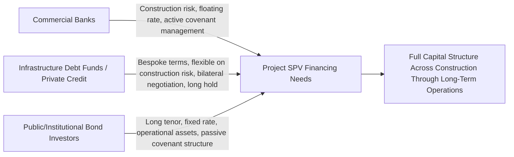

## The Rise of Infrastructure Debt Funds and Private Credit

### Overview

Infrastructure debt funds and the broader private credit market represent an increasingly significant alternative to traditional bank syndicates and public bond markets for financing project finance transactions. These vehicles — typically structured as closed-end or evergreen funds raised from institutional investors (pension funds, insurers, sovereign wealth funds, endowments) and managed by dedicated asset managers — originate and hold debt directly, filling structural gaps left by bank balance sheet constraints and offering sponsors financing terms and speed of execution that neither traditional bank syndicates nor public bond markets can always match.

**Key Points**

- Infrastructure debt funds occupy a middle position between bank debt and public project bonds: like banks, they can underwrite bespoke, complex, and construction-phase risk; like bond investors, they offer longer tenors and reduced reliance on periodic covenant renegotiation
- The broader private credit market has grown substantially, with direct lending now roughly matching the broadly syndicated loan market in size and total private credit assets under management projected to exceed $2 trillion in 2026 and approach $4 trillion by 2030
- Growth has been driven by the same structural forces discussed in Basel III and Basel IV Capital Impact on Project Lending — bank capital constraints creating a persistent financing gap — combined with institutional investor demand for the yield premium, diversification, and lower volatility that private, illiquid credit can offer relative to public fixed income
- Within private credit generally, asset-based finance and infrastructure debt specifically are highlighted as key areas of expected continued growth, as product design increasingly shifts toward meeting insurer and pension capital-eligibility requirements

### Market Growth and Scale

The private credit market broadly has expanded from roughly $500 billion to $1.3 trillion over the five years preceding 2026, with direct lending now roughly matching the broadly syndicated loan market at $1.5-2 trillion in size and forecast to reach approximately $3 trillion by 2028. Within this broader private credit universe, infrastructure debt has been identified as a specific area of anticipated growth: after several years of relatively subdued fundraising following the post-2008 boom, infrastructure debt fundraising is expected to gain momentum and reach a new level of maturity, with private credit managers increasingly establishing dedicated infrastructure debt units, signaling growing mainstream institutional adoption of the strategy.

[Inference] Market size figures cited across different research providers vary meaningfully depending on methodology (whether infrastructure debt is counted as a distinct sub-category or folded into broader "asset-based finance" or "private credit" totals), so any specific infrastructure-debt-only market size figure should be treated as indicative of scale and direction rather than a precise, universally agreed number.

### Why Infrastructure Debt Funds Fill a Distinct Niche

Infrastructure debt funds differ from both bank debt and public/institutional project bonds in several structurally important ways:

1. **Underwriting Flexibility**: unlike most public bond investors, infrastructure debt funds typically retain the origination expertise and risk appetite to underwrite construction-phase, greenfield, and complex or novel-structure transactions directly — closer to a bank's capability than a typical bond investor's
2. **Speed and Bilateral Negotiation**: transactions are typically negotiated bilaterally or in small clubs rather than broadly syndicated or publicly marketed, allowing faster execution and more bespoke terms than either a broadly syndicated bank facility or a public bond issuance requiring rating agency engagement and prospectus preparation
3. **Buy-and-Hold Investment Horizon**: fund investors typically have long-dated liabilities (matching the pension and insurance investor base discussed in Project Bonds and Institutional Investor Financing) and hold debt to maturity rather than trading it, reducing secondary market liquidity but also reducing the mark-to-market volatility that public bond investors are exposed to
4. **Sector and Origination Specialization**: because infrastructure debt remains a relatively specialized market with fewer established participants than broader direct lending, managers with long-standing origination capabilities, sector expertise, and sponsor relationships hold a meaningful competitive advantage in sourcing proprietary, well-structured opportunities

### Illustrative Mermaid Diagram: Positioning Within the Lender Landscape

### Direct Lending Structures in Infrastructure Debt

**Unitranche and Hybrid Structures**: infrastructure debt funds frequently offer unitranche facilities — a single blended-rate tranche combining what would traditionally be separate senior and subordinated debt layers — simplifying the capital structure and intercreditor complexity relative to a multi-tranche bank/mezzanine structure, while still pricing the blended risk appropriately across the combined exposure

**Junior and Mezzanine Lending with Equity-Like Upside**: private credit infrastructure strategies increasingly extend beyond senior lending into junior and mezzanine infrastructure debt, often incorporating equity-like upside features (warrants, equity kickers, or profit participation rights) to compensate for subordination risk — a structure less commonly available from traditional bank lenders or public bond investors, who typically prefer cleaner, purely fixed-income risk profiles

**Asset-Based and Contracted Cash Flow Lending**: consistent with the broader private credit market's expected shift toward asset-based finance, infrastructure debt funds often focus on transactions with strong contracted or availability-based cash flow profiles (PPA-backed renewables, availability-payment PPPs, regulated utility assets), applying underwriting discipline similar to the revenue risk frameworks used by rating agencies (see Rating Agency Methodologies for Project Finance)

### Pricing and Return Characteristics

**Example**

In 2026, private high-yield BB-rated infrastructure credit spreads typically started in the high-200 to low-300 basis point range, resulting in yields of approximately 7.0% or higher, which compares to a materially tighter average option-adjusted spread of approximately 176 basis points for the public BB US High Yield Index over the twelve months through April 2026. This spread premium reflects the illiquidity and single-asset concentration risk inherent in privately-held infrastructure debt relative to a diversified, publicly traded high-yield index, and represents the core return proposition that attracts institutional allocators to the asset class: a meaningful yield pickup for accepting illiquidity, in exchange for the direct structuring input, security package strength, and covenant protections that a privately negotiated loan can offer relative to a public bond.

For a lower-middle-market infrastructure or project-adjacent transaction in 2026, a typical structure might combine 4.0x to 5.5x total leverage against project cash flow in a unitranche facility, with pricing, covenant packages, and structural protections individually negotiated between the fund and the sponsor rather than benchmarked against a syndicated term sheet — though the specific leverage and structuring conventions cited here are drawn from broader private credit direct lending norms and may differ from infrastructure-specific market practice, which tends toward somewhat more conservative leverage given longer asset lives and different cash flow volatility profiles than corporate direct lending.

[Unverified] Specific leverage multiples, spread levels, and structuring conventions in private infrastructure credit are transaction- and sector-specific and shift with prevailing market conditions; the figures presented here reflect a snapshot of market commentary current as of mid-2026 and should not be treated as fixed benchmarks for underwriting any specific transaction.

### Fund Structures and Investor Access

Infrastructure debt funds are typically organized as:

- **Closed-end drawdown funds**: capital is committed by investors and called down as investment opportunities are originated, with a defined investment period followed by a harvest/realization period — the traditional private equity-style fund structure adapted for debt strategies
- **Evergreen/perpetual vehicles**: increasingly common structures (including non-traded business development companies, or BDCs, in adjacent corporate private credit) that allow continuous fundraising and reinvestment rather than a fixed fund life, offering periodic liquidity windows to investors rather than a hard fund termination date
- **Separately managed accounts (SMAs)**: large institutional investors (major pension funds, sovereign wealth funds) sometimes negotiate bespoke, dedicated mandates with an infrastructure debt manager rather than investing through a commingled fund vehicle, allowing customized risk/return parameters and exclusivity over certain origination opportunities

### Competitive Dynamics: Funds, Banks, and Bond Markets

Rather than displacing banks entirely, infrastructure debt funds and banks frequently operate in complementary roles: banks remain critical players in credit markets, operating simultaneously as competitors to private credit firms and as essential providers of liquidity to private credit asset managers through fund finance facilities — meaning banks often provide leverage facilities or warehouse financing to the very infrastructure debt funds that compete with them for underlying project transactions, creating an interdependent rather than purely adversarial market structure.

This dynamic mirrors the bank-bond hybrid financing structures discussed in Project Bonds and Institutional Investor Financing: just as banks originate construction-phase risk before refinancing into long-tenor bonds, banks increasingly also provide fund-level financing that enables infrastructure debt funds to extend their own lending capacity, layering multiple forms of intermediation between ultimate capital providers (pension and insurance investors) and the underlying project.

### Regulatory and Macro Considerations Affecting Growth

Continued growth in infrastructure debt and asset-based private credit is expected to be shaped by:

- **Insurer and pension regulatory capital eligibility**: product design in private credit is increasingly being structured around insurer demand and regulatory eligibility criteria (analogous to the Solvency II qualifying infrastructure investment treatment discussed in Project Bonds and Institutional Investor Financing), meaning fund structuring choices are often directly informed by what will qualify for preferential capital treatment among the largest prospective investor base
- **Late-cycle credit conditions**: entering 2026, private credit broadly faces a more challenging environment than in recent years, with rising concerns about loosening lending standards and a series of high-profile corporate bankruptcies in late 2025 prompting increased scrutiny of underwriting discipline across the asset class — though this stress has been more pronounced in corporate direct lending than in infrastructure-specific debt, which tends to benefit from more stable, contracted cash flow profiles
- **Geographic diversification**: momentum is increasingly extending beyond the historically dominant US and UK/Northern European markets into Southern Europe (with new local managers benefiting from favorable tax regimes and government energy transition programs) and broader EMEA and APAC infrastructure debt origination

### Practical Implications for Project Finance Modeling

When a transaction is expected to be financed partly or wholly by an infrastructure debt fund rather than a bank syndicate or public bond, several modeling considerations follow:

- **Pricing benchmarks should reference private credit spread levels** (which typically carry an illiquidity premium over comparable public bond or syndicated loan pricing) rather than assuming bank margin or public bond coupon conventions apply directly
- **Covenant packages may be more heavily negotiated and bespoke** than either a standardized bank facility or a public bond's incurrence covenant package, requiring the model's covenant testing logic to be built around the specific negotiated terms rather than a generic template
- **Unitranche or hybrid structures may require collapsing what would otherwise be separate senior/subordinated debt schedules** into a single blended-rate facility, simplifying the model's capital structure representation relative to a traditional multi-tranche structure
- **Where equity-like upside features (warrants, profit participation) are present in junior private credit tranches**, the model should separately track this contingent value alongside the fixed debt service schedule, since it affects overall cost-of-capital analysis and total return to the fund investor in ways a standard debt schedule alone will not capture

**Next Steps**

- Explore Unitranche and Hybrid Debt Structuring in Project Finance
- Explore Fund Finance and Leverage Facilities Provided to Private Credit Funds
- Explore Insurer and Pension Capital Eligibility Criteria Shaping Private Credit Product Design
- Explore Asset-Based Finance as an Emerging Infrastructure Financing Category
- Explore Comparative Cost of Capital: Bank Debt vs. Project Bonds vs. Private Credit
- Explore Geographic Expansion of Infrastructure Debt Markets Beyond US/UK/Northern Europe