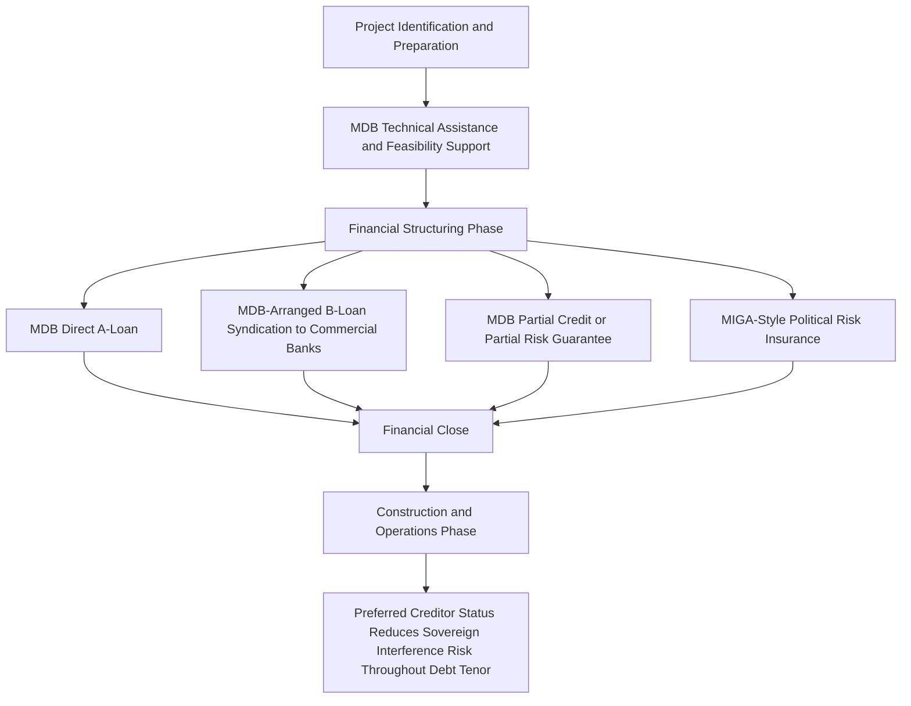

## Role of Multilateral Development Banks

### Overview and Institutional Landscape

Multilateral development banks (MDBs) are international financial institutions established and jointly owned by multiple sovereign governments, mandated to promote economic development, poverty reduction, and — increasingly — climate and infrastructure objectives in member countries, primarily in emerging and developing markets. In project finance, MDBs play a role that extends well beyond simply providing debt capital: they act as risk mitigants, catalysts for private capital mobilization, and de facto quality certifiers whose involvement signals a project has met rigorous environmental, social, and governance standards.

**Key Points**

- The major global MDBs include the World Bank Group (comprising IBRD for middle-income sovereigns and IFC for private sector lending), along with regional development banks such as the Asian Development Bank (ADB), the African Development Bank (AfDB), the Inter-American Development Bank (IDB), and the European Bank for Reconstruction and Development (EBRD)
- MDBs typically participate in project finance through direct lending, credit enhancement (guarantees), equity investment, and political risk insurance, often in combination within a single transaction
- A defining characteristic of MDB involvement is "preferred creditor status" — an informal but widely respected market convention under which sovereign borrowers prioritize repayment to MDBs even during broader debt distress, reducing MDB credit risk relative to comparable commercial lenders
- MDB participation frequently serves a "catalytic" function, mobilizing multiples of their own direct investment in additional private commercial capital that would not otherwise be willing to bear the full risk of financing in a given market or sector

### Core Functions in Project Finance Transactions

**Direct Senior Lending**: MDBs provide long-tenor senior debt directly to project SPVs, often on terms (tenor, grace periods, pricing) that commercial lenders in the same market would not offer, particularly in lower-income or higher political-risk jurisdictions where commercial bank and bond market appetite is limited or unavailable

**B-Loan / Syndication Programs**: several MDBs (notably the IFC) operate formal syndication programs in which the MDB extends an "A-loan" from its own balance sheet while simultaneously arranging a "B-loan" syndicated to commercial banks and institutional investors, who benefit from the MDB's preferred creditor status and preferential regulatory treatment extended to the syndicated portion by virtue of the MDB's continued involvement as lender of record

**Credit Enhancement**: as discussed in Wrapped Versus Unwrapped Bond Structures, MDBs provide partial credit guarantees (covering a defined portion of scheduled debt service) and partial risk guarantees (covering default arising from specified political or sovereign-related risk events), enabling bond or loan structures that would not otherwise achieve investment-grade credit quality or commercial lender comfort

**Political Risk Insurance and Guarantees**: institutions such as the Multilateral Investment Guarantee Agency (MIGA, part of the World Bank Group) provide insurance against risks including expropriation, currency inconvertibility and transfer restriction, breach of contract by a government counterparty, and war/civil disturbance — directly addressing the emerging market risk factors that most commonly deter private commercial capital

**Technical Assistance and Project Preparation**: many MDBs fund or directly provide project preparation facilities, feasibility studies, and capacity building support to sponsors and host governments, addressing the "bankability gap" where a project may be developmentally sound but insufficiently structured or documented to attract commercial financing without this preparatory support

### Illustrative Mermaid Diagram: MDB Roles Across the Transaction Lifecycle

### Preferred Creditor Status: Mechanics and Market Effect

Preferred creditor status (PCS) is not a formal legal seniority right in the way senior secured debt ranks ahead of unsecured debt, but rather a market and diplomatic convention: sovereign borrowers, recognizing the ongoing developmental relationship and future access to MDB financing that non-payment would jeopardize, have historically prioritized continued debt service to MDBs even during periods of broader sovereign debt distress or restructuring. This convention has several practical effects on project finance transactions:

- **Lower effective sovereign and political risk** for MDB-held debt relative to comparable exposures held by commercial lenders in the same jurisdiction, reflected in generally stronger historical repayment performance for MDB portfolios during emerging market debt crises
- **"Halo effect" on syndicated B-loan tranches**: because the MDB remains lender of record even for syndicated B-loan portions, those tranches are frequently understood by market participants (and in some cases explicitly by rating agencies and bank regulators) to benefit from a degree of the same de facto protection, even though the commercial participants are the actual economic risk-bearers
- **Reduced likelihood of adverse regulatory or expropriation action** targeting a specific project, since host governments generally wish to avoid actions that would be seen as impairing an MDB-associated transaction and thereby jeopardizing the country's broader relationship with that institution and its shareholders

[Inference] The strength of preferred creditor status as a risk mitigant varies by country and MDB, and has occasionally been tested or partially eroded in specific severe sovereign distress episodes, so the convention should be understood as a strong historical market pattern rather than a guaranteed or legally enforceable protection in all circumstances.

### The A/B Loan Syndication Structure in Detail

**Example**

Consider a $300,000,000 renewable energy project in a frontier emerging market where commercial banks are unwilling to lend directly given sovereign and currency risk concerns. The IFC structures the financing as:

- **A-Loan**: $75,000,000 funded directly from IFC's own balance sheet, IFC as lender of record
- **B-Loan**: $225,000,000 syndicated to a group of commercial banks and institutional investors, documented under the same loan agreement with IFC continuing to act as lender of record for the entire facility (including the syndicated portion) for administrative and legal purposes

Because IFC remains the lender of record on the full $300,000,000 facility, the B-loan participants benefit from the practical effects of preferred creditor status even though their $225,000,000 exposure is economically identical in risk-bearing terms to a directly-held commercial loan. This structure allows the MDB's limited direct balance sheet capacity (the $75,000,000 A-loan) to mobilize four times that amount in additional private commercial capital — illustrating the catalytic, capital-mobilizing function that is central to how modern MDB project finance activity is measured and reported.

### Sector and Geographic Focus Areas

MDB project finance activity is disproportionately concentrated in:

- **Renewable energy and energy transition infrastructure**: solar, wind, and grid infrastructure in emerging markets, reflecting both developmental mandates around energy access and increasingly explicit climate finance mandates embedded in MDB strategic frameworks
- **Water, sanitation, and social infrastructure**: projects with strong developmental impact but often limited standalone commercial viability without blended concessional support
- **Transportation infrastructure**: ports, roads, and rail in markets where sovereign balance sheet constraints limit public financing capacity and private capital requires de-risking to participate
- **Fragile and conflict-affected states**: markets where commercial capital is essentially unavailable without MDB risk mitigation, reflecting the institutions' core developmental mandate to serve the most underserved markets rather than compete with commercial capital in well-served markets

### Modeling MDB Participation in a Project Finance Structure

Incorporating MDB involvement into a project finance model requires several specific structural considerations:

**A/B Loan Tranching**: model the A-loan and B-loan as distinct tranches with potentially different pricing (the A-loan often prices at a modest spread reflecting the MDB's developmental rather than purely commercial mandate, while the B-loan prices to reflect commercial market terms, adjusted for the partial preferred-creditor-status benefit), but identical amortization and security terms given their pari passu documentation under a single facility

**Guarantee Fee and Reimbursement Mechanics**: where an MDB partial credit or partial risk guarantee is present, apply the same waterfall-layer and reimbursement obligation modeling approach described in Wrapped Versus Unwrapped Bond Structures — a guarantee draw mechanism triggered by defined shortfall events, with a resulting reimbursement obligation to the MDB that must be explicitly ranked within the cash flow waterfall

**Political Risk Insurance Premium**: MIGA-style political risk insurance premiums are typically modeled as an ongoing operating or financing cost (often expressed as a percentage of insured exposure per annum), reducing distributable cash flow but providing offsetting risk mitigation value that may support higher overall debt capacity or improved pricing on the insured tranches

**Concessional/Blended Finance Layering**: some MDB-involved structures include a layer of concessional capital (below-market-rate loans or grants from climate or development funds) blended with commercial-rate MDB and private capital — this "blended finance" approach requires the model to track a genuinely distinct, sub-market-rate tranche rather than approximating it within the broader debt stack, since its below-market pricing is often specifically calibrated to make an otherwise sub-commercial project bankable

### Illustrative SVG: A/B Loan Structure and Capital Mobilization (svg_diagram)

<svg xmlns="http://www.w3.org/2000/svg" viewBox="0 0 800 300">
\<style\>
.lbl { font-family: sans-serif; font-size: 13px; fill: #222; }
.small { font-family: sans-serif; font-size: 11px; fill: #444; }
.title { font-family: sans-serif; font-size: 14px; font-weight: bold; fill: #111; }
\</style\>
<text x="400" y="24" text-anchor="middle" class="title">A/B Loan Structure and Capital Mobilization (svg_diagram)</text>
<rect x="80" y="60" width="180" height="100" fill="#d5f5e3" stroke="#1e8449" />
<text x="170" y="100" text-anchor="middle" class="lbl">MDB A-Loan</text>
<text x="170" y="120" text-anchor="middle" class="small">MDB own balance sheet</text>
<text x="170" y="138" text-anchor="middle" class="small">Lender of record</text>
<rect x="290" y="60" width="430" height="100" fill="#d6eaf8" stroke="#2874a6" />
<text x="505" y="100" text-anchor="middle" class="lbl">Syndicated B-Loan</text>
<text x="505" y="120" text-anchor="middle" class="small">Commercial banks and institutional investors</text>
<text x="505" y="138" text-anchor="middle" class="small">Benefits from MDB lender-of-record status</text>
<line x1="170" y1="160" x2="170" y2="200" stroke="#333" />
<line x1="505" y1="160" x2="505" y2="200" stroke="#333" />
<line x1="170" y1="200" x2="505" y2="200" stroke="#333" />
<line x1="337" y1="200" x2="337" y2="230" stroke="#333" />
<polygon points="337,230 331,220 343,220" fill="#333" />
<rect x="180" y="235" width="315" height="40" fill="#fdebd0" stroke="#b9770e" />
<text x="337" y="259" text-anchor="middle" class="small">Single Project Finance Facility to SPV</text>
</svg>

### Criticisms and Limitations

**Additionality Concerns**: MDBs are increasingly scrutinized on whether their financing is genuinely "additional" — filling a gap that private capital would not otherwise fill — or whether they are crowding out or competing with commercial capital that would have financed the project regardless, particularly in more developed emerging markets where commercial project finance capacity has matured

**Documentation Complexity and Timelines**: MDB involvement typically brings extensive environmental and social safeguard compliance requirements, procurement rules, and internal approval processes that can materially extend transaction timelines relative to a purely commercial financing, a trade-off sponsors must weigh against the risk mitigation and pricing benefits MDB participation provides

**Scale Constraints Relative to Development Needs**: despite the catalytic multiplier effect of A/B loan and guarantee structures, aggregate MDB balance sheet capacity remains modest relative to the scale of global infrastructure investment needs, particularly for climate and energy transition infrastructure in emerging markets, which has driven continued policy attention toward capital adequacy reform and balance sheet optimization at major MDBs.

[Unverified] The specific scale of any given MDB's balance sheet capacity, capital adequacy reform initiatives, and current strategic sector priorities are subject to ongoing institutional reform discussions; current figures and priorities should be verified against each institution's current published strategy and capital position rather than assumed static.

### Practical Checklist for Structuring Around MDB Participation

- Confirm the specific MDB's risk appetite and sector/geographic mandate early in transaction development, since developmental mandate alignment (not just commercial viability) is a threshold consideration for MDB involvement
- Model A-loan and B-loan tranches with distinct but coordinated pricing and amortization terms, reflecting their pari passu documentation but differentiated market positioning
- Where political risk insurance or partial risk guarantees are used, map the specific covered risk events precisely, since coverage is typically event-specific (currency inconvertibility, expropriation, breach of contract) rather than a blanket credit guarantee
- Budget realistic timelines for MDB environmental and social safeguard review and internal approval processes, which frequently extend transaction timetables beyond what a purely commercial financing would require
- Cross-reference MDB guarantee mechanics against the waterfall and reimbursement modeling approach established in Wrapped Versus Unwrapped Bond Structures

**Next Steps**

- Explore Export Credit Agency Financing and OECD Consensus Guidelines
- Explore Political Risk Insurance and MIGA Guarantee Mechanics in Depth
- Explore Blended and Concessional Finance Structuring
- Explore Environmental and Social Safeguard Frameworks in MDB-Financed Projects
- Explore Sovereign Debt Distress and Preferred Creditor Status Under Stress
- Explore Additionality and Crowding-Out Debates in Development Finance