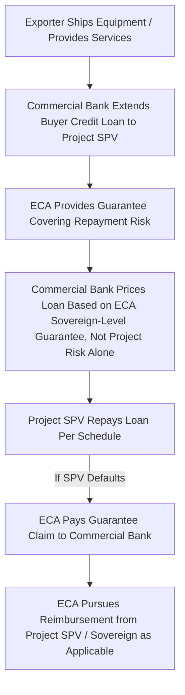

## Export Credit Agency Financing Structures

### Overview

Export credit agencies (ECAs) are government-backed or government-sponsored institutions established to promote their home country's exports by providing financing, guarantees, and insurance that support foreign buyers' purchase of goods and services from domestic exporters. In project finance, ECAs play a central role whenever a project's capital expenditure involves significant procurement of equipment, engineering services, or construction inputs from a specific exporting country — turning what might otherwise be a purely commercial financing decision into one shaped by the export promotion mandates and risk appetites of one or more sovereign governments.

**Key Points**

- Major ECAs include US EXIM (United States), UK Export Finance (UKEF), Euler Hermes/now Allianz Trade acting as Germany's official ECA, Bpifrance Assurance Export (France), JBIC and NEXI (Japan), and K-EXIM/K-sure (South Korea), among many national counterparts
- ECA involvement in a transaction is typically triggered by, and sized around, the proportion of project costs sourced from goods and services originating in the ECA's home country — commonly referred to as the "national content" or "local content" requirement
- Most major ECAs coordinate their commercial terms (minimum interest rates, maximum repayment terms, minimum down payment requirements) under the OECD Arrangement on Officially Supported Export Credits, creating a broadly standardized set of terms across ECAs from different countries for comparable transactions
- ECA-supported debt is frequently among the most attractively priced tranches in a project's capital structure, since ECAs price primarily to support their export promotion mandate rather than to maximize risk-adjusted commercial return

### The OECD Arrangement on Officially Supported Export Credits

The OECD Arrangement is a multilateral, non-binding but broadly observed agreement among most major ECA-sponsoring governments establishing common ground rules intended to prevent a competitive "race to the bottom" in export credit terms (governments offering ever-more-generous financing purely to win export contracts for domestic industry rather than competing on the underlying quality and price of the goods and services themselves). Key elements typically include:

- **Minimum interest rates**: the Commercial Interest Reference Rate (CIRR) system establishes minimum fixed rates ECAs may offer, tied to government bond yields in the relevant currency, ensuring official financing doesn't undercut market rates to an unlimited degree
- **Maximum repayment terms**: standard maximum tenors (historically often 10 years for most sectors, with extended terms of up to 18 years or more available for specific categories such as renewable energy, and other extended terms for large civil aircraft, nuclear power, and certain other capital-intensive sectors)
- **Minimum cash payment/down payment requirements**: typically requiring the buyer to fund a minimum percentage of the contract value (often around 15%) from sources other than officially supported export credit, ensuring genuine buyer commitment and risk-sharing
- **Local cost and local content provisions**: rules governing how much of an ECA's support can cover costs incurred outside the ECA's home country (local costs in the buyer's country, or goods sourced from third countries), typically capped as a percentage of the home-country export contract value

[Unverified] Specific numerical parameters within the OECD Arrangement (maximum tenors by sector, local cost percentage caps, CIRR calculation methodology) are periodically revised through OECD member negotiation, and sector-specific sector understandings (for renewable energy, rail, and other categories) have introduced extended terms beyond the historical general maximum; current parameters should be verified against the OECD's current published Arrangement text rather than assumed from prior versions.

### Core ECA Financing Products

**Direct Lending**: the ECA itself extends a loan directly to the project SPV or buyer, functioning similarly to a direct bank loan but priced and structured according to the ECA's mandate and the OECD Arrangement parameters rather than pure commercial risk-based pricing

**Buyer Credit Guarantees**: rather than lending directly, the ECA guarantees repayment of a commercial bank loan extended to the buyer/project SPV, allowing commercial banks to lend at a lower risk premium (since the ECA guarantee substitutes sovereign or quasi-sovereign credit risk for the underlying project or buyer credit risk) while the ECA itself holds contingent rather than funded exposure

**Supplier Credit Guarantees/Insurance**: the ECA insures the exporter (rather than guaranteeing the buyer's financing) against the risk of buyer non-payment, allowing the exporter to extend credit terms to the buyer or to discount its receivables with a commercial bank on more favorable terms given the ECA insurance backing

**Political Risk and Comprehensive Risk Insurance**: similar in concept to MDB political risk insurance discussed in Role of Multilateral Development Banks, ECAs frequently offer standalone or bundled insurance against political risks (expropriation, currency inconvertibility, war) and, in comprehensive policies, commercial credit risk as well

### Illustrative Mermaid Diagram: ECA Buyer Credit Guarantee Structure

### National Content and Multi-Sourcing Complexity

A defining structural feature of ECA financing is that support is generally scaled to the proportion of project costs attributable to goods and services from the ECA's home country. For a large infrastructure project sourcing equipment from multiple countries, this frequently results in a capital structure blending several ECA tranches:

**Example**

A $500,000,000 combined-cycle gas power project might source its gas turbines from Country A, balance-of-plant equipment from Country B, and EPC/construction services partly from Country C, resulting in a capital structure that could include:

- Country A's ECA supporting $150,000,000 (corresponding to the turbine package's contract value, potentially including a local cost allowance)
- Country B's ECA supporting $100,000,000 (corresponding to the balance-of-plant equipment package)
- Country C's ECA supporting $50,000,000 (corresponding to eligible EPC/construction service costs)
- The remaining $200,000,000 funded through commercial bank debt, MDB participation, or sponsor equity, covering costs not eligible for ECA support (e.g., local labor, land acquisition, contingency, and any portion exceeding each ECA's applicable national content cap)

This multi-sourcing dynamic requires careful intercreditor coordination, since each ECA tranche may carry different tenors, pricing, and covenant requirements, even though all tranches are financing the same underlying project and are typically intended to rank pari passu in the security package.

### Pricing Mechanics: CIRR and Premium Structures

ECA-supported debt pricing typically combines two components:

1. **Base interest rate**: for fixed-rate ECA loans, tied to the CIRR applicable to the relevant currency and repayment term at the time of the loan commitment, representing a government-bond-linked minimum rate rather than a purely credit-risk-derived commercial rate
2. **Risk premium (Exposure Fee)**: a separate, often substantial upfront or amortized premium charged to reflect the ECA's assessment of buyer/country credit risk, calculated under standardized OECD risk categorization frameworks that classify buyer countries into risk categories (with defined minimum premium rates published and periodically updated by the OECD for each category)

The combined effect is that ECA financing terms are more standardized and less individually negotiated on a pure credit-spread basis than a typical commercial bank loan, though the country risk premium component can still be a material and carefully modeled cost, particularly for lower-income or higher-risk buyer countries.

$$\text{Total ECA Financing Cost} = CIRR_{term, currency} + \text{Country Risk Premium (per OECD risk category)} + \text{ECA-specific commitment/administrative fees}$$

### Comparative Positioning: ECA Debt vs. Other Capital Structure Sources

| Feature | ECA Financing | Commercial Bank Debt | MDB Financing | Project Bonds |
| --- | --- | --- | --- | --- |
| Primary Driver | Export promotion mandate | Commercial risk-adjusted return | Developmental mandate | Institutional yield/duration matching |
| Pricing Basis | CIRR + standardized country risk premium | Market credit spread | Developmental/blended terms | Market credit spread, often tighter for long duration |
| Tenor | Often long, per OECD Arrangement sector terms | Shorter, refinancing risk common | Long, patient capital | Long, matching liability duration |
| Eligibility Constraint | Tied to national content/export origin | None specific | Developmental mandate alignment | Investment-grade or credit-enhanced only (typically) |
| Typical Role | Covers procurement-linked capex | Fills gaps, provides flexibility | De-risks challenging markets | Refinances de-risked operational assets |

### Modeling ECA Tranches in a Project Finance Structure

**Multi-Tranche Debt Schedule Construction**: because ECA support is typically sized against specific procurement contract values rather than the project's overall debt capacity, the model should build each ECA tranche as a distinct debt schedule with its own draw schedule (often tied to milestone payments under the relevant supply or EPC contract), interest rate basis (fixed CIRR-linked rate is common), and repayment profile (frequently semi-annual equal installments beginning after a defined starting point, commonly linked to project completion or the mean date of disbursements, per standard OECD Arrangement repayment conventions)

**Repayment Profile Convention**: OECD Arrangement-compliant ECA loans conventionally use equal semi-annual repayments of principal (a straight-line amortization profile) rather than the DSCR-sculpted repayment profiles common in commercial project finance debt, which can create a mismatch between the ECA tranche's repayment schedule and the project's own cash flow generation profile — this mismatch is often managed through the intercreditor and cash flow waterfall structure, or through commercial tranches absorbing more of the sculpting flexibility

**Exposure Fee Treatment**: model the country risk exposure fee as either an upfront financing cost capitalized into the project's total capital cost (if paid at financial close) or as a periodic fee amortized over the loan's life, consistent with how the specific ECA's fee structure is documented in the relevant facility agreement

**Multi-ECA Intercreditor Coordination**: where multiple ECA tranches are present alongside commercial and/or MDB tranches, the model's cash flow waterfall and security package logic must accommodate potentially different repayment schedules, currencies, and cross-default provisions across tranches, even where all parties intend pari passu ranking in principle

### Illustrative SVG: Multi-ECA Capital Structure for a Cross-Sourced Project (svg_diagram)

<svg xmlns="http://www.w3.org/2000/svg" viewBox="0 0 800 320">
\<style\>
.lbl { font-family: sans-serif; font-size: 12px; fill: #222; }
.small { font-family: sans-serif; font-size: 10.5px; fill: #444; }
.title { font-family: sans-serif; font-size: 14px; font-weight: bold; fill: #111; }
\</style\>
<text x="400" y="24" text-anchor="middle" class="title">Multi-ECA Capital Structure for a Cross-Sourced Project (svg_diagram)</text>
<rect x="40" y="60" width="160" height="90" fill="#d5f5e3" stroke="#1e8449" />
<text x="120" y="95" text-anchor="middle" class="lbl">ECA Country A</text>
<text x="120" y="113" text-anchor="middle" class="small">Turbine package</text>
<text x="120" y="128" text-anchor="middle" class="small">$150M tranche</text>
<rect x="220" y="60" width="160" height="90" fill="#d6eaf8" stroke="#2874a6" />
<text x="300" y="95" text-anchor="middle" class="lbl">ECA Country B</text>
<text x="300" y="113" text-anchor="middle" class="small">Balance-of-plant</text>
<text x="300" y="128" text-anchor="middle" class="small">$100M tranche</text>
<rect x="400" y="60" width="160" height="90" fill="#fdebd0" stroke="#b9770e" />
<text x="480" y="95" text-anchor="middle" class="lbl">ECA Country C</text>
<text x="480" y="113" text-anchor="middle" class="small">EPC services</text>
<text x="480" y="128" text-anchor="middle" class="small">$50M tranche</text>
<rect x="580" y="60" width="180" height="90" fill="#f2c7c3" stroke="#943126" />
<text x="670" y="95" text-anchor="middle" class="lbl">Commercial / MDB / Equity</text>
<text x="670" y="113" text-anchor="middle" class="small">Non-ECA-eligible costs</text>
<text x="670" y="128" text-anchor="middle" class="small">$200M</text>
<line x1="120" y1="150" x2="120" y2="190" stroke="#333" />
<line x1="300" y1="150" x2="300" y2="190" stroke="#333" />
<line x1="480" y1="150" x2="480" y2="190" stroke="#333" />
<line x1="670" y1="150" x2="670" y2="190" stroke="#333" />
<line x1="120" y1="190" x2="670" y2="190" stroke="#333" />
<line x1="395" y1="190" x2="395" y2="220" stroke="#333" />
<polygon points="395,220 389,210 401,210" fill="#333" />
<rect x="245" y="225" width="300" height="40" fill="#eaecee" stroke="#555" />
<text x="395" y="249" text-anchor="middle" class="small">Combined $500M Project Capital Structure</text>
</svg>

### Strategic Considerations for Sponsors and EPC Structuring

**Supply Chain Structuring for ECA Optimization**: sponsors and EPC contractors sometimes deliberately structure procurement packages to maximize eligible ECA support from favorable jurisdictions (favorable in terms of pricing, tenor, or risk appetite for the specific country/sector), which can materially influence equipment sourcing and contractor selection decisions beyond pure technical or commercial procurement criteria

**Sector-Specific Extended Terms**: certain sectors — notably renewable energy, aircraft, and nuclear power — benefit from sector-specific OECD Understandings that permit longer repayment terms than the general Arrangement maximum, reflecting both the longer asset life of these categories and, in the case of renewables, explicit climate policy objectives embedded in more recent OECD Arrangement revisions

**Interaction with MDB and Blended Finance Structures**: ECA financing frequently coexists with MDB participation (see Role of Multilateral Development Banks) in the same transaction, particularly in emerging markets where neither source alone would fully de-risk the transaction for the remaining commercial capital — sponsors and financial advisors must coordinate these parallel official financing sources' differing mandates, documentation requirements, and approval timelines

[Inference] The degree to which ECA and MDB financing sources coordinate seamlessly versus create additional structuring friction in a given transaction likely depends heavily on the specific institutions involved and their prior experience co-financing together, though verifying this for any specific institutional pairing would require reviewing precedent transaction structures rather than assuming uniform coordination practice.

### Practical Modeling Checklist

- Build separate debt schedules for each ECA tranche reflecting the specific procurement contract value, currency, disbursement schedule, and OECD Arrangement-consistent repayment terms applicable to that tranche
- Model the CIRR-linked base rate and country risk exposure fee as distinct pricing components rather than a single blended commercial-style spread
- Confirm whether each ECA's repayment profile (typically straight-line semi-annual) creates a structural mismatch against the project's own cash flow profile, and model the resulting waterfall or reserve account implications explicitly
- Track national content eligibility calculations carefully where multiple ECAs are involved, since local cost caps and eligible content percentages directly determine each tranche's maximum size
- Coordinate ECA tranche assumptions with any parallel MDB or commercial tranches in the same capital structure, ensuring intercreditor and security package logic in the model reflects the actual negotiated ranking rather than an assumed simple pari passu treatment

**Next Steps**

- Explore OECD Arrangement Sector Understandings in Detail (Renewables, Aircraft, Nuclear)
- Explore Political Risk Insurance and Comprehensive ECA Credit Insurance Products
- Explore Intercreditor Structuring Across ECA, MDB, and Commercial Tranches
- Explore National Content Calculation and Compliance Mechanics
- Explore Currency Risk in Multi-ECA, Multi-Currency Capital Structures
- Explore Blended ECA/MDB Financing in Emerging Market Renewable Energy Projects