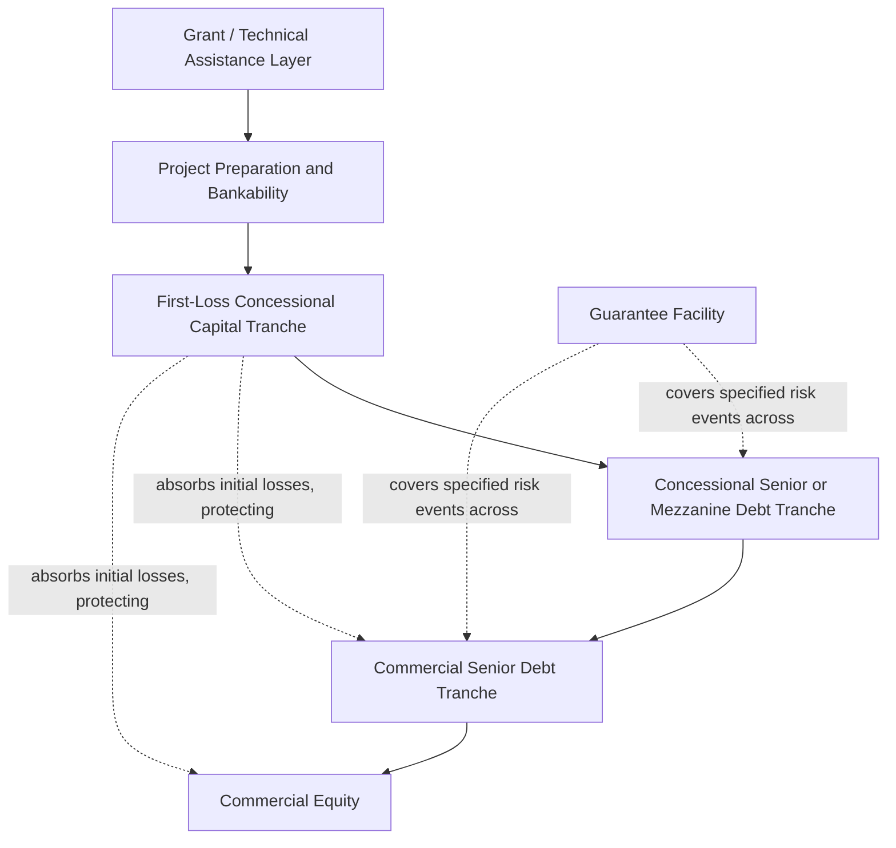

## Blended and Concessional Finance Instruments

### Overview

Blended and concessional finance refers to the strategic combination of below-market-rate ("concessional") capital — typically provided by governments, development finance institutions, philanthropic foundations, or dedicated climate and development funds — with commercial-rate capital, in order to make a project bankable that would not otherwise attract sufficient private investment on purely commercial terms. The underlying logic is that a discrete, carefully calibrated layer of concessional capital can absorb enough risk or return-gap to shift a project's blended risk-adjusted return profile into a range acceptable to commercial investors, without requiring the entire capital structure to be publicly or philanthropically funded.

**Key Points**

- Blended finance is distinguished from pure grant-based development assistance by its explicit intent to mobilize and "crowd in" private commercial capital alongside the concessional layer, rather than substituting for private investment entirely
- Concessionality can take multiple forms: below-market interest rates, extended tenors and grace periods beyond commercial norms, first-loss risk absorption, or outright grant funding for specific project preparation or capacity-building components
- A core structuring principle is "minimum concessionality" — using the smallest concessional subsidy necessary to make a transaction bankable, in order to preserve scarce concessional capital for the broadest possible mobilization of private investment across many transactions rather than over-subsidizing any single deal
- Blended finance structures are particularly prevalent in climate and energy transition financing, water and sanitation, and other sectors where strong developmental or environmental impact coexists with cash flow profiles that are marginal or insufficient under purely commercial return requirements

### Core Blended Finance Structuring Mechanisms

**Concessional Debt (Below-Market Rate or Extended Tenor)**: a distinct debt tranche priced below prevailing commercial rates for the relevant risk profile, or offering materially longer tenor and grace periods than commercial lenders would extend, funded by a development finance institution, climate fund, or bilateral donor agency rather than a commercial lender

**First-Loss Capital**: a subordinated tranche (debt or equity) that absorbs the first losses in a distressed scenario before any commercial capital is impaired, thereby reducing the effective risk borne by commercial lenders and equity investors in more senior positions — this is among the most capital-efficient blending mechanisms, since a relatively modest first-loss layer can meaningfully de-risk a much larger senior commercial tranche

**Guarantees and Risk Insurance**: similar in concept to the MDB partial credit and partial risk guarantees discussed in Role of Multilateral Development Banks, but often funded by dedicated concessional guarantee facilities rather than an MDB's own balance sheet, targeting specific risks (currency, political, or credit risk) that would otherwise deter commercial participation

**Technical Assistance Grants**: grant funding for project preparation, feasibility studies, capacity building, or post-financial-close monitoring and evaluation — addressing transaction costs and capability gaps rather than directly subsidizing the project's financial returns, but nonetheless a form of blended concessional support integral to making many transactions reach financial close at all

**Results-Based/Outcome-Based Payments**: concessional funding disbursed contingent on the achievement of specified development or impact outcomes (verified beneficiaries served, emissions reduced, capacity installed), aligning concessional capital disbursement with demonstrated impact rather than upfront unconditional funding

### Illustrative Mermaid Diagram: Layered Blended Finance Capital Structure

### The "Minimum Concessionality" Principle

Because concessional capital is a scarce resource relative to global development and climate financing needs, blended finance practitioners and the donor institutions funding these instruments generally apply a discipline of calibrating concessionality to the minimum level necessary to achieve bankability — rather than maximizing subsidy for any individual transaction. This principle has several practical implications for structuring:

1. **Return benchmarking**: the concessional layer's pricing or risk absorption is typically calibrated against a documented commercial return threshold (the return commercial investors in that market and sector would require absent the concessional support), with the concessional instrument sized to close the specific gap between the project's unassisted risk-adjusted return and that threshold — not simply set at an arbitrarily generous level
2. **Sunset and step-up mechanisms**: some concessional instruments include provisions for the concessional terms to become less generous over time (a "sunset" on preferential pricing, or a step-up in interest rates as the project matures and de-risks), reflecting the view that concessionality should support bankability at inception rather than indefinitely subsidize an operating project's ongoing returns
3. **Crowding-in evaluation**: donor institutions and development finance providers increasingly require or encourage demonstrable evidence that the concessional layer genuinely mobilized additional private capital that would not otherwise have participated, rather than simply subsidizing a transaction that commercial capital would have financed on its own terms regardless (an "additionality" concern closely related to the one discussed for MDBs generally)

[Inference] In practice, precisely quantifying the counterfactual — what commercial capital would or would not have financed absent the concessional layer — is analytically difficult and often relies on qualitative market sounding and comparable transaction benchmarking rather than a rigorous, verifiable counterfactual measurement, so additionality assessments in blended finance should be understood as informed judgment rather than a precise calculation.

### Modeling a First-Loss Tranche Structure

**Example**

Consider a $100,000,000 off-grid solar mini-grid portfolio project in a frontier market, where commercial lenders require a minimum expected loss-adjusted return that the underlying project cash flows cannot support given genuine uncertainty around customer payment collection rates and currency risk. A blended structure might allocate:

- $10,000,000 first-loss concessional capital (10% of total), funded by a dedicated climate/development blended finance facility, structured as deeply subordinated debt or equity-like capital that absorbs the first $10,000,000 of any shortfall in debt service or capital losses
- $70,000,000 senior commercial debt, priced at rates reflecting the residual risk after the first-loss layer absorbs initial losses — materially lower than the rate that would be required absent the first-loss protection
- $20,000,000 sponsor equity, ranking behind both debt tranches but ahead of the first-loss layer's subordination position in terms of ongoing distribution priority (though the first-loss layer typically absorbs losses ahead of equity in a downside scenario, reflecting its specific loss-absorption purpose rather than a simple seniority ranking)

The cash flow waterfall in this structure must explicitly model the first-loss layer's dual role: it typically receives distributions only after senior debt service and required reserve funding (similar to equity in an upside scenario), but absorbs losses ahead of both senior debt and, often, ahead of or alongside sponsor equity in a downside scenario — a structure sometimes described as "junior in cash flow priority in good times, senior in loss absorption in bad times" relative to ordinary equity.

$$\text{Effective Senior Debt Expected Loss} = \max(0, \; \text{Portfolio Loss} - \text{First-Loss Tranche Size})$$

This formula illustrates the core mechanic: senior lenders only bear expected loss to the extent portfolio losses exceed the first-loss tranche's absorptive capacity, which is precisely why a relatively modest first-loss layer can materially improve senior debt pricing and availability.

### Concessional Debt Pricing and Grant Element Calculation

Development finance institutions and donor agencies frequently quantify the degree of concessionality in a loan using a "grant element" calculation, comparing the present value of the concessional loan's below-market terms against what a market-rate loan of equivalent principal and tenor would cost:

$$\text{Grant Element} = 1 - \frac{PV(\text{Concessional Loan Debt Service}, r_{market})}{\text{Loan Principal}}$$

where $r_{market}$ is the prevailing market discount rate for a comparable commercial loan. A grant element of, for example, 25% indicates the concessional loan's terms are equivalent in present-value benefit to providing 25% of the loan principal as an outright grant, with the remaining 75% effectively priced at market terms — this metric is commonly used by donor institutions (and is central to OECD Development Assistance Committee reporting conventions) to quantify and compare the degree of concessionality embedded in different instruments and transactions.

### Blended Finance in Climate and Energy Transition Contexts

Blended finance has become particularly prominent in climate-related infrastructure financing, where projects may generate strong environmental and social value (emissions reduction, energy access, climate resilience) but insufficient standalone commercial returns, especially in emerging and developing markets where currency risk, offtaker credit risk, and early-stage technology risk compound to deter purely commercial capital. Common blended structures in this space include:

- **Climate risk guarantees**: covering specific climate-technology performance risk or resource variability risk (e.g., wind or solar resource shortfall relative to forecast) that commercial lenders are unwilling to bear without credit enhancement
- **Currency risk mitigation facilities**: dedicated concessional facilities providing local-currency hedging or first-loss currency risk protection in markets where commercial currency hedging is unavailable or prohibitively expensive over the long tenors project finance requires
- **Green/climate-dedicated concessional funds**: including entities such as the Green Climate Fund and various bilateral and multilateral climate finance facilities, which specifically target blended structures in renewable energy, climate adaptation, and related infrastructure in developing countries

### Comparative Table: Blended Finance Instruments by Function

| Instrument | Primary Function | Typical Position in Capital Structure |
| --- | --- | --- |
| Grant / Technical Assistance | Address transaction costs, capacity gaps, project preparation | Outside capital structure (pre-financing) |
| First-Loss Capital | Absorb initial losses, de-risk senior tranches | Deeply subordinated, loss-absorbing |
| Concessional Debt | Reduce weighted average cost of capital directly | Senior or mezzanine, priced below market |
| Guarantee Facility | Cover specific risk events (political, currency, performance) | Contingent, off-balance-sheet until triggered |
| Results-Based Payment | Align disbursement with verified outcomes | Often structured as milestone-linked grant or subsidy |

### Practical Modeling Checklist

- Model each concessional instrument as a distinct, explicitly identified layer in the capital structure rather than blending its terms into an average cost of capital, since donor reporting, additionality assessment, and structuring negotiation all require visibility into the specific concessional component's size and terms
- For first-loss tranches, build explicit loss-absorption waterfall logic (losses allocated to the first-loss layer before senior tranches) separately from the ordinary cash flow distribution waterfall (which typically treats the first-loss layer as junior to senior debt service)
- Calculate and document the grant element or equivalent concessionality metric for any below-market debt tranche, both for donor reporting purposes and to support minimum-concessionality structuring discipline
- Where sunset or step-up provisions apply to concessional pricing, model the resulting change in debt service explicitly over the loan's life rather than assuming a static concessional rate throughout
- Cross-reference guarantee and risk insurance mechanics against the waterfall and reimbursement modeling approach established in Wrapped Versus Unwrapped Bond Structures and Role of Multilateral Development Banks, since blended finance guarantees typically function similarly regardless of whether the guarantor is an MDB or a dedicated concessional facility

**Next Steps**

- Explore Currency Risk Mitigation Facilities in Emerging Market Project Finance
- Explore OECD Development Assistance Committee Grant Element Reporting Standards
- Explore Results-Based Financing and Outcome-Linked Disbursement Mechanics
- Explore Climate Finance Facilities: Green Climate Fund and Comparable Institutions
- Explore Additionality Measurement Challenges in Blended Finance
- Explore Interaction Between Blended Finance and ECA/MDB Co-Financing Structures