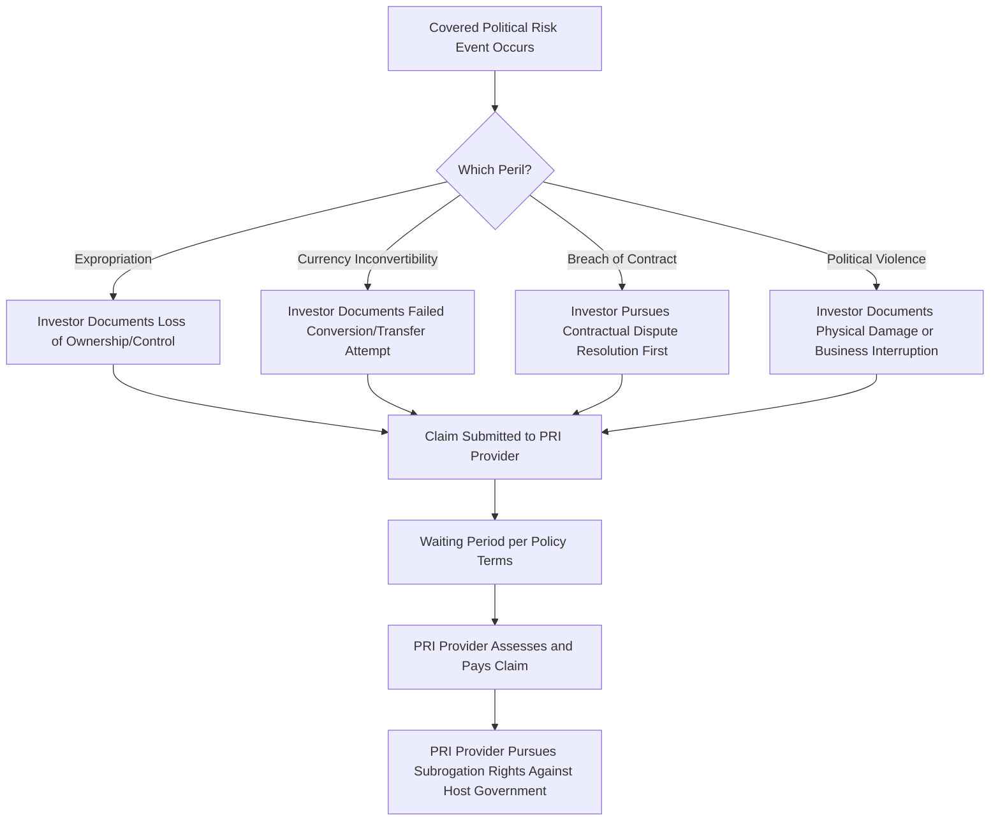

## Political Risk Insurance and Guarantees

### Overview

Political risk insurance (PRI) and guarantees provide protection against losses arising from actions or inactions by host governments — as opposed to commercial or performance risks arising from the project itself, its counterparties, or the broader market. PRI is a distinct and complementary risk mitigation tool alongside the credit enhancement mechanisms discussed in Wrapped Versus Unwrapped Bond Structures and the multilateral guarantee structures described in Role of Multilateral Development Banks, specifically targeting the sovereign and political risk layer that most heavily deters private commercial capital from financing infrastructure in emerging and higher-risk jurisdictions.

**Key Points**

- PRI is provided by a mix of public and quasi-public providers (MIGA, national ECAs' political risk insurance arms, bilateral development finance institutions) and private commercial insurers and reinsurers operating in the Lloyd's and broader specialty insurance markets
- Standard covered perils typically include expropriation and nationalization, currency inconvertibility and transfer restriction, breach of contract by a government or state-owned entity, and political violence (war, civil disturbance, terrorism)
- PRI is distinguished from the broader "political risk guarantee" category provided by MDBs (partial risk guarantees) by typically being a pure insurance contract funded through a premium, held by the investor or lender as the insured party, rather than a guarantee embedded directly within the loan or bond documentation
- The presence of PRI can materially affect a project's financeability, its achievable credit rating (per the frameworks in Rating Agency Methodologies for Project Finance), and the pricing and tenor commercial lenders are willing to offer in markets they would not otherwise enter

### Standard Covered Perils

**Expropriation and Nationalization**: covers direct government seizure of project assets or shares, as well as "creeping expropriation" — a series of incremental government actions (regulatory changes, discriminatory taxation, licensing revocation) that cumulatively deprive the investor of the substantial benefit of ownership without a single overt seizure event. Creeping expropriation coverage is often the more contentious and heavily negotiated element of a PRI policy, since it requires defining a threshold at which a series of individually defensible government actions collectively constitutes a compensable event

**Currency Inconvertibility and Transfer Restriction**: covers the risk that a host government imposes exchange controls or restrictions preventing the investor or lender from converting local currency project revenues into hard currency, or from transferring hard currency out of the host country to service foreign-currency-denominated debt or repatriate equity returns — a particularly relevant risk for project finance transactions where debt service is typically denominated in a hard currency (USD, EUR) while project revenues are earned in local currency

**Breach of Contract / Contract Frustration**: covers losses arising from a host government or state-owned counterparty's failure to honor its contractual obligations under a concession agreement, power purchase agreement, or other project-critical contract, where the investor is unable to obtain adequate compensation through the contract's own dispute resolution mechanisms (commonly requiring exhaustion of, or at least genuine attempted recourse to, arbitration or other agreed dispute resolution before a claim becomes payable)

**Political Violence, War, and Civil Disturbance**: covers physical damage to project assets or business interruption losses arising from war, civil war, insurrection, terrorism, or civil disturbance — risks that are typically excluded from standard commercial property and business interruption insurance, requiring this specialized coverage

### Illustrative Mermaid Diagram: PRI Claims Process

### Providers of Political Risk Insurance

**Multilateral Investment Guarantee Agency (MIGA)**: part of the World Bank Group, MIGA is among the largest and most prominent public providers of PRI specifically for investments in developing member countries, offering coverage against the standard perils described above, and benefiting from the World Bank Group's broader preferred creditor status and diplomatic standing when pursuing claims or engaging with host governments

**National ECA Political Risk Insurance Arms**: many export credit agencies (see Export Credit Agency Financing Structures) offer standalone or bundled political risk insurance alongside their core export finance products, typically available to investors and lenders from their home country supporting outbound investment or export-linked project finance

**Bilateral Development Finance Institutions**: national development finance institutions (such as the US International Development Finance Corporation, DFC, and comparable European and other national institutions) frequently offer PRI products as part of their broader development finance toolkit, often in combination with direct lending or equity investment in the same transaction

**Private Commercial Political Risk Insurance Market**: a specialized segment of the commercial insurance and reinsurance market (concentrated substantially, though not exclusively, in the Lloyd's of London market and among a limited number of specialist global insurers) offers PRI on commercial terms, often used to supplement or extend beyond the capacity limits of public providers, or in markets/situations where public providers' developmental mandate criteria are not met

**Berne Union**: while not itself a PRI provider, the Berne Union is the international association of export credit and investment insurance providers (encompassing most major ECAs, MDB-affiliated providers like MIGA, and many private insurers), serving as a forum for information-sharing on risk assessment, claims experience, and market practice across the PRI and export credit insurance industry.

[Unverified] The specific capacity limits, current market pricing levels, and competitive dynamics between public and private PRI providers shift with market conditions and are best assessed against current market soundings or broker guidance for a specific transaction, jurisdiction, and risk profile rather than assumed static.

### Pricing and Policy Structure

PRI premiums are typically expressed as an annual percentage of the insured exposure amount, varying substantially based on:

- The specific host country's political risk profile (often benchmarked against country risk ratings from export credit or sovereign risk rating frameworks)
- The specific perils covered (comprehensive multi-peril coverage costs more than a narrower single-peril policy)
- The tenor of coverage sought (longer coverage periods, common in project finance given long debt tenors, generally command higher cumulative premium)
- The insured amount relative to the total transaction size, and whether coverage is structured on a first-loss, pro-rata, or excess-of-loss basis relative to other risk mitigants in the transaction

**Waiting Periods**: most PRI policies incorporate a defined waiting period between the occurrence of a covered event and the point at which a claim becomes payable, intended to distinguish genuine, sustained political risk events from short-term disruptions that may resolve without triggering a compensable loss — this waiting period is a material structuring consideration, since it means PRI generally does not provide immediate liquidity relief but rather compensates for a loss confirmed to be genuinely sustained

**Subrogation Rights**: upon paying a claim, PRI providers typically acquire subrogation rights allowing them to pursue recovery directly against the host government, leveraging the provider's own diplomatic and institutional relationships — for public providers like MIGA, this subrogation mechanism is considered a meaningful deterrent against host government actions that could trigger claims, since governments generally wish to avoid direct disputes with major international financial institutions

### Modeling PRI in a Project Finance Structure

**Premium as an Ongoing Cost**: PRI premiums are typically modeled as an ongoing annual operating or financing cost, expressed as a percentage of insured principal or exposure, reducing distributable cash flow but providing offsetting risk mitigation value that may support improved debt pricing, extended tenor, or overall project bankability that would not otherwise be achievable

**Coverage Structuring Relative to Debt Schedule**: since PRI coverage is typically purchased for a specific insured amount and tenor, the model should track the insured exposure amount against the outstanding debt or equity balance over time, particularly where coverage is structured to decline in step with an amortizing debt schedule rather than remaining constant at the original principal amount throughout the coverage period

**Interaction with Rating Agency Assessment**: consistent with the rating agency frameworks discussed in Rating Agency Methodologies for Project Finance, the presence of robust PRI coverage is typically treated as a positive structural/legal protection modifier in agency assessments, though it generally does not fully substitute for underlying project or country risk in the way a full credit wrap or guarantee might — PRI mitigates specific political risk perils rather than providing a comprehensive payment guarantee

**Claims Timing and Liquidity Bridging**: because of the waiting periods common to PRI policies, sponsors and lenders in a project with meaningful political risk exposure often model a complementary liquidity mechanism (a dedicated reserve account or short-term standby facility) to bridge the period between a covered event's occurrence and eventual claim payment, since the model should not assume PRI proceeds are available immediately upon a triggering event

### Comparative Table: PRI vs. Related Risk Mitigation Tools

| Feature | Political Risk Insurance | MDB Partial Risk Guarantee | Full Credit Wrap |
| --- | --- | --- | --- |
| Scope of Coverage | Specific enumerated political perils | Specific enumerated risk events, often government-related | Comprehensive payment guarantee (any shortfall cause) |
| Typical Provider | MIGA, ECAs, DFIs, private insurers | MDBs | Monoline insurers (historically), MDBs (partial) |
| Payment Trigger | Confirmed covered peril occurrence, post waiting period | Defined risk event occurrence | Any payment shortfall, regardless of cause |
| Effect on Credit Rating | Positive modifier, not full substitution | Can meaningfully lift rating for covered tranche/period | Can lift rating to guarantor's own rating |
| Held By | Investor or lender (as named insured) | Embedded in loan/bond structure | Embedded in bond structure |

### Practical Modeling Checklist

- Model PRI premiums as an explicit ongoing cost line, sized as a percentage of insured exposure and adjusted for any scheduled decline in coverage amount over the debt or investment life
- Build in an explicit waiting period assumption between a hypothetical covered event and claim payment when stress-testing scenarios involving political risk, rather than assuming instantaneous claim proceeds
- Distinguish clearly in the model's documentation between PRI (investor/lender-held insurance against specific perils) and MDB or ECA guarantees embedded directly in the debt structure, since these have different waterfall treatment, claims mechanics, and rating agency implications
- Where multiple political risk mitigation layers are stacked (e.g., PRI alongside an MDB partial risk guarantee), map precisely which specific perils and risk periods each instrument covers to avoid gaps or unintended overlaps in coverage
- Cross-reference the country risk assumptions underlying PRI pricing against the same country risk inputs used elsewhere in the model (e.g., ECA country risk premium categorization per Export Credit Agency Financing Structures) to ensure internal consistency in how the model represents sovereign risk across different structural elements

**Next Steps**

- Explore Currency Inconvertibility Risk Modeling and Local Currency Hedging Alternatives
- Explore Creeping Expropriation: Legal Standards and Claims Precedent
- Explore Interaction Between PRI, ECA Cover, and MDB Guarantees in a Single Transaction
- Explore Private Political Risk Insurance Market Capacity and Lloyd's Syndicate Structures
- Explore International Investment Arbitration as a Complement to Political Risk Insurance
- Explore Country Risk Rating Frameworks Used Across ECA, PRI, and Rating Agency Contexts