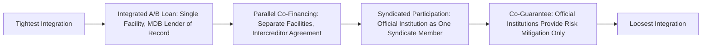

## Co-Financing and B-Loan Structures

### Overview

Co-financing and B-loan structures describe the arrangements through which multilateral development banks and other official financing institutions combine their own direct lending capacity with additional capital mobilized from commercial banks, institutional investors, and other financing sources within a single, coordinated transaction. While the A/B loan structure introduced in Role of Multilateral Development Banks is the most formalized and widely used version of this concept, co-financing more broadly encompasses a range of structures through which official and private capital sources participate alongside one another in financing a single project.

**Key Points**

- Co-financing structures exist on a spectrum from tightly integrated single-facility arrangements (classic A/B loans, where the MDB remains lender of record for the entire facility) to more loosely coordinated parallel financing (separate facilities from different institutions financing different cost categories or tranches of the same project, documented under separate agreements)
- The core economic rationale is capital mobilization: official institutions have limited direct balance sheet capacity relative to global infrastructure financing needs, so structures that allow a modest amount of official capital to catalyze a much larger pool of private commercial capital extend the practical reach of scarce official resources
- Co-financing structures introduce meaningful intercreditor complexity, since participants often have different risk appetites, return requirements, regulatory constraints, and institutional mandates that must be reconciled within a single project's security package, covenant structure, and decision-making framework
- The specific structure chosen (integrated A/B loan vs. parallel co-financing vs. syndicated participation) has material implications for how commercial participants' exposure is perceived by rating agencies and bank regulators, particularly regarding preferred creditor status benefits

### Spectrum of Co-Financing Structures

**Integrated A/B Loan (Single Facility, MDB as Lender of Record)**: as detailed in Role of Multilateral Development Banks, the MDB extends its own A-loan and simultaneously arranges a B-loan syndicated to commercial participants, with the MDB remaining the lender of record for the entire combined facility under a single loan agreement. This is the tightest form of integration and the structure most clearly associated with commercial participants benefiting from the practical effects of the MDB's preferred creditor status

**Parallel Co-Financing (Separate Facilities, Same Project)**: multiple lenders (which may include one or more MDBs, ECAs, and commercial banks) each extend separate loan facilities to the same project SPV under distinct loan agreements, coordinated through a common intercreditor agreement or memorandum of understanding but without the single-lender-of-record structure of an A/B loan. This structure is common where multiple official institutions with different mandates (an MDB and a bilateral DFI, for example) each wish to maintain their own direct lending relationship and documentation standards rather than subordinating their position within another institution's facility

**Syndicated Participation with Official Anchor**: an MDB or DFI takes a meaningful but not necessarily lead position in a broader commercial bank syndicate, functioning more as one participant among several rather than as the structuring anchor institution — this structure is more common in larger, more commercially mature transactions where the official institution's primary value-add is signaling and modest risk participation rather than being essential to achieving financial close at all

**Co-Guarantee Structures**: rather than co-financing debt directly, multiple official institutions jointly or separately provide credit enhancement (guarantees, political risk insurance) covering different risk layers or time periods of a single commercially-originated financing, allowing the underlying debt to be provided by a single commercial lender group while multiple official institutions contribute risk mitigation rather than funded capital

### Illustrative Mermaid Diagram: Co-Financing Structure Spectrum

### Rationale for Co-Financing from Each Participant's Perspective

**From the MDB or Official Institution's Perspective**: co-financing extends the practical reach of limited balance sheet capacity, allowing the institution to support a larger volume and scale of projects than its own direct lending capacity alone would permit, while retaining the ability to embed its own developmental, environmental, and social safeguard standards into the overall transaction structure even where the majority of funded capital comes from commercial sources

**From the Commercial Lender's Perspective**: participation alongside an MDB or other official institution can provide access to transactions and markets that would otherwise fall outside a commercial bank's independent risk appetite, benefit from the practical effects of preferred creditor status (in integrated A/B structures), and benefit from the official institution's due diligence, structuring expertise, and ongoing monitoring capacity in markets where the commercial lender may have less direct on-the-ground experience

**From the Sponsor's Perspective**: co-financing structures can improve overall financing terms (blending official institutions' typically more patient, development-mandate-driven pricing with commercial capital) while also potentially extending the aggregate financing available beyond what either official or commercial sources could provide independently, and can lend a degree of market credibility and comfort to a transaction that helps attract additional commercial participation

### Intercreditor Complexity in Co-Financing Structures

Reconciling multiple financing participants with differing mandates, risk appetites, and institutional requirements within a single project's security package and governance framework requires careful attention to several recurring structuring issues:

**Voting and Consent Thresholds**: intercreditor agreements must specify how decisions (waiver requests, amendment approvals, enforcement actions) are made across a diverse creditor group — official institutions with development mandates may have different priorities regarding, for example, environmental and social covenant waivers than purely commercial lenders would, requiring carefully negotiated voting mechanics (simple majority, supermajority, or unanimous consent thresholds depending on the decision category)

**Standstill and Enforcement Coordination**: in a default or distress scenario, coordinating enforcement action across multiple lender groups with potentially different incentives (an MDB may prioritize a negotiated restructuring preserving the project's developmental function, while commercial lenders may prioritize maximizing recovery value) requires explicit standstill periods and coordinated enforcement provisions within the intercreditor framework

**Environmental and Social Safeguard Compliance**: where an MDB or DFI's participation is contingent on the project meeting specific environmental and social performance standards, the intercreditor and loan documentation structure must address what happens if a safeguard breach occurs — whether this triggers a default under the entire co-financed facility or only under the specific official institution's tranche, and how commercial lenders' interests are protected if official institution-specific covenants are breached

**Currency and Payment Priority Coordination**: where co-financing sources are denominated in different currencies (a common feature when ECA, MDB, and commercial tranches are combined, as discussed in Export Credit Agency Financing Structures), the intercreditor structure must address currency conversion mechanics and payment priority in the event of insufficient project cash flow to service all tranches according to their originally scheduled terms

### Example: Multi-Institution Co-Financing for a Renewable Energy Project

**Example**

Consider a $400,000,000 wind power project in a frontier emerging market structured with co-financing from multiple sources:

- An MDB integrated A/B loan: $40,000,000 MDB A-loan plus $120,000,000 syndicated B-loan to commercial banks (per the structure in Role of Multilateral Development Banks)
- A bilateral DFI parallel facility: $60,000,000 extended directly under a separate loan agreement, coordinated via intercreditor agreement but not integrated into the MDB's single-facility structure
- An ECA buyer credit facility: $100,000,000 supporting turbine procurement from the ECA's home country, per the structures described in Export Credit Agency Financing Structures
- Sponsor equity: $80,000,000

This structure requires an intercreditor agreement coordinating four distinct creditor groups (MDB/commercial B-loan participants as a combined group under the A/B structure, the bilateral DFI, and the ECA) each with potentially different currency denominations, repayment profiles, and covenant packages, all secured against the same underlying project assets and cash flows — illustrating why co-financing transactions of this complexity typically require materially longer structuring and documentation timelines than a single-source commercial financing.

### Modeling Co-Financing Structures

**Distinct Tranche Modeling with Explicit Currency and Repayment Terms**: consistent with the multi-tranche modeling approach described for ECA structures, each co-financing source should be modeled as a distinct tranche with its own currency, disbursement schedule, interest rate basis, and repayment profile, since co-financing structures frequently combine tranches with genuinely different terms rather than a uniform blended facility

**Waterfall Priority Reflecting Actual Negotiated Ranking**: the model's cash flow waterfall must reflect the actual negotiated payment priority among co-financing tranches as documented in the intercreditor agreement, which may not be a simple pari passu treatment across all tranches even where the underlying security package is shared — some co-financing structures explicitly subordinate certain tranches (particularly deeply concessional or blended finance layers per Blended and Concessional Finance Instruments) to others

**Sensitivity Testing Across Currency Exposures**: where co-financing spans multiple currencies, the model should stress-test the project's ability to service all tranches under adverse currency movement scenarios, since a shortfall may arise in one currency's debt service even where the project's aggregate cash flow in base-currency terms remains adequate

**Covenant Compliance Tracking by Tranche and by Institution**: because different official institutions may impose distinct covenant requirements (particularly environmental and social safeguards specific to an MDB or DFI's own policies), the model or an accompanying compliance tracking mechanism should monitor covenant compliance at the level of each institution's specific requirements rather than assuming a single unified covenant package applies uniformly across all co-financing sources

### Illustrative SVG: Multi-Source Co-Financing Intercreditor Structure (svg_diagram)

<svg xmlns="http://www.w3.org/2000/svg" viewBox="0 0 800 320">
\<style\>
.lbl { font-family: sans-serif; font-size: 12px; fill: #222; }
.small { font-family: sans-serif; font-size: 10.5px; fill: #444; }
.title { font-family: sans-serif; font-size: 14px; font-weight: bold; fill: #111; }
\</style\>
<text x="400" y="24" text-anchor="middle" class="title">Multi-Source Co-Financing Intercreditor Structure (svg_diagram)</text>
<rect x="30" y="60" width="170" height="80" fill="#d5f5e3" stroke="#1e8449" />
<text x="115" y="90" text-anchor="middle" class="lbl">MDB A/B Loan</text>
<text x="115" y="108" text-anchor="middle" class="small">$40M A-loan + $120M B-loan</text>
<rect x="220" y="60" width="170" height="80" fill="#d6eaf8" stroke="#2874a6" />
<text x="305" y="90" text-anchor="middle" class="lbl">Bilateral DFI</text>
<text x="305" y="108" text-anchor="middle" class="small">$60M parallel facility</text>
<rect x="410" y="60" width="170" height="80" fill="#fdebd0" stroke="#b9770e" />
<text x="495" y="90" text-anchor="middle" class="lbl">ECA Buyer Credit</text>
<text x="495" y="108" text-anchor="middle" class="small">$100M turbine procurement</text>
<rect x="600" y="60" width="170" height="80" fill="#f2c7c3" stroke="#943126" />
<text x="685" y="90" text-anchor="middle" class="lbl">Sponsor Equity</text>
<text x="685" y="108" text-anchor="middle" class="small">$80M</text>
<line x1="115" y1="140" x2="115" y2="180" stroke="#333" />
<line x1="305" y1="140" x2="305" y2="180" stroke="#333" />
<line x1="495" y1="140" x2="495" y2="180" stroke="#333" />
<line x1="685" y1="140" x2="685" y2="180" stroke="#333" />
<line x1="115" y1="180" x2="685" y2="180" stroke="#333" />
<line x1="400" y1="180" x2="400" y2="210" stroke="#333" />
<polygon points="400,210 394,200 406,200" fill="#333" />
<rect x="220" y="215" width="360" height="40" fill="#eaecee" stroke="#555" />
<text x="400" y="239" text-anchor="middle" class="small">Intercreditor Agreement Coordinating All Four Sources</text>
<line x1="400" y1="255" x2="400" y2="280" stroke="#333" />
<polygon points="400,280 394,270 406,270" fill="#333" />
<rect x="280" y="285" width="240" height="30" fill="#eaecee" stroke="#555" />
<text x="400" y="305" text-anchor="middle" class="small">Shared Project Security Package</text>
</svg>

### Practical Modeling Checklist

- Identify and document the specific co-financing structure type (integrated A/B, parallel, syndicated, or co-guarantee) for each institutional participant, since this determines both the modeling approach for that tranche and its likely preferred-creditor or rating agency treatment
- Model each co-financing tranche with its own currency, disbursement, and repayment terms rather than aggregating dissimilar tranches into a simplified blended debt schedule
- Confirm and reflect the actual negotiated waterfall priority among tranches, particularly where blended or concessional layers per Blended and Concessional Finance Instruments carry explicit subordination
- Build currency mismatch stress scenarios where co-financing spans multiple currencies, testing debt service capacity in each currency independently as well as in aggregate
- Track covenant compliance separately by institution where environmental, social, or other institution-specific requirements differ across co-financing sources, avoiding the assumption of a single uniform covenant package

**Next Steps**

- Explore Intercreditor Agreement Drafting and Voting Threshold Design
- Explore Currency Mismatch Risk Management in Multi-Currency Co-Financed Structures
- Explore Environmental and Social Safeguard Harmonization Across Co-Financing Institutions
- Explore Standstill and Coordinated Enforcement Provisions in Distressed Co-Financed Projects
- Explore Comparative Case Studies: Integrated A/B Loans vs. Parallel Co-Financing Outcomes
- Explore Chapter Transition: Financial Modeling Mechanics and Cash Flow Waterfall Construction