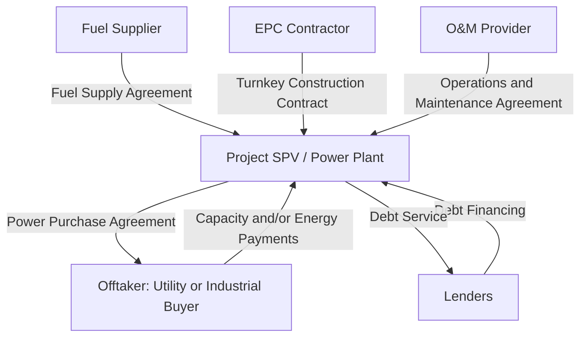

## Conventional Thermal Power Project Finance

### Overview

Conventional thermal power project finance encompasses the financing of power generation assets that convert fossil fuel or, in some cases, biomass energy into electricity via combustion-driven thermodynamic cycles — principally coal-fired, natural gas-fired (both simple-cycle and combined-cycle), and oil-fired generation. This category represents one of the most mature and historically well-precedented segments of project finance, with decades of standardized contractual structures, financing conventions, and rating agency methodology developed specifically around the risk characteristics of thermal generation assets.

**Key Points**

- Thermal power project finance risk analysis centers on three interlocking contractual relationships: the fuel supply arrangement, the offtake/power purchase arrangement, and the engineering, procurement, and construction (EPC) contract governing the plant's construction
- The dominant financing structure historically has relied on long-term power purchase agreements (PPAs) with creditworthy offtakers, which convert what would otherwise be merchant price and volume risk into a more bankable, contracted revenue stream — though merchant and quasi-merchant thermal structures exist and carry materially different risk and financing profiles
- Fuel price and fuel supply risk allocation is a defining structural feature distinguishing thermal power finance from renewable energy finance (where "fuel" — wind, sun — is free but variable), requiring dedicated fuel supply agreements, price pass-through mechanisms, or tolling structures to manage this risk
- Combined-cycle gas turbine (CCGT) plants have become the dominant new-build conventional thermal technology in many markets due to superior thermal efficiency, lower emissions relative to coal, and shorter construction timelines than coal or nuclear alternatives, though coal remains prevalent in specific markets with domestic coal resources or existing coal-fired capacity

### Core Technology Categories and Risk Implications

**Coal-Fired Generation**: typically involves higher capital cost per megawatt and longer construction timelines than gas-fired alternatives, together with more complex fuel logistics (coal transportation, storage, and handling infrastructure) and increasingly significant environmental and regulatory risk in many jurisdictions given global decarbonization policy trends — this technology category has seen substantially reduced new-build financing activity in most OECD markets, with continued but geographically concentrated activity in specific emerging markets with domestic coal resources and energy security considerations

**Simple-Cycle Gas Turbines**: lower capital cost and faster construction timelines than combined-cycle plants, but lower thermal efficiency, typically deployed for peaking capacity (meeting short-duration demand spikes) rather than baseload generation, with financing structures often reflecting the plant's role as a capacity/reliability asset rather than a primary energy revenue generator

**Combined-Cycle Gas Turbine (CCGT) Plants**: combine a gas turbine with a heat recovery steam generator and steam turbine, capturing waste heat from the gas turbine cycle to generate additional electricity, achieving substantially higher thermal efficiency than simple-cycle plants — the dominant technology choice for new-build baseload and mid-merit thermal capacity in gas-available markets, with well-established financing precedent and technology risk considered low given decades of commercial operating history for major original equipment manufacturers' turbine platforms

**Oil-Fired Generation**: now relatively rare for new-build project finance outside of specific island or off-grid markets lacking gas infrastructure access, given higher fuel costs and emissions relative to gas alternatives

### Illustrative Mermaid Diagram: Core Contractual Structure for Thermal Power Project Finance

### Power Purchase Agreement Structures

**Tolling Agreements**: the offtaker (often a utility or trading entity) supplies fuel directly to the plant and pays a "tolling fee" for the conversion service, meaning the project SPV bears essentially no fuel price or fuel supply risk, with revenue structured primarily around capacity payments and a variable conversion fee tied to actual generation — this structure shifts virtually all commodity price risk to the offtaker, making the project's revenue stream highly predictable and bankable

**Capacity and Energy Payment PPAs**: the more common structure outside pure tolling arrangements, combining a fixed capacity payment (compensating the plant for being available to generate, regardless of actual dispatch) with a variable energy payment (compensating for actual electricity delivered, often designed to pass through fuel costs to the offtaker via an indexed fuel cost recovery mechanism). This structure similarly insulates the project from most fuel price risk through the pass-through mechanism, while capacity payments provide revenue certainty supporting debt service even during periods of low dispatch

**Take-or-Pay Provisions**: many thermal PPAs incorporate take-or-pay mechanics, obligating the offtaker to pay for a minimum contracted capacity or energy volume regardless of actual offtake, further insulating the project from demand/dispatch risk — the specific minimum volume and payment mechanics are a heavily negotiated element reflecting the relative bargaining power and risk appetite of sponsor and offtaker

**Merchant and Quasi-Merchant Structures**: in markets with liquid wholesale power markets and limited long-term PPA availability, thermal plants may be financed on a merchant basis, exposed to wholesale market price and dispatch risk — this structure requires materially more conservative debt sizing (lower leverage, higher minimum DSCR thresholds per the rating agency and lender approaches discussed in Rating Agency Methodologies for Project Finance) given the absence of contracted revenue certainty, and is more commonly financed with a meaningful hedging overlay (financial hedges, tolling-like structures with a counterparty, or a hybrid contracted/merchant revenue split)

### Fuel Supply Risk Allocation

**Example**

A 500 MW CCGT plant requires a reliable, long-term natural gas supply to operate as designed. The project's fuel risk allocation structure typically includes:

- A **Gas Supply Agreement (GSA)** with a creditworthy gas supplier (often structured with take-or-pay provisions mirroring the plant's own PPA take-or-pay obligations, creating a "back-to-back" risk allocation where the plant's fuel purchase obligations align with its power sale obligations)
- A **Gas Transportation Agreement (GTA)** securing pipeline capacity to deliver gas from the supply source to the plant, since pipeline capacity constraints or interruption risk represent a distinct risk layer from the underlying commodity supply itself
- **Fuel price indexation** in the PPA's energy payment component, designed so that changes in the underlying fuel cost are substantially passed through to the offtaker rather than absorbed by the project, preserving the project's margin and debt service capacity regardless of fuel price volatility

Where perfect back-to-back alignment between fuel supply obligations and power sale obligations cannot be achieved (differing take-or-pay volumes, mismatched contract tenors, or pricing formula differences between the GSA and PPA), the residual basis risk must be explicitly identified, quantified, and stress-tested in the financial model, since even small misalignments compounded over a 20+ year contract life can materially affect project economics.

### Modeling Thermal Power Project Cash Flows

**Capacity Factor and Dispatch Modeling**: unlike renewable projects where output is driven primarily by resource availability (wind speed, solar irradiance), thermal plant output modeling must account for dispatch decisions driven by the offtaker's economic dispatch order (particularly relevant for capacity/energy payment PPAs where actual generation volume affects revenue) or the plant's role in a tolling structure (where dispatch is at the offtaker's discretion and largely decoupled from the project's own revenue predictability)

**Heat Rate and Efficiency Degradation**: thermal plant efficiency, expressed as heat rate (fuel energy input required per unit of electricity output), typically degrades gradually over the plant's operating life due to equipment wear, requiring the model to incorporate a heat rate degradation curve consistent with OEM performance guarantees and industry-standard degradation assumptions, since this directly affects fuel consumption (in tolling or non-fully-passed-through structures) and the plant's competitive dispatch position in energy-only or partially merchant revenue structures

**Major Maintenance and Overhaul Reserve Accounts**: gas turbines require periodic major inspections and overhauls (commonly following manufacturer-specified operating hour or start-cycle intervals) representing large, lumpy capital expenditures rather than smooth ongoing maintenance costs. The model must build a major maintenance reserve account, typically funded through periodic contributions sized to accumulate sufficient reserves ahead of each scheduled major overhaul:

$$MM_t = MM_{t-1} + Contribution_t - Overhaul\ Expenditure_t$$

where $MM_t$ is the major maintenance reserve balance and $Contribution_t$ is sized based on a long-term maintenance plan or long-term service agreement with the original equipment manufacturer, discussed further below

**Long-Term Service Agreements (LTSAs)**: many thermal projects, particularly gas turbine-based plants, enter into a Long-Term Service Agreement with the turbine OEM, converting the lumpy, uncertain major maintenance cost profile into a more predictable periodic fee (often structured per operating hour or per start), which is generally viewed favorably by lenders and rating agencies as a risk mitigant against major maintenance cost and timing uncertainty, similar in risk-transfer logic to how a PPA converts merchant price risk into contracted revenue certainty

### Illustrative SVG: Thermal Plant Revenue and Cost Pass-Through Structure (svg_diagram)

<svg xmlns="http://www.w3.org/2000/svg" viewBox="0 0 800 280">
\<style\>
.lbl { font-family: sans-serif; font-size: 12px; fill: #222; }
.small { font-family: sans-serif; font-size: 10.5px; fill: #444; }
.title { font-family: sans-serif; font-size: 14px; font-weight: bold; fill: #111; }
\</style\>
<text x="400" y="24" text-anchor="middle" class="title">Thermal Plant Revenue and Cost Pass-Through Structure (svg_diagram)</text>
<rect x="60" y="60" width="200" height="60" fill="#fdebd0" stroke="#b9770e" />
<text x="160" y="85" text-anchor="middle" class="lbl">Fuel Supplier</text>
<text x="160" y="103" text-anchor="middle" class="small">Gas Supply Agreement</text>
<rect x="310" y="60" width="200" height="140" fill="#d5f5e3" stroke="#1e8449" />
<text x="410" y="90" text-anchor="middle" class="lbl">Project SPV</text>
<text x="410" y="108" text-anchor="middle" class="small">Capacity Payment (fixed)</text>
<text x="410" y="123" text-anchor="middle" class="small">Energy Payment (fuel pass-through)</text>
<text x="410" y="138" text-anchor="middle" class="small">Major Maintenance Reserve</text>
<text x="410" y="153" text-anchor="middle" class="small">LTSA Fee to OEM</text>
<text x="410" y="168" text-anchor="middle" class="small">Debt Service</text>
<rect x="560" y="60" width="200" height="60" fill="#d6eaf8" stroke="#2874a6" />
<text x="660" y="85" text-anchor="middle" class="lbl">Offtaker</text>
<text x="660" y="103" text-anchor="middle" class="small">Power Purchase Agreement</text>
<line x1="260" y1="90" x2="310" y2="90" stroke="#333" marker-end="url(#arrow)" />
<line x1="510" y1="90" x2="560" y2="90" stroke="#333" marker-end="url(#arrow)" />
</svg>

### Comparative Table: Contracted Thermal vs. Merchant Thermal Financing

| Feature | PPA-Contracted (Capacity/Energy or Tolling) | Merchant/Quasi-Merchant |
| --- | --- | --- |
| Revenue Predictability | High — capacity payments largely fixed | Low to moderate — dependent on wholesale price/dispatch |
| Typical Leverage | Higher (70-85% debt common in strong-credit-offtaker structures) | Lower, more conservative leverage |
| Minimum DSCR Requirement | Lower (e.g., 1.2-1.35x range common) | Higher (e.g., 1.5x+ range common) given revenue volatility |
| Fuel Price Risk | Generally passed through to offtaker | Borne by project unless separately hedged |
| Financing Availability | Broadest — bank, bond, and institutional appetite | Narrower — often requires hedging overlay or higher equity |
| Key Credit Driver | Offtaker creditworthiness | Market price forecast and dispatch modeling robustness |

### Environmental, Regulatory, and Transition Risk Considerations

Conventional thermal power project finance, particularly coal-fired generation, faces increasingly significant transition risk considerations that must be incorporated into long-term financial modeling and lender risk assessment:

- **Carbon pricing and emissions regulation**: many jurisdictions have implemented or are developing carbon pricing mechanisms (cap-and-trade systems, carbon taxes) that directly affect thermal plant operating economics, requiring the model to incorporate carbon cost assumptions and their pass-through treatment (if any) under the relevant PPA structure
- **Stranded asset risk**: particularly for coal-fired assets, accelerating decarbonization policy in many markets raises the risk of early retirement or reduced dispatch before the originally contracted or expected asset life is reached, a risk increasingly reflected in lender and rating agency scrutiny of thermal project financing, especially for coal
- **Financing availability constraints**: a growing number of commercial banks, institutional investors, and even some ECAs have adopted policies restricting or eliminating new financing for coal-fired generation specifically, narrowing the available capital pool for this technology category relative to gas-fired alternatives and renewable energy

[Inference] The pace and jurisdictional variation in financing restrictions for coal-fired generation specifically (as opposed to thermal generation generally) continues to evolve with individual institutions' policy commitments and applicable regulatory frameworks, so current financing availability for any specific coal project should be assessed against the current policies of prospective lenders and investors rather than assumed from historical market norms.

### Practical Modeling Checklist

- Build the revenue model around the specific PPA structure (tolling, capacity/energy, or merchant) since this fundamentally determines which risks the project bears versus passes through to the offtaker
- Model fuel supply and transportation costs with explicit attention to back-to-back alignment (or lack thereof) with the PPA's fuel cost recovery mechanism, quantifying any residual basis risk
- Incorporate a heat rate degradation curve consistent with OEM guarantees and industry-standard assumptions, particularly relevant for the plant's dispatch competitiveness in any non-fully-passed-through revenue structure
- Build an explicit major maintenance reserve account schedule, ideally calibrated to a Long-Term Service Agreement fee structure where one exists, rather than assuming smooth ongoing maintenance costs
- Incorporate carbon pricing, emissions regulation costs, and transition/stranded asset risk considerations explicitly in long-term modeling assumptions and sensitivity analysis, particularly for coal-fired assets in jurisdictions with active or anticipated decarbonization policy

**Next Steps**

- Explore Renewable Energy Project Finance: Solar and Wind Structuring Differences
- Explore Power Purchase Agreement Negotiation and Risk Allocation in Depth
- Explore Long-Term Service Agreement Structuring and Major Maintenance Reserve Sizing
- Explore Merchant Power Price Forecasting and Hedging Strategies
- Explore Carbon Pricing Mechanisms and Their Modeling Treatment in Power Project Finance
- Explore Energy Storage and Hybrid Thermal-Renewable Project Structures