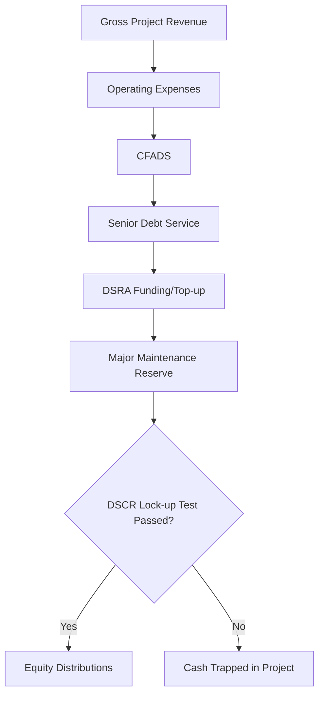

## Solar Photovoltaic Project Finance

### Overview

Solar photovoltaic (PV) project finance is the application of non-recourse or limited-recourse financing structures to utility-scale, commercial, or distributed solar generation assets. The project company (SPV — Special Purpose Vehicle) is capitalized with a mix of debt and equity, and lenders/investors look primarily to the cash flows generated by the project (through power sales) rather than to the balance sheet of the sponsor, for repayment.

Solar PV is one of the most "financeable" renewable technologies because of its relatively predictable resource (irradiance), modular and standardized equipment, low operating complexity (no fuel input, few moving parts), and short construction timelines relative to thermal or nuclear generation.

**Key Points**

- Non-recourse/limited-recourse debt is secured against project assets and cash flows, not sponsor balance sheets
- The SPV structure ring-fences project risk from the sponsor
- Revenue certainty (via PPAs, contracts-for-difference, or merchant exposure) is the single largest driver of financeability
- Solar's low technology risk (vs. wind's variability or storage's degradation complexity) generally permits higher leverage and longer tenors

### Industry Structure and Key Parties

| Party | Role |
| --- | --- |
| Sponsor/Developer | Originates the project, contributes equity, often retains O&M or asset management role |
| Lenders (Senior Debt) | Commercial banks, development finance institutions (DFIs), or institutional debt (private placements, green bonds) |
| Tax Equity Investors (US market) | Monetize Investment Tax Credit (ITC) / Production Tax Credit (PTC) and depreciation benefits |
| EPC Contractor | Engineering, Procurement, and Construction — delivers the plant on a fixed-price, date-certain basis |
| Offtaker | Utility, corporate buyer, or government entity purchasing power under a PPA |
| O&M Contractor | Operates and maintains the plant post-COD (Commercial Operation Date) |
| Independent Engineer (IE) | Lender-appointed technical advisor validating design, EPC contract, and performance assumptions |
| Insurance Advisor | Structures construction all-risk, delay-in-startup, and operational insurance |
| Modeling/Financial Advisor | Builds and audits the financial model underpinning the financing decision |

### Capital Structure

Solar PV projects typically target a debt-to-equity ratio between 70/30 and 85/15, reflecting the asset class's relatively low risk profile once operational.

**Debt Instruments**

- **Construction loan**: Drawn during the build phase, converts to (or is refinanced by) a term loan at COD
- **Term loan / mini-perm**: Amortizing senior debt sized against long-term cash flow (typically 15–20 years, sometimes shorter mini-perm structures of 5–7 years with a balloon refinancing)
- **Green bonds / project bonds**: Used for larger portfolios or post-COD refinancing where a fixed-rate, long-dated capital markets instrument is attractive
- **DFI/ECA financing**: Common in emerging markets (e.g., IFC, ADB, World Bank guarantees, export credit agencies backing equipment suppliers)

**Equity Instruments**

- **Sponsor equity**: Common equity from the developer, often 15–30% of capital stack
- **Tax equity** (US-specific): Structured as partnership flips or sale-leasebacks to transfer tax attributes (ITC/PTC, MACRS depreciation) to investors with sufficient tax appetite
- **Mezzanine debt**: Occasionally used to bridge the gap between senior debt and sponsor equity, subordinated in the waterfall

### Revenue Structures

Financeability of a solar project is fundamentally a function of revenue certainty. Common structures, ranked roughly from most to least "bankable":

1. **Fixed-price PPA (utility or corporate)**: Long-term (10–25 year) contract at a fixed or escalating tariff. This is the gold standard for project finance because it removes price risk almost entirely.
2. **Contract for Difference (CfD)**: Common in the UK and EU; project receives a strike price, paying back the difference to a counterparty (or the market) when wholesale prices exceed the strike.
3. **Feed-in Tariff (FiT)**: Government-mandated fixed tariff, historically used in Germany, Spain, and other early solar markets — now largely phased out for utility-scale in favor of auctions.
4. **Virtual PPA (VPPA)**: A financial hedge (contract for differences) between the project and a corporate offtaker, with the project selling physical power into the wholesale market separately.
5. **Merchant/Quasi-Merchant**: Project sells into the wholesale spot market with no offtake contract, or with a contract covering only a portion of output (hedged merchant). This carries the highest revenue risk and correspondingly lower achievable leverage.

**Example**

A 100 MWac solar project signs a 20-year PPA at $45/MWh with a utility offtaker, escalating 1.5% annually. Lenders will typically apply a P90 or P99 energy production estimate (see Resource Assessment below) against this contracted price to size senior debt, rather than the P50 (median) estimate used for equity returns modeling.

### Resource Assessment and Energy Yield

Unlike wind, solar irradiance is comparatively predictable and less spatially variable, which reduces (but does not eliminate) resource risk.

- **Solar resource data sources**: Satellite-derived datasets (e.g., NASA POWER, SolarGIS, Meteonorm, PVGIS) combined with on-site pyranometer/reference-cell measurements where available
- **P50/P90/P99 exceedance probabilities**:
  - P50 = median annual energy yield estimate (50% probability of exceeding this value) — used for base-case equity returns
  - P90 = 90% probability of exceedance (conservative) — used by senior lenders for debt sizing (1-year P90)
  - P99 = used for extreme downside/stress testing, sometimes for 10-year P90 (cumulative, less volatile than 1-year)
- **Performance Ratio (PR)**: The ratio of actual energy delivered to theoretical energy available given the irradiance, typically 78–85% for well-designed utility-scale plants, accounting for inverter losses, soiling, temperature derating, DC/AC mismatch, and availability losses
- **Degradation rate**: Modules typically degrade 0.4–0.7% per year (per manufacturer warranties), modeled explicitly over the loan/PPA tenor, compounding to reduce output ~10–15% by year 25

$$E_{AC,y} = E_{STC} \times PR \times (1 - d)^{y}$$

Where $E_{AC,y}$ is AC energy output in year $y$, $E_{STC}$ is nameplate energy under standard test conditions, $PR$ is the performance ratio, and $d$ is the annual degradation rate.

### Financial Model Mechanics

The project finance model is the central decision-making tool for both sponsors and lenders. It is built with explicit circularity (interest during construction, cash sweep mechanics, DSRA funding) and typically runs on a semi-annual or quarterly periodicity matching debt service dates.

**Core Model Components**

- **Construction budget and drawdown schedule**: EPC contract price, interconnection costs, land, development costs, contingency, financing fees, capitalized interest
- **Operating revenue**: Contracted PPA revenue plus any merchant tail or ancillary revenue (e.g., capacity payments, REC/environmental attribute sales)
- **Operating expenses**: O&M (fixed + variable), insurance, land lease, asset management fees, property taxes
- **Debt service**: Interest and principal (sculpted or level amortization)
- **Debt Service Coverage Ratio (DSCR)**:

$$DSCR = \frac{CFADS}{Debt\ Service}$$

Where CFADS (Cash Flow Available for Debt Service) = Operating Revenue − Operating Expenses − Working Capital Changes (before debt service and equity distributions).

Minimum DSCR covenants for contracted solar projects typically range **1.20x–1.35x**; merchant-exposed projects require higher minimum DSCRs (1.40x–1.75x+) [Unverified — exact thresholds are market- and deal-specific and shift with interest rate environment and lender risk appetite].

**Sculpted (Target) Amortization**

Rather than level amortization, project finance debt is often "sculpted" so that DSCR is held constant (e.g., at exactly 1.30x) across the loan tenor, back-solving for the principal repayment amount each period given fluctuating CFADS (due to degradation, seasonal irradiance patterns).

**Debt Sizing**

$$Debt\ Sizing = \min \begin{cases} \dfrac{PV(CFADS_{P90})}{Target\ DSCR} \\ Max\ Gearing \times Total\ Project\ Cost \end{cases}$$

Lenders size debt off the lower of (a) the present value of P90 CFADS discounted at the debt cost, divided by the minimum target DSCR, or (b) a maximum leverage constraint (e.g., 80% of total project cost).

### Reserve Accounts and Waterfall

Project finance debt agreements mandate a cash flow waterfall, typically structured as:

1. Operating expenses
2. Senior debt service (interest, then principal)
3. Debt Service Reserve Account (DSRA) funding — usually sized at 6 months of forward debt service
4. Major Maintenance Reserve Account (MMRA) — for inverter replacement (inverters typically require replacement or major refurbishment once within a 25–30 year asset life) and other capex
5. Subordinated debt (if any)
6. Distributions to equity (subject to lock-up tests — distributions are blocked if DSCR falls below a specified threshold, e.g., 1.10x, even if technically current on debt service)

### Risk Allocation Matrix

| Risk | Mitigation Mechanism |
| --- | --- |
| Construction cost overrun | Fixed-price, date-certain EPC contract; contingency reserve; performance bonds/LDs |
| Construction delay | Delay liquidated damages (LDs) from EPC contractor; Delay-in-Startup (DSU) insurance |
| Resource/production risk | P90/P99 sizing; performance guarantees from EPC/module suppliers |
| Equipment/technology risk | Bankability lists (Tier 1 module manufacturers); independent engineer due diligence; O&M performance guarantees |
| Offtake/price risk | Long-term PPA; hedging (VPPA); merchant tail haircuts in the model |
| Interconnection/curtailment risk | Interconnection agreements; curtailment compensation clauses in PPA; transmission studies |
| Counterparty credit risk | Offtaker credit rating analysis; letters of credit; parent guarantees |
| Regulatory/policy risk | Grandfathering clauses; political risk insurance (MIGA, DFIs) in emerging markets |
| Force majeure / weather | Insurance (property, business interruption); model stress testing |
| Currency risk (cross-border deals) | Local-currency debt matched to local-currency revenue; FX hedges |

### Tax Equity Structures (United States)

The US market has a distinct financing layer due to the Investment Tax Credit (ITC), historically 26–30%, with adders available for domestic content, energy communities, and low-income siting under the Inflation Reduction Act framework [Unverified — specific percentages and adders are subject to ongoing legislative change; verify current rates against IRS guidance at deal execution].

- **Partnership Flip**: Tax equity investor and sponsor form a partnership; tax equity receives the majority of tax benefits and a priority allocation of cash until reaching a target after-tax yield ("the flip"), after which allocations shift back to the sponsor
- **Sale-Leaseback**: The developer sells the project to a tax equity investor/lessor and leases it back, with lease payments structured to be economically equivalent to the developer retaining ownership
- **Inverted Lease**: A hybrid structure allocating tax credits and depreciation between a lessor and lessee/master tenant

These structures add legal and modeling complexity — a tax equity model requires explicit tracking of capital accounts, MACRS depreciation schedules, and IRS "flip" targets (typically 6–9% after-tax IRR to the tax equity investor) [Unverified — actual target yields vary by deal, market conditions, and investor].

### Illustrative Capital Stack (svg_diagram)

<svg xmlns="http://www.w3.org/2000/svg" viewBox="0 0 640 340">
<text x="320" y="28" text-anchor="middle" font-size="18" font-weight="bold" fill="#1a1a1a">Illustrative Solar PV Capital Stack (svg_diagram)</text>
<rect x="140" y="60" width="220" height="220" fill="none" stroke="#333" stroke-width="2" />
<rect x="140" y="60" width="220" height="150" fill="#3d6ea5" />
<text x="250" y="130" text-anchor="middle" font-size="15" fill="#ffffff" font-weight="bold">Senior Debt</text>
<text x="250" y="150" text-anchor="middle" font-size="13" fill="#ffffff">65-70%</text>
<text x="250" y="170" text-anchor="middle" font-size="12" fill="#e0e8f2">Non-recourse term loan</text>
<rect x="140" y="210" width="220" height="40" fill="#8a6fbf" />
<text x="250" y="234" text-anchor="middle" font-size="13" fill="#ffffff" font-weight="bold">Tax Equity ~15-20%</text>
<rect x="140" y="250" width="220" height="30" fill="#c98a3f" />
<text x="250" y="270" text-anchor="middle" font-size="12" fill="#ffffff" font-weight="bold">Sponsor Equity ~10-15%</text>
<line x1="380" y1="60" x2="420" y2="60" stroke="#333" stroke-width="1" />
<line x1="380" y1="210" x2="420" y2="210" stroke="#333" stroke-width="1" />
<line x1="380" y1="250" x2="420" y2="250" stroke="#333" stroke-width="1" />
<line x1="380" y1="280" x2="420" y2="280" stroke="#333" stroke-width="1" />

<text x="425" y="140" font-size="12" fill="#333">Lowest cost of capital,</text>

<text x="425" y="155" font-size="12" fill="#333">lowest risk, priority claim</text>

<text x="425" y="235" font-size="12" fill="#333">Monetizes ITC/PTC +</text>

<text x="425" y="250" font-size="12" fill="#333">depreciation benefits</text>

<text x="425" y="270" font-size="12" fill="#333">Highest cost of capital,</text>

<text x="425" y="285" font-size="12" fill="#333">residual risk, upside</text>

<text x="320" y="315" text-anchor="middle" font-size="12" fill="#555" font-style="italic">Indicative only — actual gearing varies by market, offtake structure, and jurisdiction</text>

</svg>

### Due Diligence Workstreams (Lender Perspective)

- **Technical**: Independent Engineer review of EPC contract, module/inverter datasheets and warranties, interconnection studies, energy yield assessment
- **Legal**: Site control (lease/land rights), permits, PPA enforceability, EPC/O&M contract review, security package (mortgage, pledge of shares, accounts, assignment of contracts)
- **Insurance**: Construction all-risk (CAR), delay-in-startup (DSU), operational all-risk, business interruption, third-party liability
- **Environmental & Social**: Equator Principles / IFC Performance Standards compliance where applicable (particularly for DFI-backed or emerging-market deals)
- **Model Audit**: Independent verification of the financial model's mechanics, circularity resolution, and covenant calculations

### Sensitivities Typically Stress-Tested

- Irradiance/production downside (P90/P99 scenarios, extended low-yield years)
- Module degradation rate above warranty assumptions
- O&M cost escalation above base case
- Interest rate movements (for floating-rate tranches, mitigated via interest rate swaps/caps)
- Construction delay and cost overrun beyond contingency
- Curtailment above modeled base case
- Merchant price downside (for any uncontracted revenue tail)
- Inflation/escalation mismatches between opex and revenue

### Distinguishing Solar from Other Renewable Asset Classes

| Factor | Solar PV | Onshore Wind | Battery Storage |
| --- | --- | --- | --- |
| Resource predictability | High (diurnal, seasonal patterns well understood) | Moderate (higher inter-annual variability) | N/A (dispatch-driven, not resource-driven) |
| Technology risk | Low (mature, modular) | Low-Moderate | Moderate-High (degradation, cycling life less mature) |
| O&M complexity | Low (few moving parts) | Moderate (gearboxes, blades) | Moderate (thermal management, augmentation) |
| Typical achievable leverage | Higher | Slightly lower | Generally lower (revenue stacking complexity) |
| Construction timeline | Short (12-18 months typical for utility-scale) | Moderate (18-24 months) | Short |

**Conclusion**

Solar PV project finance is characterized by strong financeability driven by predictable resource characteristics, mature and standardized technology, and (where available) long-term contracted revenue. The core analytical exercise for both sponsors and lenders centers on translating P50/P90 energy yield estimates into a robust CFADS forecast, sizing debt against conservative DSCR covenants, and structuring reserves and cash flow waterfalls that protect creditors while preserving sponsor/tax-equity returns. Jurisdiction-specific factors — particularly US tax equity monetization, EU/UK CfD mechanisms, and DFI involvement in emerging markets — materially shape the specific capital structure used in any given transaction.

**Related Topics**

- Wind Project Finance (Onshore and Offshore) — comparative resource and technology risk profiles
- Battery Energy Storage System (BESS) Project Finance and revenue stacking
- Power Purchase Agreement (PPA) structuring and credit analysis of offtakers
- Investment Tax Credit (ITC) and Production Tax Credit (PTC) mechanics under US tax law
- Green Bonds and capital markets refinancing of operating renewable assets
- Merchant price forecasting and hedging strategies for uncontracted renewable revenue
- Equator Principles and IFC Performance Standards for emerging-market renewable financing
- Interconnection queue risk and transmission cost allocation in utility-scale solar
- Repowering and end-of-life decommissioning economics for solar assets
- Distributed Generation / Community Solar financing structures (as distinct from utility-scale)