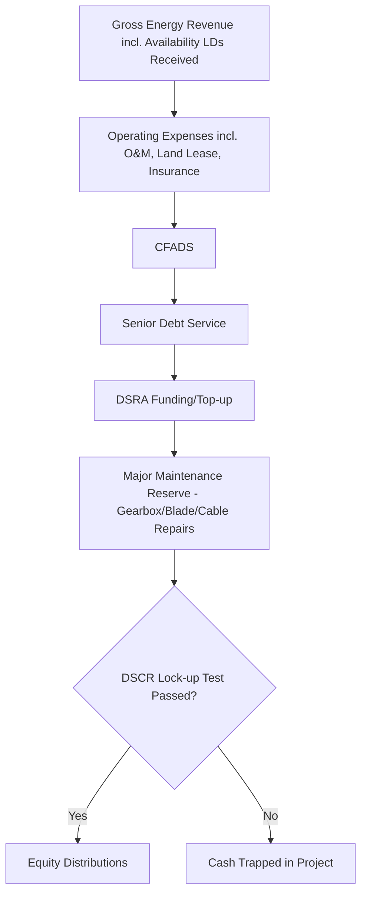

## Onshore and Offshore Wind Project Finance

### Overview

Wind project finance applies the same non-recourse/limited-recourse SPV structure used across renewable energy, but with risk profiles that diverge meaningfully from solar — and diverge again between onshore and offshore sub-sectors. Wind resource is more variable and site-specific than solar irradiance, turbine technology carries more mechanical complexity (gearboxes, blades, foundations), and offshore wind introduces marine construction, subsea cabling, and substantially higher capital intensity and construction risk than either onshore wind or solar.

**Key Points**

- Onshore wind is a mature, bankable asset class with financing mechanics broadly similar to solar but with higher resource variability
- Offshore wind requires materially larger capital stacks, longer construction periods, and specialized marine/subsea risk allocation
- Both sub-sectors depend heavily on long-term offtake certainty (PPA/CfD) to achieve project-finance leverage
- Independent Engineer and wind resource assessment rigor is proportionally higher than solar due to greater inter-annual production variability

### Onshore Wind: Structure and Parties

The party structure mirrors solar project finance (Sponsor, Lenders, EPC/turbine supplier, Offtaker, O&M provider, Independent Engineer) with wind-specific additions:

| Party | Role |
| --- | --- |
| Turbine Supply Agreement (TSA) counterparty | Original Equipment Manufacturer (OEM) supplying and often warranting turbine performance |
| Balance of Plant (BoP) Contractor | Civil works, foundations, internal collector system, substation — often separate from the TSA (multi-contract structure) |
| Wind Resource Consultant | Independent assessment of wind speed, turbulence, wake effects, and energy yield |
| Grid/Transmission Operator | Interconnection and transmission capacity allocation |

**Contracting Strategy**: Onshore wind projects commonly use a **multi-contract** structure (separate TSA and BoP/civil contracts) rather than a single wrapped EPC, because turbine OEMs are typically unwilling to accept full EPC wrap liability for civil works. This shifts interface risk onto the sponsor/lender, requiring careful contractual bridging (interface matrices, wrap-around warranties) to avoid gaps in liability coverage between contractors.

### Offshore Wind: Structure and Parties

Offshore wind adds a distinct layer of specialized counterparties and risk:

| Party | Role |
| --- | --- |
| Marine Installation Contractor | Specialized vessels (jack-up rigs, heavy-lift vessels) for foundation and turbine installation |
| Cable Supplier/Installer | Inter-array cables and export cable to shore, a historically high-risk, high-cost item |
| Transmission Asset Owner (TAO/OFTO in UK) | In some markets (notably UK), offshore transmission assets are separated and sold/tendered to a distinct regulated owner post-construction |
| Port/Logistics Provider | Marshaling ports for pre-assembly and vessel mobilization |
| Metocean/Geotechnical Consultant | Seabed conditions, wave/current data, foundation design inputs |

**Example**

A 500 MW offshore wind farm may involve separate contracts for: (1) turbine supply and installation, (2) foundation (monopile/jacket) fabrication and installation, (3) inter-array and export cable supply/installation, and (4) offshore/onshore substation construction — each with its own interface risk, schedule dependency, and liquidated damages regime, coordinated under an overarching Project Management Agreement.

### Capital Structure Comparison

| Metric | Onshore Wind | Offshore Wind |
| --- | --- | --- |
| Typical gearing (debt/total capital) | 70-80% | 60-75% [Inference — offshore gearing is generally lower than onshore due to construction complexity, though this compresses as the asset class matures and lenders gain track record] |
| Construction period | 12-24 months | 3-5 years |
| Capex intensity ($/MW, indicative) | Lower | Substantially higher, driven by foundations, vessels, and subsea cabling |
| Typical debt tenor | 15-18 years | 15-20 years, sometimes with mini-perm structures given construction risk |
| Construction risk profile | Moderate | High (weather windows, vessel availability, marine logistics) |

Offshore wind projects have historically relied more heavily on **DFI and export credit agency (ECA) support**, given the scale of capital required and the desire to distribute construction risk across a syndicate of lenders alongside commercial banks.

### Revenue Structures

Revenue mechanisms broadly mirror those used in solar, with market-specific nuances:

- **Contract for Difference (CfD)**: The dominant mechanism for UK offshore wind, awarded through competitive Allocation Rounds (AR); provides a fixed strike price with two-way settlement against a reference market price
- **Fixed-price PPA**: Common for onshore wind in the US and emerging markets, often 15-25 year tenors
- **Feed-in Premium / Feed-in Tariff**: Used in various EU markets, sometimes as a floor with market upside
- **Merchant/hybrid**: Increasingly common for onshore repowering projects and later-stage offshore projects in mature markets with liquid wholesale power markets

### Wind Resource Assessment

Wind resource assessment is more data- and methodology-intensive than solar irradiance assessment due to higher spatial and temporal variability.

**Key Inputs**

- On-site meteorological (met) mast or LiDAR data, ideally covering 1-3+ years, adjusted against long-term reference stations (Measure-Correlate-Predict, MCP methodology)
- Wake effect modeling between turbines within the array (typically 5-15% energy loss)
- Turbulence intensity and its impact on turbine loading and warranty compliance
- Air density, shear profile, and terrain complexity (for onshore) or metocean/wave climate (for offshore)

**Exceedance Probabilities**: As with solar, lenders size debt against **P90** (or sometimes P99, or 10-year P90) energy production estimates, while equity models the **P50** case.

$$AEP_{P90} = AEP_{P50} \times (1 - k \cdot \sigma)$$

Where $AEP$ is Annual Energy Production, $\sigma$ is the standard deviation of the estimate (reflecting resource dataset quality/length), and $k$ is the z-value corresponding to the desired confidence level (e.g., $k \approx 1.28$ for P90 under a normal distribution assumption).

**Capacity Factor**: Onshore wind capacity factors typically range 30-45%; offshore wind, benefiting from stronger and steadier offshore winds, typically achieves 40-55%+ [Unverified — actual capacity factors are highly site- and turbine-technology-specific and continue to rise with larger rotor diameters and taller hub heights].

### Financial Model Mechanics

The core modeling framework (CFADS, DSCR, sculpted amortization, reserve waterfall) is structurally identical to solar project finance, with wind-specific adjustments:

- **Seasonality**: Wind production is often more seasonally concentrated than solar (e.g., stronger winter wind in many Northern Hemisphere onshore sites), requiring debt service schedules to be matched to seasonal cash flow rather than assuming smooth annual distribution
- **Availability guarantees**: Turbine Availability Guarantees (typically 95-97%) from the OEM are modeled explicitly, with liquidated damages for shortfalls flowing back into the cash waterfall
- **Curtailment**: Grid curtailment risk (common in constrained transmission markets) is modeled as a haircut to gross AEP, with compensation mechanisms varying by market design
- **DSCR covenants**: Minimum DSCR for contracted onshore wind is typically **1.25x-1.40x**; offshore wind, reflecting higher operational and construction risk, typically requires **1.35x-1.50x+** [Unverified — deal-specific and highly sensitive to contract structure, market, and prevailing rate environment]

$$DSCR = \frac{CFADS}{Debt\ Service} \geq DSCR_{min}$$

### Offshore-Specific Risk Allocation

| Risk | Mitigation Mechanism |
| --- | --- |
| Vessel availability/weather windows | Contingency float in construction schedule; weather-adjusted LDs in marine contracts; vessel charter commitments secured early |
| Foundation/geotechnical risk | Extensive pre-FID geotechnical surveys; ground risk allocation clauses; contingency reserves |
| Cable failure (inter-array/export) | Cable warranty regimes; spare cable/jointing kits; specialized cable insurance |
| Grid connection delay | Milestone-linked payment structures; delay LDs from transmission counterparty |
| Marine logistics/installation delay | Delay-in-Startup (DSU) insurance; liquidated damages from installation contractor |
| Decommissioning obligation | Decommissioning security/bonding required in many jurisdictions (e.g., UK, US BOEM) |
| Environmental/permitting (marine mammals, fisheries, shipping lanes) | Extensive environmental impact assessment; mitigation and monitoring plans built into permits |

### Onshore-Specific Risk Allocation

| Risk | Mitigation Mechanism |
| --- | --- |
| Interface risk (multi-contract structure) | Interface agreements between TSA and BoP contractors; sponsor-held contingency; wrap insurance in some structures |
| Wake/array losses exceeding estimate | Conservative wake modeling; performance guarantees from turbine OEM |
| Land/easement risk | Long-term lease agreements with landowners; title insurance where available |
| Community/permitting opposition | Early stakeholder engagement; permitting risk assessed pre-FID; contingent equity commitments |
| Repowering/end-of-life uncertainty | Modeled explicitly in later-life cash flows; residual value assumptions kept conservative |

### Cash Flow Waterfall (Wind-Specific Considerations)

The Major Maintenance Reserve for wind is typically sized larger and drawn more actively than solar's equivalent, reflecting the higher frequency of major component replacement (gearboxes, blade repairs, and for offshore, cable and foundation inspections).

### Illustrative Onshore vs. Offshore Cost/Risk Profile (svg_diagram)

<svg xmlns="http://www.w3.org/2000/svg" viewBox="0 0 640 320">
<text x="320" y="26" text-anchor="middle" font-size="17" font-weight="bold" fill="#1a1a1a">Onshore vs. Offshore Wind: Relative Profile (svg_diagram)</text>
<line x1="80" y1="270" x2="580" y2="270" stroke="#333" stroke-width="1.5" />
<line x1="80" y1="60" x2="80" y2="270" stroke="#333" stroke-width="1.5" />
<text x="330" y="300" text-anchor="middle" font-size="12" fill="#333">Relative Capex Intensity</text>
<text x="45" y="170" text-anchor="middle" font-size="12" fill="#333" transform="rotate(-90 45 170)">Construction Risk</text>
<rect x="120" y="220" width="90" height="50" fill="#3d6ea5" />
<text x="165" y="210" text-anchor="middle" font-size="12" fill="#1a1a1a">Onshore Wind</text>
<rect x="430" y="90" width="110" height="180" fill="#c9603f" />
<text x="485" y="80" text-anchor="middle" font-size="12" fill="#1a1a1a">Offshore Wind</text>
<rect x="260" y="245" width="80" height="25" fill="#4a9d5f" />
<text x="300" y="235" text-anchor="middle" font-size="12" fill="#1a1a1a">Solar PV</text>

<text x="330" y="312" text-anchor="middle" font-size="11" fill="#555" font-style="italic">Indicative positioning only — not to scale</text>

</svg>

### Due Diligence Workstreams

- **Technical**: Independent Engineer review of turbine supply agreement, wind resource assessment methodology, wake modeling, foundation design (offshore), grid connection agreement
- **Legal**: Land/seabed lease rights, permits (including marine licenses for offshore), TSA/BoP contract interface review, security package
- **Insurance**: Construction all-risk, marine cargo/transit (offshore), delay-in-startup, operational all-risk, business interruption
- **Environmental & Social**: Avian/bat impact studies (onshore), marine mammal and fisheries impact studies (offshore), Equator Principles compliance for DFI-backed deals
- **Model Audit**: Verification of seasonality assumptions, availability guarantee mechanics, and reserve account sizing

### Sensitivities Typically Stress-Tested

- Wind resource downside (P90/P99, extended low-wind periods, wake losses exceeding estimate)
- Turbine/component availability below OEM guarantee
- Offshore: vessel/weather delay extending construction beyond contingency
- Curtailment above base case
- Interest rate movements on floating-rate tranches
- Major component replacement cost/timing (gearbox, blade, cable) exceeding reserve assumptions
- Decommissioning cost escalation (particularly offshore, where bonding requirements are material)

**Conclusion**

Onshore wind project finance is a mature discipline closely analogous to solar in its financial architecture, differentiated mainly by higher resource variability, multi-contract interface risk, and larger major-maintenance reserve requirements. Offshore wind, by contrast, represents a step-change in capital intensity and construction complexity — marine logistics, subsea cabling, and foundation risk require more granular risk allocation, longer construction financing periods, and often heavier reliance on DFI/ECA co-financing. In both cases, the financeability of the asset hinges on the strength of the offtake arrangement (PPA/CfD) and the rigor of the independent wind resource assessment underpinning the P90 debt-sizing case.

**Related Topics**

- Solar Photovoltaic Project Finance — comparative resource and technology risk profiles
- Contract for Difference (CfD) mechanics and UK offshore wind Allocation Rounds
- Turbine Supply Agreements and OEM availability/performance warranty structures
- Marine construction and offshore vessel logistics risk in project finance
- Repowering economics for aging onshore wind fleets
- Battery Storage co-located with wind assets (hybrid project finance structures)
- Decommissioning security and bonding requirements in offshore energy projects
- Grid curtailment risk and transmission queue reform in constrained markets
- Green Bonds and capital markets refinancing for operating wind portfolios
- Equator Principles and IFC Performance Standards for internationally financed wind projects