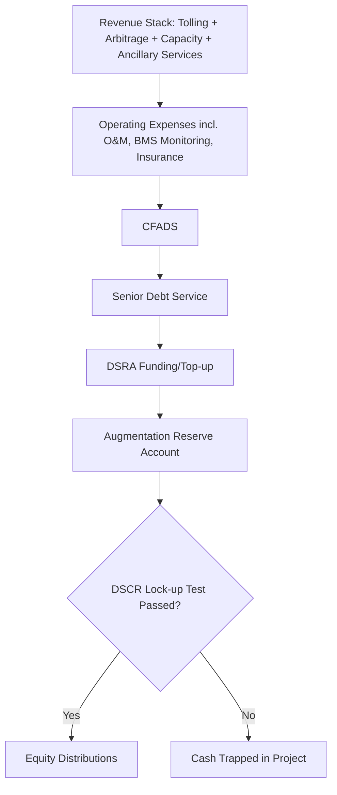

## Battery Energy Storage System Financing

### Overview

Battery Energy Storage System (BESS) financing is the youngest and structurally most complex branch of renewable/power project finance. Unlike solar or wind, storage assets do not have a natural, singular revenue source tied to a physical resource (irradiance, wind speed) — instead, BESS projects monetize value through a stack of services (energy arbitrage, capacity, ancillary services, transmission deferral) whose relative economics shift with market conditions. This makes revenue forecasting inherently more uncertain, and consequently makes achievable leverage generally lower and covenant structures more conservative than solar or wind.

**Key Points**

- BESS revenue is typically "stacked" across multiple market services rather than derived from a single contracted source
- Degradation and augmentation economics (replacing cells as capacity fades) are a first-order modeling concern, unlike solar/wind
- Standalone storage, co-located (hybrid) storage, and storage-as-a-service are financed under meaningfully different structures
- Merchant/market-price exposure is more common and more central to BESS economics than in contracted solar/wind

### Configurations

| Configuration | Description | Financing Implication |
| --- | --- | --- |
| Standalone (front-of-meter) | Battery connected directly to the grid, independent revenue stack | Financed as its own SPV; revenue risk borne primarily by the project (unless contracted via tolling) |
| Co-located/Hybrid (with solar or wind) | Battery paired with a generation asset at the same site, often sharing interconnection | Can be financed within the generation project's SPV or as a separate tranche; revenue allocation between generation and storage must be modeled explicitly |
| Storage-as-a-Service / Tolling Agreement | A counterparty (utility, trader, corporate) pays a fixed capacity/tolling fee to dispatch the battery per its own strategy | Most bankable structure — resembles a contracted PPA, shifting merchant risk to the tolling counterparty |
| Behind-the-meter (C&I) | Battery sited at a commercial/industrial customer's facility, financed against bill savings/demand charge reduction | Smaller-ticket financing, often via leases or on-balance-sheet corporate financing rather than classic project finance |

### Revenue Stack

BESS revenue is typically composed of several stacked or sequential value streams, which vary substantially by market/jurisdiction:

1. **Energy arbitrage**: Charging during low-price periods, discharging during high-price periods, capturing the spread
2. **Capacity payments**: Payments for guaranteeing available capacity during system peak/stress events (e.g., capacity markets, Resource Adequacy programs)
3. **Ancillary services**: Frequency regulation, spinning reserve, voltage support — often the highest-value-per-MW service in early-stage markets, though subject to saturation as more storage enters
4. **Transmission and distribution deferral**: Payments (often via long-term contracts with utilities) for deferring the need for grid infrastructure upgrades
5. **Renewable integration / curtailment avoidance**: Storing otherwise-curtailed renewable generation for later dispatch, particularly valuable when co-located

**Example**

A 100 MW / 400 MWh (4-hour duration) standalone BESS project in a deregulated market might underwrite its base case around a tolling agreement covering 70% of expected revenue, with the remaining 30% left as a merchant "upside" tail participating directly in energy arbitrage and ancillary service markets — a hybrid contracted/merchant structure increasingly common as pure tolling capacity becomes scarce.

### Capital Structure

| Metric | Standalone BESS | Co-located BESS |
| --- | --- | --- |
| Typical gearing | 50-65% [Inference — lower than solar/wind reflecting revenue stack uncertainty and shorter operating track record of the asset class] | Varies — often financed as an incremental tranche within the generation project's existing capital structure |
| Typical debt tenor | 7-15 years (shorter than solar/wind due to technology and revenue uncertainty) | Matched to host generation asset tenor where integrated |
| Key equity source | Infrastructure funds, developers, increasingly tax equity (US, post-IRA standalone storage ITC eligibility) | Sponsor equity of the host generation project |

The **Inflation Reduction Act (2022)** extended Investment Tax Credit eligibility to standalone storage in the US (previously ITC required storage to be charged predominantly by co-located renewables) — a structural change that materially improved standalone BESS financeability by unlocking tax equity as a capital source [Unverified — verify current IRC Section 48E/45X eligibility rules and adder stacking against current IRS guidance, as this is an active area of regulatory evolution].

### Degradation and Augmentation Modeling

This is the single most distinctive modeling element of BESS finance relative to solar/wind.

- **Capacity fade**: Lithium-ion battery capacity degrades with both **calendar aging** (time-based) and **cycle aging** (usage-based, worsened by deep cycling, high charge/discharge rates, and temperature extremes)
- **Augmentation strategy**: Rather than accepting capacity fade over the asset life, most BESS projects contractually commit to **augmentation** — periodically adding new battery cells/racks to restore capacity to a guaranteed minimum (e.g., maintaining ≥85% of nameplate energy capacity throughout the contract term)
- **Augmentation capex**: Modeled as a recurring capital cost (distinct from routine O&M), typically front-loaded less and back-loaded more as degradation accelerates; funded from a dedicated reserve or additional draw facility

$$C_{y} = C_{0} \times (1 - \alpha_{cal} \cdot y - \alpha_{cyc} \cdot N_{cyc,y}) + A_{y}$$

Where $C_y$ is available capacity in year $y$, $\alpha_{cal}$ and $\alpha_{cyc}$ are calendar and cycle degradation coefficients, $N_{cyc,y}$ is cumulative equivalent full cycles, and $A_y$ is capacity restored through augmentation in that year.

- **Performance Guarantees**: BESS EPC/supply agreements typically include an **Augmentation Guarantee** and a **Round-Trip Efficiency (RTE) Guarantee** (commonly targeting 85-90% RTE), with liquidated damages if actual performance falls short

### Financial Model Mechanics

The CFADS/DSCR/waterfall framework from solar and wind carries over, with BESS-specific overlays:

- **Revenue volatility**: Because much of the revenue stack (arbitrage, ancillary services) is market-price-dependent, lenders typically apply a **haircut to merchant revenue** (e.g., only crediting 50-70% of a third-party market price forecast) when sizing debt, and place heavier weight on any contracted/tolled revenue portion
- **Multiple market price forecasts**: Unlike solar/wind, where a single P50/P90 production estimate suffices, BESS models typically incorporate independent market price forecasts (from firms specializing in power market modeling) for each revenue stream, often shown as low/base/high cases
- **DSCR covenants**: Minimum DSCR for contracted/tolled BESS is typically **1.30x-1.50x**; for merchant-heavy standalone BESS, minimum DSCRs run materially higher, often **1.50x-2.00x+**, reflecting revenue uncertainty [Unverified — this remains a fast-evolving underwriting area as lender experience with the asset class grows; actual covenant levels are deal- and lender-specific]
- **Augmentation reserve account**: A dedicated reserve (distinct from the standard Major Maintenance Reserve used in solar/wind) funded from operating cash flow to pre-fund known future augmentation capex

### Risk Allocation

| Risk | Mitigation Mechanism |
| --- | --- |
| Revenue/price risk (merchant exposure) | Tolling agreements; revenue haircuts in debt sizing; diversified revenue stack across multiple markets/services |
| Degradation exceeding guarantee | Augmentation guarantees from supplier with LDs; independent engineer validation of degradation model |
| Round-trip efficiency shortfall | RTE performance guarantees; liquidated damages |
| Thermal/safety risk (fire, thermal runaway) | Battery Management System (BMS) requirements; NFPA 855 (US) or equivalent code compliance; specialized insurance underwriting |
| Technology obsolescence | Modular/replaceable architecture; supplier long-term service agreements; conservative technology selection (proven chemistry, e.g., LFP over NMC in many recent deals for safety/cost reasons) |
| Market structure change (e.g., ancillary service market saturation) | Diversified revenue stack; conservative haircuts on any single revenue stream; shorter debt tenor to reduce exposure to long-dated market assumptions |
| Supply chain/warranty enforceability | Strong parent guarantees from battery OEM; letters of credit; long-term service agreements co-terminus with financing tenor |
| Interconnection queue delay | Milestone-based development risk mitigation; sponsor equity bridge financing pre-COD |

### Insurance and Safety Considerations

BESS projects require underwriting attention to fire/thermal-runaway risk that has no direct analog in solar/wind:

- Compliance with applicable fire codes (e.g., NFPA 855 in the US) is typically a condition precedent to financial close and insurance placement
- Property insurance for BESS has historically carried higher premiums and more restrictive terms than solar/wind, reflecting a still-maturing loss history across the industry
- Business interruption coverage must account for potentially long replacement lead times for damaged battery modules

### Cash Flow Waterfall (BESS-Specific)

### Illustrative Revenue Stack Composition (svg_diagram)

<svg xmlns="http://www.w3.org/2000/svg" viewBox="0 0 640 320">
<text x="320" y="26" text-anchor="middle" font-size="17" font-weight="bold" fill="#1a1a1a">Illustrative BESS Revenue Stack (svg_diagram)</text>
<rect x="180" y="60" width="160" height="220" fill="none" stroke="#333" stroke-width="2" />
<rect x="180" y="60" width="160" height="90" fill="#3d6ea5" />
<text x="260" y="100" text-anchor="middle" font-size="13" fill="#ffffff" font-weight="bold">Tolling/Contracted</text>
<text x="260" y="118" text-anchor="middle" font-size="12" fill="#e0e8f2">~40-70%</text>
<rect x="180" y="150" width="160" height="60" fill="#c9603f" />
<text x="260" y="178" text-anchor="middle" font-size="12" fill="#ffffff" font-weight="bold">Energy Arbitrage</text>
<text x="260" y="195" text-anchor="middle" font-size="11" fill="#fbe4dc">Merchant</text>
<rect x="180" y="210" width="160" height="40" fill="#c98a3f" />
<text x="260" y="234" text-anchor="middle" font-size="12" fill="#ffffff" font-weight="bold">Capacity Payments</text>
<rect x="180" y="250" width="160" height="30" fill="#8a6fbf" />
<text x="260" y="269" text-anchor="middle" font-size="11" fill="#ffffff" font-weight="bold">Ancillary Services</text>

<text x="400" y="105" font-size="12" fill="#333">Bankable, debt-sizing basis</text>

<text x="400" y="180" font-size="12" fill="#333">Haircut applied for</text>

<text x="400" y="195" font-size="12" fill="#333">debt sizing purposes</text>

<text x="400" y="230" font-size="12" fill="#333">Variable by market design</text>

<text x="400" y="265" font-size="12" fill="#333">Subject to saturation risk</text>

<text x="320" y="305" text-anchor="middle" font-size="11" fill="#555" font-style="italic">Illustrative composition only — highly market- and contract-specific</text>

</svg>

### Due Diligence Workstreams

- **Technical**: Independent Engineer review of battery cell/pack technology, degradation and augmentation modeling assumptions, RTE and availability guarantees, BMS architecture, thermal management design
- **Market**: Independent power market price forecast review across each revenue stream (arbitrage spreads, capacity market clearing prices, ancillary service pricing trends)
- **Legal**: Tolling agreement or offtake structure review, supplier warranty and long-term service agreement enforceability, interconnection agreement
- **Insurance/Safety**: Fire code compliance (e.g., NFPA 855), property and business interruption insurance placement, BMS and safety system certification
- **Model Audit**: Verification of degradation/augmentation mechanics, revenue stack haircuts, and reserve account sizing logic

### Sensitivities Typically Stress-Tested

- Merchant price downside across each revenue stream (arbitrage spread compression, ancillary service price saturation)
- Degradation exceeding modeled/guaranteed rates, accelerating augmentation capex
- Round-trip efficiency below guarantee
- Cycling intensity above base case (accelerating cycle-based degradation)
- Interconnection/curtailment risk affecting charging availability
- Augmentation cost inflation (battery cell/pack pricing volatility)
- Tolling counterparty credit risk (for contracted structures)

### Distinguishing BESS from Solar and Wind Financing

| Factor | Solar PV | Onshore/Offshore Wind | BESS |
| --- | --- | --- | --- |
| Primary revenue driver | Contracted PPA against resource-based production | Contracted PPA/CfD against resource-based production | Multi-stream stack, often partially merchant |
| Resource/production risk | Moderate-Low | Moderate-High | N/A (dispatch/degradation-driven, not resource-driven) |
| Key technical risk | Module/inverter performance | Turbine availability, mechanical wear | Degradation, augmentation, thermal safety |
| Typical achievable leverage | Higher | Moderate-High | Lower, more conservative |
| Asset class maturity (lender experience) | Very mature | Mature | Emerging/rapidly maturing |

**Conclusion**

BESS financing represents a structurally distinct challenge within renewable project finance: rather than underwriting a single, resource-driven revenue stream, lenders and sponsors must underwrite a dynamic, multi-service revenue stack subject to significant market design and merchant price risk, layered on top of a technology that degrades with use and requires active capital reinvestment (augmentation) to sustain contracted performance. As tolling agreements, standalone ITC eligibility (in the US), and lender track record with the asset class continue to mature, BESS financing terms are converging toward — though still remain more conservative than — the leverage and tenor achievable in mature solar and wind project finance.

**Related Topics**

- Solar Photovoltaic Project Finance — contrast in revenue certainty and resource risk
- Onshore and Offshore Wind Project Finance — contrast in technology and construction risk
- Co-located Hybrid Renewable Plus Storage Project Structuring
- Power Market Price Forecasting Methodologies for Merchant Revenue Underwriting
- Investment Tax Credit (ITC) Eligibility for Standalone Energy Storage (US)
- Tolling Agreement Structuring and Counterparty Credit Analysis
- Battery Safety Standards and Fire Code Compliance (NFPA 855) in Project Finance Due Diligence
- Capacity Market Mechanics and Resource Adequacy Program Design
- Long-Term Service Agreements (LTSAs) for Battery OEM Performance Guarantees
- Ancillary Services Market Saturation Risk in Grid-Scale Storage Revenue Modeling