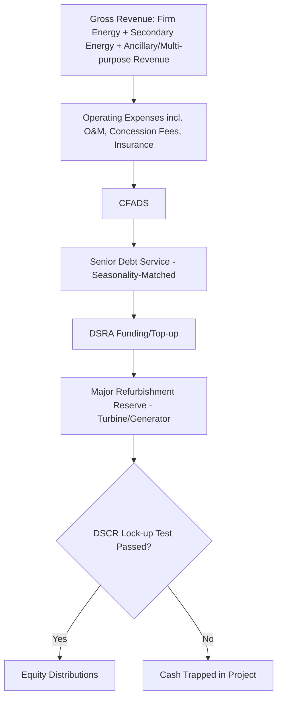

## Hydropower Project Finance Considerations

### Overview

Hydropower project finance is among the most heterogeneous asset classes in power finance, spanning small run-of-river schemes of a few MW to multi-gigawatt large dams with decades-long development timelines. Unlike solar, wind, or BESS, hydropower projects are highly site-specific civil engineering undertakings, with financing structures shaped heavily by the type of scheme (run-of-river vs. storage/reservoir vs. pumped storage), the jurisdiction's regulatory and environmental regime, and the scale of construction risk. Hydropower is also unique among renewables in having a mature, century-long operating track record, which supports long asset lives (50-100 years) but also means many projects carry legacy regulatory, environmental, and resettlement considerations absent from newer technologies.

**Key Points**

- Hydrology risk (streamflow variability) is the central resource risk, analogous to but generally more complex than solar irradiance or wind speed
- Construction risk is typically the dominant risk driver — large hydro projects have a well-documented history of cost overruns and delays tied to geotechnical surprises
- Environmental, social, and resettlement risk is often the most consequential and reputationally sensitive risk category, particularly for large storage/reservoir projects
- Pumped storage hydro (PSH) is increasingly financed as a grid-flexibility/storage asset with revenue mechanics closer to BESS than to conventional generation

### Types of Hydropower Schemes and Financing Implications

| Scheme Type | Description | Financing Implication |
| --- | --- | --- |
| Run-of-river (RoR) | Diverts river flow through a powerhouse with little to no water storage; output closely tracks natural streamflow | More resource-variable revenue; generally smaller-scale, more standardized financing similar in spirit to wind |
| Storage/Reservoir | Dam creates a reservoir, allowing water to be stored and released to match demand/price signals | Higher capex and construction complexity; but reservoir provides dispatchability, supporting stronger revenue certainty once operating |
| Pumped Storage Hydro (PSH) | Pumps water uphill during low-price periods, releases through turbines during high-price periods — functions as a large-scale mechanical battery | Financed increasingly like BESS — revenue stack includes arbitrage, capacity, and ancillary services rather than a single energy sale |
| Small hydro (<10-30 MW, threshold varies by jurisdiction) | Smaller-scale, often simpler permitting and standardized turbine packages | Faster to finance and construct; sometimes financed in portfolios to achieve scale for institutional lenders |

### Hydrology and Resource Assessment

Hydrology risk assessment is arguably more data-intensive than solar or wind resource assessment because streamflow reflects an entire upstream watershed's precipitation, snowmelt, and land-use dynamics over long timescales.

- **Historical flow records**: Lenders require long-dated (ideally 20-30+ years) streamflow records, either from on-site gauging stations or nearby reference gauges adjusted via hydrological modeling
- **Flow Duration Curve (FDC)**: The primary analytical tool, plotting the percentage of time a given flow rate is equaled or exceeded — used to estimate firm and average energy production
- **Exceedance probabilities**: Analogous to solar/wind P50/P90, hydro projects use **Q50/Q90** (or "dependable flow", "firm yield") to describe flow available at a given exceedance probability; lenders typically size debt against a **P90 (dry year) hydrology scenario**
- **Climate change/long-term trend risk**: Increasingly incorporated into due diligence, given observed shifts in precipitation patterns, glacial melt contributions, and snowpack timing in many hydro-dependent basins [Unverified — the magnitude and directionality of climate impact is highly basin-specific and subject to ongoing scientific study]

$$E_{y} = \int_{0}^{T} \rho \cdot g \cdot Q(t) \cdot H_{net}(t) \cdot \eta \, dt$$

Where $E_y$ is annual energy production, $\rho$ is water density, $g$ is gravitational acceleration, $Q(t)$ is flow rate at time $t$, $H_{net}(t)$ is net hydraulic head, and $\eta$ is the combined turbine-generator efficiency.

**Example**

A 50 MW run-of-river project on a snowmelt-fed river may generate 70% of its annual energy in a 4-month spring freshet period. The financial model must reflect this seasonality explicitly in the debt service schedule (matching amortization to seasonal cash generation) rather than assuming smooth annual production, and the PPA (if any) must specify how seasonal delivery obligations and shortfalls are treated.

### Construction Risk — The Dominant Risk Category

Large hydro projects have a well-documented history of cost overruns, frequently tied to geotechnical conditions encountered during excavation and foundation work that differ from pre-construction site investigations.

- **Geotechnical/geological risk**: The single largest driver of large-hydro cost overruns — unexpected rock quality, groundwater conditions, or seismic considerations during dam/tunnel/powerhouse excavation
- **EPC contracting approach**: Large hydro rarely achieves a single fully-wrapped fixed-price EPC contract due to geotechnical uncertainty; more commonly structured as **multi-contract** (civil works, electromechanical, hydromechanical/gates separately) with the sponsor or a government counterparty retaining some geotechnical/ground risk
- **Contingency sizing**: Reflecting this history, contingency reserves for large hydro construction budgets are typically sized more conservatively than for solar, wind, or BESS
- **Construction duration**: Small/run-of-river projects: 2-4 years; large storage/reservoir projects: 5-10+ years, extending both construction financing exposure and interest-during-construction costs

### Environmental, Social, and Resettlement Considerations

This risk category is frequently the most consequential for large hydro project financeability, particularly for internationally financed projects subject to lender environmental and social standards.

- **Involuntary resettlement**: Large reservoir projects may require resettling communities — governed by frameworks such as the **IFC Performance Standard 5** and **World Bank Involuntary Resettlement policies**, requiring resettlement action plans, livelihood restoration programs, and often multi-year implementation timelines
- **Downstream/ecological impacts**: Fish passage, sediment transport disruption, minimum environmental flow requirements, and impacts on downstream water users and ecosystems
- **Dam safety**: International standards (e.g., ICOLD guidelines) and independent Dam Safety Panel review are typically mandatory conditions precedent for lenders, given the catastrophic tail risk of dam failure
- **Equator Principles / IFC Performance Standards**: Large hydro is one of the categories most likely to be classified as **Category A** (highest environmental/social risk) under the Equator Principles, triggering the most extensive due diligence, disclosure, and monitoring requirements

### Capital Structure

| Metric | Run-of-River / Small Hydro | Large Storage/Reservoir Hydro | Pumped Storage Hydro |
| --- | --- | --- | --- |
| Typical gearing | 65-75% | Often lower on a pure project-finance basis, or structured with significant sovereign/DFI/state-backed financing given scale | 50-65% [Inference — comparable to standalone BESS given similar merchant/arbitrage revenue exposure] |
| Typical debt tenor | 15-20 years | 20-25+ years, sometimes matched to very long-dated concession/PPA terms | 15-20 years |
| Common capital sources | Commercial banks, regional DFIs | Multilateral development banks (World Bank, ADB, IFC), export credit agencies, sovereign guarantees, commercial bank syndicates | Commercial banks, infrastructure funds, increasingly capacity-market-driven capital given PSH's flexibility role |

Very large hydro projects (multi-GW scale) are frequently financed with significant **sovereign or state-owned utility involvement**, blending elements of project finance with public infrastructure financing, particularly in emerging markets where the asset is considered nationally strategic.

### Revenue Structures

- **Long-term PPA**: Common for both small and large hydro, often with take-or-pay or minimum-offtake provisions given the strategic/baseload nature of large hydro capacity
- **Government concession/licensing regime**: Many hydro projects operate under long-dated concessions (30-50+ years) from the state, which owns the water rights, rather than a conventional PPA alone
- **Capacity and ancillary services (PSH)**: Pumped storage increasingly monetizes flexibility value analogous to BESS — arbitrage, capacity payments, and frequency regulation — rather than a simple energy PPA
- **Multi-purpose revenue**: Some large reservoir projects generate ancillary revenue from irrigation, flood control, and water supply services, sometimes with government payments or in-kind arrangements supplementing power revenue

### Financial Model Mechanics

- **Seasonality-matched amortization**: Debt service schedules for hydro (especially RoR) frequently use seasonally-adjusted or sculpted repayment profiles that mirror the flow duration curve, rather than level quarterly/semi-annual payments
- **Firm vs. secondary energy**: Some PPA structures distinguish between "firm energy" (guaranteed minimum, priced higher) and "secondary/surplus energy" (priced lower, sold when flow exceeds the firm threshold) — modeled as two distinct revenue tranches
- **DSCR covenants**: Minimum DSCR for contracted hydro is typically **1.20x-1.40x** for stable-hydrology, reservoir-backed projects, and **1.30x-1.50x+** for run-of-river projects with higher flow variability [Unverified — deal-specific, and materially influenced by the length and quality of the hydrology dataset underpinning the P90 case]
- **Long-term operating cost assumptions**: Hydro O&M costs are generally low relative to capex (no fuel, few major rotating components relative to wind), but must account for periodic major refurbishment (turbine runners, generators) typically every 20-30 years

$$DSCR = \frac{CFADS}{Debt\ Service} \geq DSCR_{min}$$

### Risk Allocation Matrix

| Risk | Mitigation Mechanism |
| --- | --- |
| Hydrology/streamflow variability | P90 dry-year debt sizing; DSRA sized larger for higher-variability schemes; firm/secondary energy PPA tranching |
| Geotechnical/construction cost overrun | Extensive pre-FID geotechnical investigation; conservative contingency; ground risk-sharing mechanisms with contractor or government |
| Construction delay | Milestone-based drawdowns; delay LDs; DSU insurance; extended interest-during-construction reserves |
| Dam safety | Independent Dam Safety Panel; adherence to ICOLD or equivalent standards; dam safety insurance/emergency action plans |
| Environmental/resettlement | Resettlement Action Plans; compliance with IFC PS5/World Bank standards; ongoing stakeholder engagement and grievance mechanisms |
| Sedimentation (reservoir capacity loss over time) | Sediment flushing/management design; modeled reservoir capacity decline over asset life |
| Water rights/concession risk | Long-term government concession agreements; legal due diligence on water allocation priority, especially in shared/transboundary basins |
| Transboundary water disputes | Political risk insurance; international treaty/agreement review where basins span multiple countries |
| Equipment/turbine performance | Performance guarantees from turbine/generator OEM; independent engineer review of equipment selection |

### Cash Flow Waterfall (Hydro-Specific)

### Illustrative Flow Duration Curve Concept (svg_diagram)

<svg xmlns="http://www.w3.org/2000/svg" viewBox="0 0 640 340">
<text x="320" y="26" text-anchor="middle" font-size="17" font-weight="bold" fill="#1a1a1a">Flow Duration Curve Concept (svg_diagram)</text>
<line x1="80" y1="280" x2="580" y2="280" stroke="#333" stroke-width="1.5" />
<line x1="80" y1="60" x2="80" y2="280" stroke="#333" stroke-width="1.5" />
<text x="330" y="315" text-anchor="middle" font-size="12" fill="#333">% of Time Flow is Equaled or Exceeded</text>
<text x="40" y="170" text-anchor="middle" font-size="12" fill="#333" transform="rotate(-90 40 170)">Streamflow Rate</text>
<path d="M 100 80 Q 250 90 350 180 T 560 260" stroke="#3d6ea5" stroke-width="3" fill="none" />
<line x1="330" y1="60" x2="330" y2="280" stroke="#999" stroke-width="1" stroke-dasharray="4,4" />
<text x="330" y="295" text-anchor="middle" font-size="11" fill="#555">Q50</text>
<line x1="470" y1="60" x2="470" y2="280" stroke="#999" stroke-width="1" stroke-dasharray="4,4" />
<text x="470" y="295" text-anchor="middle" font-size="11" fill="#555">Q90 (Debt Sizing)</text>

<text x="150" y="75" font-size="11" fill="#555">High Flow / Wet Season</text>

<text x="480" y="245" font-size="11" fill="#555">Low Flow / Dry Season</text>

<text x="330" y="335" text-anchor="middle" font-size="11" fill="#555" font-style="italic">Illustrative shape only — actual curves are site- and basin-specific</text>

</svg>

### Due Diligence Workstreams

- **Technical/Geotechnical**: Independent Engineer and specialist geotechnical consultant review of dam/tunnel/powerhouse design, hydrology dataset quality, turbine selection, Dam Safety Panel findings
- **Legal**: Water rights/concession agreement review, PPA/offtake enforceability, resettlement and land acquisition legal compliance, security package
- **Environmental & Social**: Full Environmental and Social Impact Assessment (ESIA), Resettlement Action Plan review, compliance with Equator Principles/IFC Performance Standards (typically Category A), stakeholder consultation records
- **Insurance**: Construction all-risk, dam-specific liability coverage, delay-in-startup, operational all-risk, business interruption
- **Model Audit**: Verification of hydrology-driven seasonality assumptions, firm/secondary energy tranching, and major refurbishment reserve sizing

### Sensitivities Typically Stress-Tested

- Hydrology downside (P90/dry-year scenarios, multi-year drought sequences)
- Construction cost overrun and delay beyond contingency (particularly geotechnical-driven)
- Sedimentation-driven reservoir capacity loss over the asset life
- Long-term climate/precipitation pattern shifts affecting firm yield assumptions
- Turbine/generator major refurbishment cost and timing versus reserve assumptions
- Resettlement/environmental compliance cost and schedule overruns
- Water rights or concession renewal risk at the tail of the financing tenor

### Distinguishing Hydropower from Other Renewable Asset Classes

| Factor | Solar PV | Wind | BESS | Hydropower |
| --- | --- | --- | --- | --- |
| Primary risk driver | Resource/production | Resource/production | Revenue stack/market design | Construction (geotechnical) + hydrology |
| Asset life | 25-30 years | 25-30 years | 15-20 years (with augmentation) | 50-100 years |
| Environmental/social complexity | Low-Moderate | Moderate | Low | High (especially large reservoir schemes) |
| Dispatchability | None (intermittent) | None (intermittent) | High (flexible) | High for reservoir/PSH; Low for run-of-river |
| Typical financing sponsor profile | Developers, infrastructure funds | Developers, infrastructure funds | Developers, infrastructure funds, increasingly utilities | Often state-owned utilities, DFIs, sovereign-linked for large schemes |

**Conclusion**

Hydropower project finance defies a single template more than any other renewable asset class: small run-of-river schemes finance much like wind projects with resource-driven revenue, while large storage and pumped-storage projects combine civil-engineering-scale construction risk, multi-decade concession structures, and — for reservoir schemes — some of the most demanding environmental and social due diligence requirements in project finance. The unifying analytical threads are rigorous hydrology assessment (culminating in a P90/dry-year debt-sizing case), acute sensitivity to geotechnical construction risk, and, for large or internationally financed projects, the centrality of resettlement and environmental compliance to overall financeability. Pumped storage hydro increasingly sits at the intersection of traditional hydro engineering and BESS-style revenue-stack financing as grids place growing value on flexibility.

**Related Topics**

- Solar Photovoltaic Project Finance and Onshore/Offshore Wind Project Finance — comparative resource risk frameworks
- Battery Energy Storage System Financing — revenue stack parallels with pumped storage hydro
- IFC Performance Standards and Equator Principles Category A Project Due Diligence
- Involuntary Resettlement Action Plans in Internationally Financed Infrastructure
- Dam Safety Governance and ICOLD Guidelines in Project Finance
- Multilateral Development Bank and Export Credit Agency Co-Financing Structures
- Transboundary Water Rights and Political Risk Insurance
- Concession Agreement Structuring for Long-Life Infrastructure Assets
- Flow Duration Curve Analysis and Hydrological Modeling Methodologies
- Pumped Storage Hydro as Grid Flexibility Infrastructure