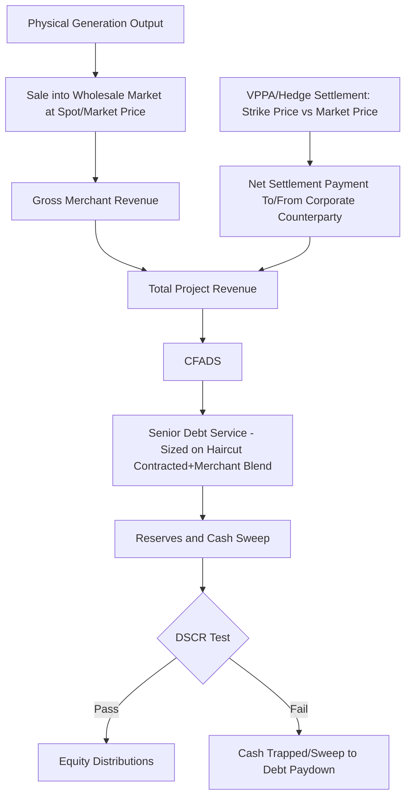

## Merchant Price Risk and Corporate Power Purchase Agreements

### Overview

As competitive procurement, PPA expirations, and market liberalization reshape renewable energy financing, an increasing share of project revenue is exposed to wholesale market prices rather than fixed utility offtake contracts. Merchant price risk — and the contractual instruments used to mitigate it, principally the Corporate Power Purchase Agreement (CPPA) — sits at the center of modern renewable and power project finance. This topic addresses how uncontracted or partially-contracted revenue is analyzed, priced, and structured for bankability, and how corporate offtake has emerged as a dominant substitute for traditional utility PPAs in many markets.

**Key Points**

- Merchant risk is the exposure of project revenue to unhedged wholesale market prices, which are volatile, cyclical, and influenced by renewable penetration itself (cannibalization effect)
- Corporate PPAs have become a primary offtake mechanism as corporates pursue decarbonization commitments and utility procurement has become more competitive/constrained
- Physical and virtual (financial) PPA structures carry materially different risk allocation, accounting treatment, and bankability characteristics
- Lenders address merchant exposure through revenue haircuts, higher DSCR covenants, shorter merchant-tail debt tenors, and price hedges rather than accepting merchant revenue at face value

### Sources of Merchant Price Risk

- **Wholesale market price volatility**: Spot and day-ahead prices fluctuate with fuel costs, demand patterns, weather, and transmission constraints
- **Renewable cannibalization effect**: As solar/wind penetration increases in a given market, correlated generation output depresses wholesale prices precisely when renewable output is high (a well-documented phenomenon sometimes called the "merit order effect" or "value deflation") — a project's realized capture price falls below the average market price over time
- **Basis risk**: The difference between the price at a project's specific delivery/settlement node and the reference hub price used in a hedge or PPA — a mismatch here means a hedge does not perfectly offset actual project exposure
- **Shape risk**: The mismatch between a project's actual generation profile (hourly/seasonal) and a flat-shaped hedge or contract, meaning the project may be a net seller at low-price hours and a net buyer at high-price hours relative to its hedge position
- **Regulatory/market design risk**: Changes to market rules, capacity mechanisms, or carbon pricing that shift the wholesale price formation process
- **PPA expiration/rollover risk**: When a project's original long-term PPA/CfD expires (often after 15-25 years) but the physical asset continues operating, the "merchant tail" period requires separate revenue modeling

### Corporate PPA Structures

**Physical (Sleeved) PPA**

The corporate offtaker contracts directly for the physical delivery of power, typically routed ("sleeved") through a utility or retailer that handles the physical balancing and grid delivery obligations, since most corporates are not licensed to transact directly in wholesale markets.

- Requires the corporate to be in the same market/balancing area as the generator (or an adjacent one with import capability)
- The corporate takes on the shape and volume risk of actual generation, or negotiates a baseload/pay-as-produced structure
- Common in deregulated markets with retail choice (e.g., ERCOT, parts of Europe)

**Virtual/Financial PPA (VPPA)**

A purely financial contract-for-differences: the corporate and the project agree a fixed strike price; the project continues to sell its physical output into the wholesale market at prevailing prices, and the two parties settle the difference between the strike price and a reference market price.

$$Settlement_{t} = (P_{strike} - P_{market,t}) \times Q_{t}$$

Where $P_{strike}$ is the contracted fixed price, $P_{market,t}$ is the reference market price at settlement period $t$, and $Q_t$ is the settled volume (often the project's actual metered output, or a fixed notional volume/shape).

- If $P_{market,t} > P_{strike}$: the project pays the corporate the difference (corporate receives the benefit of the fixed price)
- If $P_{market,t} < P_{strike}$: the corporate pays the project the difference (project is protected against low prices)
- Does not require the corporate and project to be in the same physical delivery area — enables corporates to contract with projects anywhere within a broadly compatible market/pricing zone, which has driven much of the growth in VPPA volumes for multinational corporate buyers
- The corporate typically also retains the Renewable Energy Certificates (RECs) or Guarantees of Origin generated by the project, which is often the primary sustainability/reporting driver for the corporate's participation

**Example**

A technology company signs a 15-year VPPA with a 200 MW wind project at a $32/MWh strike price. In months when the wholesale hub price averages $45/MWh, the project pays the corporate $13/MWh on the contracted volume — the corporate effectively "gives back" the upside, but has locked in $32/MWh economics for its sustainability accounting and cost certainty. In months when the hub price falls to $20/MWh, the corporate pays the project $12/MWh, providing the revenue floor the project needed to secure financing.

### Bankability Comparison: Physical vs. Virtual PPA

| Factor | Physical (Sleeved) PPA | Virtual PPA (VPPA) |
| --- | --- | --- |
| Geographic constraint | Requires same/adjacent market | None (subject to reasonable basis correlation) |
| Basis risk | Lower (direct physical delivery) | Higher (settlement reference price may differ from project's actual node) |
| Accounting treatment | Generally treated as an executory contract | May require derivative accounting (e.g., hedge accounting analysis under ASC 815/IFRS 9) depending on structure [Unverified — accounting treatment is fact-specific and should be confirmed with the corporate's auditors] |
| Corporate credit importance | High — sleeving arrangement and corporate credit both underwritten | High — corporate credit is the primary counterparty risk for lenders |
| Typical bankability | Strong, closely resembles utility PPA | Strong, now widely accepted by lenders as bankable revenue, though basis risk is scrutinized |

### Credit Analysis of Corporate Offtakers

Because the project's revenue certainty is only as strong as its counterparty's ability to pay, lenders conduct credit analysis on corporate offtakers analogous to (though distinct from) utility counterparty analysis:

- **Investment-grade rating**: Preferred; sub-investment-grade or unrated corporates typically require credit enhancement
- **Credit support mechanisms**: Letters of credit, parent company guarantees, cash-collateralized reserve accounts, or credit insurance
- **Tenor mismatch risk**: Corporate PPAs are often shorter (7-15 years) than traditional utility PPAs (15-25 years), creating a "merchant tail" for the remaining debt/asset life that must be separately underwritten
- **Portfolio concentration**: Lenders assess whether a project depends on a single corporate offtaker (concentration risk) versus a diversified buyer group (e.g., multiple corporates each taking a partial share, or a "PPA basket")

### Modeling Merchant and Hybrid Revenue

**Contracted vs. Merchant Revenue Split**

Most modern renewable projects underwrite a blended revenue case:

$$Total\ Revenue = (Q_{contracted} \times P_{contract}) + (Q_{merchant} \times P_{market} \times Haircut)$$

Lenders typically size senior debt only against the contracted portion (or apply a substantial haircut, e.g., 50-70% of an independent price forecast, to any merchant tail), while equity models the full expected merchant upside.

**Merchant Price Forecasting**

- Independent market price forecasts are commissioned from specialized consultancies, typically providing low/base/high scenarios reflecting different assumptions on fuel prices, renewable build-out, demand growth, and policy
- **Capture price** (the average price a specific technology actually realizes, net of the cannibalization effect) is distinguished from the average wholesale/hub price — lenders focus on the capture price forecast specific to the project's technology and location, not the generic market average
- Forecast horizons of 20-25+ years carry substantial uncertainty; sensitivity analysis and scenario stress-testing are standard practice rather than reliance on a single base case

**DSCR and Covenant Implications**

- Minimum DSCR covenants scale with the proportion of merchant exposure: a fully-contracted project might carry a 1.20x-1.35x minimum DSCR, while a majority-merchant project can require 1.50x-2.00x+ [Unverified — covenant levels are deal-specific and shift with the prevailing interest rate and risk appetite environment]
- **Cash sweep mechanisms**: Merchant-exposed deals more commonly incorporate cash sweep provisions (excess cash flow above target DSCR used to prepay debt) to reduce leverage faster during strong merchant price periods, partially compensating for downside risk in weak periods
- **Merchant tail refinancing risk**: Projects with debt maturities extending past PPA/CfD expiration must model refinancing assumptions for the merchant tail, typically underwritten conservatively (higher assumed refinancing spread, lower assumed leverage at refinancing)

### Hedging Instruments Beyond the PPA

- **Financial hedges/swaps**: Fixed-for-floating power price swaps with banks or trading counterparties, similar in mechanics to a VPPA but typically shorter tenor and used to hedge a merchant tail or gap period
- **Proxy revenue swaps**: A newer instrument (particularly used in wind) where settlement is based on a modeled "proxy generation" output at contracted prices rather than actual metered output, isolating price risk from production/resource risk
- **Tolling arrangements**: Common in storage (see BESS financing) and increasingly explored for renewable-plus-storage hybrids, where a counterparty pays a fixed fee for dispatch rights rather than purchasing energy directly

### Risk Allocation Summary

| Risk | Mitigation Mechanism |
| --- | --- |
| Wholesale price volatility | PPA/VPPA fixed-price contracting; revenue haircuts in debt sizing |
| Cannibalization/capture price decline | Independent capture-price-specific forecasting (not generic hub price); diversified technology/geography in portfolio financings |
| Basis risk (VPPA) | Careful selection of reference pricing node with historical correlation analysis; basis risk stress testing |
| Shape risk | Shaped (as-generated) PPA structures where available; conservative haircuts for baseload-shaped VPPAs against variable generation |
| Corporate counterparty credit risk | Investment-grade counterparty preference; LCs/guarantees; counterparty diversification |
| PPA/CfD expiration (merchant tail) | Conservative refinancing assumptions; cash sweep to delever ahead of expiration; merchant tail price haircuts |
| Regulatory/market design change | Scenario stress testing across policy environments; geographic/market diversification in portfolios |

### Cash Flow and Hedge Interaction

### Illustrative Capture Price Decline Concept (svg_diagram)

<svg xmlns="http://www.w3.org/2000/svg" viewBox="0 0 640 320">
<text x="320" y="26" text-anchor="middle" font-size="16" font-weight="bold" fill="#1a1a1a">Capture Price vs. Average Market Price (svg_diagram)</text>
<line x1="80" y1="270" x2="580" y2="270" stroke="#333" stroke-width="1.5" />
<line x1="80" y1="60" x2="80" y2="270" stroke="#333" stroke-width="1.5" />
<text x="330" y="300" text-anchor="middle" font-size="12" fill="#333">Solar/Wind Penetration Over Time</text>
<text x="40" y="165" text-anchor="middle" font-size="12" fill="#333" transform="rotate(-90 40 165)">Price (\$/MWh)</text>
<path d="M 100 150 L 560 150" stroke="#3d6ea5" stroke-width="2.5" stroke-dasharray="6,3" fill="none" />
<text x="500" y="140" font-size="11" fill="#3d6ea5">Average Market Price</text>
<path d="M 100 155 Q 300 175 450 210 T 560 240" stroke="#c9603f" stroke-width="3" fill="none" />
<text x="480" y="255" font-size="11" fill="#c9603f">Solar/Wind Capture Price</text>

<text x="330" y="315" text-anchor="middle" font-size="11" fill="#555" font-style="italic">Illustrative cannibalization trend only — magnitude is market-specific</text>

</svg>

### Due Diligence Workstreams

- **Legal**: PPA/VPPA contract review (settlement mechanics, termination rights, credit support provisions), sleeving arrangement review (physical PPAs), counterparty guarantee documentation
- **Credit**: Independent credit assessment of corporate offtaker(s), concentration analysis, credit support adequacy
- **Market**: Independent capture-price forecast review, basis risk correlation analysis, market design/regulatory change risk assessment
- **Financial Model Audit**: Verification of contracted/merchant revenue split, haircut methodology, cash sweep mechanics, and merchant tail refinancing assumptions
- **Accounting**: Derivative/hedge accounting treatment review for VPPA structures (typically a corporate-side workstream, but relevant to deal structuring)

### Sensitivities Typically Stress-Tested

- Merchant/capture price downside relative to independent forecast base case
- Accelerated cannibalization effect beyond base-case assumptions
- Corporate offtaker credit deterioration or default
- Basis risk widening between settlement node and project node (VPPA)
- PPA/CfD non-renewal or expiration earlier than debt maturity
- Regulatory/market design changes affecting price formation or renewable revenue mechanisms

**Conclusion**

Merchant price risk has moved from a peripheral consideration to a central underwriting concern as renewable penetration increases, PPA tenors shorten relative to asset life, and corporate offtake becomes a primary substitute for utility contracting. Corporate PPAs — whether physical/sleeved or virtual/financial — provide a bankable bridge between fully merchant exposure and traditional utility contracting, but require careful analysis of basis risk, shape risk, and counterparty credit quality distinct from utility PPA underwriting. Regardless of structure, lenders consistently respond to merchant exposure through the same toolkit: revenue haircuts anchored to independent capture-price forecasts, elevated DSCR covenants, cash sweep mechanisms, and conservative merchant-tail refinancing assumptions — treating any uncontracted revenue as inherently less certain than its contracted counterpart, regardless of how optimistic the underlying market forecast may appear.

**Related Topics**

- Solar Photovoltaic Project Finance and Onshore/Offshore Wind Project Finance — contracted revenue baseline for comparison
- Battery Energy Storage System Financing — tolling and revenue stack parallels to merchant exposure management
- Contract for Difference (CfD) Mechanics and Two-Way Settlement Structures
- Renewable Energy Certificate (REC) and Guarantee of Origin Markets
- Derivative and Hedge Accounting Treatment for Virtual PPAs (ASC 815/IFRS 9)
- Proxy Revenue Swaps and Production-Independent Price Hedging
- Portfolio Financing and Geographic/Technology Diversification for Merchant Risk Mitigation
- Cash Sweep Mechanics and Accelerated Deleveraging Structures in Project Finance
- Independent Power Market Price Forecasting Methodologies
- Refinancing Risk at Debt Maturities Beyond Offtake Contract Expiration