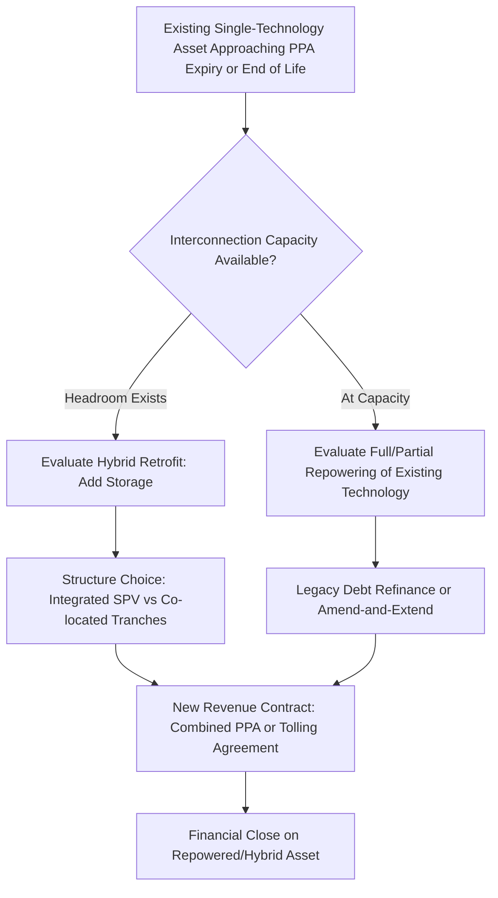

## Repowering and Hybrid Renewable Project Financing

### Overview

As the first generation of utility-scale wind and solar assets approaches the end of its original PPA term or useful equipment life, two distinct but increasingly intertwined financing disciplines have emerged: **repowering** (replacing or upgrading aging generation equipment at an existing site to extend life and boost output) and **hybrid project financing** (combining generation technologies — typically solar or wind with battery storage, or solar with wind — at a single site under an integrated or co-located capital structure). Both disciplines depart from "greenfield" project finance in important ways: repowering must contend with legacy debt, existing interconnection rights, and brownfield site conditions, while hybrid projects require financial models and risk allocation frameworks that did not exist in first-generation single-technology project finance.

**Key Points**

- Repowering monetizes existing site value (interconnection queue position, land control, transmission access) that would otherwise require years to re-permit from scratch
- Hybrid projects are financed either as a single integrated SPV or as separate co-located tranches, with revenue allocation between technologies a first-order structuring question
- Both categories increasingly interact with tax policy (US ITC/PTC treatment of repowered vs. new assets) and with legacy contractual obligations from the original asset
- Interconnection and grid capacity constraints are often the primary driver of both repowering and hybridization decisions, not merely economics

### Repowering: Definitions and Scope

| Term | Description |
| --- | --- |
| Full Repowering | Complete replacement of major equipment (wind turbines, or solar modules/inverters) on an existing site, often retaining only the foundations, roads, substation, and interconnection infrastructure |
| Partial Repowering | Selective replacement of specific components (e.g., inverters, gearboxes, blades) to extend life or improve performance without full equipment replacement |
| Life Extension | Engineering and operational measures to extend the operating life of existing equipment beyond its original design life without wholesale replacement, often supported by an updated structural/engineering assessment |
| Hybrid Retrofit | Addition of a new technology (most commonly battery storage) to an existing single-technology site, using existing interconnection capacity |

**Why Repower Rather Than Build Greenfield**

- **Interconnection queue position**: In many markets, new interconnection requests face multi-year queues and substantial network upgrade costs; an existing site retains its interconnection rights, which can be worth more than the physical equipment being replaced
- **Land control**: Existing leases/easements avoid the multi-year process of new land acquisition and community engagement
- **Permitting**: Many jurisdictions offer streamlined permitting for repowering versus greenfield development, since the land use and community impact profile is already established
- **Technology improvement**: Modern wind turbines (larger rotors, taller hub heights) or modern solar modules (higher efficiency, bifacial technology) can substantially increase energy yield on the same or a reduced physical footprint

### Repowering Financing Structure

**Dealing with Legacy Debt**

The original project financing must typically be refinanced or restructured concurrently with repowering, since the existing debt was sized against the original (now-superseded) asset and cash flow profile.

- **Full refinancing**: Existing debt is repaid at repowering financial close, replaced with new construction/term debt sized against the repowered asset's projected cash flows
- **Amend and extend**: Existing lenders agree to modify the facility to accommodate the repowering capex and revised cash flow profile, avoiding a full refinancing process
- **Sequential/staged repowering**: For portfolio assets (e.g., a wind farm with multiple turbine strings), repowering may proceed in phases to manage cash flow disruption and construction risk, with debt structured accordingly

**New Capital Requirements**

Repowering requires new construction-phase capital for equipment removal, new equipment procurement/installation, and any BoP or interconnection upgrades — sized and financed similarly to greenfield construction debt, but against a brownfield site with generally lower permitting/development risk than greenfield.

**Tax Considerations (US)**

Repowering financing has historically required careful navigation of the "80/20 rule" applied by the IRS to determine whether a repowered facility qualifies as a "new" facility for tax credit purposes (i.e., fair market value of retained/used equipment must not exceed 20% of the total value of the repowered facility for it to qualify for a new PTC/ITC vintage) [Unverified — this is an evolving area of tax guidance and the specific threshold, its application to storage, and interaction with current tax credit regimes should be confirmed against current IRS guidance at deal execution].

**Example**

A wind farm originally built with 1.5 MW turbines in the early 2010s repowers with modern 3-4 MW turbines on a reduced turbine count, using the same pad foundations where feasible and the same substation/interconnection point. The repowered facility may see AEP increase by 30-50%+ due to larger rotors and improved availability, while the original 20-year PPA (now expired) is replaced with a new merchant or corporate PPA arrangement reflecting current market terms.

### Hybrid Project Financing: Structuring Approaches

**Integrated SPV Structure**

Both technologies (e.g., solar + storage) are owned by a single project company, financed under a single capital structure with a blended financial model.

- Simplifies financing (one set of lenders, one set of documents) but requires the financial model to allocate cash flows and risk between technologies transparently, particularly where revenue is co-mingled (e.g., a single PPA covering combined output) or where one technology charges from the other (solar charging storage)
- Debt sizing typically reflects a blended DSCR approach across the combined, more diversified revenue stack

**Co-located but Separately Financed (Tranche) Structure**

Each technology is financed as a distinct tranche or even a distinct SPV, sharing site infrastructure (land, interconnection) under contractual arrangements (shared facilities agreements, interconnection sharing agreements) but with separate capital providers.

- Allows each technology's investors (e.g., tax equity for the ITC-eligible components, infrastructure debt for the generation asset) to underwrite according to their own risk/return criteria
- Requires careful contractual allocation of shared interconnection capacity, particularly regarding curtailment priority (which technology is curtailed first if combined output exceeds interconnection capacity)

**Example**

A 150 MW solar project co-located with a 50 MW / 200 MWh battery may be structured with the solar asset financed via traditional project debt against its PPA, while the battery is financed via a separate tax equity partnership flip structure monetizing the storage ITC, with an Interconnection Sharing Agreement governing dispatch priority at the shared point of interconnection.

### Revenue Allocation in Hybrid Structures

This is one of the more technically involved aspects of hybrid financing, since combined-output PPAs must specify how revenue is attributed between the generation and storage components.

- **Charging source restrictions**: Some tax credit regimes (historically) require storage to be charged predominantly by the co-located renewable source to qualify for certain credit treatments — requiring metering and contractual mechanisms to track charging source
- **Combined PPA with storage optimization carve-out**: A single PPA may cover the combined site output at a blended price, while a separate "tolling" or optimization agreement governs how the storage operator (which may be the same or a different party) is compensated for dispatch decisions that shift energy delivery timing
- **Interconnection capacity allocation**: Where combined nameplate capacity (solar + storage) exceeds interconnection capacity ("oversizing" or "overbuild"), curtailment/clipping must be modeled explicitly, with priority rules determining whether curtailed solar energy is stored (if battery has headroom) or genuinely lost

$$Revenue_{combined} = \sum_{t} \left[ P_{PPA} \times \min(G_t + D_t, C_{interconnect}) \right] + Revenue_{ancillary}$$

Where $G_t$ is generation output, $D_t$ is battery discharge, $C_{interconnect}$ is the interconnection capacity limit, and $Revenue_{ancillary}$ captures any separately-monetized ancillary services from the storage component.

### Financial Model Considerations for Hybrids

- **AC-coupled vs. DC-coupled configuration**: DC-coupled systems (battery on the DC side of a shared inverter with solar) can charge the battery from clipped solar energy that would otherwise be lost to inverter clipping, improving overall project economics but adding modeling complexity around shared inverter capacity allocation
- **Combined DSCR**: Lenders financing an integrated SPV assess DSCR against the blended cash flow of both technologies, which typically produces a more resilient (less volatile) coverage profile than either technology alone, given diversified revenue sources
- **Component-level performance guarantees**: Even within an integrated financing, EPC and O&M contracts typically maintain separate performance guarantees for the generation and storage components, since a single combined guarantee would obscure attribution of underperformance

### Risk Allocation Matrix

| Risk | Mitigation Mechanism (Repowering) | Mitigation Mechanism (Hybrid) |
| --- | --- | --- |
| Legacy interconnection/agreement transfer | Legal due diligence on assignability of existing interconnection agreement; utility consent processes | Interconnection Sharing Agreement with clear curtailment priority rules |
| Brownfield site/foundation reuse risk | Geotechnical/structural re-assessment of retained foundations; engineering certification | N/A |
| Tax credit qualification (80/20 rule) | Careful cost segregation and valuation analysis; tax counsel review | Charging source metering/verification for storage ITC compliance |
| Legacy debt/contract transition | Structured refinancing or amend-and-extend process with existing lenders | N/A |
| Revenue allocation ambiguity between technologies | N/A | Clearly defined combined PPA and/or tolling agreement revenue-split mechanics |
| Curtailment/clipping between co-located technologies | N/A | Explicit clipping/curtailment modeling; DC-coupling to capture otherwise-lost energy where applicable |
| Construction disruption to any continuing operations | Phased/staged repowering; temporary generation continuity planning where feasible | Sequencing plan for phased hybrid construction (e.g., storage added post-COD to existing generation) |

### Illustrative Structures Comparison (svg_diagram)

<svg xmlns="http://www.w3.org/2000/svg" viewBox="0 0 640 340">
<text x="320" y="26" text-anchor="middle" font-size="16" font-weight="bold" fill="#1a1a1a">Hybrid Financing Structures Compared (svg_diagram)</text>
<rect x="60" y="60" width="230" height="240" fill="none" stroke="#333" stroke-width="1.5" />
<text x="175" y="85" text-anchor="middle" font-size="13" font-weight="bold" fill="#1a1a1a">Integrated SPV</text>
<rect x="90" y="110" width="170" height="60" fill="#3d6ea5" />
<text x="175" y="145" text-anchor="middle" font-size="12" fill="#ffffff">Single Project Company</text>
<rect x="90" y="180" width="80" height="50" fill="#4a9d5f" />
<text x="130" y="209" text-anchor="middle" font-size="11" fill="#ffffff">Solar</text>
<rect x="180" y="180" width="80" height="50" fill="#c9603f" />
<text x="220" y="209" text-anchor="middle" font-size="11" fill="#ffffff">Storage</text>
<text x="175" y="255" text-anchor="middle" font-size="11" fill="#333">One lender group,</text>
<text x="175" y="270" text-anchor="middle" font-size="11" fill="#333">blended DSCR</text>
<rect x="350" y="60" width="230" height="240" fill="none" stroke="#333" stroke-width="1.5" />
<text x="465" y="85" text-anchor="middle" font-size="13" font-weight="bold" fill="#1a1a1a">Co-located Tranches</text>
<rect x="370" y="110" width="90" height="70" fill="#4a9d5f" />
<text x="415" y="150" text-anchor="middle" font-size="11" fill="#ffffff">Solar SPV</text>
<text x="415" y="165" text-anchor="middle" font-size="10" fill="#e8f5ea">Project Debt</text>
<rect x="470" y="110" width="90" height="70" fill="#c9603f" />
<text x="515" y="150" text-anchor="middle" font-size="11" fill="#ffffff">Storage SPV</text>
<text x="515" y="165" text-anchor="middle" font-size="10" fill="#fbe4dc">Tax Equity</text>
<rect x="390" y="200" width="150" height="30" fill="#8a6fbf" />
<text x="465" y="220" text-anchor="middle" font-size="10" fill="#ffffff">Shared Interconnection Agreement</text>
<text x="465" y="255" text-anchor="middle" font-size="11" fill="#333">Separate lenders,</text>
<text x="465" y="270" text-anchor="middle" font-size="11" fill="#333">contractual coordination</text>

<text x="320" y="325" text-anchor="middle" font-size="11" fill="#555" font-style="italic">Structure choice depends on tax treatment, lender preference, and revenue contract design</text>

</svg>

### Repowering/Hybrid Decision Flow

### Due Diligence Workstreams

- **Legal**: Assignability and consent requirements for existing interconnection agreements and land leases; legacy debt documentation review; new/amended PPA and tolling agreement review; tax credit qualification legal opinion (repowering)
- **Technical**: Independent Engineer assessment of retained infrastructure (foundations, substation, cabling) suitability for new equipment; updated energy yield assessment reflecting new technology; interconnection/curtailment modeling for hybrids
- **Tax**: Repowering — 80/20 rule analysis and cost segregation study; Hybrid — ITC eligibility and charging-source compliance analysis
- **Financial Model Audit**: Verification of legacy debt transition mechanics, combined/blended DSCR calculation methodology, and revenue allocation logic between co-located technologies

### Sensitivities Typically Stress-Tested

- Legacy debt refinancing terms (interest rate environment at repowering financial close versus original financing)
- Retained infrastructure (foundations, cabling) requiring unplanned remediation
- Tax credit qualification risk if valuation thresholds are not met
- Curtailment/clipping losses exceeding modeled assumptions in hybrid configurations
- Combined PPA pricing renegotiation risk if original offtaker relationship is not preserved
- Construction disruption extending beyond planned outage/phasing windows

**Conclusion**

Repowering and hybrid project financing both represent the renewable sector's maturation from first-build greenfield development into asset optimization and integration. Repowering monetizes the often-underappreciated value of existing interconnection and land rights, but requires careful navigation of legacy debt transitions and tax credit qualification rules. Hybrid financing requires resolving a structuring choice — integrated SPV versus co-located tranches — that is driven as much by tax and capital-provider considerations as by engineering logic, alongside financial modeling that must explicitly allocate revenue and curtailment risk between technologies sharing a single interconnection point. Both disciplines are increasingly central to renewable finance as grid interconnection capacity becomes the binding constraint on new development in many mature markets.

**Related Topics**

- Solar Photovoltaic Project Finance and Onshore/Offshore Wind Project Finance — original asset financing frameworks being repowered or hybridized
- Battery Energy Storage System Financing — the storage component in most hybrid retrofit structures
- Merchant Price Risk and Corporate Power Purchase Agreements — revenue contracts often renegotiated at repowering
- Investment Tax Credit (ITC) and Production Tax Credit (PTC) Qualification Rules (US)
- Interconnection Queue Reform and Grid Capacity Allocation
- DC-Coupled vs. AC-Coupled Hybrid System Design
- Amend-and-Extend Restructuring of Existing Project Finance Debt
- Cost Segregation Studies and the 80/20 Rule in Renewable Tax Equity
- Tolling Agreement Structuring for Co-located Storage Dispatch Rights
- Portfolio-Level Refinancing Strategies for Aging Renewable Asset Fleets