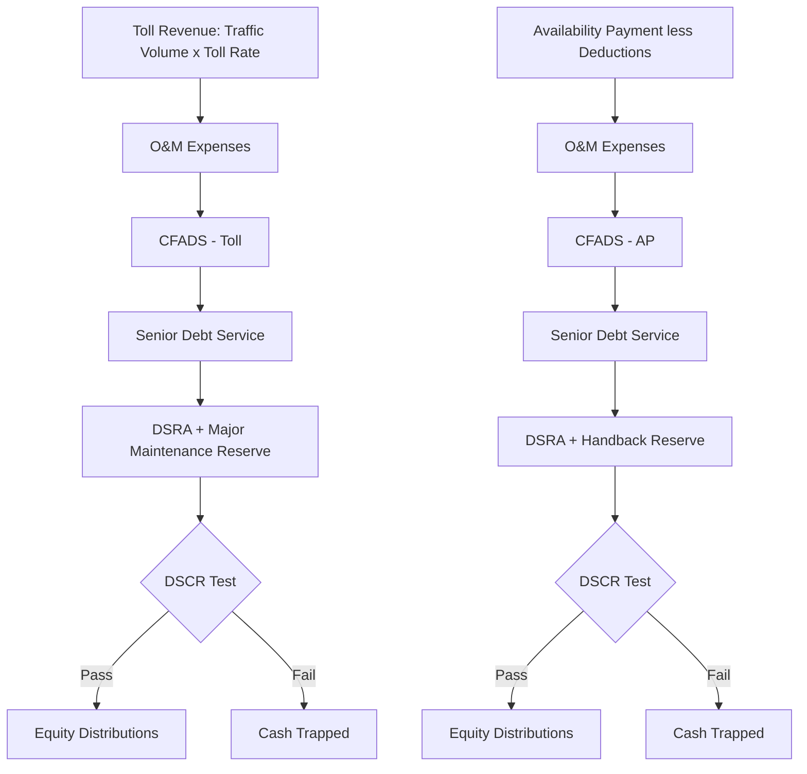

## Toll Road and Availability-Based Road Financing

### Overview

Road infrastructure financed through Public-Private Partnerships (PPPs) is structured around two fundamentally different revenue models: **toll/demand-risk concessions**, where the private concessionaire's revenue depends on actual traffic volumes and toll rates, and **availability-based (availability payment) concessions**, where the public authority pays the concessionaire a periodic fee contingent only on the road being available and meeting performance standards, regardless of how much traffic actually uses it. This distinction is the single most important structuring decision in road PPPs, as it determines which party bears demand/traffic risk and drives nearly every other financing parameter — leverage, tenor, covenant structure, and required equity returns.

**Key Points**

- Toll/demand-risk concessions transfer traffic volume risk to the private sector; availability payment (AP) concessions transfer it back to the public sector
- Availability-based structures are generally more bankable and support higher leverage, because they remove the most volatile and hardest-to-forecast risk variable
- Both structures share a common contractual backbone (concession agreement, construction contract, O&M contract) but differ substantially in revenue mechanics and risk allocation
- Traffic/demand risk has a well-documented history of forecasting error in toll concessions, materially shaping how conservatively lenders now underwrite demand-risk deals

### Toll (Demand-Risk) Concessions

**Structure**

The concessionaire is granted the right to collect tolls from road users for a defined concession period (typically 25-50+ years), in exchange for financing, constructing (if greenfield), and operating/maintaining the road. Revenue is a direct function of traffic volume and the toll rate/schedule (often subject to regulatory caps or adjustment formulas, e.g., CPI-linked).

$$Revenue_{t} = \sum_{i} V_{i,t} \times T_{i,t}$$

Where $V_{i,t}$ is traffic volume for vehicle class $i$ in period $t$, and $T_{i,t}$ is the toll rate applicable to that vehicle class.

**Traffic and Revenue Risk Assessment**

- **Traffic forecasts**: Prepared by specialized traffic engineering consultants, typically presenting base/low/high scenarios reflecting different assumptions on economic growth, competing route availability, land-use development along the corridor, and price elasticity of demand
- **Ramp-up risk**: Newly opened toll roads typically experience several years of below-forecast traffic as drivers adjust habits ("ramp-up curve") — a well-documented pattern that lenders explicitly model rather than assuming immediate stabilized traffic
- **Historical forecasting accuracy**: Toll road traffic forecasts have a widely-documented history of optimism bias, with numerous prominent toll road projects globally experiencing actual traffic materially below initial forecasts, leading to renegotiations, defaults, or government step-in [Unverified — the degree of forecasting error varies enormously by project and market, but the pattern itself is well documented in academic and industry literature on toll road performance]
- **Price elasticity**: Higher toll rates reduce diversion-adjusted demand; the specific elasticity is highly corridor-specific (dependent on availability and quality of free alternative routes)

**Example**

A greenfield toll road concession forecasts 40,000 vehicles/day by year 5 of operation (stabilized traffic), based on regional economic growth and limited free alternatives. Lenders apply a P90 (conservative) traffic case for debt sizing — perhaps 25-30% below the P50 base case — reflecting the historical pattern of forecast optimism, and require a longer ramp-up period (5-7 years to reach stabilized volumes) than the traffic consultant's base case assumes.

### Availability-Based (Availability Payment) Concessions

**Structure**

The public authority (grantor) makes periodic payments to the concessionaire contingent on the asset being available for use and meeting contractually specified performance/condition standards — the concessionaire bears no direct traffic/revenue risk. This structure is also commonly referred to as **DBFOM** (Design-Build-Finance-Operate-Maintain) when the private party handles the full project lifecycle under this payment mechanism.

$$Payment_{t} = AP_{base,t} \times (1 - Deduction_{unavailability,t}) \times (1 - Deduction_{performance,t})$$

Where $AP_{base,t}$ is the scheduled availability payment for period $t$, and deductions are applied for lane closures/unavailability and for failure to meet performance standards (e.g., pavement condition, incident response times).

**Availability and Performance Deduction Mechanics**

- **Availability deductions**: Calculated based on the extent (number of lanes, duration, criticality of location — e.g., peak hour closures penalized more heavily than off-peak) of any unplanned unavailability
- **Performance deductions**: Applied for failures against specified Key Performance Indicators (KPIs) — pavement roughness/condition indices, snow/ice clearance times, lighting functionality, incident response times
- **Deduction caps and cure periods**: Contracts typically specify maximum deduction thresholds and cure/rectification periods before deductions escalate or trigger termination rights, to avoid disproportionate penalties for minor or promptly-remedied issues

**Bankability Advantage**

Because AP concessions eliminate traffic/demand risk (the historically most volatile and forecast-error-prone risk in road PPPs), they generally achieve:

- Higher leverage (often 85-90%+ debt-to-capital, versus 60-75% typical for toll/demand-risk deals) [Inference — reflecting the substantially reduced revenue volatility profile, though actual leverage is deal- and rating-agency-specific]
- Longer debt tenors, often structured to closely match the concession term
- Lower cost of debt, reflecting the primarily public-authority credit risk rather than market/demand risk
- Simpler, more standardized financial models (no traffic forecasting uncertainty to model)

### Bankability Comparison

| Factor | Toll (Demand-Risk) | Availability Payment |
| --- | --- | --- |
| Primary risk borne by concessionaire | Traffic volume, toll rate realization | Construction, operational/maintenance performance only |
| Revenue counterparty credit | Diffuse (road users) | Concentrated (single public authority) |
| Typical leverage | 60-75% | 85-90%+ |
| Typical minimum DSCR | 1.30x-1.50x+ (demand risk) [Unverified — highly deal-specific] | 1.05x-1.20x (reflecting near-fixed payment stream) [Unverified — deal-specific] |
| Revenue volatility | High (traffic-dependent) | Low (contractual, subject to deductions) |
| Public sector fiscal exposure | Lower (revenue collected from users) | Higher (direct budgetary payment obligation) |
| Political/tariff-setting risk | Present (toll rate increases can be politically sensitive) | Largely absent (no user-facing toll rate decisions) |

### Hybrid and Shadow Toll Structures

- **Shadow Tolls**: The public authority pays the concessionaire per vehicle (or per traffic band) using the road, but the road user pays no toll directly — this transfers demand risk partially or fully to the public sector while retaining a "toll-like" payment mechanism, historically used in the UK's early PPP road program
- **Minimum Revenue Guarantees (MRGs)**: The public authority guarantees a minimum revenue floor to the concessionaire, with the concessionaire retaining upside above the floor and the government absorbing downside below it — a partial demand-risk transfer mechanism common in several emerging-market toll programs
- **Traffic Risk Sharing Bands**: More sophisticated structures define bands of traffic outcomes with different risk-sharing percentages between public and private parties (e.g., full private risk within a band around the base case, shared risk outside it) — used in some more recent-generation toll concessions to balance bankability with genuine risk transfer

### Capital Structure and Financing Instruments

| Instrument | Typical Use |
| --- | --- |
| Senior bank debt | Construction-phase financing for both toll and AP structures; often refinanced at or after substantial completion |
| Project bonds (private placement or public) | Common refinancing instrument for AP concessions post-construction, given the stable, bond-like payment stream; also used for stabilized toll assets |
| Availability Payment-backed bonds | Increasingly common in mature AP markets (e.g., US P3 programs), given rating agencies' comfort with the largely governmental credit risk |
| TIFIA/PABs (US-specific) | US federal credit programs (Transportation Infrastructure Finance and Innovation Act loans) and Private Activity Bonds provide subsidized/tax-exempt capital frequently layered into US road PPP capital stacks |
| Multilateral/DFI debt | Common in emerging-market toll concessions, often alongside political risk insurance or partial credit guarantees |

### Financial Model Mechanics

- **Construction phase**: Modeled similarly across both structures — EPC/D-B contract price, drawdown schedule, interest during construction, construction contingency
- **Operations phase (toll)**: Explicit traffic ramp-up curve, toll rate escalation formula (often CPI or CPI-linked with regulatory caps), O&M cost escalation, major maintenance/resurfacing cycle (e.g., every 10-15 years)
- **Operations phase (AP)**: Availability payment schedule (often flat in real terms or indexed to inflation), explicit modeling of availability/performance deduction risk (typically modeled as a minor haircut to the contractual AP schedule reflecting historical deduction experience), major maintenance reserve funded from the AP stream
- **Handback requirements**: Both structures typically specify condition standards the asset must meet at the end of the concession term ("handback standards"), requiring a funded handback reserve or committed capex in the final years of the concession

### Risk Allocation Matrix

| Risk | Toll (Demand-Risk) Mitigation | Availability Payment Mitigation |
| --- | --- | --- |
| Traffic/demand shortfall | P90 conservative traffic case for debt sizing; extended ramp-up assumptions; MRG/shadow toll hybrid structures | Not applicable — risk retained by public authority |
| Construction cost overrun/delay | Fixed-price D-B contract with LDs; contingency; DSU insurance | Same — construction risk transfer is common to both structures |
| Toll rate-setting/political risk | Contractual toll escalation formula with limited government discretion; legal enforceability review | Not applicable |
| Public authority payment/credit risk | N/A (revenue from users, not government) | Sovereign/municipal credit analysis; payment mechanism legal enforceability; step-in rights |
| O&M/performance risk | Performance-linked O&M contractor incentives; independent engineer monitoring | Deduction regime aligns concessionaire incentives directly with performance KPIs |
| Competing route/network risk | Non-compete clauses in concession agreement (where legally permissible); traffic forecast sensitivity to alternative route development | Generally immaterial (payment not traffic-linked) |
| Handback condition risk | Funded handback reserve; independent condition surveys pre-handback | Same mechanism applies |

### Cash Flow Waterfall Comparison

### Illustrative Risk Transfer Spectrum (svg_diagram)

<svg xmlns="http://www.w3.org/2000/svg" viewBox="0 0 640 260">
<text x="320" y="26" text-anchor="middle" font-size="16" font-weight="bold" fill="#1a1a1a">Road PPP Demand Risk Transfer Spectrum (svg_diagram)</text>
<line x1="60" y1="140" x2="580" y2="140" stroke="#333" stroke-width="2" />
<polygon points="580,140 570,134 570,146" fill="#333" />
<circle cx="100" cy="140" r="8" fill="#3d6ea5" />
<text x="100" y="170" text-anchor="middle" font-size="12" fill="#1a1a1a">Pure Availability</text>
<text x="100" y="185" text-anchor="middle" font-size="11" fill="#555">Payment</text>
<text x="100" y="115" text-anchor="middle" font-size="10" fill="#555">No demand risk</text>
<circle cx="280" cy="140" r="8" fill="#8a6fbf" />
<text x="280" y="170" text-anchor="middle" font-size="12" fill="#1a1a1a">Shadow Toll /</text>
<text x="280" y="185" text-anchor="middle" font-size="11" fill="#555">Minimum Revenue Guarantee</text>
<text x="280" y="115" text-anchor="middle" font-size="10" fill="#555">Partial demand risk</text>
<circle cx="460" cy="140" r="8" fill="#c98a3f" />
<text x="460" y="170" text-anchor="middle" font-size="12" fill="#1a1a1a">Risk-Sharing Band</text>
<text x="460" y="185" text-anchor="middle" font-size="11" fill="#555">Toll Concession</text>
<text x="460" y="115" text-anchor="middle" font-size="10" fill="#555">Shared demand risk</text>
<circle cx="550" cy="140" r="8" fill="#c9603f" />
<text x="550" y="170" text-anchor="middle" font-size="11" fill="#1a1a1a">Pure Toll</text>
<text x="550" y="115" text-anchor="middle" font-size="10" fill="#555">Full demand risk</text>

<text x="320" y="230" text-anchor="middle" font-size="11" fill="#555" font-style="italic">Leverage and bankability generally increase moving left along this spectrum</text>

</svg>

### Due Diligence Workstreams

- **Traffic/Legal (Toll)**: Independent traffic and revenue study review, toll rate-setting mechanism legal enforceability, non-compete clause review, concession agreement termination/compensation provisions
- **Technical**: Independent Engineer review of D-B contract, pavement/structural design standards, handback condition requirements
- **Public Authority Credit (AP)**: Sovereign/municipal/state credit analysis, appropriation risk (where AP payments are subject to annual legislative appropriation rather than an unconditional payment obligation), payment mechanism legal review
- **Insurance**: Construction all-risk, DSU, operational all-risk, third-party liability (particularly significant for public roads)
- **Model Audit**: Verification of traffic ramp-up mechanics (toll) or deduction regime modeling (AP), major maintenance/handback reserve sizing

### Sensitivities Typically Stress-Tested

- Toll: Traffic volume downside (P90 case), extended ramp-up period, toll rate escalation shortfall versus inflation, competing route development
- AP: Availability/performance deduction levels exceeding historical experience, public authority appropriation/credit risk, major maintenance cost overrun
- Both: Construction delay/cost overrun, O&M cost escalation, refinancing risk at any mini-perm maturity, handback capex requirements exceeding reserve

**Conclusion**

The toll versus availability-payment choice is the foundational structuring decision in road PPP finance, determining who bears the single largest source of revenue volatility in the sector: traffic demand. Availability payment structures have become the dominant model in many mature PPP markets precisely because they remove this historically difficult-to-forecast risk, enabling higher leverage, longer tenors, and simpler financial models — at the cost of shifting fiscal exposure onto the public authority. Toll and hybrid structures (shadow tolls, minimum revenue guarantees, risk-sharing bands) remain relevant where genuine risk transfer or private-sector traffic management incentives are policy priorities, but require materially more conservative underwriting, reflecting a well-established history of traffic forecast optimism in the sector.

**Related Topics**

- Public-Private Partnership (PPP) Contractual Frameworks and Risk Allocation Principles
- Availability Payment Deduction Regimes and KPI Design in Social Infrastructure PPPs
- Traffic and Revenue Study Methodologies and Historical Forecasting Accuracy
- TIFIA and Private Activity Bond Financing in US Transportation P3s
- Minimum Revenue Guarantee and Shadow Toll Structuring in Emerging Markets
- Handback Standards and End-of-Concession Condition Requirements
- Refinancing Gain-Sharing Mechanisms in Mature PPP Concessions
- Political Risk Insurance and Multilateral Credit Support for Emerging-Market Toll Roads
- Rail, Airport, and Port PPP Financing — comparative demand-risk transportation asset classes
- Social Infrastructure PPPs (Hospitals, Schools) — pure availability-payment comparator sector