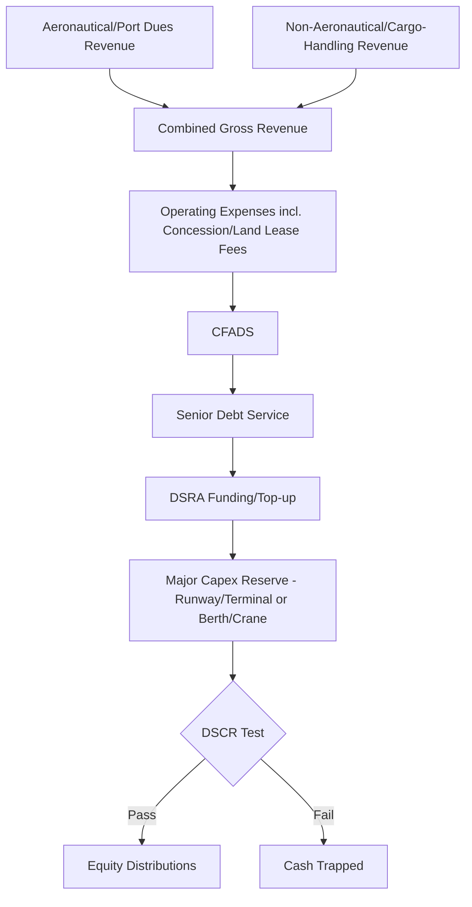

## Airport and Seaport Project Finance

### Overview

Airports and seaports occupy a distinct position within transportation project finance: both are complex, multi-revenue-stream infrastructure assets with substantial market power (often natural or regulated monopolies serving a catchment region), long asset lives, and capital structures shaped heavily by whether the asset is fully privatized, operated under a long-term concession, or financed as a regulated public utility. Unlike toll roads, which have essentially a single revenue driver (traffic volume × toll rate), airports and seaports generate revenue from a diversified mix of aeronautical/nautical charges and commercial (non-aeronautical/non-nautical) activities, requiring financial models that separately underwrite each stream's distinct risk and growth characteristics.

**Key Points**

- Airport revenue splits into aeronautical (landing fees, passenger charges) and non-aeronautical (retail, parking, real estate) streams with very different risk-return profiles
- Seaport revenue splits similarly into port/berth dues and cargo-handling charges versus concession/lease income from terminal operators
- Regulatory framework (single-till vs. dual-till regulation for airports; landlord vs. operating port models for seaports) materially shapes financeability and achievable leverage
- Both asset classes are exposed to macro-cyclical demand risk (passenger volumes, trade volumes) that correlates with GDP growth, distinct from the site-specific demand risk of toll roads

### Airport Project Finance

**Ownership and Concession Models**

| Model | Description |
| --- | --- |
| Full Privatization | Airport is sold outright to private ownership (rare globally, notable examples include UK airports post-1987 privatization wave) |
| Long-term Concession/Lease | Public authority retains ownership; private concessionaire operates under a long-term agreement (typically 20-50 years), common global model (e.g., many Latin American, European, and Asian airports) |
| Public-Private Partnership (Greenfield) | New airport or terminal developed and financed by a private consortium under a DBFOM-style structure, transferring back to public ownership at concession end |
| Management Contract | Private operator manages the airport for a fee without taking financing or demand risk (not project finance in the traditional sense) |

**Revenue Streams**

- **Aeronautical revenue**: Landing fees, passenger service charges, aircraft parking fees — typically subject to regulatory oversight given the airport's market power over airlines and passengers
- **Non-aeronautical (commercial) revenue**: Retail concessions, food & beverage, car parking, real estate/property development, advertising, and increasingly a larger share of total airport revenue at major hub airports
- **Regulated vs. unregulated split**: Aeronautical charges are frequently regulated (price caps, rate-of-return regulation, or negotiated agreements with airline users), while non-aeronautical revenue is typically unregulated and market-driven

**Single-Till vs. Dual-Till Regulation**

This regulatory design choice materially affects airport financeability and is a defining feature of airport (as opposed to seaport or toll road) project finance:

- **Single-till**: Non-aeronautical (commercial) profits are used to cross-subsidize and reduce regulated aeronautical charges — the regulator sets aeronautical charges considering total airport profitability across both revenue streams
- **Dual-till**: Aeronautical and non-aeronautical revenues are regulated/assessed separately, with aeronautical charges set to recover only aeronautical-related costs and a return on aeronautical assets, without cross-subsidization from commercial profits
- **Financing implication**: Dual-till regulation generally allows airports to retain more upside from strong commercial performance, while single-till regulation provides more stable but potentially lower aeronautical charge growth, since commercial success reduces the regulatory need for aeronautical charge increases [Unverified — the practical financeability impact varies by specific regulatory implementation and jurisdiction]

**Passenger Traffic Risk Assessment**

- **Traffic forecasting**: Prepared by specialized aviation consultants, incorporating GDP growth correlation, airline route network decisions, low-cost carrier penetration, and competing airport catchment overlap
- **Origin-Destination (O&D) vs. Transfer/Hub traffic**: O&D traffic (passengers whose journey begins or ends at that airport) is generally considered more stable and less susceptible to airline network restructuring than transfer/hub traffic, which can be lost relatively quickly if a hub carrier changes its network strategy
- **Airline counterparty concentration risk**: Airports heavily dependent on a single carrier or alliance face concentration risk analogous to a single-offtaker renewable project — a major carrier's bankruptcy, base closure, or network change can materially impact traffic
- **Exogenous shock exposure**: Aviation traffic has demonstrated acute sensitivity to exogenous shocks (pandemics, security events, fuel price spikes, geopolitical disruption to specific routes), a risk category modeled through severe-downside scenario stress testing rather than standard statistical forecasting methods

$$Revenue_{aero,t} = \sum_{i} PAX_{i,t} \times PSC_{i,t} + \sum_{j} MTOW_{j,t} \times LandingFee_{j,t}$$

Where $PAX_{i,t}$ is passenger volume by category (domestic/international) in period $t$, $PSC_{i,t}$ is the applicable passenger service charge, and $MTOW_{j,t}$ reflects landing fee calculations typically based on aircraft Maximum Take-Off Weight.

**Example**

A regional international airport concession models base-case passenger growth of 4-5% annually, tied closely to regional GDP forecasts, with a P90 downside case incorporating a severe demand shock (e.g., a 60-80% single-year traffic decline with multi-year recovery) as a standard stress test given the sector's demonstrated exposure to pandemic and geopolitical shocks — informing DSRA sizing and covenant headroom rather than the base-case debt sizing itself.

### Seaport Project Finance

**Ownership and Operating Models**

| Model | Description |
| --- | --- |
| Landlord Port | Public port authority owns land/infrastructure and leases terminals to private operators (most common global model for container ports) |
| Fully Private Port | Private ownership of both land and operations (less common, some historical UK examples) |
| Service/Tool Port | Public authority owns infrastructure and directly operates cargo-handling services (declining model globally in favor of landlord structure) |
| Terminal Concession | Private terminal operator holds a long-term concession (typically 20-30+ years) for a specific terminal within a broader landlord port, financing terminal-specific equipment and superstructure |

**Revenue Streams**

- **Port/harbor dues**: Charges to vessels for use of port infrastructure (channel, berths), often tonnage or vessel-size based
- **Cargo-handling charges**: Per-container (TEU — Twenty-foot Equivalent Unit) or per-tonnage charges for loading/unloading, typically the primary revenue driver for container terminal concessions
- **Storage and ancillary services**: Container storage/demurrage fees, warehousing, logistics value-added services
- **Land lease/concession fees**: Where the terminal operator itself is the concession-holder within a landlord port, an underlying land lease payment to the port authority is typically a fixed or minimum-guarantee-plus-variable cost

**Cargo Volume and Trade Risk Assessment**

- **Trade volume forecasting**: Correlated with regional/national GDP growth, global trade patterns, shipping line network decisions (which ports are included in major shipping alliance rotations), and competing port catchment overlap
- **Shipping line concentration risk**: Similar to airline concentration risk at airports — a container terminal dependent on a small number of shipping alliance rotations faces risk if that alliance restructures its network or a major carrier withdraws
- **Vessel size trends**: The trend toward larger container vessels (ultra-large container vessels, ULCVs) has required significant capital investment in berth depth, crane reach, and yard capacity at many ports to remain competitive for major shipping line rotations — a technology/obsolescence risk factor
- **Commodity-specific exposure**: Bulk/specialized cargo ports (oil, coal, grain, minerals) carry additional exposure to commodity price cycles and the specific commodity's long-term demand trajectory (e.g., coal terminal exposure to energy transition trends)

$$Revenue_{cargo,t} = \sum_{k} TEU_{k,t} \times HandlingRate_{k,t} + StorageRevenue_t + AncillaryRevenue_t$$

**Minimum Guaranteed Throughput (MGT)**

Many terminal concession agreements include a **Minimum Guaranteed Throughput** clause, under which the concessionaire commits to pay the port authority based on a minimum volume regardless of actual cargo handled — this de-risks the port authority's underlying land lease revenue but does not de-risk the concessionaire's own financing, which remains exposed to actual throughput for its debt service capacity.

### Capital Structure Comparison

| Metric | Airport Concession | Seaport Terminal Concession |
| --- | --- | --- |
| Typical gearing | 60-75%, higher for regulated/single-till structures with stable aeronautical revenue base | 55-70%, generally somewhat more conservative given cargo volume volatility and shipping line concentration risk [Unverified — highly deal- and market-specific] |
| Typical debt tenor | 15-25 years, sometimes matched to concession term | 12-20 years |
| Key revenue diversification factor | Non-aeronautical/commercial revenue growth | Diversification across cargo types and shipping line relationships |
| Common capital sources | Commercial banks, infrastructure funds, project bonds, DFIs (emerging markets) | Commercial banks, infrastructure funds, DFIs, export credit agencies (crane/equipment financing) |

### Financial Model Mechanics

- **Dual revenue stream modeling**: Both airports and seaports require the financial model to forecast and stress-test each revenue stream (aeronautical/non-aeronautical; port dues/cargo-handling) separately, since growth rates, regulatory constraints, and risk profiles differ materially between them
- **Capex reinvestment cycles**: Terminal/airport infrastructure requires periodic reinvestment (runway resurfacing, terminal expansion, crane replacement, berth deepening) — modeled as recurring or lumpy capex funded from a major maintenance/capex reserve, distinct from routine O&M
- **Regulatory reset risk (airports)**: Where aeronautical charges are subject to periodic regulatory review/reset (e.g., every 5 years), the financial model must incorporate assumptions about the outcome of future resets, a source of medium-term revenue uncertainty even for "regulated" revenue
- **DSCR covenants**: Minimum DSCR for airport concessions with a strong regulated aeronautical revenue base is typically **1.20x-1.40x**; for seaport terminal concessions with cargo volume/shipping line concentration exposure, typically **1.30x-1.50x+** [Unverified — deal-specific and sensitive to the strength of any minimum guaranteed revenue/throughput provisions]

### Risk Allocation Matrix

| Risk | Airport Mitigation | Seaport Mitigation |
| --- | --- | --- |
| Passenger/cargo volume downside | P90 traffic case for debt sizing; DSRA sized for severe-shock scenarios; non-aeronautical revenue diversification | Minimum Guaranteed Throughput provisions; cargo diversification across commodity types/shipping lines |
| Airline/shipping line counterparty concentration | Route network monitoring; diversified carrier base where achievable | Multiple shipping alliance relationships; long-term service agreements with anchor carriers |
| Regulatory reset/tariff risk | Long-term regulatory framework agreements; contractual protections on reset methodology | Generally less regulated pricing exposure than airports, but land lease/concession fee reset risk at renewal |
| Exogenous shock (pandemic, security, geopolitical) | Business interruption insurance; conservative DSRA sizing; covenant waiver/standstill mechanisms built into loan documentation | Similar mechanisms; trade route disruption insurance where available |
| Vessel/aircraft size obsolescence | Design flexibility for future capacity expansion; phased capex planning | Berth depth/crane capacity designed with future vessel size trends in mind |
| Construction/expansion cost overrun (greenfield or expansion) | Fixed-price D-B/EPC contracts; contingency reserves; DSU insurance | Same mechanisms; specialized marine construction risk considerations for berths/breakwaters |
| Land lease/concession renewal risk | Long concession term aligned with debt tenor; renewal option provisions | Same considerations, particularly relevant for terminal concessions within landlord ports |

### Cash Flow Waterfall (Diversified Revenue Structure)

### Illustrative Revenue Mix Comparison (svg_diagram)

<svg xmlns="http://www.w3.org/2000/svg" viewBox="0 0 640 300">
<text x="320" y="26" text-anchor="middle" font-size="16" font-weight="bold" fill="#1a1a1a">Illustrative Airport vs. Seaport Revenue Mix (svg_diagram)</text>

<text x="160" y="60" text-anchor="middle" font-size="13" font-weight="bold" fill="`#1a1a1a`">Airport</text>

<rect x="90" y="80" width="140" height="90" fill="`#3d6ea5`" />

<text x="160" y="130" text-anchor="middle" font-size="11" fill="`#ffffff`">Aeronautical</text>

<rect x="90" y="170" width="140" height="70" fill="`#4a9d5f`" />

<text x="160" y="210" text-anchor="middle" font-size="11" fill="`#ffffff`">Non-Aeronautical</text>

<text x="480" y="60" text-anchor="middle" font-size="13" font-weight="bold" fill="`#1a1a1a`">Seaport Terminal</text>

<rect x="410" y="80" width="140" height="120" fill="`#c9603f`" />

<text x="480" y="145" text-anchor="middle" font-size="11" fill="`#ffffff`">Cargo-Handling (TEU)</text>

<rect x="410" y="200" width="140" height="40" fill="`#c98a3f`" />

<text x="480" y="224" text-anchor="middle" font-size="11" fill="`#ffffff`">Port Dues/Storage</text>

<text x="320" y="270" text-anchor="middle" font-size="11" fill="#555" font-style="italic">Illustrative proportions only — actual mix varies substantially by asset and market</text>

</svg>

### Due Diligence Workstreams

- **Traffic/Trade**: Independent aviation traffic consultant review (airports) or trade/cargo volume consultant review (seaports), airline/shipping line relationship and network risk assessment
- **Regulatory/Legal**: Regulatory framework review (single-till/dual-till for airports; tariff-setting authority for ports), concession agreement termination/compensation provisions, land lease and title review
- **Technical**: Independent Engineer review of runway/terminal or berth/crane infrastructure condition and expansion capacity, capex reinvestment planning
- **Insurance**: Construction all-risk (for expansion/greenfield), operational all-risk, business interruption (with particular attention to exogenous shock coverage/exclusions post-pandemic era policy changes)
- **Model Audit**: Verification of dual-revenue-stream forecasting methodology, regulatory reset assumptions, and major capex reserve sizing

### Sensitivities Typically Stress-Tested

- Passenger/cargo volume downside (P90 case, severe exogenous shock scenarios)
- Airline/shipping line network restructuring or counterparty loss
- Regulatory reset outcomes below base-case assumptions (airports)
- Non-aeronautical/commercial revenue underperformance relative to forecast
- Major capex/reinvestment cost overrun (runway, terminal, berth, crane)
- Currency risk for internationally financed emerging-market assets
- Competing airport/port catchment development reducing market share

**Conclusion**

Airport and seaport project finance share a common architecture — diversified, multi-stream revenue models exposed to macro-cyclical demand risk and shaped by long-term concession or regulatory frameworks — but differ from single-revenue-driver infrastructure like toll roads in requiring financial models that separately underwrite aeronautical/non-aeronautical or port-dues/cargo-handling revenue streams. Airport financeability is heavily influenced by the regulatory till structure governing aeronautical charges, while seaport financeability hinges on cargo diversification and the strength of relationships with major shipping alliances. Both asset classes have demonstrated acute vulnerability to exogenous shocks, a lesson embedded into modern underwriting through severe-downside stress testing, conservative reserve sizing, and increasingly flexible covenant/waiver mechanisms in loan documentation.

**Related Topics**

- Toll Road and Availability-Based Road Financing — comparative demand-risk transportation asset class
- Public-Private Partnership (PPP) Contractual Frameworks and Risk Allocation Principles
- Single-Till vs. Dual-Till Airport Economic Regulation
- Container Shipping Alliance Networks and Terminal Concession Risk
- Minimum Guaranteed Throughput and Take-or-Pay Structures in Port Concessions
- Business Interruption Insurance for Pandemic and Geopolitical Shock Exposure
- Rail Project Finance — comparative transportation infrastructure demand-risk profile
- Regulatory Asset Base (RAB) Methodologies in Infrastructure Tariff-Setting
- Political Risk Insurance and DFI Co-Financing for Emerging-Market Transportation Assets
- Social Infrastructure PPPs — comparative availability-payment infrastructure sector