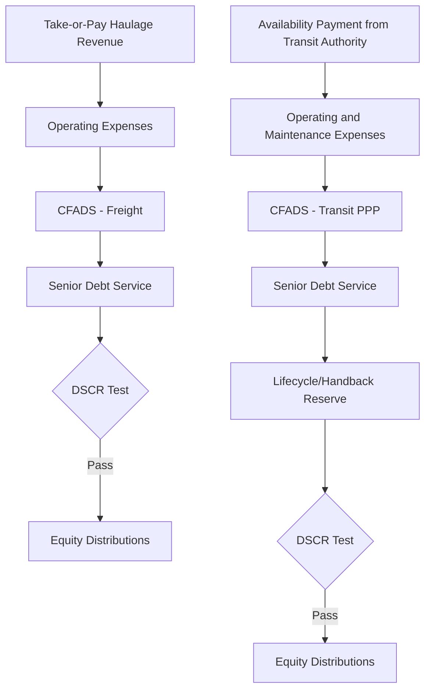

## Rail and Rapid Transit Financing

### Overview

Rail and rapid transit financing spans an unusually broad spectrum of asset types — freight rail, intercity/high-speed passenger rail, urban metro/subway systems, light rail transit (LRT), and rolling stock leasing — each carrying distinct revenue models, capital intensity, and risk allocation frameworks. Unlike toll roads or airports, most passenger rail and transit systems face structurally weaker farebox revenue relative to capital and operating costs, making availability-payment and hybrid public-subsidy structures far more prevalent than pure demand-risk concessions. Freight rail, by contrast, more closely resembles a private infrastructure/logistics business with direct commercial revenue and, in some markets (notably North America), vertically integrated private ownership rather than a concession model at all.

**Key Points**

- Passenger rail/transit systems rarely cover full capital and operating costs from farebox revenue alone, making public subsidy or availability-payment mechanisms the norm rather than the exception
- Freight rail is often financed as a vertically integrated corporate/infrastructure business (particularly in North America) rather than through a discrete concession structure
- Rolling stock financing (trains themselves) is frequently structured as a separate leasing/financing layer distinct from the infrastructure concession
- High-speed and intercity passenger rail carries some of the most challenging demand-risk profiles in transportation finance, with a well-documented history of ridership forecasts missing targets

### Rail Sub-Sector Taxonomy and Financing Implications

| Sub-Sector | Typical Ownership/Financing Model | Revenue Basis |
| --- | --- | --- |
| Freight Rail | Vertically integrated private ownership (North America) or open-access with regulated track access charges (much of Europe) | Freight tariffs/haulage charges, often long-term contracts with shippers |
| High-Speed/Intercity Passenger Rail | Government-owned, PPP concession, or hybrid (infrastructure public, operations concessioned) | Farebox revenue, frequently supplemented by government subsidy/availability payments |
| Urban Metro/Subway | Predominantly public ownership; PPP models used for specific lines/extensions in some markets | Farebox revenue plus substantial public subsidy; availability payment common for PPP components |
| Light Rail Transit (LRT) | Often municipal ownership with PPP delivery (DBFOM) for construction/operations | Farebox revenue plus public subsidy; frequently structured as availability payment |
| Rolling Stock (Trains) | Separate leasing companies (ROSCOs in the UK model) or direct procurement financing | Lease payments from train operating companies or transit authorities |

### Freight Rail Financing

**Structure**

In North America, major freight railroads are typically vertically integrated private corporations owning track, rolling stock, and operations, financed through conventional corporate finance (bonds, revolving credit facilities) rather than discrete project finance structures, given the network-wide nature of the asset and business. In much of Europe and other markets with open-access regimes, infrastructure managers (often state-owned) charge regulated track access fees to multiple freight (and passenger) train operators, more closely resembling a regulated utility model.

**Revenue and Contracting**

- **Long-term haulage/take-or-pay contracts**: Freight rail projects tied to specific commodity flows (e.g., a dedicated line serving a mine or port) are frequently financed against long-term, often take-or-pay, shipper contracts — resembling project finance principles applied to a rail corridor
- **Regulated track access charges**: In open-access regimes, infrastructure owners earn regulated per-train-kilometer or per-tonne-kilometer charges from operators, providing more predictable but regulator-constrained revenue

**Example**

A dedicated freight rail line built to connect an inland mining operation to a port is financed on a project-finance basis, underpinned by a 20-year take-or-pay haulage agreement with the mining company covering a minimum tonnage regardless of actual shipments — closely resembling the risk allocation logic of a minimum guaranteed throughput port concession.

### Passenger Rail and Rapid Transit Financing

**The Farebox Recovery Gap**

Most urban transit and many intercity passenger rail systems do not recover full costs from farebox revenue — the difference between operating costs (and often capital costs) and farebox revenue is termed the **farebox recovery ratio**, and is a central planning and financing metric.

$$FareboxRecoveryRatio = \frac{FareboxRevenue}{OperatingCost}$$

Ratios below 100% (common for most urban transit systems, often materially below 50% in many markets) [Unverified — actual ratios vary enormously by system, market, and post-pandemic ridership recovery patterns] mean that public subsidy is structurally embedded in the financing model, not an occasional supplement — a fundamental difference from toll roads or airports, where the underlying asset is generally expected to be commercially self-sustaining.

**Financing Structures**

- **Public capital financing (municipal/government bonds)**: The most common model globally for core transit infrastructure — general obligation or revenue bonds issued by a transit authority or municipality, backed by a mix of farebox revenue, dedicated tax revenue (sales tax levies are common in the US), and general government credit
- **PPP/DBFOM for specific lines or extensions**: Private consortium designs, builds, finances, and operates/maintains a specific line or extension under an availability-payment structure, with the public transit authority retaining fare-setting and revenue collection (and therefore demand risk)
- **Concession with partial demand risk**: Less common but present in some markets — a private concessionaire takes on farebox revenue risk in exchange for the concession, sometimes combined with a minimum revenue guarantee from government to achieve bankability
- **Value capture mechanisms**: Financing tools that monetize the increase in adjacent land value created by new transit access — including tax increment financing (TIF), special assessment districts, and joint development (transit authority partnering with private developers on land above/adjacent to stations) — increasingly used to supplement traditional financing sources

**Example**

A new light rail extension is delivered under a DBFOM availability-payment structure: a private consortium designs, builds, and will operate/maintain the line for 30 years, receiving availability payments from the municipal transit authority contingent on service availability and performance standards, while the transit authority continues to set fares, collect farebox revenue, and bear all ridership risk — a structure that isolates construction and lifecycle performance risk in the private sector while keeping demand risk with the public sponsor, given how difficult transit ridership has proven to forecast reliably.

### Ridership Forecasting Risk

Ridership forecasting for new rail/transit lines has a well-documented history of significant forecast error, generally in the optimistic direction, across many markets and project types [Unverified — the degree and directionality of forecast error is well-documented in academic transportation planning literature but varies by project, region, and forecasting methodology]. This has several financing implications:

- **P90/conservative ridership cases**: Where any demand risk is retained in the private financing structure, lenders apply substantially conservative ridership assumptions relative to sponsor/planning agency base cases
- **Preference for availability payment**: The ridership forecasting risk history is a primary driver of the strong market preference for availability-payment delivery of new transit PPPs, transferring demand risk back to the public sponsor who is better positioned to bear it (via tax revenue, budget appropriation) than a private concessionaire
- **Network effect complexity**: Transit ridership forecasts must account for network effects (how a new line interacts with existing transit network, park-and-ride catchment, connecting bus services) that are more complex to model than a standalone toll road's traffic catchment

### Rolling Stock Financing

Rolling stock (trains, railcars) is frequently financed and owned separately from the track/infrastructure concession, particularly in liberalized rail markets.

**Rolling Stock Company (ROSCO) Model**

Most developed in the UK's privatized rail structure, ROSCOs own rolling stock and lease it to train operating companies (TOCs) under long-term leases, allowing the capital-intensive asset (trains, with 30-40+ year useful lives) to be financed independently of the (often shorter-term) operating franchise/concession held by the TOC.

- **Benefits**: Decouples long-lived rolling stock financing from potentially shorter operating concessions, allows specialized rolling stock lessors to achieve financing efficiencies through portfolio diversification across multiple TOCs/operators
- **Financing structures**: Rolling stock leases are typically structured as operating leases or finance leases, with the ROSCO raising debt (asset-backed or corporate) against the lease payment stream from creditworthy TOCs/transit authorities
- **Residual value risk**: The ROSCO bears risk on the rolling stock's residual/re-leasing value at lease expiry, particularly relevant for specialized rolling stock with limited alternative deployment options if a specific route/gauge configuration becomes obsolete

### Capital Structure Comparison

| Metric | Freight Rail (Dedicated Line) | Passenger Rail/Transit PPP (Availability Payment) | Rolling Stock (ROSCO) |
| --- | --- | --- | --- |
| Typical gearing | 65-75%, supported by take-or-pay shipper contracts | 80-90%+, reflecting near-fixed availability payment stream | Varies; often asset-backed with moderate-high leverage given lease payment predictability |
| Typical debt tenor | 15-20 years, often matched to shipper contract tenor | 25-30+ years, often matched to concession term | Matched to lease term, often 10-20+ years |
| Key revenue certainty driver | Take-or-pay contract strength and shipper creditworthiness | Public authority credit and availability payment mechanism | Train operating company/transit authority lease payment creditworthiness |

### Risk Allocation Matrix

| Risk | Freight Rail Mitigation | Passenger Rail/Transit Mitigation |
| --- | --- | --- |
| Commodity/shipper demand risk | Take-or-pay contracts; shipper creditworthiness analysis; diversified shipper base where feasible | Not applicable in availability payment structures (public sponsor retains ridership risk) |
| Ridership/demand risk | N/A | Availability payment structure transfers this to public sponsor; P90 conservative case where any risk is retained privately |
| Construction cost overrun/delay | Fixed-price D-B contract; contingency; DSU insurance | Same mechanisms — construction risk transfer is common regardless of revenue structure |
| Rolling stock residual value | N/A (typically owned outright in freight) | ROSCO-specific: diversified lessee base; conservative residual value assumptions; standardized (non-bespoke) rolling stock specification where feasible |
| Public authority payment/appropriation risk | N/A | Sovereign/municipal credit analysis; appropriation risk assessment; dedicated tax revenue pledges where available |
| Track access/interoperability risk (open-access markets) | Regulatory framework review; long-term access rights | Similar considerations where infrastructure and operations are separated |
| Technology/signaling obsolescence | Standardized, interoperable technology specification | Same; particular relevance for automated/driverless transit systems |

### Cash Flow Structure Comparison

### Illustrative Farebox Recovery and Subsidy Structure (svg_diagram)

<svg xmlns="http://www.w3.org/2000/svg" viewBox="0 0 640 300">
<text x="320" y="26" text-anchor="middle" font-size="16" font-weight="bold" fill="#1a1a1a">Illustrative Transit Cost Recovery Structure (svg_diagram)</text>
<line x1="80" y1="260" x2="580" y2="260" stroke="#333" stroke-width="1.5" />
<line x1="80" y1="60" x2="80" y2="260" stroke="#333" stroke-width="1.5" />
<text x="330" y="290" text-anchor="middle" font-size="12" fill="#333">Total System Operating and Capital Cost</text>
<rect x="150" y="130" width="180" height="130" fill="#3d6ea5" />
<text x="240" y="200" text-anchor="middle" font-size="13" fill="#ffffff" font-weight="bold">Farebox Revenue</text>
<text x="240" y="220" text-anchor="middle" font-size="11" fill="#e0e8f2">Often below 50% of cost</text>
<rect x="330" y="70" width="180" height="190" fill="#c9603f" />
<text x="420" y="160" text-anchor="middle" font-size="13" fill="#ffffff" font-weight="bold">Public Subsidy /</text>
<text x="420" y="180" text-anchor="middle" font-size="13" fill="#ffffff" font-weight="bold">Availability Payment</text>

<text x="330" y="315" text-anchor="middle" font-size="11" fill="#555" font-style="italic">Illustrative proportions only — actual recovery ratios vary substantially by system and market</text>

</svg>

### Due Diligence Workstreams

- **Traffic/Ridership**: Independent ridership forecast review (transit/passenger rail) or shipper/commodity flow analysis (freight), network effect and connecting service assessment
- **Legal**: Concession/DBFOM agreement review, take-or-pay contract enforceability (freight), track access rights (open-access markets), public authority appropriation mechanism legal review
- **Technical**: Independent Engineer review of track/signaling/rolling stock design, interoperability standards, lifecycle maintenance planning
- **Public Authority Credit**: Sovereign/municipal/transit authority credit analysis, dedicated tax revenue pledge review, appropriation risk assessment
- **Model Audit**: Verification of availability payment/deduction mechanics, take-or-pay revenue modeling, rolling stock lease/residual value assumptions

### Sensitivities Typically Stress-Tested

- Ridership downside relative to base-case forecast (where any demand risk is retained privately)
- Public authority appropriation/credit risk (availability payment structures)
- Shipper volume/commodity demand downside and counterparty credit risk (freight)
- Construction cost overrun/delay, particularly for tunneling/complex urban transit construction
- Rolling stock residual value shortfall at lease expiry
- Major lifecycle maintenance/renewal cost overrun (track, signaling, rolling stock)
- Farebox recovery ratio deterioration requiring increased public subsidy

**Conclusion**

Rail and rapid transit financing is defined less by a single dominant structure than by the sub-sector's fundamental economics: freight rail behaves like a commercial infrastructure/logistics business financeable on conventional corporate or take-or-pay project finance principles, while passenger rail and urban transit systems structurally require public subsidy given persistently low farebox recovery ratios, making availability-payment PPP delivery the dominant model for new transit infrastructure. The well-documented history of ridership forecast optimism across the sector has reinforced this preference for keeping demand risk with public sponsors, while rolling stock financing has evolved its own specialized leasing layer (the ROSCO model) to efficiently finance long-lived trains independently of shorter operating concessions.

**Related Topics**

- Toll Road and Availability-Based Road Financing — comparative demand-risk transportation framework
- Airport and Seaport Project Finance — comparative diversified-revenue transportation infrastructure
- Value Capture Financing: Tax Increment Financing and Joint Development for Transit
- Take-or-Pay Contract Structuring in Dedicated Freight Rail Corridors
- Rolling Stock Company (ROSCO) Leasing Structures and Residual Value Risk
- Public-Private Partnership (PPP) Contractual Frameworks and Risk Allocation Principles
- Ridership Forecasting Methodologies and Historical Accuracy in Transit Planning
- Municipal and Revenue Bond Financing for Public Transit Infrastructure
- Social Infrastructure PPPs — comparative pure availability-payment sector
- High-Speed Rail Megaproject Financing and Cost Overrun Risk