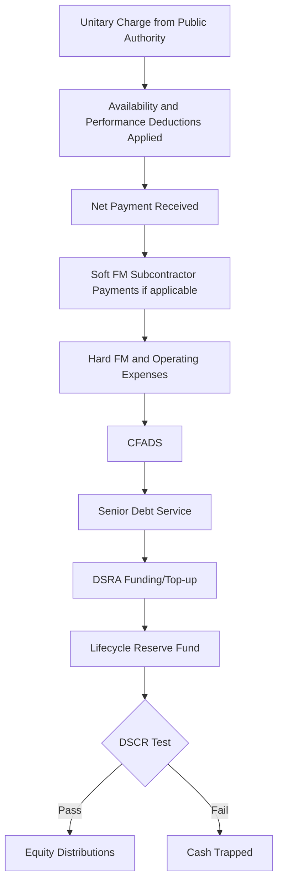

## Social Infrastructure and PPP Structures

### Overview

Social infrastructure — hospitals, schools, prisons, courthouses, government buildings, student and social housing, and similar public-service facilities — represents the purest application of the availability-payment PPP model in the infrastructure finance landscape. Unlike toll roads, airports, or transit systems, social infrastructure assets generally have no independent revenue-generating capacity at all: the facility exists to house a public service (education, healthcare, justice) delivered by the public sector or a separate service provider, and the private party's sole compensation is a contractual payment stream from the public authority tied strictly to asset availability and lifecycle performance, with essentially zero demand or volume risk transferred to the private party. This makes social infrastructure PPPs the most standardized, most bankable, and most widely replicated PPP model globally — but also the model most scrutinized for whether private finance genuinely offers value for money versus conventional public procurement.

**Key Points**

- Social infrastructure PPPs (often called PFI — Private Finance Initiative in the UK, or DBFOM/social infrastructure P3 elsewhere) transfer essentially zero demand risk to the private party — payment depends only on availability and performance
- The private party typically does NOT deliver the core public service (education, medical care, incarceration) — only the physical asset and "soft" facilities management (FM) services (maintenance, cleaning, catering, security)
- This "hard FM vs. soft FM vs. core service" separation is the central structuring principle distinguishing social infrastructure PPPs from availability-payment transportation PPPs
- Value-for-money (VfM) analysis comparing PPP delivery against conventional public procurement is a standard, often mandatory, pre-procurement requirement in most social infrastructure PPP programs

### Core Structural Principle: Separating Asset, Service, and Core Function

| Layer | Who Delivers It | Example (Hospital) |
| --- | --- | --- |
| Core public service | Always the public sector (or a separate public/private service provider outside the PPP contract) | Doctors, nurses, clinical care, medical decision-making |
| Soft Facilities Management (FM) | Often the PPP concessionaire or its subcontractor | Catering, cleaning, laundry, portering, security, grounds maintenance |
| Hard FM / Lifecycle Maintenance | The PPP concessionaire | Building fabric maintenance, mechanical/electrical systems, lifecycle capital replacement (roofing, HVAC, lifts) |
| Design, Build, Finance | The PPP concessionaire | Original construction and financing of the facility |

This separation is what allows social infrastructure PPPs to transfer construction and lifecycle asset-performance risk to the private sector while keeping the politically and operationally sensitive core public service function entirely within public control — addressing a common public concern about "privatizing" essential services while still capturing private-sector discipline in asset delivery and maintenance.

### Availability Payment Mechanics

**Unitary Charge**

The public authority pays a single, typically monthly or quarterly, "unitary charge" to the concessionaire, covering debt service, equity returns, hard FM/lifecycle costs, and (where included) soft FM service costs — subject to deductions for unavailability or poor performance.

$$UnitaryCharge_{t} = BaseCharge_{t} \times (1 - Deduction_{availability,t}) \times (1 - Deduction_{performance,t})$$

**Availability Deductions**

Structured around the specific functional units of the facility rather than a simple binary open/closed test — critical in social infrastructure given the granularity of use (e.g., an individual hospital ward, operating theater, or school classroom being unavailable, rather than the entire building).

- **Functional unit unavailability**: Deductions scaled to the criticality and duration of unavailability for specific rooms/units (e.g., an operating theater unavailable for a full day incurs a much larger deduction than a single unused office)
- **Performance failure deductions**: Applied against specific service KPIs for soft FM elements (e.g., cleaning standards, catering quality/timeliness, response times for maintenance requests)
- **Persistent breach/termination triggers**: Contracts specify cumulative deduction thresholds or repeated KPI failures that can escalate to step-in rights or ultimately contract termination, though these are rare in practice given the strong incentive structure to remedy issues promptly

**Example**

A PPP hospital contract deducts a defined percentage of the daily unitary charge rate for each hour an operating theater is unavailable due to a facilities fault (e.g., HVAC failure preventing use), with the deduction rate calibrated to reflect the high criticality of that specific functional space, while a similar-duration unavailability of a staff break room carries a materially smaller deduction — the deduction schedule itself, negotiated during procurement, is one of the most heavily scrutinized commercial terms in the concession agreement.

### Delivery Models by Sub-Sector

| Sub-Sector | Typical Scope in PPP | Notable Structuring Considerations |
| --- | --- | --- |
| Hospitals | DBFM (Design-Build-Finance-Maintain) of the building; hard FM and often soft FM within the contract; clinical services always excluded | High specification complexity (medical equipment interfaces, infection control standards); frequent scope changes over long concession terms as medical practice evolves |
| Schools | DBFM of the building; hard/soft FM often included; teaching always excluded | Standardized design templates reduce construction risk; typically smaller individual project size, often bundled into portfolios for financing efficiency |
| Prisons/Justice Facilities | DBFM of the building; sometimes includes custodial/operational services in some jurisdictions (a notable departure from the "no core service" principle, and more contentious) | Security specification is highly detailed; some markets (e.g., parts of the US, UK "contracted-out" prisons) do include core custodial operations in the private scope, unlike hospitals/schools |
| Government Buildings/Courthouses | DBFM of the building; hard/soft FM typically included | Generally lower complexity than hospitals; often used as an early/pilot PPP sector in developing programs |
| Social/Affordable Housing | Varies — DBFM for public housing stock, or direct development/investment models for affordable housing funds | Often blends PPP-style availability payment with rental income streams, depending on market and tenure structure |

### Capital Structure

Social infrastructure PPPs typically achieve the highest leverage of any PPP asset class, reflecting the near-total absence of demand risk:

- **Typical gearing**: 85-90%+ debt-to-capital, among the highest in project finance generally
- **Typical debt tenor**: Often matched closely to the concession term (25-30 years), given the highly predictable, contractually fixed payment stream
- **Minimum DSCR**: Typically **1.05x-1.15x**, among the lowest (most aggressive) DSCR covenants across infrastructure asset classes, reflecting the low volatility of the availability payment revenue stream [Unverified — deal- and jurisdiction-specific, and has shifted over time with prevailing interest rates and lender risk appetite]
- **Common capital sources**: Institutional debt (pension funds, insurance companies) has become a dominant capital source for mature-market social infrastructure PPPs post-construction, given the bond-like, long-duration, inflation-linked (in many structures) cash flow profile that closely matches those investors' liability profiles
- **Inflation indexation**: Unitary charges are frequently indexed (fully or partially) to inflation (e.g., CPI or RPI in the UK), which has historically made the asset class attractive to inflation-hedging institutional investors, though this also transfers inflation risk to the public authority's budget

### Financial Model Mechanics

- **Construction phase**: Standard D-B contract structure — fixed-price, date-certain, with liquidated damages for delay; independent certifier (Independent Certifier / Employer's Agent) verifies completion and readiness for service commencement
- **Operations phase**: Unitary charge modeled with explicit deduction assumptions (typically a modest haircut reflecting historical deduction experience, often only 1-3% of gross unitary charge in a well-run asset) [Unverified — actual deduction experience varies by facility type and operator performance]
- **Lifecycle/handback modeling**: A dedicated lifecycle fund/reserve is built into the unitary charge structure from the outset, pre-funding the periodic replacement of building components (roofing, HVAC, lifts, finishes) over the concession term, with handback condition surveys and reserve top-up requirements near contract expiry
- **Soft FM subcontracting**: Where soft FM is included, the concessionaire typically subcontracts these services to specialist FM providers under back-to-back contracts mirroring the deduction risk, effectively passing much of the soft FM performance risk down the contracting chain

### Value-for-Money (VfM) Analysis

Most social infrastructure PPP programs require a formal VfM assessment comparing the PPP delivery option against a **Public Sector Comparator (PSC)** — a hypothetical model of conventionally financed and delivered public procurement — before proceeding with a PPP procurement.

- **Qualitative factors**: Risk transfer effectiveness, innovation potential, whole-life asset performance incentives
- **Quantitative factors**: Discounted whole-life cost comparison between PPP unitary charge payments and estimated conventional procurement costs, incorporating risk-adjusted cost of capital differentials
- **Ongoing debate**: VfM methodology, particularly the treatment of the cost of private capital versus government borrowing rates, and the valuation of risk transfer, has been a persistent subject of public policy debate and academic scrutiny across PPP programs globally [Unverified — this reflects an active and evolving area of public policy and comparative infrastructure finance research rather than a settled consensus]

### Risk Allocation Matrix

| Risk | Mitigation Mechanism |
| --- | --- |
| Construction cost overrun/delay | Fixed-price D-B contract with LDs; contingency reserve; DSU insurance; independent certifier sign-off |
| Availability/performance deduction risk | Detailed functional-unit deduction schedule negotiated at procurement; soft FM subcontracting passes performance risk down the chain |
| Public authority payment/appropriation risk | Sovereign/municipal credit analysis; in many jurisdictions, unitary charge payments are treated as a senior budgetary obligation with strong payment history precedent |
| Lifecycle/handback condition risk | Dedicated lifecycle reserve funded from inception; periodic condition surveys; handback standards specified in concession agreement |
| Scope change/variation risk (particularly hospitals, given evolving medical practice) | Contractual variation mechanisms with pre-agreed pricing principles; change management protocols |
| Soft FM subcontractor performance/insolvency | Parent guarantees or performance bonds from FM subcontractors; step-in rights for the concessionaire |
| Refinancing gain-sharing | Many mature PPP programs mandate gain-sharing provisions requiring the concessionaire to share refinancing benefits (e.g., from lower interest rates or leverage increases post-construction) with the public authority |
| Early termination/compensation | Concession agreement specifies compensation on termination for default, voluntary termination, or force majeure, protecting lender debt recovery |

### Cash Flow Waterfall

### Illustrative Contractual Layering (svg_diagram)

<svg xmlns="http://www.w3.org/2000/svg" viewBox="0 0 640 320">
<text x="320" y="26" text-anchor="middle" font-size="16" font-weight="bold" fill="#1a1a1a">Social Infrastructure PPP Contractual Layers (svg_diagram)</text>
<rect x="200" y="55" width="240" height="45" fill="#3d6ea5" />
<text x="320" y="83" text-anchor="middle" font-size="12" fill="#ffffff" font-weight="bold">Public Authority (Payer)</text>
<line x1="320" y1="100" x2="320" y2="125" stroke="#333" stroke-width="1.5" />
<text x="400" y="118" font-size="10" fill="#333">Unitary Charge</text>
<rect x="200" y="125" width="240" height="45" fill="#4a9d5f" />
<text x="320" y="153" text-anchor="middle" font-size="12" fill="#ffffff" font-weight="bold">PPP Concessionaire (SPV)</text>
<line x1="260" y1="170" x2="180" y2="200" stroke="#333" stroke-width="1.5" />
<line x1="380" y1="170" x2="460" y2="200" stroke="#333" stroke-width="1.5" />
<rect x="70" y="200" width="220" height="45" fill="#c9603f" />
<text x="180" y="228" text-anchor="middle" font-size="11" fill="#ffffff" font-weight="bold">Hard FM / Lifecycle Contractor</text>
<rect x="350" y="200" width="220" height="45" fill="#c98a3f" />
<text x="460" y="228" text-anchor="middle" font-size="11" fill="#ffffff" font-weight="bold">Soft FM Subcontractor</text>
<rect x="200" y="260" width="240" height="40" fill="none" stroke="#8a6fbf" stroke-width="2" stroke-dasharray="4,3" />
<text x="320" y="284" text-anchor="middle" font-size="11" fill="#8a6fbf" font-weight="bold">Core Service Provider (Outside PPP Contract)</text>

<text x="320" y="315" text-anchor="middle" font-size="10" fill="#555" font-style="italic">Core public service (clinical, teaching, custodial) always remains outside the PPP contract structure</text>

</svg>

### Due Diligence Workstreams

- **Legal**: Concession agreement review (unitary charge mechanics, deduction schedule, termination/compensation provisions), soft FM subcontract review, public authority payment obligation legal enforceability
- **Technical**: Independent Certifier/technical advisor review of design specification and construction quality, lifecycle maintenance plan and reserve sizing adequacy, functional-unit criticality mapping for deduction purposes
- **Public Authority Credit**: Sovereign/municipal credit analysis, budgetary treatment and appropriation risk assessment, historical payment performance across the relevant PPP program
- **Insurance**: Construction all-risk, DSU, operational all-risk, professional indemnity (design), employer's/public liability
- **Model Audit**: Verification of deduction haircut assumptions, lifecycle reserve funding adequacy, refinancing gain-share mechanics where applicable

### Sensitivities Typically Stress-Tested

- Availability/performance deduction levels exceeding historical/modeled experience
- Public authority budgetary/appropriation risk (particularly relevant in fiscally constrained jurisdictions)
- Lifecycle/major maintenance cost overrun relative to reserve funding
- Soft FM subcontractor cost inflation or insolvency
- Scope variation cost exposure (particularly hospitals, given evolving clinical requirements)
- Interest rate movements on any floating-rate tranches (though heavily fixed/hedged given the asset class's investor base preference for certainty)
- Refinancing outcomes and gain-share obligations at any mini-perm or refinancing event

**Conclusion**

Social infrastructure PPPs represent the availability-payment model in its purest form: the private party bears essentially no demand risk whatsoever, with revenue certainty underpinned entirely by a public authority's contractual payment obligation and the concessionaire's own performance in maintaining the physical asset. This has made the asset class exceptionally attractive to long-duration institutional capital and has enabled the highest leverage and most aggressive DSCR covenants across the infrastructure spectrum — but it has also concentrated policy scrutiny on whether the resulting cost of private capital is justified by the risk transfer and performance incentives achieved, a debate embedded in the value-for-money analysis that typically precedes every such procurement. The defining structural discipline of the sector remains the strict separation between the physical asset/soft FM services (private scope) and the core public service itself (always retained by the public sector), a boundary that has proven durable across the many national variations of the social infrastructure PPP model.

**Related Topics**

- Toll Road and Availability-Based Road Financing — comparative availability-payment transportation framework
- Airport and Seaport Project Finance — comparative diversified-revenue infrastructure model
- Rail and Rapid Transit Financing — comparative public-subsidy-dependent infrastructure sector
- Public-Private Partnership (PPP) Contractual Frameworks and Risk Allocation Principles
- Value-for-Money Analysis and Public Sector Comparator Methodology
- Refinancing Gain-Sharing Mechanisms in Mature PPP Programs
- Institutional Investor Demand for Inflation-Linked Infrastructure Debt
- Facilities Management (FM) Subcontracting and Performance-Based Service Contracts
- Lifecycle Costing and Whole-Life Asset Management in PPP Concessions
- Private Finance Initiative (PFI) Program History and International PPP Model Variations